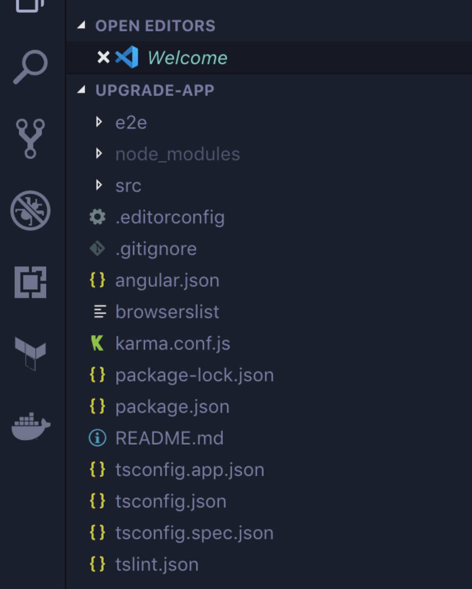
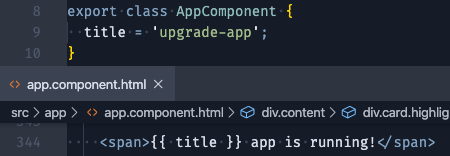

# Angular: intro

Después de esta lección podrás:

1. Entender qué es Angular y la potencia que nos da para el desarrollo de una aplicación web.
2. Generar tu primer proyecto bien estructurado con el CLI.
3. Entender los primeros artefactos de Angular.

## ¿Qué es y por qué usar Angular?

Angular es un *framework* (caja de herramientas) creado por Google en TypeScript de código abierto, pensado para usarse en el desarrollo de SPA (*Single Page Application*).

Nos va a permitir desarrollar una **aplicación web** gracias a los artefactos que lo componen, abstrayéndonos de las complicaciones. Las razones que respaldan su uso son muchas, pero resumiendo podemos decir que es un framework: **estructurado**, **escalable**, con una gran **comunidad** (proyectos) y una **documentación** excelente.

Antes de comenzar debemos instalar el CLI de Angular. El **CLI** (*Command Line Interface*) es un paquete de Angular que nos va a permitir crear proyectos, componentes y enlazar todas las piezas de nuestra aplicación:

```bash
npm install -g @angular/cli
```

Ahora, ya podemos usar el CLI, mediante el comando `ng` en nuestra terminal. Crearemos nuestra primera aplicación de Angular mediante:

```bash
ng new minsait-app
```

La consola del terminal nos irá haciendo preguntas sobre cómo queremos generar el nuevo proyecto, debemos ir contestando sí o no a algunas configuraciones. Por ahora contestar a todo y fijar `SCSS/CSS/SASS` para los estilos, y a futuro ya iremos profundizando para comprenderlo mejor.

- *Would you like to add Angular routing?* `Yes`
- *Which stylesheet format would you like to use?* `SCSS`

Tu proyecto debería verse en Chrome, ejecutando el comando `serve`:

```bash
cd minsait-app
ng serve --open
```

*Pista: Para apagar el servidor de Angular y volver a la terminal, basta con pulsar CTRL + C.*

Una vez creada la app, comenzaremos a echar un vistazo a los ficheros y estructura:



Como vemos, el CLI nos ha adelantando un montón de trabajo, creando un montón de ficheros y directorios:

- `/e2e` será un directorio para test de integración (olvidémonos de esto hasta que nos adentremos más en Angular y los test end to end).
- `/node_modules` es la carpeta donde NPM descarga las librerías que complementan nuestra aplicación web, **mejor no tocar aquí :)**
- `/src` el directorio **más importante**, aquí es donde se concentra la aplicación angular, son los ficheros fuente (*source*)
- El resto de ficheros de la raíz son en su mayoría ficheros de configuración, sobre Angular, sobre Karma (motor de testing), sobre NPM y sobre TypeScript. Detallemos los más importantes:
    - `tslint.json` ****contiene las reglas básicas de lintado con TypeScript. El linter de **TSLint** es una herramienta que nos va a ayudar a crear código más limpio.
    - `tsconfig.json` ****tiene la configuración del *build* de nuestro código TypeScript. Es decir, de cómo se construirá la aplicación final que servimos a la web.

Y ahora, centrémonos en la carpeta `/src/app` de nuestro proyecto, ya que aquí desarrollaremos todo nuestro código de la aplicación. A partir de aquí, empezaremos a hablar de **Módulos y Componentes**, pero no os asustéis, tendremos una sección específica para explicar estos artefactos al detalle.

### app.module.ts

```tsx
import { BrowserModule } from '@angular/platform-browser';
import { NgModule } from '@angular/core';

import { AppRoutingModule } from './app-routing.module';
import { AppComponent } from './app.component';

@NgModule({
  declarations: [
    AppComponent
  ],
  imports: [
    BrowserModule,
    AppRoutingModule
  ],
  providers: [],
  bootstrap: [AppComponent]
})
export class AppModule { }
```

¿Qué está haciendo este fichero? Está creando el **módulo principal** de la aplicación. `@NgModule` es un **decorador** que toma un solo objeto de metadatos, cuyas propiedades describen el módulo. Las propiedades son las siguientes.

- **Declaraciones**: los **componentes**, **directivas** y **pipes** que pertenecen a este **NgModule**.
- **Exportaciones**: declaraciones que deberían ser visibles y utilizables por los componentes de otros NgModules.
- **Importaciones**: otros módulos cuyas clases exportadas son necesarias para los componentes declarados en este NgModule. Como el AppRoutingModule
- **Proveedores**: proveedores de servicios (profundizaremos cuando veamos los **servicios**).
- **Bootstrap**: indica el componente de entrada a nuestra aplicación. Solo el **NgModule** raíz debe establecer esta propiedad.

### app-routing.module.ts

```tsx
import { NgModule } from '@angular/core';
import { Routes, RouterModule } from '@angular/router';

const routes: Routes = [];

@NgModule({
  imports: [RouterModule.forRoot(routes)],
  exports: [RouterModule]
})
export class AppRoutingModule { }
```

Este otro módulo está enfocado al **sistema de enrutamiento**, ****es decir, a establecer las rutas para navegar por nuestra aplicación. En el apartado de rutas aprenderemos a crear diferentes secciones en nuestra app, para navegar por varias vistas distintas.

Fijaos cómo este módulo se importó en el anterior **app.module.ts** y se configuró dentro de la matriz de **imports**.

### app.component.ts

```tsx
import { Component } from '@angular/core';

@Component({
  selector: 'app-root',
  templateUrl: './app.component.html',
  styleUrls: ['./app.component.scss']
})
export class AppComponent {
  title = 'minsait-app';
}
```

Este sería un componente de Angular. El decorador `@Component` nos permite declarar componentes indicando su:

- `selector` etiqueta que usaremos en el HTML
- `template` asociando la vista HTML a la lógica que habrá en el fichero de TypeScript
- `style` indicando los ficheros de estilos para darle forma al componente

Aprenderemos más sobre los componentes en la siguiente sección.

### app.component.html

```tsx
<!--The content below is only a placeholder and can be replaced.-->
<div style="text-align:center">
  <h1>
    Welcome to {{ title }}!
  </h1>
  
</div>
<h2>Here are some links to help you start: </h2>
<ul>
  <li>
    <h2><a target="_blank" rel="noopener" href="https://angular.io/tutorial">Tour of Heroes</a></h2>
  </li>
  <li>
    <h2><a target="_blank" rel="noopener" href="https://angular.io/cli">CLI Documentation</a></h2>
  </li>
  <li>
    <h2><a target="_blank" rel="noopener" href="https://blog.angular.io/">Angular blog</a></h2>
  </li>
</ul>

<router-outlet></router-outlet>
```

Esta sería la vista HTML asociada al componente que acabamos de mencionar. Los elementos que se visualizan ya nos deberían sonar: `div`, `h1`, `li`, `a`, etc.

Pero podemos destacar cosas nuevas, como por ejemplo en la **línea 4** del ejemplo `{{ title }}`, es nuestra primera interpolación. Es la manera en la que la **vista** puede mostrar **datos** del fichero de **lógica** TypeScript.



También vemos la declaración del `<router-outlet>`, componente que permite hacer uso del enrutado que mencionamos anteriormente.

### index.html

```tsx
<!doctype html>
<html lang="en">
<head>
  <meta charset="utf-8">
  <title>MinsaitApp</title>
  <base href="/">

  <meta name="viewport" content="width=device-width, initial-scale=1">
  <link rel="icon" type="image/x-icon" href="favicon.ico">
</head>
<body>
  <app-root></app-root>
</body>
</html>
```

¡Por fin, un fichero que nos suena! El `index.html` será la primera vista de entrada a nuestra aplicación, como en cualquier aplicación web.

La magia de **Angular** comienza con el uso del componente `<app-root>` dentro del `body`. De ahí en profundidad, crece nuestra aplicación Angular. En el fichero **app.componente.ts** declaramos el selector `app-root`. ¡Todo empieza a encajar!

Ahora que ya hemos repasado los primeros ficheros de nuestra aplicación, vamos a profundizar en cómo funciona un módulo Angular y cómo ir creando más componentes 🚀