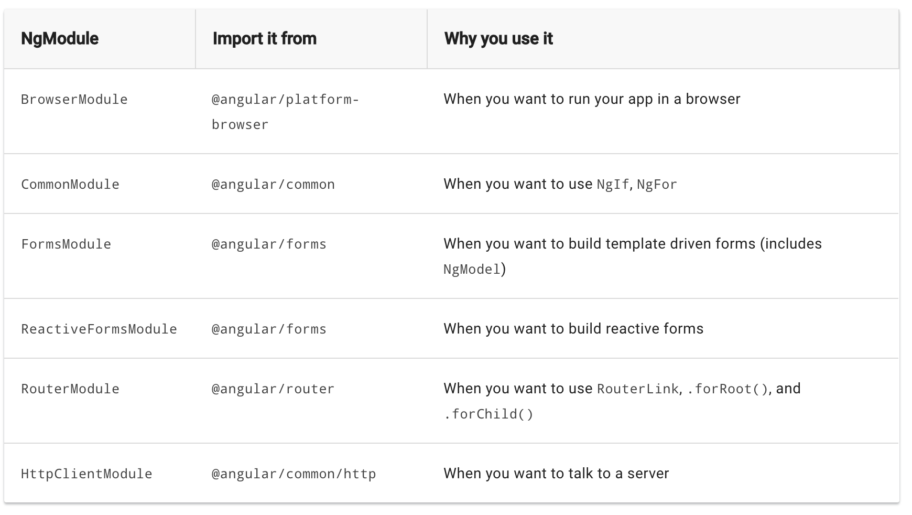

# Angular: Components

Después de esta lección podrás:

1. Entender cómo declarar componentes.
2. Organizar un proyecto Angular de manera escalable.

### Modulos Angular

Los primeros artefactos que vamos a estudiar son los **módulos** Angular. ¿Qué es un módulo? Pues un módulo es un conjunto de utilidades, todas juntas en la misma cápsula. La principal utilidad que tiene los módulos, es que nos permiten escalar nuestra aplicación. Entre los módulos más importantes definidos en Angular, tenemos:

- `BrowserModule` módulo de infraestructura, permite hacer funcionar la app.
- `CommonModule` módulo de directivas principales de Angular (profundizaremos más adelante).
- `FormsModule` módulo para creación de formularios.
- `ReactiveFormsModule` módulo para la creación de formularios reactivos.
- `RouterModule` módulo orientado al enrutamiento (profundizaremos más adelante).
- `HttpClientModule` módulo preparado para hacer peticiones al servidor mediante servicios.



### Componentes

¿Qué son los componentes? Los componentes nos sirven para ir construyendo nuestra aplicación a base de elementos. Cada componente tiene su fichero de **lógica**, su **vista** y sus **estilos**. Este enfoque nos ayuda de nuevo a organizar el código por bloques, y la posibilidad de reutilizar estos bloques en varios sitios.

Para generar nuestro primer componente, vamos a seguir unos pasos muy parecidos a los anteriores, nos vamos a apoyar en el CLI de la siguiente manera:

```bash
cd src/app
ng generate component student-list
```

Ahora nuestro app.module contiene **student-list-component**:

Veamos ahora nuestro nuevo **student-list.component.ts**:

```tsx
import { Component, OnInit } from '@angular/core';

@Component({
  selector: 'app-student-list',
  templateUrl: './student-list.component.html',
  styleUrls: ['./student-list.component.scss']
})
export class StudentListComponent implements OnInit {

  constructor() { }

  ngOnInit() {
  }

}
```

Toda la lógica asociada a este componente deberá ir en el interior de esta clase, por lo que iremos codificando atributos y funciones, pero antes de empezar, vemos dos funciones. ¿Qué son y cuáles son las diferencias entre **constructor** y **ngOnInit**?

El método `constructor` permite la creación del componente y la asignación de los parámetros de entrada a los valores iniciales a los atributos del componente.
El método `ngOnInit` maneja el comportamiento que el componente seguirá cuando aparezca por primera vez.

```tsx
import { Component, OnInit } from '@angular/core';

@Component({
  selector: 'app-student-list',
  templateUrl: './student-list.component.html',
  styleUrls: ['./student-list.component.scss']
})
export class StudentListComponent implements OnInit {
  title: string;

  constructor() {
    console.log(this.title);
    this.title = 'Listado de Alumnos';
    console.log('constructor finalizado');
  }

  ngOnInit() {
    console.log(this.title);
    console.log('ngOnInit finalizado');
  }
}
```

Estos dos anteriores métodos se generan automáticamente, pero existen otros métodos que tienen que ver con el **ciclo de vida** de la clase. El ciclo de vida de un componente está compuesto por diferentes etapas que van desde su construcción, pasando por su uso, hasta su destrucción.

Conviene destacar otras dos funciones importantes:

- `ngOnChanges` este evento será lanzado por cada cambio en las propiedades del componente
- `ngOnDestroy` este evento se ejecuta justo antes de destruir un componente, nos será útil para "hacer limpieza" y no dejarnos cables sueltos

Para comprobar como se construye nuestro componente, debemos usarlo en nuestra aplicación. Primero debemos exportarlo módulo, para poder usarlo en otros puntos. 

```tsx
import { BrowserModule } from '@angular/platform-browser';
import { NgModule } from '@angular/core';

import { AppRoutingModule } from './app-routing.module';
import { AppComponent } from './app.component';
import { StudentListComponent } from './student-list/student-list.component';
import { StudentListHeaderComponent } from './student-list/student-list-header/student-list-header.component';

@NgModule({
  declarations: [
    AppComponent,
    StudentListComponent,
    StudentListHeaderComponent
  ],
  imports: [
    BrowserModule,
    AppRoutingModule
  ],
  providers: [],
  bootstrap: [AppComponent]
})
export class AppModule { }
```

Seguidamente, abrimos el fichero **app.component.html** y escribimos el selector de nuestro componente:

```html
<app-student-list></app-student-list>
```

¡Y listo! Tenemos nuestro primer componente creado. Para comprobarlo, puedes lanzar tu aplicación Angular desde una terminal con el comando `ng serve --open`:

.png)

### Componentes hijos

Pues ahora que ya tenemos nuestro primer componente, vamos a aprender a generar componentes hijos, para que nuestra aplicación siga creciendo.

De manera similar al apartado anterior, vamos a crear un componente hijo llamado **student-list-header**:

```bash
cd src/app/student-list
ng generate component student-list-header
```

Como vemos, se genera una carpeta separada, con el nuevo componente hijo.

Y para comprobar su visualización, nos dirigimos a **student-list.component.html** y escribimos la nueva etiqueta:

```html
<app-student-list-header></app-student-list-header>
```

Si todo funciona correctamente deberíamos ver esto en nuestro navegador:

```html
<p>student-list works!</p>
```

Un apunte importante, es que si nos fijamos en el contenido del módulo, veremos que el nuevo componente se ha incluido en el array de **declarations**, pero esta vez no ha hecho falta incluirlo en el array de **exports**. ¿Por qué?

Porque el componente padre lo hemos usado fuera del módulo **student-list**, ¿recordáis? hace falta que lo exportemos para poder usarlo al nivel del **app.component.html**. Sin embargo este componente hijo, lo estamos usando en el propio módulo interno de **student-list**, por lo que no ha hecho falta exportarlo.

De todas maneras, si se produce algún **error**, siempre podéis consultar la consola del navegador Chrome, o la propia consola del terminal. Angular es muy verboso a la hora de informarnos que algo va mal.