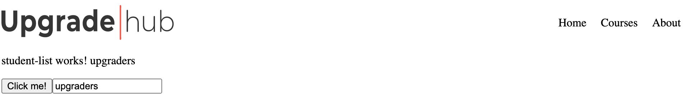

# Angular: Templates & Directivas

### Después de esta lección podrás:

1. Conocer la sintaxis de Angular.
2. Uso y sintaxis de atributos dinámicos.
3. Conocer y aplicar las directivas de Angular en un proyecto.

### Template Syntax

En la anterior lección vimos que podemos interpolar variables en nuestro código así:

```html
<p>the variable name exists and the value is {{ name }}</p>
```

Y tener la variable de nombre en nuestro componente hará que aparezca en nuestra aplicación:

```tsx
export class ExampleComponentComponent implements OnInit {
  name: string = 'Student';

  constructor() {}

  ngOnInit() {}
}
```

¿Qué pasa con los atributos como las fuentes de imágenes? Podemos interpolar el valor:

```html

```

**ngModel**:

Implementa un mecanismo de *binding* bi-direccional. El ejemplo típico es con el elemento HTML `<input>`, donde asigna la propiedad *value* a mostrar y además responde a eventos de modificación. [Algo que veremos más adelante en el día de hoy.](https://www.notion.so/13c6e4ebad2f40988a6ddec7e20d50ea)

```html
    <input [(ngModel)]="todo">
```

**ngClass**:

Esta directiva permite añadir/eliminar varias clases a un elemento de forma simultánea y dinámica. El ejemplo es algo más complejo.

```html
<div [ngClass]="{'pending': !isDone, 'done': true, 'other-class-name': false}">Este ToDo es importante y está pendiente</div>
```

**ngStyle**:

De forma análoga a `ngClass`, esta directiva te permite asignar varios estilos inline a tu elemento. Veamos:

```html
<!--in template-->
<div [ngStyle]="{'background': 'red'}"></div>
```

### Eventos

Podemos usar un botón como este:

```html
<button (click)="onButtonClick()">Click me!</button>
```

Y crear el método en el archivo `component.ts`:

```tsx
onButtonClick() : void {
  console.log('clicked!')
}
```

Veréis que al clickear sobre el botón se imprimirá el mensaje tantas veces como clickemos sobre este. De este modo podéis observar el funcionamiento de los eventos en angular de una manera sencilla.

### Directivas

Las directivas corresponden a elementos en el HTML que permiten añadir, manipular o eliminar elementos del DOM. Estas directivas son fácilmente reconocibles debido a que están precedidas por un *asterisco* `*` seguido del nombre de la directiva. Por ejemplo:

```html
<div *ngIf="condition or variable">
  <p>Contition is true or variable is true</p>
</div>

//Acción de la directiva es *ngIf
```

Es como un if que engloba todo el contenido dentro del **<div>** contendor.

¿Qué sucede si **no** queremos que aparezca el bloque dentro de nuestro **DOM**? Podemos usar la etiqueta `<ng-template>` durante el proceso de transpilación de Angular CLI. Por ejemplo:

```html
<ng-template [ngIf]="condition or variable">
  <div>
      <p>Contion or Variable is true and draw on DOM</p>
  </div>
</ng-template>
```

Al utilizar una directiva estructural, el transpilador agrega un elemento `<ng-template>` que envuelve el elemento y ocurren dos cosas:

- La directiva (`ngIf` en este caso) pasa al elemento padre `<ng-template>`.
- Los elementos hijos (incluyendo todos sus atributos), pasan a estar dentro de `ng-template`.

### **Tipos de directivas**

En Angular existen dos tipos de directivas:

1. **Directivas de componente**: es aquella que se utiliza en un punto del HTML de manera "nativa" por lo tanto sería una directiva con un template.
2. **Directivas de atributo**: con esta cambiamos la apariencia o comportamiento de un elemento.

***Importante**! solamente se puede aplicar una directiva por bloque es decir:

```html
<!-- WORKS -->
<p *ngIf="condition or variable"> Una directiva en bloque</p>

<!-- NOT WORKS -->
<p *ngIf="condition or variable" *ngFor="let element of myArray"> Dos directivas</p>

<!--SOLUTION -->
<ng-template [ngIf]="condition or variable">
  <div *ngFor="let element of myArray">
  <p>Dos directivas y no son dos divs</p>
  </div>
</ng-template>
```

Pero bueno, estamos usando ejemplos de directivas y no os hemos dicho que Angular posee 2 directivas estructurales:

- ***ngIf:** Permite mostrar / ocultar elementos del DOM.
- ***ngFor:** Permite ejecutar bucles sobre elementos del DOM.

### ***ngIf**

Esta directiva toma una expresión booleana y hace que todo elemento contenido del DOM aparezca o desaparezca dada esa condición. Por ejemplo:

```html
<!-- BOOLEAN CONTION -->
<p *ngIf="condition or variable">Una directiva en bloque</p>
```

Un ejemplo de uso:

```html
<!-- Dado let avengers: boolean = true. El elemento va a aparecer -->
<p *ngIf="avengers">Avengers exists</p>

<!-- Dado let avengers: boolean = false. El elemento no va a aparecer -->
<p *ngIf="avengers">Avengers not exist</p>
```

***Importante**! si recordáis los operadores lógicos que os explicamos en el prework se puden usar aquí sin problema, os recuerdo algunos como && or ||.

### ***ngFor**

Si recordáis el bucle `for` y sus variantes, no deberíais tener problema alguno para usar esta directiva ya que no deja de ser un `for of`. Para realizar este bucle hay que:

1. Declarar la variable que contiene el valor de la iteración.
2. Utilizar `of`.
3. La variable / Array que vamos a iterar.

También se puede añadir aunque no es necesario:

1. Indice de la iteración.
2. Imprimir el valor de la iteración.

Estructura de la directiva:

```jsx
avengers = ['Spiderman','Iron-man', 'Hulk', 'Thor']
```

```html
<!--Optional part let i = index" -->
<ul>
  <li *ngFor="let avenger of avengers; let index = index">
    Nombre del Vengador número {{index}} de nombre {{avenger}}
  </li>
</ul>
```

# Copy of ngModel

Esta directiva nos permite tener un enlace unidireccional entre una propiedad de nuestra clase con el valor que se muestra un control de formulario HTML de tipo input, textarea etc.

Por ejemplo si en la clase StudentListComponent tenemos la propiedad 'name' con el valor 'upgraders':

```jsx
name='upgraders';

```

Luego en la vista o html definimos la directiva ngModel entre corchetes y le asignamos el nombre de la propiedad definida en la clase:

```jsx
  <input type="text" [ngModel]="name">

```

Cuando arrancamos la aplicación podemos observar que el control input aparece automáticamente con el valor 'upgraders'.



Lo único a tener en cuenta es que cuando utilizamos la directiva ngModel debemos importar la clase 'FormsModule' en el archivo 'app.module.ts' y especificarla en la propiedad 'imports':

```jsx
import { BrowserModule } from '@angular/platform-browser';
import { NgModule } from '@angular/core';
import {FormsModule} from '@angular/forms';

import { AppComponent } from './app.component';

@NgModule({
  declarations: [
    AppComponent
  ],
  imports: [
    BrowserModule
    ,FormsModule
  ],
  providers: [],
  bootstrap: [AppComponent]
})
export class AppModule { }
```