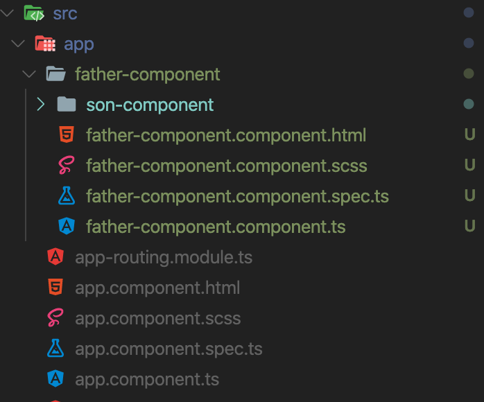
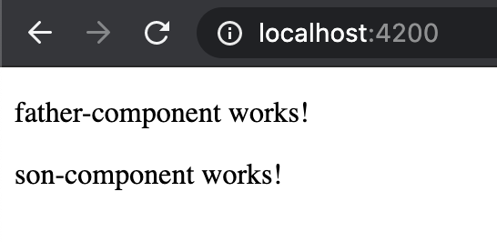
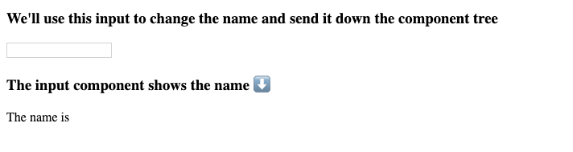
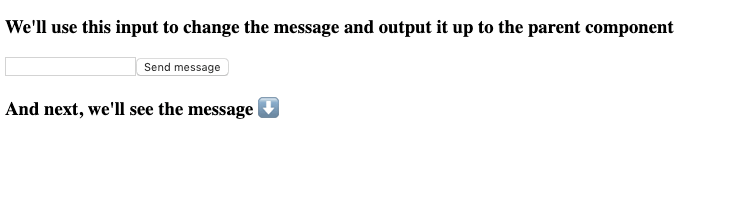

# Angular: Inputs & Outputs

### Después de esta lección podrás:

1. Establer comunicación entre componentes.
2. Entender la estructura de un proyecto Angular.
3. Trabajar con soltura usando Inputs & Outputs.

# Inputs & Outputs

Después de haber creado varios componentes hemos llegado al punto en el que querríamos que ciertos componentes compartiesen información, de tal manera que cualquier cambio en uno afecte a otro. Por ello os vamos a explicar la comunicación entre componentes, de padre a hijo o de hijo a padre a través de los **Inputs & Outputs**.💪

### Inputs

Los inputs indican que les entra un valor desde otro punto de nuestra aplicación, en este caso de un componente padre. Para entenderlo mejor empezaremos creando un nuevo proyecto

```bash
ng new comunication-app
```

Una vez creada nuestra aplicación debemos generar dos componentes, un componente padre y un componente hijo. Tal y como vemos aquí:

```bash
cd comunication-app

cd src/app

ng generate component father-component

cd father-component

ng generate component son-component
```

De este modo tendríamos la siguiente estructura en nuestro proyecto:



Lo primero como siempre es limpiar el **app.component.html**:

```html
<app-father-component></app-father-component>
<router-outlet></router-outlet>
```

Y desde nuestro componente padre instanciaremos el componente hijo:

```html
<p>father-component works!</p>
<app-son-component></app-son-component>
```

Ahora si inicializamos nuestra aplicación con **ng-serve** veremos:



Hasta aquí todo sencillo y no hay novedad respecto a clases anteriores. Pero ha llegado el momento de utilizar un poco de la magia que nos da Angular. Para ello vamos a definir un input de texto en el componente padre  que cuando escribamos sobre el envíe la info al componente hijo que irá mostrando el texto escrito a tiempo real. Allá vamos! 

En el **father-component.component.ts:**

```tsx
export class FatherComponentComponent  {
  //declaramos nuestra variable
  inputText: string = '';
  
  // Función cada vez que pulsamos una tecla.
  keyUp(letra: string) {
    this.inputText = letra;
  }
}
```

Y en el **father-component.component.html:**

```html
<div>
  <h1>Father Component</h1>
  <!-- Input sobre el que escribimos y la función declarada en el .ts -->
  <input #fatherInput (keyup)="keyUp(fatherInput.value)"/>
  <div>
    <!-- pasamos al hijo el valor de la variable inputText -->
    <!-- El valor de la izquierda es el que recibe -->
    <app-son-component [inputText]="inputText"></app-son-component>
  </div>
</div>
```

De este modo si ejecutamos el `ng-serve` para arrancar nuestra aplicación observaremos que nos da un error indicando que **inputText** no es conocido por el componente `app-son-component`. Para ello aplicaremos la magia de Angular usando el decorador `@Input`.

En nuestro **son-component.component.ts**:

```tsx
import { Component, Input } from '@angular/core';

@Component({
  selector: 'app-son-component',
  templateUrl: './son-component.component.html',
  styleUrls: ['./son-component.component.scss']
})
export class SonComponentComponent {
  // Recibe inputText desde la template del padre
  @Input() inputText: string;
}
```

Y desde **son-component.component.html** disponemos de esa variable que tiene un efecto reactivo, cuando cambia en el padre afecta a el hijo.

```html
<div>
  <h1>Son Component</h1>
  <p>El hijo ahora escucha:</p>
  <p>{{ inputText }}</p>
</div>
```

Lanzamos nuestra aplicación con el ng-serve:



¿No es genial? Estamos haciendo que nuestro componente padre hable con su hijo. ¡Tecnología!🤯

Hola, ¿y cómo podemos hacer que un hijo hable con su padre? Deberían poder comunicarse correctamente, y resolvemos ese problema usando **outputs**.

### Outputs

En nuestro **son-component.component.ts** es hora de importar los módulos `Output` y `EventEmitter`:

```tsx
import { Component, Input, Output, EventEmitter } from '@angular/core';

@Component({
  selector: 'app-son-component',
  templateUrl: './son-component.component.html',
  styleUrls: ['./son-component.component.scss']
})
export class SonComponentComponent {
  @Input() inputText: string;

  @Output() emitMessage = new EventEmitter<string>();

  message: string = '';

  sendMessage() {
    this.emitMessage.emit(this.message);
  }
}
```

Vamos a explicar lo que tenemos aquí:

1.  **@Output()** inicializa un `EventEmitter` llamado **emitMessage** que devuelve una cadena usando la propiedad **emit**.
2. **message** es una variable de tipo cadena que vamos a cambiar y enviar al componente padre.
3. **sendMessage** es el método que activará la emisión de la variable, utilizando la salida que creamos antes.

El archivo de plantilla **son-component.component.html** se verá así:

```html
<!-- Recibe un Input -->
<div>
  <h1>Son Component</h1>
  <p>El hijo ahora escucha:</p>
  <p>{{ inputText }}</p>
</div>
<!-- Emite un Output -->
<div>
  <h1>Envia mensaje al componente padre</h1>
  <!-- ngModel lo iremos aprendiendo poco a poco a lo largo del curso -->
  <input [(ngModel)]="message" />
  <button (click)="sendMessage()">Enviar a padre</button>
</div>
```

¿Qué está pasando aquí?

- La entrada está utilizando un **ngModel** para cambiar dinámicamente el valor de la variable **message**.
- El botón activará el método **sendMessage** al **hacer click**.

¡Y ahora es el momento de recibir los datos! 

Basta con adaptar **father-component.component .html**

```html
<div>
  <h1>Father Component</h1>
  <input #fatherInput (keyup)="keyUp(fatherInput.value)"/>
  <div>
  <!-- Recibe un Input y emite un Output -->
    <app-son-component 
    [inputText]="inputText"
    (emitMessage)="setMessage($event)"
    ></app-son-component>
    <h1>Mensaje de mi hijo ⬇️</h1>
    <p>{{ sonMessage }}</p>
  </div>
</div>
```

Podemos ver aquí que estamos creando un atributo de evento en **app-son-component** con el mismo nombre de nuestro emisor **emitMessage**. Esto significa que estamos atendiendo el mensaje con **setMessage**, que es un método que vamos a crear ahora en el padre.

Entonces, en **father-component.component.ts** tenemos:

```tsx
import { Component } from '@angular/core';

@Component({
  selector: 'app-father-component',
  templateUrl: './father-component.component.html',
  styleUrls: ['./father-component.component.scss']
})
export class FatherComponentComponent  {
  // Se declara e inicia en el componente padre para luego comunicarlo al componente hijo
  inputText: string = '';
  // Variable donde almacenamos el valor del hijo
  sonMessage: string = '';

  // con cada tecla apretada se activa esta funcion.
  keyUp(letra: string) {
    this.inputText = letra;
  }
  // Recibe el mensaje del hijo  
  setMessage(message: string): void {
    this.sonMessage = message;
  }
}
```

Antes de nada, para poder hacer uso del **ngModel** y que funcione nuestra aplicación debemos importar en el **app.module** el `FormsModule` que veremos en la próxima lección:

```tsx
import { SonComponentComponent } from './father-component/son-component/son-component.component';
import { FormsModule } from '@angular/forms';

@NgModule({
  declarations: [
    AppComponent,
    FatherComponentComponent,
    SonComponentComponent
  ],
  imports: [
    BrowserModule,
    AppRoutingModule,
    FormsModule
  ],
  providers: [],
  bootstrap: [AppComponent]
})
export class AppModule { }
```

 ¡Vamos a ver cómo funciona!🚀



Una vez conocemos los inputs y outputs debemos conocer una última cosa para ser expertos en comunicación entre componentes. Es el **doble data binding**.

### Banana in a box

Por no extendernos, usamos este operador cuando queremos tanto **enviar** como **recibir** información, para no tener que hacer *input/output* utilizamos el doble data binding o también conocido como banana in a box. Es algo que ya hemos utilizado en nuestro ejemplo anterior con el `ngModel`:

```tsx
<input [(ngModel)]="message" />
```