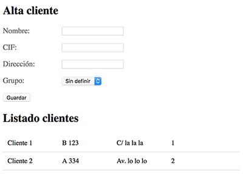

# Angular: Ejercicio Guiado

## Creamos nuestra aplicación

El primer paso es, usando el CLI, crear nuestra aplicación nueva. Lo haces entrando en la carpeta de tus proyectos y ejecutando el comando.

```tsx
ng new clientes-app
```

Luego puedes entrar en la carpeta de la aplicación y lanzar el servidor web de desarrollo, para ver lo que se ha construido hasta el momento.

```tsx
cd clientes app
ng serve -o
```

## Creamos nuestro módulo de clientes

La aplicación recién generada ya contiene un módulo principal, sin embargo, yo prefiero dejar ese módulo con pocas o ninguna cosa más de las que nos entregan por defecto al generar la aplicación básica. Por ello crearemos como primer paso un módulo nuevo, llamado "ClientesModule".

Encargamos a Angular CLI la creación del esqueleto de nuestro módulo con el siguiente comando:

```tsx
ng generate module clientes
```

## Definir el modelo de datos

Vamos a comenzar nuestro código por definir los tipos de datos que vamos a usar en esta aplicación. Vamos a trabajar con clientes y grupos.

Crearemos el modelo de datos dentro de la carpeta del módulo "clientes". No existe en Angular un generador de este tipo de modelos, por lo que crearé el archivo a mano con el editor. Lo voy a nombrar "cliente.model.ts".

En este archivo coloco las interfaces de TypeScript que definen los datos de mi aplicación.

```tsx
export interface Cliente {
  id: number;
  nombre: string;
  cif: string;
  direccion: string;
  grupo: number;
}

export interface Grupo {
  id: number;
  nombre: string;
}
```

Como ves, he creado el tipo de datos Cliente y, por complicarlo un poquito más, el tipo de datos Grupo. Así, cada cliente generado pertenecerá a un grupo.

**Nota:** Esta parte de la creación de interfaces es perfectamente opcional. Solo la hacemos para usar esos tipos en la declaración de variables. El compilador de TypeScript nos avisará si en algún momento no respetamos estos tipos de datos, ayudando en tiempo de desarrollo y ahorrando algún que otro error derivado por despistes.

## Crear un servicio para los clientes

Lo ideal es crear un servicio (service de Angular) donde concentremos las tareas de trabajo con los datos de los clientes, descargando de código a los componentes de la aplicación y centralizando en un solo archivo la lógica de la aplicación.

El servicio lo vamos a crear dentro de la carpeta del módulo clientes, por lo que especificamos la ruta completa.

```tsx
ng generate service clientes/clientes
```

En el servicio tengo que hacer el import del modelo de datos, interfaces de Cliente y Grupo (creadas en el paso anterior).

```tsx
import { Cliente, Grupo } from './cliente.model';
```

Nuestro servicio no tiene nada del otro mundo. Vamos a ver su código y luego explicaremos algún que otro punto destacable.

```tsx
import { Injectable } from '@angular/core';
import { Cliente, Grupo } from './cliente.model';

@Injectable()
export class ClientesService {

  private clientes: Cliente[];
  private grupos: Grupo[];

  constructor() {
    this.grupos = [
      {
        id: 0,
        nombre: 'Sin definir'
      },
      {
        id: 1,
        nombre: 'Activos'
      },
      {
        id: 2,
        nombre: 'Inactivos'
      },
      {
        id: 3,
        nombre: 'Deudores'
      },
    ];
    this.clientes = [];
  }

  getGrupos() {
    return this.grupos;
  }

  getClientes() {
    return this.clientes;
  }

  agregarCliente(cliente: Cliente) {
    this.clientes.push(cliente);
  }

  nuevoCliente(): Cliente {
    return {
      id: this.clientes.length,
      nombre: '',
      cif: '',
      direccion: '',
      grupo: 0
    };
  }
}
```

1. Las dos propiedades del servicio contienen los datos que va a mantener. Sin embargo, las hemos definido como privadas, de modo que no se puedan tocar directamente y tengamos que usar los métodos del servicio creados para su acceso.
2. Los grupos los construyes con un literal en el constructor. Generalmente los traerías de algún servicio REST o algo parecido, pero de momento está bien para empezar.
3. Agregar un cliente es un simple "push" al array de clientes, de un cliente recibido por parámetro.
4. Crear un nuevo cliente es simplemente devolver un nuevo objeto, que tiene que respetar la interfaz, ya que en la función nuevoCliente() se está especificando que el valor de devolución será un objeto del tipo Cliente.
5. Fíjate que en general está todo tipado, tarea opcional pero siempre útil.

### Declarar el servicio para poder usarlo en los componentes

Una tarea fundamental para poder usar los servicios es declararlos en el "module" donde se vayan a usar.

Para añadir el servicio en el module "clientes.module.ts", el primer paso es importarlo.

```tsx
import { ClientesService } from './clientes.service';
```

Luego hay que declararlo en el array "providers".

```tsx
providers: [
  ClientesService
]
```

## Crear componente que da de alta clientes

Vamos a continuar nuestra práctica creando un primer componente. Es el que se encargará de dar de alta los clientes.

Generamos el esqueleto usando el Angular CLI.

```tsx
ng generate component clientes/altaCliente
```

Comenzaremos editando el archivo del componente y luego iremos a trabajar con el template. Por tanto, vamos a abrir el fichero "alta-cliente.component.ts".

### Agregar el servicio al componente

Muy importante. Para poder usar el servicio anterior, tengo que agregarlo al componente recién creado, realizando el correspondiente import.

```tsx
import { ClientesService } from './../clientes.service';
```

Y posteriormente ya podré inyectar el servicio en el constructor del componente.

```tsx
constructor(private clientesService: ClientesService) { }
```

### Agregar el modelo de datos

Para poder seguir usando los tipos de datos de mi modelo, vamos a agregar el archivo donde se generaron las interfaces.

```tsx
import { Cliente, Grupo } from './../cliente.model';
```

### Código TypeScript completo del componente

El código completo de "alta-cliente.component.ts", para la definición de mi componente, quedaría más o menos así

```tsx
import { Cliente, Grupo } from './../cliente.model';
import { ClientesService } from './../clientes.service';
import { Component, OnInit } from '@angular/core';

@Component({
  selector: 'app-alta-cliente',
  templateUrl: './alta-cliente.component.html',
  styleUrls: ['./alta-cliente.component.css']
})
export class AltaClienteComponent implements OnInit {

  cliente: Cliente;
  grupos: Grupo[];

  constructor(private clientesService: ClientesService) { }

  ngOnInit() {
    this.cliente = this.clientesService.nuevoCliente();
    this.grupos = this.clientesService.getGrupos();
  }

  nuevoCliente(): void {
    this.clientesService.agregarCliente(this.cliente);
    this.cliente = this.clientesService.nuevoCliente();
  }
}
```

Es importante mencionar estos puntos.

1. El componente declara un par de propiedades, el cliente y el array de grupos.
2. En el constructor, que se ejecuta lo primero, conseguimos una instancia del servicio de clientes, mediante la inyección de dependencias.
3. Posteriormente se ejecuta ngOnInit(). En este punto ya se ha recibido el servicio de clientes, por lo que lo puedo usar para generar los valores que necesito en las propiedades del componente.
4. El método nuevoCliente() es el que se ejecutará cuando, desde el formulario de alta, se produzca el envío de datos. En este código usamos el servicio clientesService, para agregar el cliente y generar un cliente nuevo, para que el usuario pueda seguir dando de alta clientes sin machacar los clientes anteriormente creados.

### Template del componente, con el formulario de alta de cliente

Vamos a ver ahora cuál es el HTML del componente de alta de clientes, que básicamente contiene un formulario.

Pero antes de ponernos con el HTML, vamos a hacer una importante tarea. Consiste en declarar en el módulo de clientes que se va a usar la directiva "ngModel". Para ello tenemos que hacer dos pasos:

En el archivo "clientes.module.ts" comenzamos por importar "FormsModule".

```tsx
import { FormsModule } from '@angular/forms';
```

En el decorador, indicamos el imports del FormsModule.

```tsx
imports: [
  CommonModule,
  FormsModule
],
```

Ahora veamos el código del template, en el que reconocerás el uso de la propiedad "cliente" declarada en el constructor, así como el array de grupos.

```html
<h2>Alta cliente</h2><p><span>Nombre:</span><input type="text" [(ngModel)]="cliente.nombre"></p><p><span>CIF:</span><input type="text" [(ngModel)]="cliente.cif"></p><p><span>Dirección:</span><input type="text" [(ngModel)]="cliente.direccion"></p><p><span>Grupo:</span><select [(ngModel)]="cliente.grupo"><option *ngFor="let grupo of grupos" value="{{grupo.id}}">{{grupo.nombre}}</option></select></p><p><button (click)="this.nuevoCliente()">Guardar</button></p>
```

## Usar el componente Alta cliente

Este componente, de alta de clientes, lo quiero usar desde el componente raíz de mi aplicación. Como el componente raíz está declarado en otro módulo, necesito hacer que conozca al AltaClienteComponent. Esto lo consigo en dos pasos:

### 1.- Agregar al exports AltaClienteComponent

En el módulo de clientes "clientes.module.ts" agrego al exports el componente que quiero usar desde otros módulos.

```tsx
exports: [
  AltaClienteComponent
]
```

### 2.- Importar en el módulo raíz

Ahora, en el módulo raíz, "app.module.ts", debes declarar que vas a usar componentes que vienen de clientes.module.ts. Para ello tienes que hacer el correspondiente import:

```tsx
import { ClientesModule } from './clientes/clientes.module';
```

Y luego declaras el módulo en el array de imports:

```tsx
imports: [
  BrowserModule,
  ClientesModule
],
```

Hechos los dos pasos anteriores, ya puedes usar el componente en el template. Para ello simplemente tenemos que escribir su tag, en el archivo "app.component.html".

```html
<app-alta-cliente></app-alta-cliente>
```

Llegado a este punto, si todo ha ido bien, deberías ver ya el componente de alta de clientes funcionando en tu página.

**Nota:** Si se produce cualquier error, entonces te tocará revisar los pasos anteriores o hacer una búsqueda con el texto del error que te devuelva la consola del navegador o el terminal, para ver dónde te has equivocado.

## Crear el componente listado-cliente

Para acabar nuestra práctica vamos a crear un segundo componente de aplicación. Será el componente que nos muestre un listado de los clientes que se van generando.

Como siempre, comenzamos con un comando del CLI.

```bash
ng generate component clientes/listadoClientes
```

Ahora el flujo de trabajo es similar al realizado para el componente anterior. Vamos detallando por pasos.

Creas los import del servicio y de los tipos de datos del modelo.

```tsx
import { Cliente, Grupo } from './../cliente.model';
import { ClientesService } from './../clientes.service';
```

Inyectas el servicio en el constructor.

```tsx
constructor(private clientesService: ClientesService) { }
```

En este componente tendremos como propiedad el array de clientes que el servicio vaya creando. Así pues, declaras dicho array de clientes:

```tsx
clientes: Cliente[];
```

Cuando se inicialice el componente tienes que solicitar los clientes al servicio. Esto lo hacemos en el método ngOnInit().

```tsx
ngOnInit() {
  this.clientes = this.clientesService.getClientes();
}
```

### Código completo del componente ListadoClientesComponent

Puedes ver a continuación el código TypeScript completo de cómo nos quedaría este segundo componente.

```tsx
import { Cliente, Grupo } from './../cliente.model';
import { ClientesService } from './../clientes.service';
import { Component, OnInit } from '@angular/core';

@Component({
  selector: 'app-listado-clientes',
  templateUrl: './listado-clientes.component.html',
  styleUrls: ['./listado-clientes.component.css']
})
export class ListadoClientesComponent implements OnInit {

  clientes: Cliente[];
  constructor(private clientesService: ClientesService) { }

  ngOnInit() {
    this.clientes = this.clientesService.getClientes();
  }

}
```

### Código de la vista

Ahora podemos ver cómo sería la vista, código HTML, del listado de componentes.

```html
<h2>
  Listado clientes
</h2><div *ngIf="! clientes.length">No hay clientes por el momento</div><div><article *ngFor="let cliente of clientes"><span>{{cliente.nombre}}</span><span>{{cliente.cif}}</span><span>{{cliente.direccion}}</span><span>{{cliente.grupo}}</span></article></div>
```

No lo hemos comentado anteriormente, pero puedes darle un poco de estilo a los componentes editando el archivo de CSS. Por ejemplo, este sería un poco de CSS que podrías colocar en el fichero "listado-clientes.component.css".

```css
article {
  display: flex;
  border-bottom: 1px solid #ddd;
  padding: 10px;
  font-size: 0.9em;
}
span {
  display: inline-block;
  width: 22%;
  margin-right: 2%;
}
```

## Usar el componente del listado

Para usar este componente de listado de clientes, ya que lo queremos invocar desde el módulo raíz, tienes que ampliar el exports del module "clientes.module.ts".

```tsx
exports: [
  AltaClienteComponent,
  ListadoClientesComponent
]
```

Como para el anterior componente, de alta de clientes, ya habíamos importado el módulo de clientes, no necesitas hacer nada más. Ahora ya puedes usar el usar el componente directamente en el template del componente raíz "app.component.html".

```html
<app-listado-clientes></app-listado-clientes>
```

Es hora de ver de nuevo la aplicación construida y disfrutar del buen trabajo realizado. El aspecto de la aplicación que hemos realizado debería ser más o menos el siguiente:



## Conclusión

Llegado a este punto, hemos terminado la práctica. Tenemos un sistema de alta y visualización de clientes dinámico, generado en una aplicación Angular con diferentes piezas del framework.