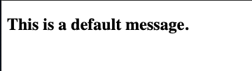
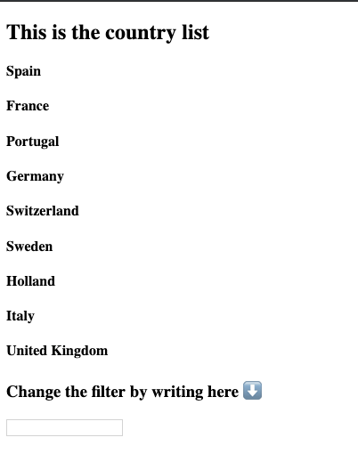
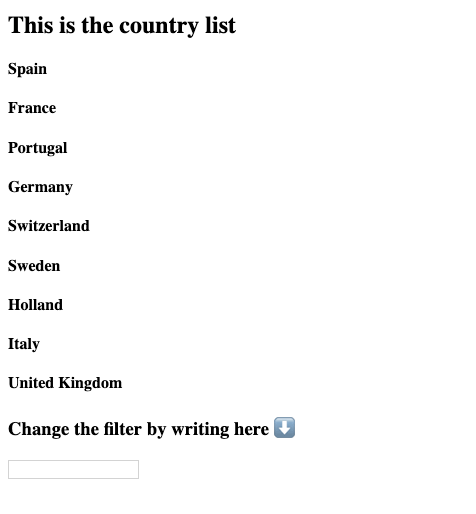

# Angular: Pipes & Lazy-loading

## Después de esta lección podrás:

1. Trabajar con Pipes custom en aplicaciones Angular.
2. Implementar Lazy loading en los modulos Angular de nuestra aplicación.

¡Y aquí estamos! Como los otros capítulos cubren la mayor parte del contenido Angular necesario para desarrollar una aplicación, estamos listos para comenzar a desarrollar, pero bueno, aprenderemos dos pequeñas cosas antes de ir de frente y convertirse en un profesional.

### Pipes

Los pipes son una herramienta realmente útil que podemos aplicar a nuestro código angular. Es posible que ya haya visto algunos, ya que se pueden aplicar directamente en la template para cambiar la salida de las variables que vinculamos.

Vamos a mostrar el poder de los pipes a través de un ejemplo. Tendremos una variable **message** en **app.component.ts:**

```tsx
import { Component } from '@angular/core';

@Component({
  selector: 'app-root',
  templateUrl: './app.component.html',
  styleUrls: ['./app.component.scss']
})
export class AppComponent {
  message: string;

  constructor() {
    this.message = 'This is a default message.';
  }
}
```

Y mostrarlo en la plantilla:

```tsx
<h2>{{ message }}</h2>
```



Entonces, ¿dónde está ese Pipe y cómo puedo usarlo?

Fácil, usaremos una los Pipes predeterminados en Angular,  **uppercase**, que hace lo que dice el nombre, cambiando un texto a mayúscula:

```html
<h2>{{ message | uppercase }}</h2>
```


### Pipes personalizadas

Para mostrar lo que podemos lograr con un Pipe personalizado, ¿por qué no intentamos crear una entrada de filtro?

En primer lugar, creemos un componente de lista:

```bash
ng g c components/list --module=app.module
```

Hay que tener en cuenta que aquí estamos usando un indicador  - **module** , esta es una manera de resolver un problema al crear un nuevo componente después de tener diferentes **app.module.ts** en la carpeta de la aplicación.

Agregamos una lista a nuestro componente y una función para filtrar los elementos de la lista y devolver una nueva lista:

```tsx
import { Component, OnInit } from '@angular/core';

@Component({
  selector: 'app-list',
  templateUrl: './list.component.html',
  styleUrls: ['./list.component.scss']
})
export class ListComponent implements OnInit {
  countryList: string[];
  filteredList: string[];
  filter: string;

  constructor() {
    this.filter = '';
    this.countryList = ['Spain', 'France', 'Portugal', 'Germany', 'Switzerland', 'Sweden', 'Holland', 'Italy', 'United Kingdom'];
    this.filteredList = this.countryList;  
  }

  ngOnInit() {}

  onChangeFilter(filter: string) {
    const newList: string[] = this.countryList.filter(el => el.toLowerCase().includes(filter.trim().toLowerCase()));
    this.filteredList = newList;
  }
}
```

¿Qué tenemos aquí?

1. Una lista de países, que será la fuente de la verdad para nuestro filtro.
2. Una lista filtrada, que almacenará la lista que veremos en la plantilla.
3. Un filtro, que se asignará a una entrada.

Y la plantilla para el componente de la lista:

```html
<h2>This is the country list</h2>
<div>
  <h4 *ngFor="let country of filteredList">{{ country }}</h4>
</div>

<h3>Change the filter by writing here ⬇️</h3>
<input type="text" [(ngModel)]="filter" (ngModelChange)="onChangeFilter($event)" />
```

El resultado:



¿Pero dónde están las Pipes prometidos?

No te preocupes! Esta fue la forma de preparar un gran escenario de Pipes. ¿Qué tal un Pipe que hace todo este filtro automáticamente?

¡Suena bien! ¡Sigamos y comencemos a trabajar en eso! 🚀

Antes de crear el Pipe, crearemos un nuevo archivo **app-pipes.module.ts**, que será el módulo donde almacenaremos todas nuestros Pipes personalizados:

```tsx
import { NgModule } from '@angular/core';

@NgModule({
  imports: [],
  declarations: [],
  exports: []
})
export class AppPipesModule { }
```

 

Y importarlo en **app.module.ts:**

```tsx
import { BrowserModule } from '@angular/platform-browser';
import { NgModule } from '@angular/core';
import { ReactiveFormsModule, FormsModule } from '@angular/forms';

import { AppRoutingModule } from './app-routing.module';
import { AppPipesModule } from './app-pipes.module';

import { AppComponent } from './app.component';

@NgModule({
  declarations: [
    AppComponent,
  ],
  imports: [
    BrowserModule,
    FormsModule,
    ReactiveFormsModule,
    AppRoutingModule,
    AppPipesModule,
  ],
  providers: [],
  bootstrap: [AppComponent]
})
export class AppModule { }
```

A partir de ahora, todos nuestros  Pipes se importarán en **app-pipes.module.ts** y se importarán a nuestra aplicación a través de la importación en app.module.ts. Esto conducirá a un código y una arquitectura más limpios.

Ahora crearemos un Pipe a través de la CLI:

```bash
ng generate pipe pipes/filter-names --module=app-pipes.module
```

Como antes, estamos eligiendo un módulo, pero el nuevo en este caso, que se ve así:

```tsx
import { NgModule } from '@angular/core';
import { FilterNamesPipe } from './pipes/filter-names.pipe';

@NgModule({
  imports: [],
  declarations: [
    FilterNamesPipe
  ],
  exports: [
    FilterNamesPipe,
  ]
})
export class AppPipesModule { }
```

**Recuerda exportar la declaración FilterNamesPipe! No será el comportamiento predeterminado de la CLI y debemos exportarlo con este patrón de módulo.**

Pasemos ahora al archivo de Pipe y creemos el método de filtro dentro de la función de transformación que viene creada por defecto:

```tsx
import { Pipe, PipeTransform } from '@angular/core';

@Pipe({ name: 'priorityName' })
export class PriorityNamePipe implements PipeTransform {
  transform(list: string[], filter: string = '') {
    const lowerCaseFilter: string = filter.toLowerCase().trim();

    const filteredList: string[] = list.filter((el: string) => {
      return el.toLowerCase().includes(lowerCaseFilter);
    });

    return filteredList;
  }
}
```

El método de transformación recibió el elemento al que estamos aplicando el Pipe como primer argumento, que es la lista en este caso.

Los otros argumentos, se envían a el Pipe utilizando una nomenclatura especial, **{valor | pipe: arg}**.

¡Y así, creamos un Pipe de filtro personalizado! Podemos usarlo con el nombre **filterNames**, así que vamos a nuestro componente y ¡aplicarlo!

En primer lugar, limpia el archivo ts del componente:

```tsx
import { Component, OnInit } from '@angular/core';

@Component({
  selector: 'app-list',
  templateUrl: './list.component.html',
  styleUrls: ['./list.component.scss']
})
export class ListComponent implements OnInit {
  countryList: string[];
  filter: string;

  constructor() {
    this.filter = '';
    this.countryList = ['Spain', 'France', 'Portugal', 'Germany', 'Switzerland', 'Sweden', 'Holland', 'Italy', 'United Kingdom'];
  }

  ngOnInit() { }
}
```

¡Esto es mucho más limpio, nos deshacemos de la lista de filtros de respaldo y solo tenemos el original!

En la plantilla, aplicar el Pipe:

```html
<h2>This is the country list</h2>
<div>
  <h4 *ngFor="let country of (countryList | filterNames: filter)">{{ country }}</h4>
</div>

<h3>Change the filter by writing here ⬇️</h3>
<input type="text" [(ngModel)]="filter" />
```

Esto es un buen pipe!!!



¡Estas son los Pipes personalizados! ¡La forma correcta de lograr un código y una arquitectura limpios y organizados en Angular!

### Lazy Loading

**Esta técnica usada en Angular** nos permite cargar sólo, el o los componentes que necesitemos al inicio de nuestra aplicación, estos componentes no cargan cada vez que entres, sino que solo cargan una sola vez.

Cuando usamos Lazy Loading hacemos llamado de un módulo mediante el sistema de rutas de Angular y este módulo a su vez tiene rutas hijas que se encargan de cargar el componente solicitado por el usuario, más adelante entenderemos esto mejor.