# API - JSON Server

Esta es una pequeña guía para fakear APIS y poder trabajar con la temática que queramos sin estar atados a las APIS públicas que existen en la actualidad. Que no existan limitaciones para poder trabajar como queremos FRONTENDS.

Nos generamos una carpeta con el nombre que queramos utilizar para nuestra API - en mi caso he decido llamarla **backend.**

Dentro de **backend** ejecutamos el siguiente comando**:**

```bash
npm init -y
```

Esto nos generará un fichero **package.json** con el siguiente contenido:

```json
{
  "name": "backend",
  "version": "1.0.0",
  "description": "",
  "main": "index.js",
  "scripts": {
    "test": "echo \"Error: no test specified\" && exit 1"
  },
  "keywords": [],
  "author": "",
  "license": "ISC"
}
```

Lo siguiente es instalar nuestra dependencia:

```bash
npm i json-server
```

Ahora en nuestro proyecto crearemos una carpeta con el nombre **db** y dentro un fichero con el nombre **db.json**, que será el que contenga la info básica de nuestra API.


Dentro agregamos el siguiente contenido:

```json
{
  "posts": [
    { "id": 1, "title": "json-server", "author": "typicode" }
  ],
  "comments": [
    { "id": 1, "body": "some comment", "postId": 1 }
  ],
  "profile": { "name": "typicode" }
}
```

Ahora vamos a modificar nuestro **package.json** para correr como servidor, tenemos que añadir un script como veis en el ejemplo:

```json
{
  "name": "backend",
  "version": "1.0.0",
  "description": "",
  "main": "index.js",
  "scripts": {
    "server": "json-server --watch ./db/db.json"
  },
  "keywords": [],
  "author": "",
  "license": "ISC",
  "dependencies": {
    "json-server": "^0.16.1"
  }
}
```

Okei, pues ya tenemos nuestro servidor. Ahora tendremos que correrlo para ver que todo ha ido bien:

```bash
npm run server
```

Y nos aparecerá lo siguiente en consola:

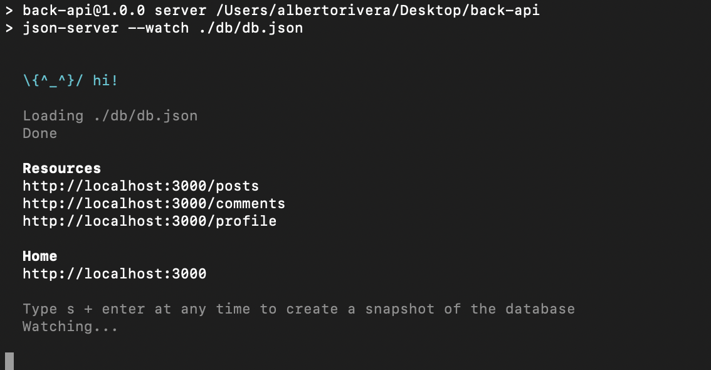

> MUY IMPORTANTE CUANDO QUERAMOS TRABAJAR CON NUESTRA API-FRONTEND DEBEMOS TENER LEVANTADO EL PROYECTO ES DECIR DEBE ESTAR ESCUCHANDO EL PUERTO DE LOS CONTRARIO TENDREMOS ERRORES AL LANZAR LAS PETICIONES DESDE FRONT
> 

Esto nos indica que tenemos nuestro servidor corriendo en el [http://localhost:3000](http://localhost:3000/) , si abrimos el navegador nos encontraremos el siguiente contenido:

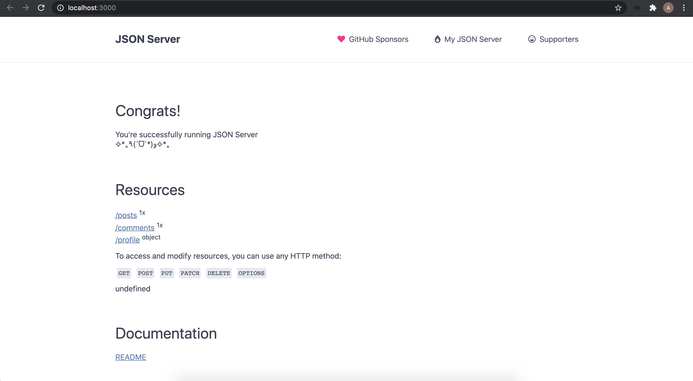

si os dais cuenta nos está indicando las rutas que hemos configurado en el fichero **db.json**, tenemos: **/post  /comments /profile**

A partir de aquí os mostraremos como ir **integrando diferentes métodos** en nuestra Api-Fake, para ello lo mejor es utilizar **PostMan**, es una herramienta muy útil para conocer las respuestas de diferentes APIS sin tener que programar. Vamos a por ello!

Lo primero que voy a hacer es probar PostMan para ello vamos a probar uno de nuestro **endpoints**:

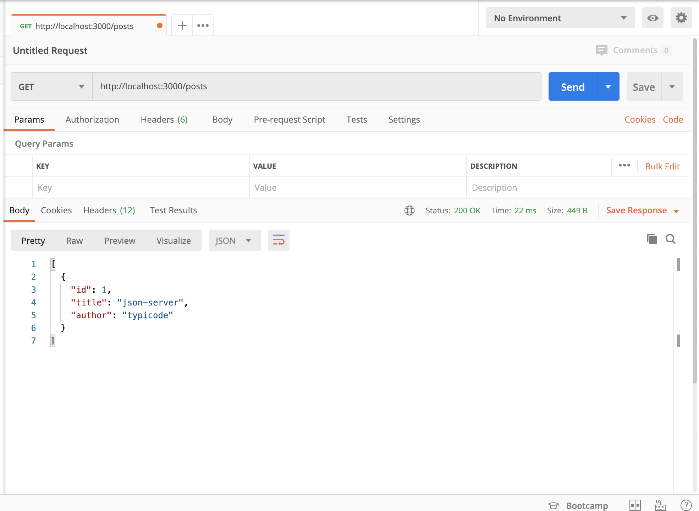

Si veis la imagen hemos realizado un GET a la url [http://localhost:3000/posts](http://localhost:3000/posts) y nos ha devuelto el contenido de nuestro **db.json**:

```json
[{ 
"id": 1, 
"title": "json-server", 
"author": "typicode" 
}]
```

Vamos a  cambiar datos de nuestro db.json y ver si nos lo devuelve, para ello modificamos el fichero:

```json
{
  "posts": [
    { "id": 1, "title": "json-server", "author": "typicode" },
    { "id": 2, "title": "json-ejemplo", "author": "Alberto" }
  ],
  "comments": [{ "id": 1, "body": "some comment", "postId": 1 }],
  "profile": { "name": "typicode" }
}
```

Hemos añadido un nuevo Objeto en el array "posts" y vamos a lanzar en PostMan nuestra petición GET de nuevo:

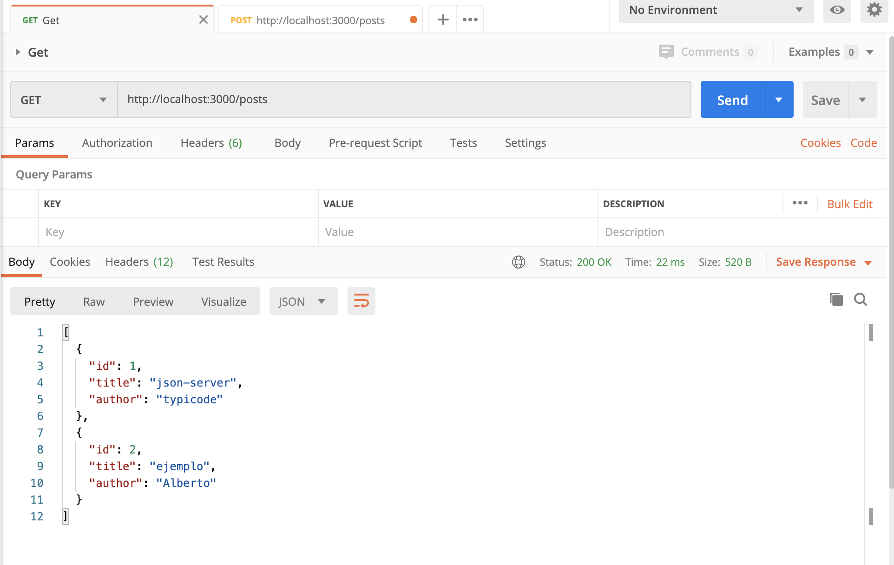

Este proceso se puede hacer con PostMan para probar el método POST:

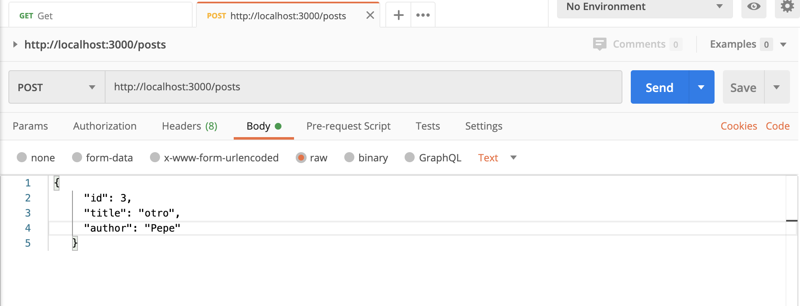

Ahora que tenemos tres objetos guardados podemos atacar a los **endpoints** bajo la url

[http://localhost:3000/posts/1](http://localhost:3000/posts/1) siendo '1' el id de nuestro array de objetos.

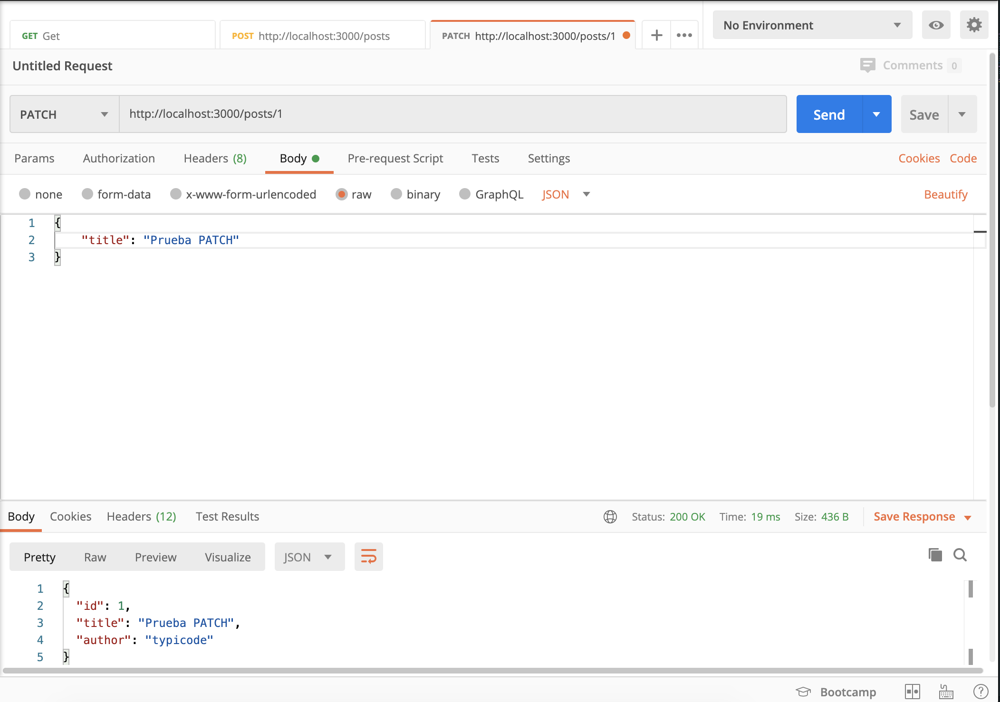

Si os fijáis nuestro objeto con el **"id":1** ha cambiado su **"title"** por **"Prueba PATCH"**. Por lo tanto PATCH funciona en nuestra API. Con esto estamos a un paso de tener un **CRUD** - Create/Response/Update/Delete.

Para ello vamos con el **DELETE**, usamos nuestro PostMan para probarlo tal y como vemos a continuación:

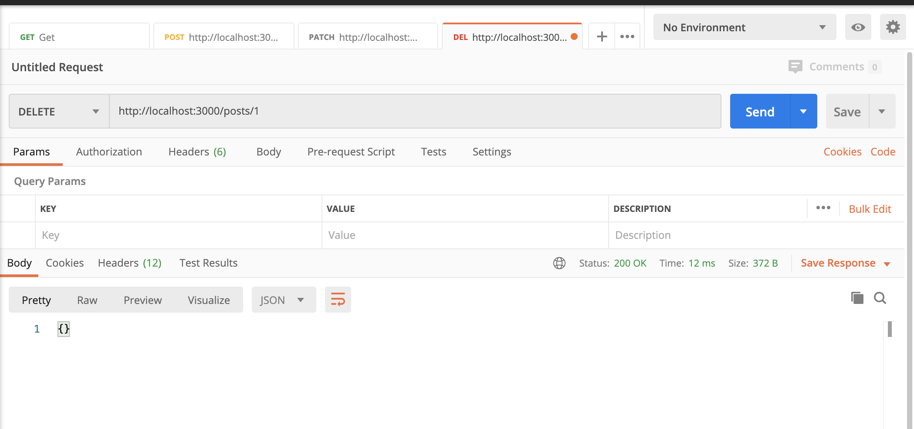

Por último recordar que para introducir valores a nuestra **API** no es necesario PostMan, podemos ir a nuestro fichero **db.json** y engordarlo de manera manual, añadiendo tantos objetos como deseamos.

Por último algunos 'tips' que nunca vienen mal, si nuestro puerto 3000 está ocupado o tenéis otra API escuchando podemos cambiar el puerto, en nuestro **package.json**, de la siguiente manera:

```json
{
  "name": "backend",
  "version": "1.0.0",
  "description": "",
  "main": "index.js",
  "scripts": {
    "server": "json-server --watch ./db/db.json --port 3010"
  },
  "keywords": [],
  "author": "",
  "license": "ISC",
  "dependencies": {
    "json-server": "^0.16.1"
  }
}
```

Si os fijáis ha cambiado el script, y ahora cuando arrancamos nuestra API, escucha en el puerto 3010:

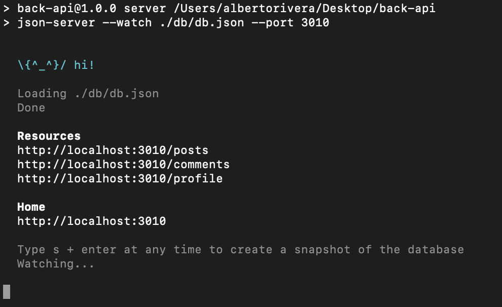

Por último os dejamos el enlace a la DOCUMENTACIÓN de json-server :

[typicode/json-server](https://github.com/typicode/json-server)

### **BONUS UPGRADERS**

Ya que nos hemos dado una vuelta por la DOCU vamos a dejarlos algunos ejemplos más de como usarla. Aunque como siempre esperamos que seáis vosotros quienes profundicéis en el uso de la misma y lo compartáis con vuestros compañeros. Últimos ejemplos!

Vamos a probar a realizar un FILTER pasando por parámetro de la url, como siempre usaremos PostMan para ver que funciona correctamente nuestra API:

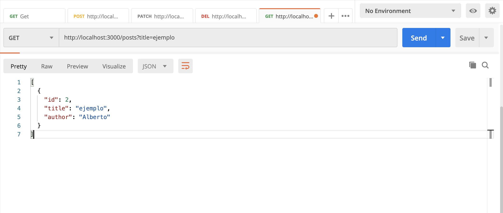

Para hacer uso del FILTER simplemente atacamos al siguiente endpoint : [http://localhost:3000/posts?title=ejemplo](http://localhost:3000/posts?title=ejemplo) y nos devuelve el elemento que cumple con lo introducido por parámetro.

Para finalizar imaginaros que queremos tener la posibilidad de registrarnos en nuestra **API**, para ello creamos un fichero **users.js**:

```jsx
module.exports = () => {
  const data = {
    users: [],
  };
  // Crear Users de manera aleatoria
  const registers = 5;
  for (let i = 0; i < registers; i++) {
    data.users.push({
      id: i,
      name: `user${i}`,
      other: `other${i}`,
    });
  }
  return data;
};
```

Para guardar estos datos tenemos que ejecutar los siguientes comandos - que nos generará una semilla de users:

```bash
sudo npm install -g json-server

json-server users.js
```

Esto nos devolverá en consola:

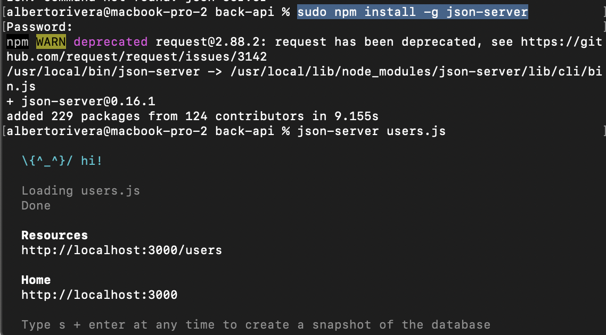

Qué quiere decir? que ahora tenemos un nuevo endpoint - [http://localhost:3000/users](http://localhost:3000/users)  y para comprobar que esto es correcto nos vamos a nuestro PostMan y lanzamos un GET:

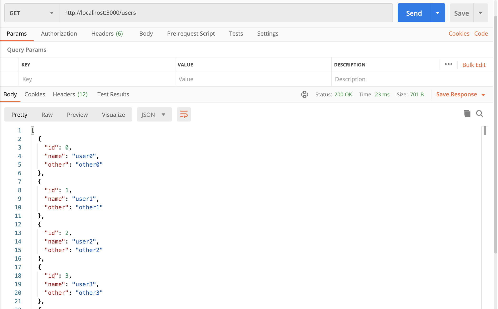

Esto nos serviría para tener un listado de usuarios y poder tener un Login en nuestra Aplicación. En caso de querer realizar un Registro es tan sencillo como atacar al mismo endpoint realizando un POST.

Por último recordad que si decidimos realizar este proceso no tendremos el resto de endpoints disponibles. Es un ejemplo para generarlo de manera dinámica. Para una API lo suyo sería tener en nuestro **db.json** un apartado de users que permite hacer un GET en el caso que existiese alguno o un POST para crearlo.