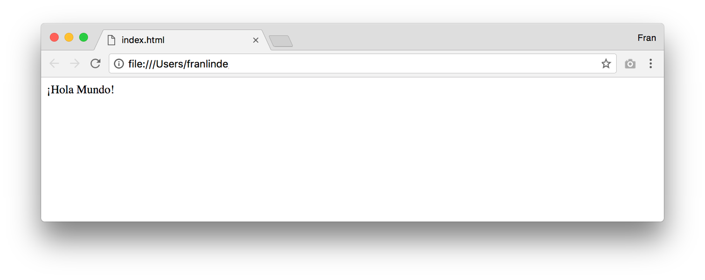
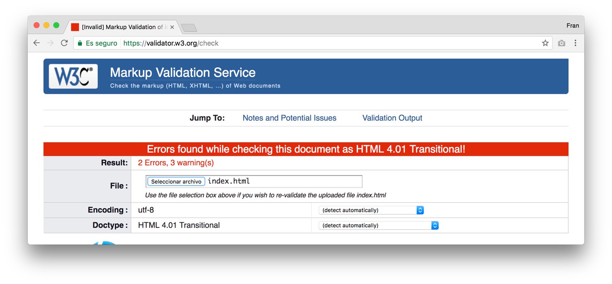
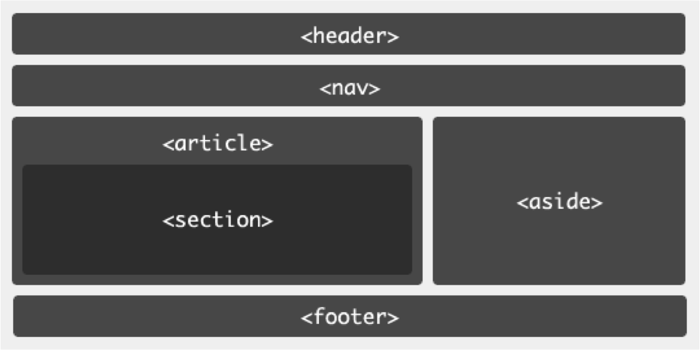
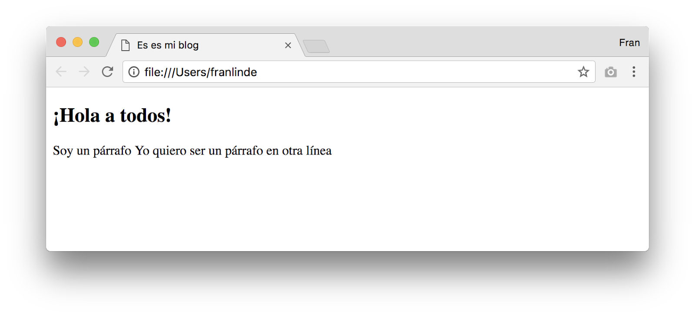
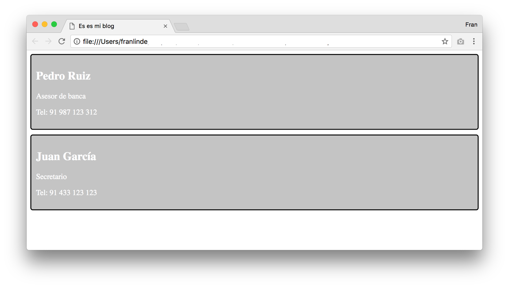
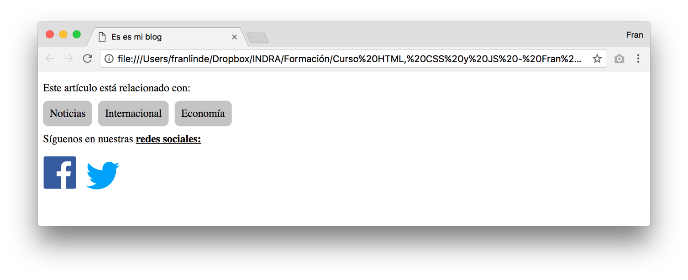
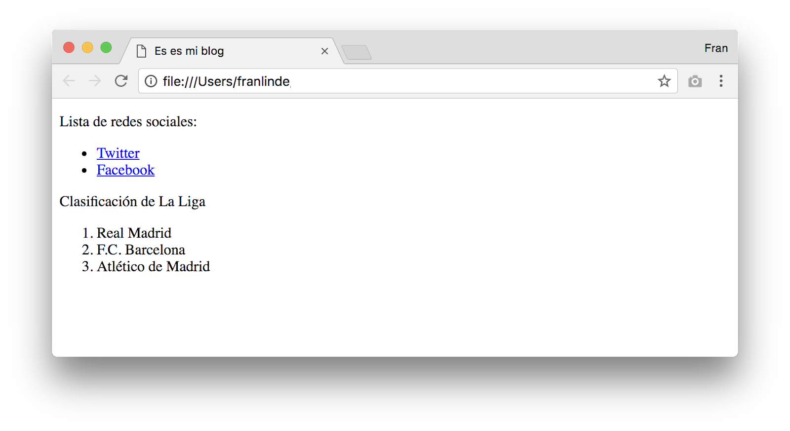
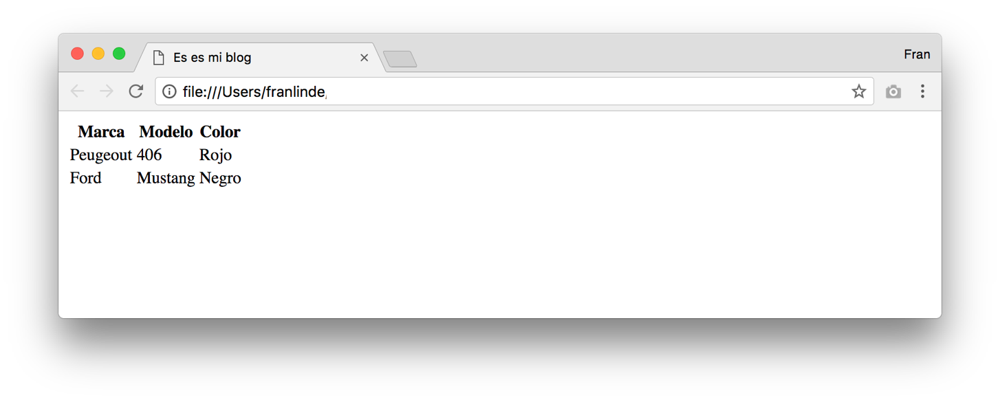
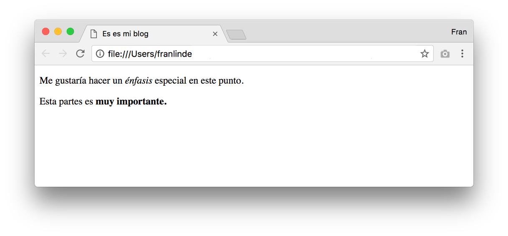

# HTML: Intro HTML y etiquetas principales

### ¿Qué es HTML?

Cualquier página web del mundo que puedas imaginarte, está realizada con HTML. Por suerte, HTML es uno de los lenguajes de marcado más sencillo, ya que consiste en un documento de texto formado por ciertas etiquetas, que nos aportan semántica al contenido.

Comenzaremos con un ejemplo sencillo. Para su desarrollo recomendamos la utilización del editor de Visual Code. Comenzaremos creando un fichero al que otorgaremos el nombre “index.html” y cuyo contenido será el siguiente:

```html
¡Hola Mundo!
```

Este fichero puede ser abierto directamente con un navegador, y efectivamente mostrará el contenido “¡Hola Mundo!”, pero aún estamos muy lejos de hacer una verdadera página HTML.

De hecho, este documento no es un documento HTML válido. Una de las primeras normas que debemos aprender es que no podemos conformarnos con que el documento se vea bien en un navegador. Debemos generar documentos HTML correctos y válidos.

Los navegadores web siempre tratan de ofrecer la mejor experiencia posible al usuario, por este motivo, aunque el documento contenga errores de sintaxis, el navegador lo mostrará:



### Validación de un documento HTML

Como comentábamos en el punto anterior, nuestro documento “index.html” no es un documento válido, y para comprobarlo podemos usar multitud de validadores de HTML.

El más conocido es el que ofrece la W3C: [https://validator.w3.org/](https://validator.w3.org/)

*Nota: La W3C es el consorcio que genera los estándares y recomendaciones a seguir para HTML y HTTP.*

Si subimos este documento al validador de la W3C podremos comprobar que contiene multitud de errores:



El validador nos ofrece información sobre cada uno de los errores, pero antes de centrarnos en los errores de este documento, primero vamos a ver cómo es la estructura de un documento HTML.

### Estructura de un documento HTML

Un documento HTML está formado por etiquetas o tags. Una etiqueta es un nombre escrito entre signos de mayor y menor, que nos ayuda a organizar y clasificar el contenido de nuestro documento HTML.

El nombre de la etiqueta sirve para que informar sobre la naturaleza del contenido que alberga. Pueden estar compuestas de etiqueta de apertura y de cierre o ser etiquetas únicas.

Ejemplo de etiqueta única: **`<nombre>`**

Ejemplo de etiqueta con apertura y cierre: **`<nombre>`** Contenido **`</nombre>`**

### La etiqueta DOCTYPE

Un documento HTML debe siempre comenzar con una etiqueta **`<DOCTYPE>`.** Esta etiqueta permite al navegador saber qué versión de HTML estamos utilizando en el documento.

Existen multitud de versiones HTML y por consiguiente una multitud de etiquetas doctype asociadas. Nosotros haremos uso del estándar actual: usaremos HTML5, cuya etiqueta es la siguiente:

```html
<!DOCTYPE html>
```

### La etiqueta html

Lo documentos HTML tienen forma de árbol, puesto que podemos encontrar elementos padres, hijos y hermanos. La etiqueta HTML debe ser siempre la etiqueta de raíz de un documento HTML y debe contener todas las demás etiquetas y metadatos.

```html
<!DOCTYPE html>
<html>Hello, world!</html>
```

### Las etiquetas body y head

El ejemplo anterior sigue sin ser un documento HTML válido. No debemos colocar nunca contenido directamente dentro de la etiqueta **`<html>`**.

De hecho, la etiqueta **`<html>`** solo puede contener dos etiquetas en su interior: la etiqueta **`<head>`** y la etiqueta **`<body>`**. Teniendo como resultado un documento con la siguiente estructura:

```html
<!DOCTYPE html>
<html lang="en">
<head>
    <meta charset="UTF-8">
    <meta name="viewport" content="width=device-width, initial-scale=1.0">
    <title>Document</title>
</head>
<body>
    
</body>
</html>
```

El contenido visible de nuestra página debe colocarse dentro de la etiqueta **`<body>`**. El contenido de la etiqueta **`<head>`** lo veremos más tarde.

Puedes observar que hemos “indentado” o tabulado el documento. Se trata de una práctica muy extendida y cuyo fin es mejorar la compresión y la legibilidad. Para indentar un documento debemos introducir un nivel más de tabulación siempre que encontremos contenido dentro de una etiqueta. Por ejemplo, hemos introducido un nivel de indentación pasada la etiqueta `<html>`, porque tanto la etiqueta `<head>` como la etiqueta `<body>`, se encuentran dentro de esta.

### La etiqueta "a" o hiperenlace

La principal característica que hizo que las páginas web se convirtieran en lo que son hoy en día son los hiperenlaces (llamados comúnmente enlaces). Un enlace permite que un usuario navegue entre distintos documentos HTML.

Los enlaces se escriben mediante la etiqueta **`<a>`** (proviene del inglés anchor), y poseen una propiedad llamada `href`, que permite indicar la ruta del HTML al que vamos a enlazar. Por ejemplo:

```html
<!DOCTYPE html>
<html lang="en">
<head>
    <meta charset="UTF-8">
    <meta name="viewport" content="width=device-width, initial-scale=1.0">
    <title>Document</title>
</head>
<body>
    <a href="http://google.com">Ir a la página web de Google</a>
</body>
</html>
```

### Secciones una página HTML

Con la aparición de HTML5 han surgido nuevas etiquetas semánticas que permiten establecer estructuras en nuestras páginas. Es importante hacer un uso correcto de las etiquetas por varias razones:

- Tienen un impacto directo en cómo el navegador lo renderiza
- Afectan al SEO (posicionamiento)
- Afectan tremendamente a la accesibilidad de la página

Un ejemplo de una página web bien estructurada es el siguiente:



En este ejemplo podemos encontrar las siguientes etiquetas:

- `<header>` es el elemento superior de nuestra página web, habitualmente contiene el logo de la compañía y el título de la página web
- `<nav>` contiene la navegación de la página web
- `<footer>` es el elemento inferior de la página web y suele contener enlaces y el copyright
- `<aside>` debe contener elementos que aportan información complementaria
- `<article>` es una unidad de contenido (por ejemplo: en un blog sería un post)
- `<section>` representa una división de un contenido

El documento HTML de esta estructura tendría el siguiente aspecto:

```html
<!DOCTYPE html>
<html lang="en">

<head>
    <meta charset="UTF-8">
    <meta name="viewport" content="width=device-width, initial-scale=1.0">
    <title>Document</title>
</head>

<body>
    <header>
        <p>Blog Hola Mundo</p>
    </header>

    <nav>
        <a href="http://google.com">Web de Google</a>
    </nav>

    <article>
        <section>
            <h1>Primer artículo</h1>
            <p>Texto del artículo</p>
        </section>
        
    </article>

    <aside>
        <p>Información extra</p>
    </aside>

    <footer>
        <p>Copyright Minsait</p>
    </footer>
</body>
</html>
```

### La etiqueta head

Anteriormente indicamos que veríamos la etiqueta **`<head>`** más adelante, ¡vamos a ello!

La etiqueta **`<head>`** (no confundir con la etiqueta **`<header>`**) tiene como misión contener metadatos sobre el documento como el título, la codificación del fichero, etiquetas para buscadores, enlaces a CSS y JavaScript… etc. Veamos un pequeño ejemplo:

```html
<head>
    <meta charset="UTF-8">
    <meta name="viewport" content="width=device-width, initial-scale=1.0">
    <title>Minsait - Bootcamps molones :)</title>
</head>
```

La etiqueta **`<title>`** indica el título que posteriormente mostrarán los navegadores web en la parte superior de la venta o de la pestaña.

La etiqueta **`<meta>`** permite indicar información muy diversa, en este caso está indicando la codificación del fichero. Cabe destacar que esta etiqueta no posee etiqueta de cierre, ya que la información debe incluirse como atributo de la misma y no como contenido.

### Encabezados o títulos en HTML

Podemos encontrar 6 etiquetas para realizar encabezados: desde **`<h1>`** hasta **`<h6>`** Lo cual nos permite establecer niveles de importancia dentro de los títulos, siendo **`<h1>`** el más importante, **`<h2>`** el siguiente, y así sucesivamente disminuyendo importancia hasta llegar a **`<h6>`.** Ejemplo:

```html
<article>
   <h1>¡Soy un título muy importante!</h1
</article>
```

### Párrafos en HTML

La etiqueta **`<p>`** es la etiqueta apropiada para contener textos (siempre que no sean títulos, enlaces o listas, que tienen su etiqueta propia). **`<p>`** proviene del inglés paragraph (párrafo) y por tanto debe ser usada para contener solo dicho contenido.

Los párrafos por defecto en todos los navegadores comienzan ocupando una línea nueva. Por este motivo, si necesitamos incluir un salto de línea dentro de nuestro texto, lo correcto es usar un párrafo nuevo. Por ejemplo:

```html
<article>
   <h1>¡Hola a todos!</h1>
   <p>Soy un párrafo</p>
   <p>Soy un párrafo en otra línea</p>
</article>
```

Podría tentarnos la idea de incluir un salto de línea de la siguiente manera:

```html
<article>
    <h1>¡Hola a todos!</h1>
    <p>Soy un párrafo
    Yo quiero ser un párrafo en otra línea</p>
</article>
```

Pero si vemos este código en un navegador (como por ejemplo Google Chrome) veremos que el salto de línea esperado, no se produce. Esto sucede debido a que los navegadores convierten todos los espacios en blanco (tabuladores, saltos de línea o múltiples espacios) en un único espacio en blanco.



Algún programador es posible que conozca la etiqueta **`<br>`**, comúnmente (y erróneamente) usada para realizar saltos de línea. Esta etiqueta no tiene un carácter semántico, el cual buscamos con HTML5. Sucede lo mismo con etiquetas como **`<i>`** (italic) y **`<b>`** (bold), que debemos evitar, ya que estas etiquetas están enfocadas a la presentación que tendrán estos elementos.

### Imágenes en HTML

Para incluir imágenes en nuestros documentos HTML debemos usar la etiqueta **``,** la cual nos ofrece el atributo **`src`** para indicar la ruta en la que se encuentra alojada la imagen.

```html
<article>
    <h1>¡Hola a todos!</h1>
    <p>Esto es una imagen:</p>
    
</article>
```

Es común ver que se usan sobre esta etiqueta los atributos **`height`** o **`width`**. Al ser propiedades de presentación, lo correcto es indicar estos valores mediante CSS.

No conviene confundir la etiqueta `` para incluir imágenes, con la imágenes que puedan aparecer en el *background* de un contenedor. Las `` son usadas por ejemplo, para una tienda de ropa, la típica parrilla de productos, en la que cada producto presenta una imagen del mismo.

Para establecer imágenes de fondo en un contenedor, será más propio utilizar reglas de CSS como `background-image`. En esta primeras sesiones NO es necesario incluir imágenes de fondo.

### La etiqueta div

La etiqueta **`<div>`** es una de las más usada en HTML. “Div” proviene del inglés “divider” y representa una división o sección dentro de nuestro documento.

Una de las propiedades más usadas del **`<div>`** es a nivel de presentación, ya que por defecto un **`<div>`** se muestra como un bloque, ocupando la altura que necesite según su contenido, pero al mismo tiempo ocupando todo el ancho que pueda.

Posteriormente veremos cómo los **`<span>`** tienen precisamente el comportamiento contrario.

Esta propiedad CSS se denomina **`display`,** y la veremos en profundidad más adelante.

Veamos un ejemplo de página que haga uso de **`<div>`** para mostrar unas tarjetas de visita con información personal.

```html
<!DOCTYPE html>
<html>

<head>
    <meta charset="utf-8">
    <title>Es es mi blog</title>
    <link rel="stylesheet" type="text/css" href="blog.css">
    <script type="text/javascript" src="blog.js"></script>
</head>

<body>
    <div class="tarjeta">
        <h2>Pedro Ruiz</h2>
        <p>Asesor de banca</p>
        <p>Tel: 91 987 123 312</p>
    </div>
    <div class="tarjeta">
        <h2>Juan García</h2>
        <p>Secretario</p>
        <p>Tel: 91 433 123 123</p>
    </div>
</body>

</html>
```

Estos son los estilos CSS que hemos aplicado:

```css
.tarjeta{
    border: 2px solid #000;
    border-radius: 5px;
    padding: 10px;
    background: #c4c4c4;
    color: #FFF;
    margin-bottom: 10px;
}
```

Cuyo resultado es el siguiente:



Como puede observarse, ambos **`<div>`** han ocupado la altura que han necesitado para poder albergar su contenido, sin embargo, han ocupado más ancho del estrictamente necesario, expandiéndose todo lo que han podido.

### La etiqueta span

Como ya adelantábamos al hablar de los **`<div>`,** los **`<span>`** son elemento que no ocupan todo el ancho que pueden. Un **`<span>`** por defecto, ocupará solo el ancho y el alto que necesite para albergar su contenido.

Generalmente son usados para:

- Mostrar varios elementos en una misma línea: por ejemplo, una nube de etiquetas o de logos
- Añadir unos estilos diferentes a una parte de un texto. Por ejemplo, dentro de un párrafo **`<p>`** es bastante común que encontremos palabras o frases con colores, tamaños o fuentes diferentes.

Veamos un ejemplo que demuestre ambos usos:

```html
<p>Este artículo está relacionado con:</p>
<div class="grupo-etiquetas">
    <span class="etiqueta">Noticias</span>
    <span class="etiqueta">Internacional</span>
    <span class="etiqueta">Economía</span>
    <span class="etiqueta">España</span>
</div>

<p>Síguenos en nuestras redes sociales:</p>
<div class="grupo-logos">
    <span class="logo">
        
    </span>

    <span class="logo">
        
    </span>

    <span class="logo">
        
    </span>
</div>
```

Los estilos que hemos aplicado son los siguientes:

```css
.grupo-etiquetas {
    margin-top: 20px;
    margin-bottom: 20px;
}

.etiqueta {
    border-radius: 8px;
    padding: 10px;
    background: #c4c4c4;
    margin-right: 5px;
}

.logo {
    margin-right: 10px;
}

.logo-img {
    width: 50px;
    height: auto;
}

.redes-sociales-text {
    font-weight: bold;
    text-decoration: underline;
}
```

Veamos cuál sería el resultado al visualizarlo en un navegador:



### Listas en HTML

En HTML encontramos dos tipos de listas:

- Listas ordenadas: Se representan con la etiqueta `<ol>` y por defecto los navegadores representan estas listas numeradas, pero no es obligatorio. `<ol>` nos indica que se trata de una lista ordenada por algún tipo de orden (puede ser alfabético, por puntuación, por orden de llegada…)
*Nota: `<ol>` proviene de Ordered List*

- Listas desordenadas: Las listas desordenadas contienen un conjunto de elementos cuyo orden no es relevante. Por defecto los navegadores no las muestran numeradas.
*Nota: <ul> proviene de Unordered List*

Independientemente de si se trata de una lista ordenada o desordenada, los elementos dentro de estas, deben ser `<li>`, cuyo nombre proviene del inglés “list item”. Ejemplo:

```html
<p>Lista de redes sociales:</p>
<ul>
    <li><a href="http://twitter.com">Twitter</a></li>
    <li><a href="http://facebook.com">Facebook</a></li>
</ul>
<p>Clasificación de La Liga</p>
<ol>
    <li>Real Madrid</li>
    <li>F.C. Barcelona</li>
    <li>Atlético de Madrid</li>
</ol>
```

Como indicábamos previamente, las listas ordenadas se deben usar cuando los elementos dentro de ella se encuentran ordenados según algún criterio.

La visualización de este HTML en un navegador presenta el siguiente aspecto:



### Tablas en HTML

Otra forma de representar la información en nuestra página HTML es haciendo uso de tablas. Durante muchos años las tablas se utilizaron para realizar el layout o estructura visual de la página. Actualmente usar tablas para algo distinto que representar un dato que se corresponde con una tabla, es un grave error.

Volviendo al punto de que HTML5 es semántico, una tabla no debería nunca usarse para realizar un layout. No solo representa un error semántico, si no que además representa un problema en resoluciones de pantalla pequeñas, al no ser un componente responsive o adaptativo (más adelante trataremos este aspecto).

No obstante, sabiendo estas indicaciones, podemos hacer uso de las tablas HTML. Veamos su estructura con un ejemplo:

```html
<table>
    <thead>
        <tr>
            <th>Marca</th>
            <th>Modelo</th>
            <th>Color</th>
        </tr>
    </thead>
    <tbody>
        <tr>
            <td>Peugeout</td>
            <td>406</td>
            <td>Rojo</td>
        </tr>
        <tr>
            <td>Ford</td>
            <td>Mustang</td>
            <td>Negro</td>
        </tr>
    </tbody>
</table>
```

Como se puede observar, la etiqueta raíz de una tabla es **`<table>`,** dentro de la cual encontramos los elementos **`<thead>`** y **`<tbody>`.** Como su propio nombre indica la primera servirá para contener la cabecera de la tabla y la segunda contendrá el cuerpo de la misma.

Dentro de cada una de las estas partes encontraremos las filas de la tabla etiquetadas como **<tr>** (del inglés table row) y cada uno de los elementos etiquetados como **<td>** (del inglés table data). Si visualizamos este código en un navegador tendrá el siguiente aspecto:



### Etiquetas em y strong

Antes comentamos que no se recomienda hacer uso de las etiquetas **`<bold>`** e **`<italic>`,** ya que ambas tienen un marcado carácter representacional, en vez de semántico.

Generalmente cuando queremos dar importancia a una parte del texto solemos marcarlo con letras más gruesas, también conocido como negrita. El uso de la etiqueta **`<bold>`** nos estaría diciendo que la letra debe ir negrita, esta información sobre sus estilos debería dárnosla su CSS, pero nunca la propia etiqueta.

Por este motivo se recomienda en su lugar hacer uso de la etiqueta **`<strong>`.** Mediante esta etiqueta estamos indicando que esa parte del texto es más importante, pero no estamos indicando cómo debe mostrarse (aunque por defecto los navegadores suelen representarlo mediante texto en negrita).

Del mismo modo sucede con la etiqueta **`<italic>`**. Esta etiqueta posee un marcado carácter de estilo. En su lugar debemos usar la etiqueta **`<em>`** (proveniente del inglés emphasis), ****la cual nos indica que debemos aplicar un énfasis especial a esta parte, pero no indica de qué manera deberá mostrarse (en este caso por defecto los navegadores suelen representarlo mediante texto en itálica). Veamos un ejemplo mínimo:

```html
<p>Me gustaría hacer un <em>énfasis</em> especial en este punto.</p>
<p>Esta parte es <strong>muy importante.</strong></p>
```

Cuyo resultado es:

