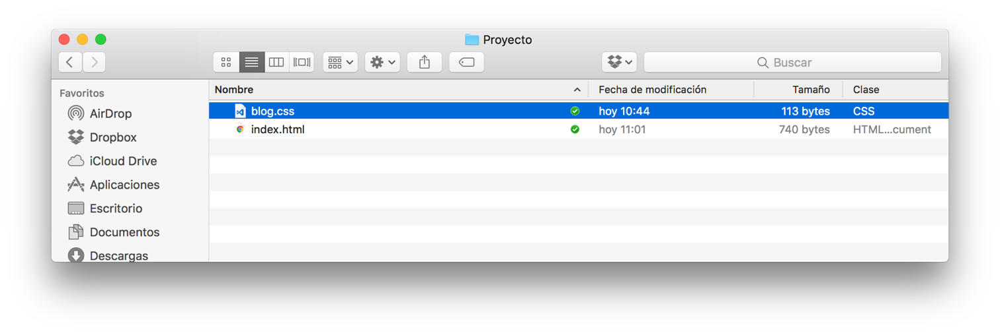
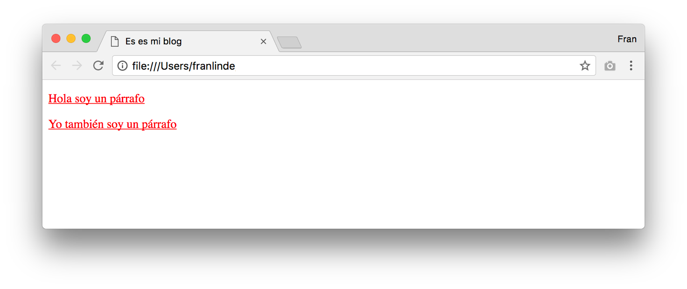
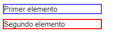
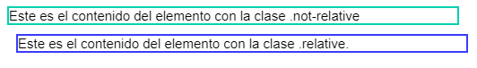
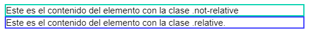
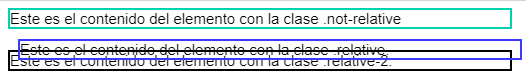
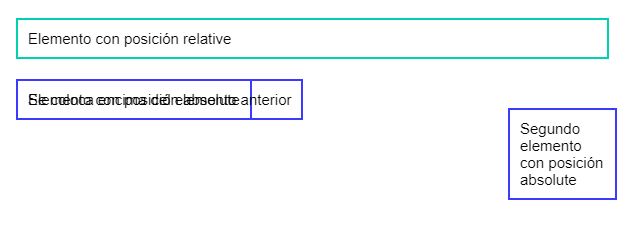
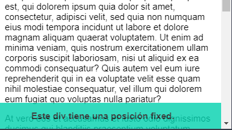

# CSS: selectores, display, position y unidades

### Introducción

Durante las lecciones anteriores hemos tratado algunos conocimientos básicos sobre la sintaxis de HTML, que nos han permitido desarrollar nuestras primeras páginas. Ahora vamos a realizar una introducción a la tecnología que nos permite aplicar estilos a estas páginas: CSS.

El nombre CSS proviene del inglés Cascading Style Sheets (hojas de estilo en cascada). El propio nombre nos indica que serán documentos y que su aplicación es en cascada (esto lo trataremos más adelante).

Mediante CSS tendremos la posibilidad de aplicar reglas de visualización como: colores, márgenes, bordes, sombras, tamaños y muchas más propiedades, a elementos HTML de nuestro documento, mediante la siguiente sintaxis:

```css
selector {
    propiedad: valor;
}
```

El selector indicará al navegador qué elementos se van a ver afectado por la regla. La propiedad será la que queramos modificar: ancho, alto, color, borde, sombra... etc. Y por último el valor será el que queramos aplicar a la mencionada propiedad.

Por ejemplo:

```css
header {
  color: red;
  font-size: 28px;
}

p {
  color: green;
}
```

En este ejemplo encontramos dos reglas:

- La primera tiene `**header**` como selector, por lo que aplicará a todas las etiquetas **`<header>`** de nuestra página (Nota: no deberíamos tener más de uno en cada página). Por un lado, se está indicando que la propiedad “color” debe tener el valor “red” (rojo) y por otro que la propiedad “font-size” (tamaño de la fuente) tiene el valor “28px” (28 píxeles).
- La segunda propiedad tiene “p” como selector, por lo que dicha regla se aplicará a todas las etiquetas **<p>** que aparezcan en nuestra página. Esta regla indica que la propiedad “color” debe tener el valor “green” (verde).

### Cómo incluir CSS en una página

Existen varias formas de incluir CSS en una página HTML, vamos a ver las más utilizadas:

- **Estilos in-line o en línea:**

Cada etiqueta HTML posee un atributo “style” sobre el cual podemos aplicar estilos directamente. De esta forma no necesitamos hacer uso de selectores, puesto que los estilos se aplicarán sobre propio elemento que los contiene.

Ejemplo:
    
```html
<p style="background-color: grey;">Soy un texto con fondo gris</p>
```

En el código anterior podemos observar una etiqueta **`<p>`** sobre la cual estamos aplicando estilos en línea. En este caso estamos indicando que para ese párrafo la propiedad “background-color” tendrá el valor “grey” (gris).

Esta forma de aplicar CSS **no se recomienda** por varias razones:

- Se vuelve difícil tener control sobre todos los estilos de la página
- El tamaño de nuestro HTML crece, volviéndose pesado y difícil de mantener
- Los estilos en línea no nos permiten reutilizarlos. Si queremos que dos elementos tengan el mismo estilo, tendremos que copiar el atributo style entero en ambos elementos.
- No nos permite estructurar ni organizar nuestros estilos de ninguna manera
    
- **Estilos dentro de la etiqueta `<head>`:**

Durante las lecciones de HTML hemos visto la etiqueta **`<head>`.** Además de los usos que se mencionaban, también ofrece la posibilidad de incluir CSS en nuestra página web haciendo uso de la etiqueta **`<style>`** como muestra el siguiente ejemplo:
    
```html
<!DOCTYPE html>
<html>

<head>
    <meta charset="utf-8">
    <title>Es es mi blog</title>
    <style>
        a {
            text-decoration: underline;
        }

        p {
            color: blue;
            font-size: 20px;
        }
    </style>
</head>

<body>
    <p>Este es un texto azul</p>
    <a href="http://google.es">Este es un enlace subrayado</a>
</body>

</html>
```

En el ejemplo podemos observar cómo se ha incluido la etiqueta **`<style>`** bajo la cual hemos incluido un par de reglas CSS. Estas reglas aplica a todas las etiquetas **`<a>`  y `<p>`** que encontremos en el documento. Lo que indica nuestra regla al navegador es que debe mostrar una línea por debajo de todos los enlaces de la página (etiquetas **`<a>`**) y mostrar los párrafos azules y con tamaño 20px de fuente.

Podemos también observar en el ejemplo anterior cómo hemos tabulado el CSS la misma manera que tabulamos el HTML: añadimos un nivel de tabulado o indentación dentro de cada regla CSS.

En esta forma de incluir CSS encontramos ventajas respecto a la anterior, **pero aún quedan problemas** que no nos resuelve:

- No podemos reutilizar estos estilos en otra página HTML salvo que copiemos y peguemos todo el contenido de la etiqueta `<style>`
- Nuestro HTML crece a medida que añadimos más estilos, pudiendo convertirse en un archivo demasiado grande.

- **Estilos en ficheros externos .css:**

La manera **más correcta** de incluir CSS en nuestras páginas es haciendo uso de ficheros externos que contengan nuestras reglas CSS. Para incluir ficheros CSS externos debemos incluir la etiqueta **<link>** dentro de nuestra etiqueta **<head>** de la siguiente manera:
    
```html
<!DOCTYPE html>
<html lang="en">
<head>
    <meta charset="UTF-8">
    <meta name="viewport" content="width=device-width, initial-scale=1.0">
    <title>Document</title>
    <link rel="stylesheet" href="./blog.css">
</head>
<body>
    
</body>
</html>
```


Como podemos observar la etiqueta **`<link>`** posee varios atributos. Los dos primeros (**`"rel"`** y  **`"type"`**) indican al navegador que es una hoja de estilos de tipo texto. El último atributo: **`"href"`** ya debería sonarnos, puesto que en las etiquetas `**<a>**` (enlaces) usamos el mismo atributo para indicar la ruta a la que queremos dirigir dicho enlace.

En este caso **`"href"`** nos servirá para indicar la ruta en la que se encuentra alojado el fichero CSS que queremos incluir.

En el ejemplo vemos que se está incluyendo un fichero llamado “blog.css”. Al no indicar más información sobre la ruta, estamos indicando al navegador que el fichero se encuentra en el mismo directorio que el HTML que lo está incluyendo.

Vamos por tanto a crear un fichero “blog.css” en la misma ruta que nuestro index.html de manera que nos quede así:



Dentro del fichero “blog.css” incluiremos las siguientes reglas CSS:

```css
p {
    color: red;
    text-decoration: underline;
}
```

Si visualizamos ahora nuestro HTML en un navegador observaremos que se han aplicado las reglas CSS sobre todos los elementos **`<p>`** que tenemos en nuestro documento HTML.



## Selectores CSS

Hasta ahora en nuestros ejemplos hemos usado como selectores las propias etiquetas HTML (**`<p>`** y **`<a>`**). Vamos a ver otros selectores CSS que nos permitirán organizar nuestro CSS mejor y ser más selectivos (valga la redundancia) en los elementos sobre los que aplicar los estilos.

### Selectores por etiqueta

Son los selectores que hemos usado en los ejemplos anteriores. Son sencillos de usar, pero no permiten realizar una selección precisa de elementos, debido a que los estilos que indiquemos se aplicarán a todas las etiquetas de ese tipo que aparezcan en nuestro documento.

Ejemplo:

```css
p {
  color: gray;
  font-size: 14px;
  font-weight: normal;
}

h1 {
  font-size: 28px;
  font-weight: bold;
}
```

Aunque no son los mejores selectores, ofrecen algunas ventajas, como por ejemplo a la hora de realizar unos estilos homogéneos en nuestras páginas. Es muy común que nos pidan como desarrolladores que todos los párrafos o todos los títulos tengan el mismo color, el mismo tamaño y la misma tipografía. Los selectores CSS por etiqueta nos permiten hacer esto de una manera sencilla.

### Selectores de clase

Los selectores CSS de clase nos permiten indicar estilos diferentes a etiquetas que sean iguales. Es decir, que nos permiten tener dos párrafos con estilos distintos. Esto no es posible usando selectores de etiqueta.

Veamos un ejemplo con nuestro fichero “blog.css”. Puede observarse como los selectores CSS de clase se escriben indicando el nombre de la clase precedido por un punto:

```css
.estilo1 {
  color: red;
  font-size: 14px;
}

.estilo2 {
  font-weight: bold;
  color: blue;
  text-decoration: underline;
}
```

Por otro lado, nuestro fichero “index.html” luciría así:

```html
<html>

<head>
    <meta charset="utf-8">
    <title>Este es mi blog</title>
    <link rel="stylesheet" type="text/css" href="blog.css">
</head>

<body>
    <p class="estilo1">Hola soy un párrafo con estilo 1</p>
    <p class="estilo2">Hola soy un párrafo con estilo 2</p>
</body>

</html>
```

Y si visualizamos nuestro index.html en un navegador este será el resultado:

.png)

Como se puede observar en nuestro “index.html” la manera de añadir clases a nuestros elementos es mediante el atributo “class”, el cual acepta múltiples nombres de clases separados por espacios. Por ejemplo, si quisiéramos que un párrafo tuviera dos estilos lo haríamos de la siguiente manera:

```html
<p class="estilo1 estilo2">Hola soy un párrafo con estilo 1 y 2</p>
```

Si visualizamos nuestro index.html en un navegador podremos observar lo siguiente:

.png)

Se observa que se han aplicado ambas reglas y encontramos algo interesante: se ha impuesto la propiedad `color: blue;` sobre `color: red;` Esto se debe a la naturaleza de CSS: recordando el nombre “Cascasing Style Sheets”: Cascading viene a indicarnos que los estilos se aplican en forma de cascada: a igualdad de condiciones, se aplica el último estilo cargado. Por este motivo prevalece el estilo impuesto por la clase “estilo2”.

Ejercicio: Prueba a cambiar el orden de las clases en el fichero blog.css ¿Cómo debería verse nuestro párrafo ahora?

### Selectores por ID

En algunas ocasiones nos gustaría que nuestras reglas CSS se aplicasen solo a un elemento, en esos casos es posible que debamos usar como selector un ID. A diferencia de los selectores de clase, cuyo nombre debe ir precedido por un punto, los selectores de ID deben ir precedidos por una almohadilla (#). Veamos un ejemplo sobre nuestro HTML:

```html
<p class="estilo1">Hola soy un párrafo con estilo 1</p>
<p class="estilo1 estilo2">Hola soy un párrafo con estilo 1 y estilo 2</p>
<p id="estilo-especial">Soy un párrafo único</p>
```

Nuestro fichero "blog.css" tendría el siguiente aspecto:

```css
.estilo1 {
  color: red;
  font-size: 14px;
}

.estilo2 {
  font-weight: bold;
  color: blue;
  text-decoration: underline;
}

#estilo-especial {
  border: 1px solid #000;
  padding: 20px;
}
```

Si visualizamos nuestro index.html en un navegador se vería así:

.png)

Debemos tener en cuenta que por corrección no debemos usar **más de un ID** dentro de nuestro documento HTML, de hecho, el uso de un mismo ID múltiples veces en nuestro documento produciría errores de validación de nuestro documento.

### Selectores múltiples

Una regla puede ser aplicada sobre múltiples elementos separándolos por comas. Por ejemplo, si quisiéramos que todos los párrafos y además los enlaces con la clase "especial" tuvieran el mismo estilo, lo haríamos de la siguiente manera:

```css
p, a.especial{
  color: blue;
  font-size: 20px;
}
```

En este ejemplo podemos observar algo nuevo: hemos concatenado el nombre de una etiqueta y una clase, de manera que observamos: "etiqueta.clase". Este selector indica que los estilos se aplicarán solo sobre los elementos de tipo "etiqueta" que además tengan dicha clase.

### Selectores por relación

Existe otras formas de combinar selectores. Por ejemplo, si quisiéramos indicar al navegador que todos los párrafos dentro del footer deben tener un estilo determinado, podemos hacerlo de la siguiente manera:

```css
footer p {
  margin: 20px;
  font-weight: bold;
}
```

La combinación de dos selectores separados por espacio indica anidación a nivel de HTML. Por tanto, en nuestro ejemplo, todos los elementos `<p>` que se encuentren dentro de nuestro `<footer>` se verán afectados por esta regla.

### Colores en CSS

Principalmente existen tres formas de indicar un color en CSS:

- **Por nombre:** existen ciertos nombres reservados y que pueden ser utilizados, como por ejemplo: red, blue, green... etc. Se puede encontrar la lista completa de colores disponibles en:
[https://developer.mozilla.org/en-US/docs/Web/CSS/color_value](https://developer.mozilla.org/en-US/docs/Web/CSS/color_value)

- **RGB o RGBA:** también pueden indicarse mediante un código RGB o RGBA. Los códigos RGBA son como los RGB, pero incluyen un parámetro más que indica el nivel de opacidad del color

Nota: (a en rgba proviene del inglés alpha = opacidad).

- Hexadecimal: Por último pueden indicarse mediante un código hexadecimal.
Ejemplo:
    
```css
.clase-con-color-por-nombre {
  color: red;
}

.clase-con-color-rgb {
  color: rgb(255, 0, 0);
}

.clase-con-color-rgba {
  color: rgba(255, 0, 0, 1);
}

.clase-con-color-hexadecimal {
  color: #ff0000;
}
```
    

En este ejemplo el color siempre es el mismo: rojo. Y es que en HTML/CSS podemos obtener un mismo resultado de múltiples maneras, esto mismo lo veremos en muchos otros ejemplos.

### Fuentes en CSS

Durante la fase de diseño de una página web o una aplicación móvil es muy común que se incluyan distintas tipografías, con distintos grosores y tamaños. Vamos a ver qué propiedades nos ofrece CSS para indicar al navegador la fuente que queremos usar:

- font-family: Indica al navegador el nombre de la fuente que debemos usar. Para ello la fuente debe estar disponible a nivel de sistema o haber sido importada en nuestra web.
- font-weight: Indica el grosor de la fuente. Acepta valores entre 100 y 900, creciendo siempre de 100 en 100.
- font-size: Indica el tamaño de la fuente. Puede ser indicado en píxeles, en em, en porcentajes...

Ejemplo de blog.css:

```css
.fuente-bonita{
  font-family: Arial;
  font-weight: 100;
  font-size: 14px;
}
```

Al igual que indicábamos en la parte de HTML) hemos visto algunas nociones básicas sobre CSS, pero debemos aún profundizar mucho más:

### Modelo de Cajas: Padding, Margin y Border

A la hora de estilizar nuestros componentes es importante que apliquemos espaciados para una correcta posición de los mismos. Esto se consigue mediante las propiedades padding y margin.

- **`padding`**: aplica un espaciado al interior del elemento seleccionado. Esto hace que el elemento crezca o el contenido dentro del mismo se reduzca.
- **`margin`**: aplica espaciado alrededor del elemento seleccionado, alejando este elemento del resto.

Una vez tenemos posicionado nuestros elementos podremos aplicarle un borde, con la propiedad border, que se situará entre los espaciados aplicados con las propiedades antes descritas.

### Display

Define el tipo de caja usada para un elemento HTML. Existen muchos tipos de valores que podemos asignar a esta propiedad, los más utilizados son:

- `inline`: Valor por defecto. Expone un elemento como elemento en línea. No admite width, height ni margin.
- `block`: Expone un elemento como elemento de bloque. Este elemento ocupará todo el ancho posible.
- `inline-block`: Su comportamiento es una mezcla de los dos anteriores, se muestran en la misma línea (respetando el flujo) todos los elementos y además, acepta las propiedades width, height y margin.
- `none`: El elemento no se mostrará ni tendrá́ efecto alguno en la estructura de la web.
- `flex`: Expone un elemento como un elemento de bloque de tipo flexible, generalmente nos servirá para colocar elementos en una misma fila o columna. Esto lo veremos en detalle más adelante :)

### Position en CSS

La propiedad position especifica que método de posicionamiento es usado para un elemento. Existen cuatro tipos de posicionamiento:

- `static`: Posicionamiento por defecto. El elemento será posicionado acorde al flujo normal de la web. Propiedades como top, right, bottom y left no tendrán efecto.
- `relative`: El elemento se posiciona acorde al flujo normal de la web. Propiedades como top, right, bottom y left tendrán efecto e iniciarán las coordenadas 0,0 en el punto de partida del elemento.
- `absolute`: El elemento se posiciona relativamente al primer padre con el valor relative. Propiedades como top, right, bottom y left tendrán efecto e iniciarán las coordenadas 0,0 en el punto de partida del primer padre con el valor relative.
- `fixed`: El elemento se posiciona relativamente a los extremos de la pantalla y quedará fijo aunque hagamos scroll. Propiedades como top, right, bottom y left tendrán efecto e iniciarán las coordenadas 0,0 en el borde superior izquierdo del viewport.

Vamos a ver ejemplos de cada uno de ellos.

### Ejemplo de position `static`:

Creamos unos bloques en HTML:

```html
<div class="first box">
  Primer elemento
</div>

<div class="second box">
  Segundo elemento
</div>
```

Añadimos el siguiente código en CSS:

```css
.box {
  margin: 10px 0;
  border: 2px solid;
  font-family: Arial;
  font-size: 15px;
  width: 200px;
}

.second {
  border-color: red;
}
.first {
  position: static;
  border-color: #3b3bff;
}
```

El resultado en nuestro navegador este:



### Ejemplo de position `relative`:

```html
<div class="not-relative box">
  Este es el contenido del elemento con la clase .not-relative
</div>

<div class="relative box">
  Este es el contenido del elemento con la clase .relative.
</div>
```

Añadimos el siguiente código en CSS:

```css
.box {
  border: 2px solid;
  font-family: Arial;
  font-size: 15px;
  width: 500px;
}

.not-relative {
  border-color: #00D1AE;
}

.relative {
  position: relative;
  border-color: #3B3BFF;
  left: 10px;
  top: 10px;
}
```

El resultado en nuestro navegador este:



Si comentamos las propiedades left y top de la clase relative, el elemento vuelve a su lugar por defecto:



Descomentamos las propiedas left y top de la clase relative, y añadimos un tercer elemento a nuestro HTML:

```html
<div class="not-relative box">
  Este es el contenido del elemento con la clase .not-relative
</div>

<div class="relative box">
  Este es el contenido del elemento con la clase .relative.
</div>

<div class="relative-2 box">
  Este es el contenido del elemento con la clase .relative-2.
</div>
```

Así podemos ver que un posicionado relative ignora otros elementos en el HTML:



### Ejemplo de position `absolute`:

Creamos unos bloques en HTML:

```html
<div class="relative">
  Elemento con posición relative
</div>

<div class="absolute">
  Elemento con posición absolute
</div>

<div class="absolute">
  Se coloca encima del elemento anterior
</div>

<div class="absolute absolute-second">
  Segundo elemento con posición absolute
</div>
```

Añadimos el siguiente código en CSS:

```css
div {
  border: 2px solid;
  font-family: Arial;
  font-size: 15px;
  padding: 10px;
  margin: 10px;
}

.relative {
  border-color: #00d1ae;
  margin-top: 20px;
  position: relative;
  color: black;
}

.absolute {
  border-color: #3b3bff;
  position: absolute;
}

.absolute-second {
  top: 100px;
  left: 500px;
}
```

Esto es lo que vemos en nuestro navegador:



Como podemos ver, los elementos con la posición absolute empiezan a pintarse tomando como origen el elemento con la posición relative.

### Ejemplo de position `fixed:`

El elemento fixed se mantiene en la misma posición aunque hagamos scroll, sin importar la posición de la pantalla en la que nos encontremos:



En la siguiente imagen se observa que el usuario ha bajado hasta el final de la página, pero el elemento verde (que usa position fixed) se sigue mostrando en la misma posición


Llegados a este punto, hemos aprendido las bases del CSS para poder empezar a estilar nuestros HTML. No obstante, existen multitud de reglas que iremos aprendiendo a base de practicar y profundizar en la maquetación 🤓