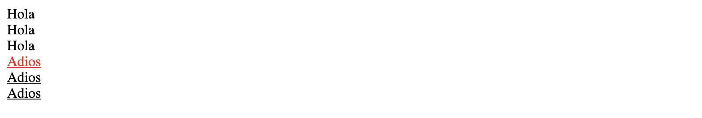
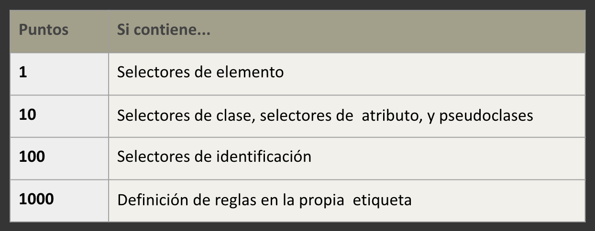
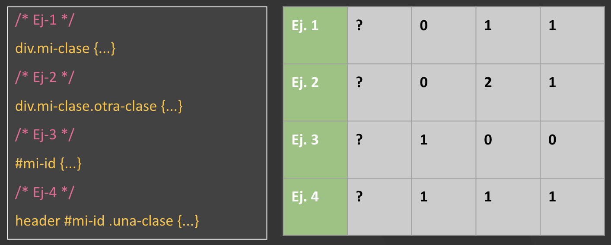
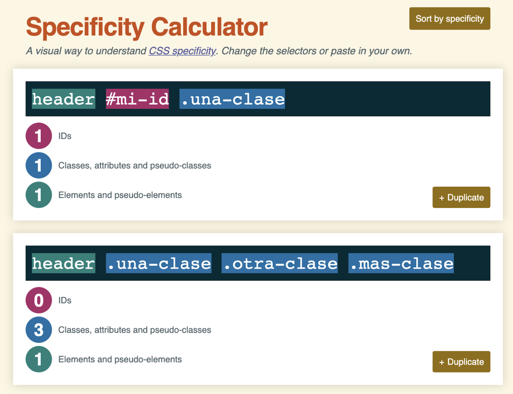
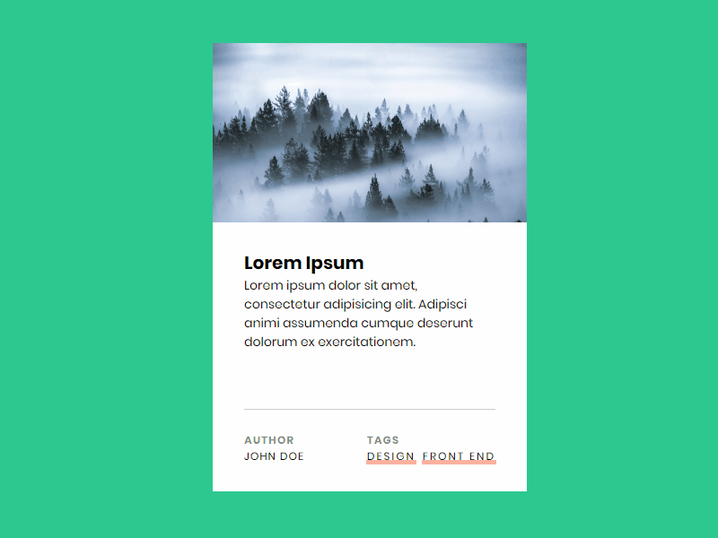
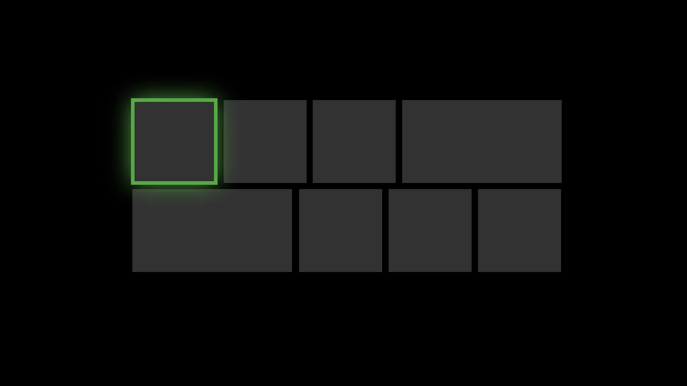
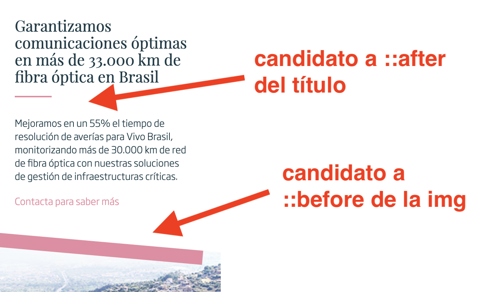
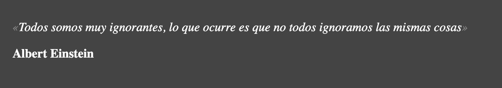

# CSS: Selectores avanzados, especificidad, fuentes, pseudo-elementos y clases. Centrado y fondos.

### Fuentes

Las fuentes aplicadas a tu HTML se pueden controlar mediante la propiedad font-family.

Esta propiedad puede tomar uno o más nombres de familias de fuentes, y el navegador recorre la lista hasta que encuentra una fuente disponible en el sistema.

Lógicamente, las fuentes disponibles en el sistema son limitadas. Hay solo unas cuantas fuentes que sabemos que están disponibles en todos los sistemas, las llamadas "Safe Fonts".

[https://www.w3schools.com/cssref/css_websafe_fonts.asp](https://www.w3schools.com/cssref/css_websafe_fonts.asp)[https://www.cssfontstack.com/](https://www.cssfontstack.com/)

```css
p {
  font-family: Helvetica, "Arial";
}
```

Como habrás visto el listado de Safe Fonts es muy limitado, por suerte, podemos definir nuestras propias fuentes! Esto lo haremos con un `font-face` y las siguientes propiedades:

- `font-family`: permite especificar un nombre para la fuente
- `font-weight`: define el grosor de la fuente, nos permite tener distintos grosores bajo el mismo nombre de fuente.
- `font-style`: nos permite generar fuentes en itálica o normal
- `src`: nos permitirá indicar la ruta en la que dejaremos los estáticos de nuestra fuente

Por ejemplo:

```css
@font-face {
    font-family: 'ciclefina';
    src: url('fonts/webfont.eot');
    font-weight: 500;
    font-style: italic;
}
```

En el ejemplo anterior solo hemos cargado un formato de fuente, pero si queremos dar mejor soporte a todos los navegadores, deberíamos incluir más formatos de la siguiente forma:

```css
@font-face {
 font-family: 'upgrade';
 src: url('fonts/upgrade.eot');
 src: url('fonts/upgrade.woff2') format('woff2'),
      url('fonts/upgrade.woff') format('woff'),
      url('fonts/upgrade.ttf') format('truetype'),
      url('fonts/upgrade.svg#upgrade') format('svg');
 font-weight: normal;
 font-style: normal;
}

@font-face {
 font-family: 'upgrade';
 src: url('fonts/upgrade-it.eot');
 src: url('fonts/upgrade-it.woff2') format('woff2'),
      url('fonts/upgrade-it.woff') format('woff'),
      url('fonts/upgrade-it.ttf') format('truetype'),
      url('fonts/upgrade-it.svg#ciclefina') format('svg');
 font-weight: normal;
 font-style: italic;
}
```

### **Recursos de fuentes:**

Google Fonts nos provee una gran cantidad de fuentes gratis:

[https://fonts.google.com/](https://fonts.google.com/)

Podemos crear nuestras propias fuentes iconográficas con herramientas como Icomoon:

[https://icomoon.io/app/#/select](https://icomoon.io/app/#/select)

### Selectores avanzados

Hemos visto hasta ahora formas de hacer selectores de CSS muy básicas, generalmente por clases o etiquetas, pero apenas hemos profundizado en la relación entre las etiquetas, por ejemplo: un elemento dentro de otro, elementos "hermanos", o elementos que sen el tercero de su contenedor... etc. Vamos a ver algunos de ellos:

`padre > hijo_directo`

```css
footer > p {
    /* Selecciona todos los hijos DIRECTOS que cumplan con el criterio */
    /* En este caso, todos los p que se encuentren dentro de un p */
}
```

`regla + nodo adyacente`

```css
.hola + .adios {
  /* Selecciona un elemento ADYACENTE, es decir: */
  /* en este caso, el elemento con clase adios, JUSTO DESPUÉS */
  /* de un elemento con la clase hola */
}
```

`nodo ~ nodo-hermano-post`

```css
.hola ~ .adios {
  /* Selecciona TODOS los elementos que vengan después, es decir: */
  /* en este caso, TODOS los elementos con clase adios después */
  /* de elementos con la clase hola */
}
```

Para que entiendas la diferencia entre los dos selectores anteriores te ponemos un ejemplo:

HTML

```html
<div class="hola">Hola</div>
<div class="hola">Hola</div>
<div class="hola">Hola</div>
<div class="adios">Adios</div>
<div class="adios">Adios</div>
<div class="adios">Adios</div>
```

CSS

```css
.hola + .adios {
  color: red;
}

.hola ~ .adios {
  text-decoration: underline;
}
```

Esto se verá de la siguiente forma:



`*`

Bastante sencillo, hace referencia a cualquier elemento. Puede combinarse con otras formas, por ejemplo todos los elementos con la clase `.especial`

```css
*.especial {
    /* ESTILOS */
}
```

`padre hijo`

Cuando separamos dos selectores con un espacio hacemos referencia a que uno está dentro de otro, por ejemplo

```css
div .miclase {
  /* Estos estilos aplicarán a los elementos con la clase miclase */
  /* Que estén dentro de un div (no importa a qué nivel) */
}

```

`Primer / último hijo o hijo número N`

Reglas concretas para seleccionar ciertos elementos dentro de una jerarquía de estos.

```css
li:last-child {
    /* Hace referencia a los li que sean el último hijo de su padre */
}

tr:nth-child(odd) {
    /* Hace referencuia a los tr de filas impares */
    /* Hay más combinaciones para nth-child, revisar: */
    /* https://developer.mozilla.org/es/docs/Web/CSS/:nth-child */
}
```

`[attr=valor]`

Permite generar selectores de CSS basados en atributos HTML (por ejemplo href o src). Para la parte del valor existen operadores "regexp" para comparar los valores de los atributos:
`^=` (comience por)
`|=` (comience hasta -)
`$=` (termine por)

Por ejemplo:

```css
a[href="https://google.com"] {
  color: red;
}
```

### Ejemplo de selectores avanzados:

Tienes un ejemplo muy completo con muchos de estos selectores en: [https://codepen.io/franlindebl/pen/JjYzepE](https://codepen.io/franlindebl/pen/JjYzepE)

### Especificidad

¿Menuda palabreja no?

Como ya hemos visto en CSS pueden aplicar varias reglas a un mismo elemento, por en el siguiente ejemplo:

**HTML**

```html
<p class="especial">Hola!!</p>
```

CSS

```css
p.especial {
    color: blue;
}

p {
    color: red;
}
```

¿De qué manera podemos saber si nuestro párrafo se verá rojo o azul? Dependerá de cuál de los dos selectores que le aplican, sea más "fuerte", y la regla que define esas "fuerza" que tiene un selector de CSS es la especificad.

Veamos cómo se calcula:

A cada selector le asignamos un valor numérico que dependerá del tipo de selectores que tenga en su regla:

- Cada selector de elemento (p, div, ul...) sumará 1
- Cada selector de clase (.mi-clase, .otra-clase) sumará 10
- Cada selector de ID (#unico, #buscador) sumará 100
- Los estilos en línea pesan 1000

Te mostramos un resumen en la siguiente tabla:



Veamos un ejemplo:



Sabiendo esto, ya tenemos claro que en el ejemplo inicial prevalece el selector que tiene una clase por tener especificidad 11, sobre el selector de etiqueta que tiene 1, y por tanto el párrafo se verá azul.

Te dejamos una herramienta online muy útil por aquí:

[https://specificity.keegan.st/](https://specificity.keegan.st/)



### Centrando elementos horizontalmente en CSS:

Uno de los problemas más típicos en CSS es tener que centrar elementos horizontalmente:


Hay muchas formas de centrar con CSS un elemento. Esto dependerá del elemento que sea, sus estilos y los de los elementos que lo rodean. A continuación expondremos algunas de las formas más comunes de alinear elementos y contenidos.

Veamos algunos ejemplos:

### Centrado horizontal para inline-blocks, usando `**text-align**`

Si los elementos a centrar son inline-block, podemos alinearlos al centro con tan solo darle a un elemento la propiedad `text-align` con el valor center. Esta propiedad vale para multitud de elementos, no sólo elementos de texto.

```css
.elemento-padre {
    text-align: center;
}
```

### Centrado horizontal para blocks, usando `**margin**`

Si los elementos a centrar son bloques (`display: block;`) podemos alinealos horizontalmente con tan solo agregar la propiedad `margin` y el valor `auto` a un elemento.

Esto puede ser aplicado a cualquier elemento, incluso a imágenes, si lo convertimos en un elemento de bloque añadiéndole el mencionado estilo `display: block;`

```css
.elemento-a-centrar {
    margin: 0 auto;
}
```

### Centrando verticalmente elementos

Seguimos centrando elementos, esta vez de forma vertical:


Generalmente no tendremos tanto problema para centrar de forma vertical, ya que lo más normal es que no importe que la página crezca de forma vertical, por lo que no habría problema en simplemente añadir unos `***margins***` al elemento a centrar:

```css
.elemento-hijo {
  margin-top: 30px;
  margin-bottom: 30px;
}
```

O incluso unos `***paddings***` a su padre:

```css
.elemento-padre {
  padding-top: 30px;
  padding-bottom: 30px;
}
```

### Centrados verticales y horizontales con **`position`**

A la hora de la verdad, en muchas ocasiones necesitamos centrar elementos de forma vertical y horizontal, dentro de elementos que tienen una altura y anchura concretos. Para ello os daremos un pequeño truco.

Basta con especificar a un padre el estilo `**position: relative**` y agregar al hijo que queremos centrar estilos de posicionamiento absoluto, os dejamos el ejemplo por aquí:

HTML:

```html
<div class="padre">
  <div class="hijo-centrado">
  </div>
</div>
```

CSS:

```css
.padre {
  background: black;
  width: 300px;
  height: 300px;
  position: relative;
}

.hijo-centrado {
  position: absolute;
  left: 50%;
  top: 50%;
  transform: translate(-50%, -50%);
  width: 80px;
  height: 80px;
  background: red;
}
```

De este modo conseguimos que el elemento se posicione tanto vertical como horizontalmente al elemento padre:


En próximas lecciones veremos flexbox, y aprenderás otras formas de hacer esto mismo.

### Pseudoclases: `link`, `visited`, `hover`

Las pseudoclases nos sirven para aplicar estilos a diferentes estados de
los diferentes elementos. Se indican con un selector css, seguido de dos
puntos y el nombre de la pseu-doclase.

Por ejemplo:

```css
.clase:pseudoclase {
    estilo: valor;
}
```

Veamos una lista de las pseudo-clases más usadas:

`**link**` 

Es una pseudo-clase que solo se puede usar sobre enlaces, el navegador la aplica a los enlaces que aún no han sido visitados por el usuario.

`**visited**`

Esta también es una pseudo-clase que solo se puede aplicar en para enlaces. Justo la contraría que la anterior, se aplica en los enlaces que ya han sido visitados.

`**hover**`

Esta pseudo-clase nos permite aplica estilos cuando tenemos el ratón encima de un elemento, muy útil para indicar que un elemento es *clickable* o para hacer ciertos efectos muy chulos:



`**active**`

Aplica estilos cuando un elemento es activado por el usuario. Por ejemplo, cuando se pulsa sobre él. Normalmente se suele aplicar sobre botones:

`**focus**`

Aplica estilos cuando tenemos el foco en un elemento. Esto es muy útil para personas con problemas de movilidad, ya que navegarán por la web haciendo uso de teclado u otro tipo de periféricos que irán desplazado el foco sobre los distintos elementos:



### Pseudoelementos `after` y `before`

En HTML existen varios pseudo-elementos que nos permiten aplicar estilos a ciertas partes de nuestro HTML. Se puede encontrar una lista completa sobre los pseudo-elementos HTML en:
[https://developer.mozilla.org/es/docs/Web/CSS/Pseudoelementos](https://developer.mozilla.org/es/docs/Web/CSS/Pseudoelementos)

Nosotros vamos a tratar los dos más importantes: **`::after`** y  **`::before.`**

Los pseudo-elementos se generan a través de CSS y se aplican sobre elementos ya existentes. La sintaxis de los pseudo-elementos es la siguiente:

```css
selector::pseudo-elemento {
    /* Estilos */
}

/* POR EJEMPLO */
selector::after {
    background: red;
    width: 10px;
}
```

Mediante esta sintaxis estamos creando y dando estilos a un elemento virtual en el DOM.

`**::after**`

Esta propiedad crea un pseudo-elemento que se convierte en el **último** hijo del elemento seleccionado. Nos permite añadir elementos de estilo inmediatamente después del elemento seleccionado.

`**::before**`

Igual que la propiedad anterior, salvo que en este caso se crea un pseudo-elemento que se convierte en el **primer** hijo del elemento seleccionado. Nos permite añadir elementos de estilo justo antes del comienzo del elemento seleccionado.

Normalmente usaremos estas dos propiedades para hacer efectos visuales como bordes, por ejemplo:



### Propiedad `content`

La manera de añadir contenido sobre estos pseudo-elementos es mediante
la propiedad CSS "content".

Veamos un ejemplo sobre nuestro fichero CSS:

```css
.cita::before {
    content: "«";
    color: gray;
}

.cita::after {
    content: "»";
    color: gray;
}

.cita {
    font-style: italic;
}
```

Con estas propiedades estamos indicando a nuestro navegador que antes y después de los elementos que tengan la clase `cita`, vamos a añadir unas marcas que nos indican que la frase es una cita. Haremos uso de este CSS sobre nuestro HTML:

```html
<p class="cita">Todos somos muy ignorantes, lo que ocurre es que no todos ignoramos las mismas cosas</p>
<p><strong>Albert Einstein</strong></p>
```

Y obtendremos el siguiente resultado:



¿Qué profundo verdad? 😜

### Fondos (background)

La propiedad background nos sirve para cambiar el fondo de un elemento. Esto nos permitirá realizar efectos muy chulos si conocemos todas las propiedades y sabemos usarlas correctamente. 

Os dejamos una lista de las propiedades más importantes:

- `**background**`: Establece todas las propiedades de background en una sola línea, es lo que se conoce como un short-hand
- **`background-image`**: Establece la imagen de fondo de un elemento
- **`background-size`**: Especifica el tamaño de la imagen de fondo
- **`background-position`**: Establece la posición inicial de una imagen de fondo
- **`background-repeat`**: Establece cómo se repetirá una imagen de fondo
- **`background-color`**: Establece el color de fondo de un elemento (difícil eh?)
- **`background-attachment`**: Establece si una imagen de fondo es fija o se desplaza con el resto de la página

Es cuestión de jugar un poco con ellas para lograr efectos chulos 😊

### Backgrounds: truco útil

Si en algún momento necesitas rellenar el hueco con una imagen, pero su tamaño es incierto… puedes “apañarlo” con un background.

Por ejemplo si necesitamos mostrar una imagen cuadrada, pero la imagen no lo es:

```css
div.imagen-cuadrada {
   display: inline-block;
   width: 300px;
   height: 300px;
   background-image: url("https://i.ibb.co/LJRRycx/imagen-rectangular.jpg");
   background-position: center;
   background-size: cover;
}
```

Esto haría que la imagen de la izquierda se pueda representar como a la derecha:


### Enlaces de Interés

- Documentación: [https://www.w3schools.com/cssref/css_selectors.asp](https://www.w3schools.com/cssref/css_selectors.asp)
- Ejemplo práctico: [https://www.w3schools.com/cssref/trysel.asp](https://www.w3schools.com/cssref/trysel.asp)