# CSS: Responsive, Flexbox, calc y svgs.

En esta sesión hablaremos un poco sobre la maquetacion de páginas web responsive. Desde la entrada de los dispostivos móviles se ha convertido en una necesidad vital realizar página webs que se adapten correctamente a todos los tamaños de pantalla, y esto es lo conocido como "responsive".

Si aplicamos correctamente nuestras propiedades CSS obtendremos resultados responsive sin mucho esfuerzo, por ello es importante que a la hora de maquetar desde un inicio tengamos en mente el comportamiento en todos los tamaños de pantalla.

Es importante que vayamos conociendo algunos términos dentro del mundo de la maquetación responsive, veamos algunos de ellos:

### Maquetación Responsive: Mobile First

Técnicamente, no hay mucha diferencia si un proyecto se inicia maquetando primero una pantalla más pequeña y después una más grande o viceversa.

Sin embargo, está comprobado que aplicar Mobile First tiene algunas ventajas:

- mayor rendimiento en móviles
- menor número de reglas
- lógica menos compleja

Más adelante cuando veamos como se implementan reglas CSS para distintos dispositivos, entenderemos cómo aplicar reglas "mobile first"

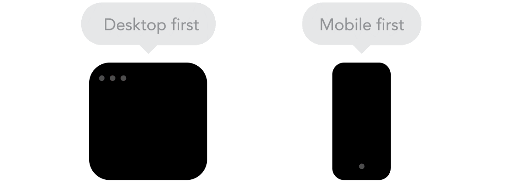

### Responsive vs Adaptive

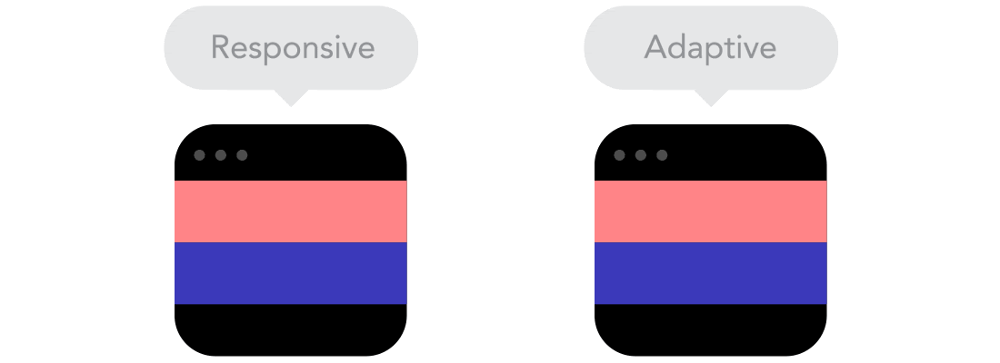

En muchas ocasiones encontramos páginas web que se adaptan a dispositivos móviles, pero no lo hacen de una forma fluida, probablemente porque se estén realizando ciertos cálculos mediante JavaScript, lo cual debemos evitar a toda costa.

Como decíamos antes, si aplicamos correctamente las propiedades CSS en nuestro HTML, por defecto la web se adaptará sola, el HTML y el CSS son muy listos… ¡Deja que ellos hagan el trabajo!

### Maquetación Responsive: Flow


A medida que los tamaños de pantalla se hacen más pequeños, el contenido comienza a ocupar más espacio vertical y todo lo que se encuentra debajo será empujado hacia abajo.

Esto ocurre siempre que no hayamos maquetado poniendo tamaños fijos, alturas limitadas, posiciones absolutas por todos lados… etc

¡Respeta el Flow BRO!

### Maquetación Responsive: Unidades

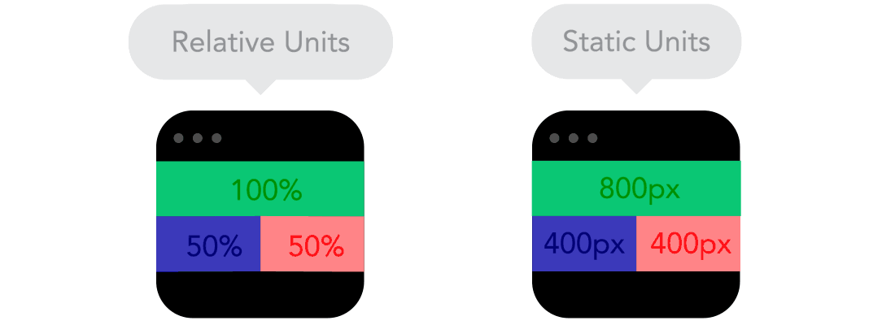

Como ya comentábamos, siempre que usemos medidas cerradas estamos limitando la maqueta y no dejamos que el HTML se adapte.

Ojo: no todas las unidades fijas son malas. Por ej: un padding

### Maquetación Responsive: Breakpoints

Los puntos de ruptura nos permiten que el diseño cambie en tamaños predefinidos. Por ejemplo que tenga 3 columnas en un escritorio, pero solo 1 columna en un dispositivo móvil. Eso sí, ten cuidado, si usas muchos puntos de ruptura tu CSS puede complicarse mucho…

Por ejemplo un diseño como lo haremos mediante Media Queries:

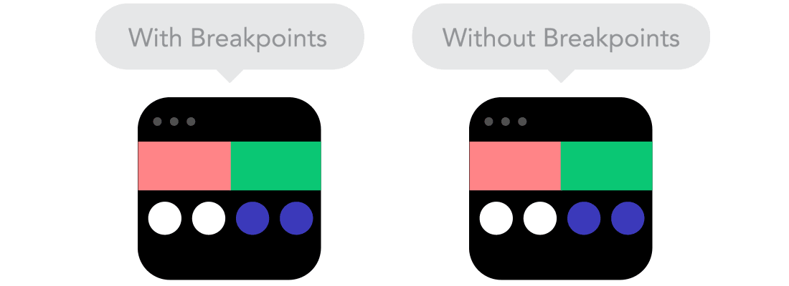

### Maquetación Responsive: Max y Min

Puede quedar muy bien que el contenido ocupe todo el ancho de una pantalla, como la de un dispositivo móvil. Pero tener el mismo contenido que se extiende a todo el ancho de la pantalla de una tele… quizá no tenga sentido.

Para esto podemos aprovecharnos de max-width o max-height.

Por ejemplo, tener un ancho de 100% y un ancho máximo de 1000px significaría que el contenido llenará la pantalla, pero no pasará de 1000px.


### Maquetación Responsive: Wrappers

Siempre que varios objetos tengan una posición determinada entre ellos, ayúdate de elementos padre que los agrupen. Esto te evitará complicaciones a la hora de colocar los elementos.

Es importante que a la hora de maquetar pensemos en agrupar cierto contenido de cara a "facilitaros la vida".

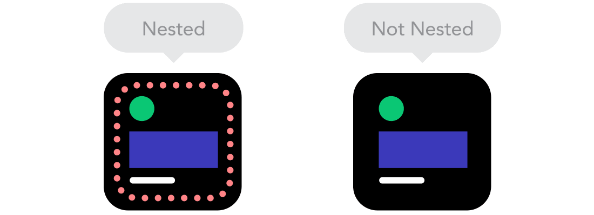

### Maquetación Responsive: Imágenes

Si el recurso gráfico que quieres incorporar no es una fotografía, trata de incluir en formato vectorial, como por ejemplo SVG.

Los png, jpgs, gifs… etc no escalan hasta el infinito.

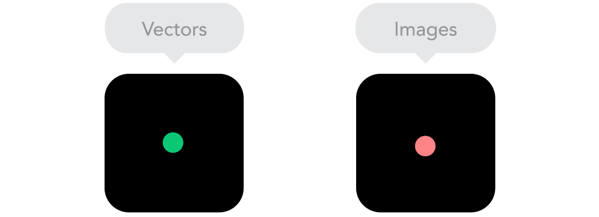

### Piensa como Bruce Lee

Como ya hemos comentado el contenido HTML por defecto se adapta solo al ancho de los huecos que tenga, es por eso que debemos pensar que el contenido es como agua.

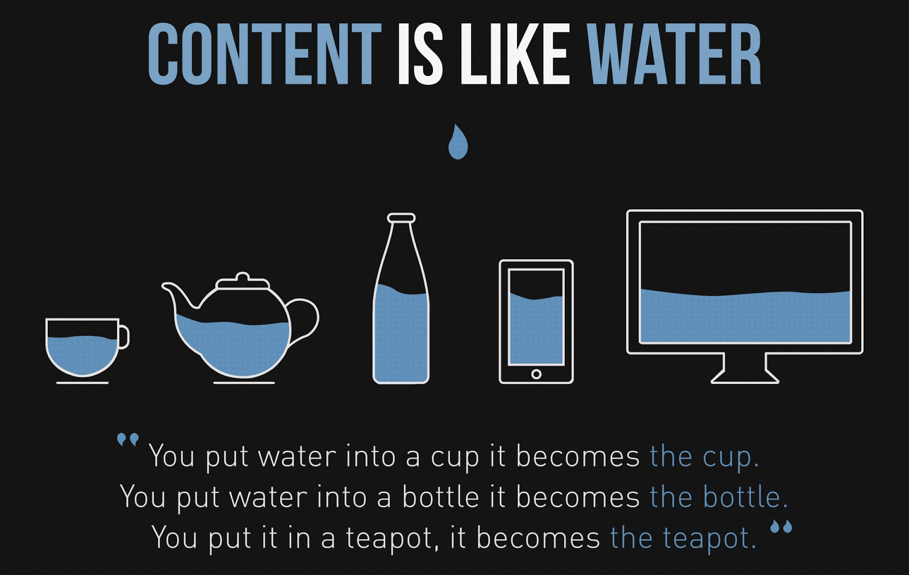

### Media Queries

Son reglas CSS específicas que solo aplicarán a ciertos tamaños de pantalla concretos, ¡vamos a ver cómo crearlas!

En primer lugar para que las medias queries te funcionen, debes indicar esta meta en el head de tu HTML

```html
<meta name="viewport" content="width=device-width, initial-scale=1.0">
```

Esto le dirá al navegador que el ancho de la vista debe ser como máximo el ancho del dispositivo, de esta manera deberíamos evitar tener scroll horizontal en nuestra web

Una vez tengamos el meta indicado podremos crear nuestras primeras media queries:

```css
@media screen and (min-width: 480px) {
   /* Código CSS que solo aplica a pantallas con ancho > 480 */
   p {
       font-size: 25px;
   }
}
```

Podemos hacer combinaciones de reglas:

```css
@media all and (min-width: 800px) and (max-width: 1024px) {
    .columna {
        width: 33%;
    }
}
```

También podemos usar como selector la orientación de la pantalla, aunque probablemente esto acabe generando demasiadas variaciones y nos acaba resultando un lío:

```css
@media only screen and (orientation: portrait) {
    .titulo {
        margin: 10px 20px;
    }
}
```

### Media Queries: ejemplo mobile first

Como ya hemos mencionando anteriormente debes pensar primero en mobile, esto implica que las reglas CSS que apliques deberán ser primero para pantallas pequeñas, y en caso de que tengamos que aplicar alguna media querie, esta debe ser para pantallas grandes

Veamos un ejemplo:

```css
/* Reglas por defecto (mobile) */
p {
 font-size: 12px;
}

/* Resto de reglas en orden creciente */
@media (min-width: 576px) {
   p {
       font-size: 14px;
   }
}
@media (min-width: 768px) {
   p {
       font-size: 16px;
   }
}
@media (min-width: 992px) {
   p {
       font-size: 20px;
   }
}
@media (min-width: 1200px) {
   p {
       font-size: 24px;
   }
}
```

Documentación adicional: [https://css-tricks.com/css-media-queries/](https://css-tricks.com/css-media-queries/)

No hay unos breakpoints estándar, en cada proyecto se usan uno, pero si quieres una referencia puedes usar los mismos que usa Bootstrap en su librería:

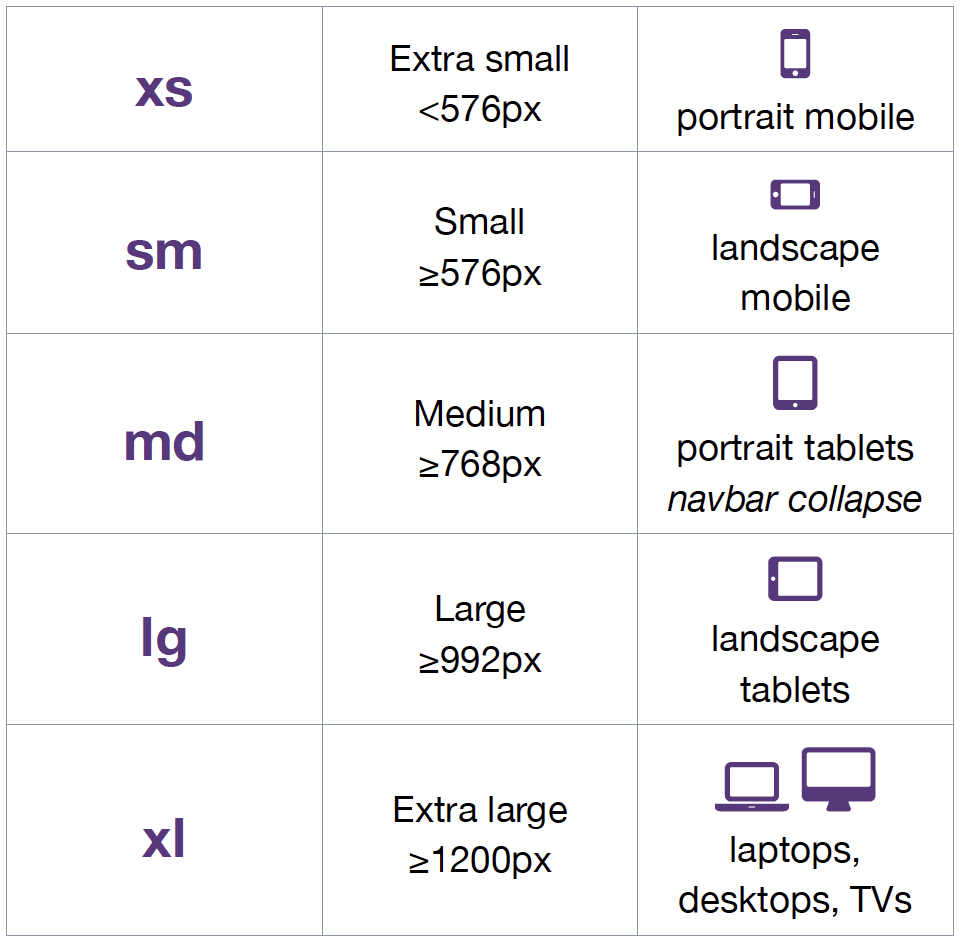

### Flexbox

El módulo Flexbox tiene como objetivo proporcionar una manera más eficiente de diseñar, alinear y distribuir el espacio entre los elementos de un contenedor, incluso cuando su tamaño es desconocido o dinámico (de ahí la palabra "flex").

```css
.padre {
    display: flex;
}
```

La idea principal detrás del diseño flexible es otorgar al contenedor la capacidad de modificar el ancho/alto (y el orden) de sus elementos para llenar mejor el espacio disponible (principalmente para adaptarse a todo tipo de dispositivos de visualización y tamaños de pantalla).

Un contenedor flexible expande los elementos para llenar el espacio libre disponible o los reduce para evitar el desbordamiento.

La referencia por excelencia:

[https://css-tricks.com/snippets/css/a-guide-to-flexbox/](https://css-tricks.com/snippets/css/a-guide-to-flexbox/)

### Flexbox: aplicación

Flex se aplica siempre a un contenedor, de manera que este aplica “flexibilidad” a sus hijos, veamos como afecta esto al contenedor y a los hijos:

- Contenedor: Existe un elemento padre que es el contenedor que tendrá en su interior cada uno de los ítems flexibles y adaptables.
    - Eje principal: Los contenedores flexibles tendrán una orientación principal específica. Por defecto, es en horizontal (fila).
    - Eje secundario: De la misma forma, los contenedores flexibles tendrán una orientación secundaria, perpendicular a la principal. Si la principal es en horizontal, la secundaria será en vertical, y viceversa.
- Ítem: Cada uno de los hijos flexibles que tendrá el contenedor en su interior.

```html
<!-- contenedor flex -->
<div id="contenedor">
    <!-- cada uno de los ítems flexibles -->
    <div class="item item-1">1</div>
    <div class="item item-2">2</div>
    <div class="item item-3">3</div>
</div>
```

Veamos las propiedades que podemos usar, las propiedades disponibles dependerán de si las estamos aplicando al contenedor padre o al hijo.

### Flexbox: propiedades (padre)

Veamos algunas de las propiedades que podemos usar en el contenedor:

`flex-direction`

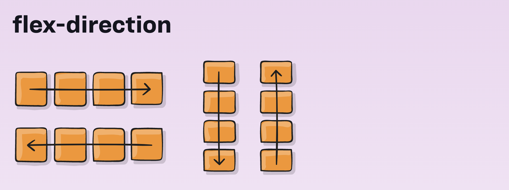

Esta propiedad establece la dirección en que se colocan los elementos flexibles en el contenedor.

Acepta las siguientes propiedades:

```css
.container {
    flex-direction: row | row-reverse | column | column-reverse;
}
```

`flex-wrap`

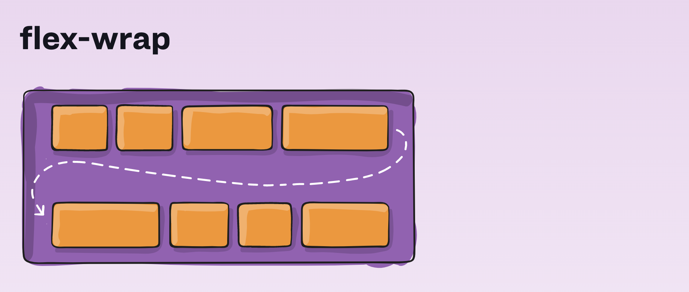

Por defecto, todos los elementos bajo flex intentarán encajar en una sola línea. Puedes cambiar esto y permitir que los elementos se ajusten según sea necesario con esta propiedad.

Acepta las siguientes propiedades:

```css
.container{
    flex-wrap: nowrap | wrap | wrap-reverse;
}
```

`justify-content`

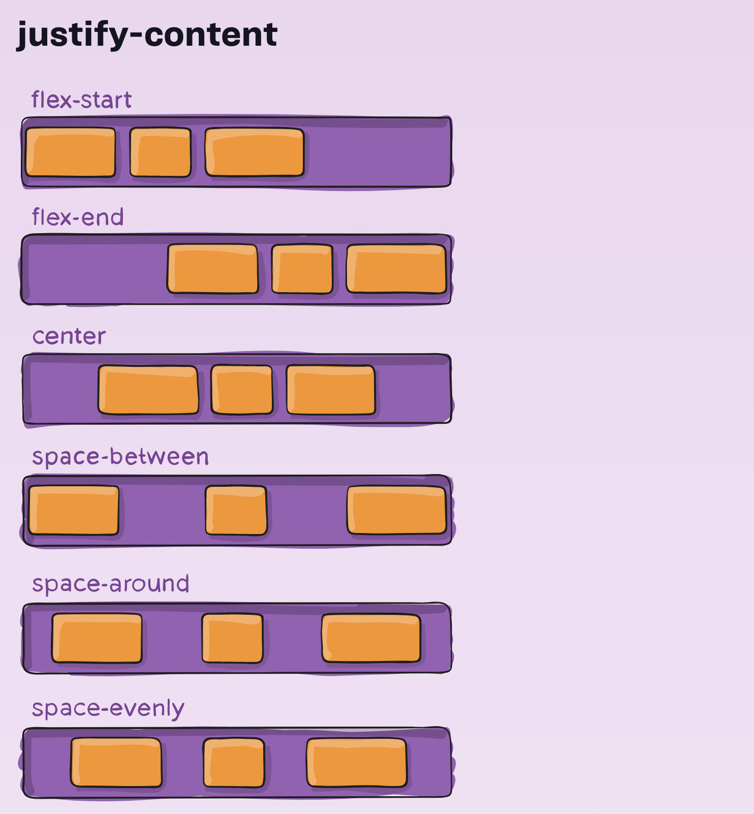

Esta propiedad define la alineación a lo largo del eje principal.

Ayuda a distribuir el espacio libre adicional que sobra cuando todos los elementos flexibles en una línea son inflexibles, o son flexibles pero han alcanzado su tamaño máximo.

Acepta las siguientes propiedades:

```css
.container {
    justify-content: flex-start | flex-end | center ...
}
```

`align-items`

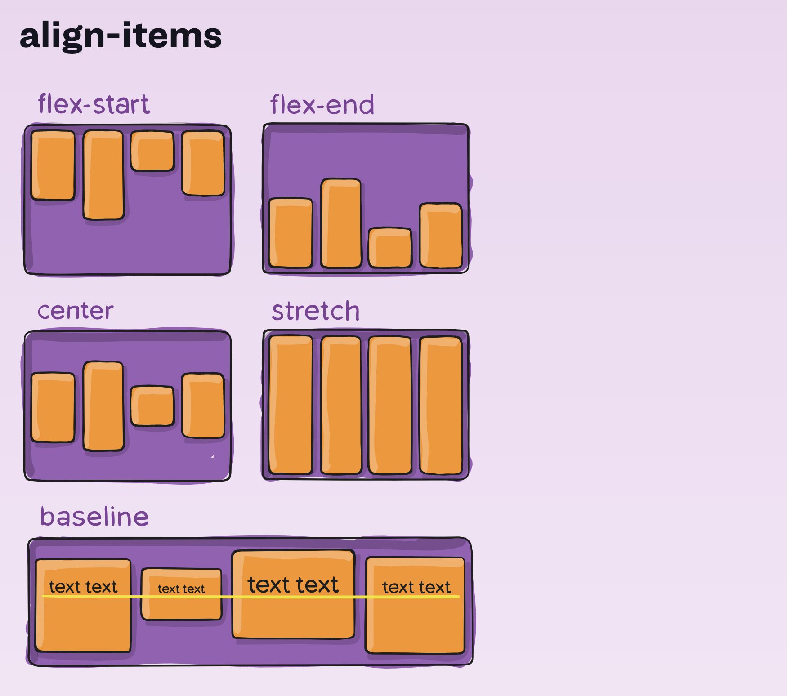

Esto define cómo los elementos flexibles se distribuyen a lo largo del eje secundario. Acepta las siguientes propiedades:

```css
.container {
   align-items: stretch | flex-start | flex-end | center | baseline;
}
```

`align-content`

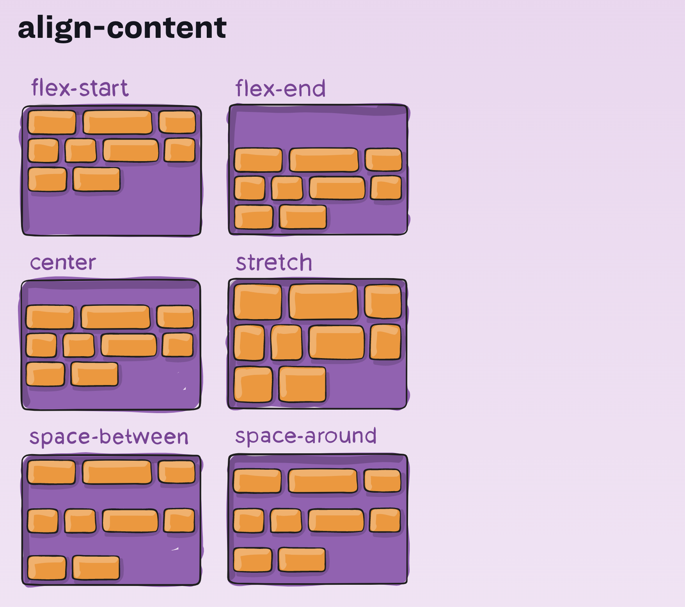

Esto alinea las líneas de un contenedor flexible cuando hay espacio extra en el eje secundario.

Acepta las siguientes propiedades:

```css
.container {
    align-content: flex-start | flex-end | center ...
}
```

### Flexbox: propiedades (hijo)

Veamos algunas de las propiedades que podemos usar en el los elementos que están dentro del contenedor flex:

`order`

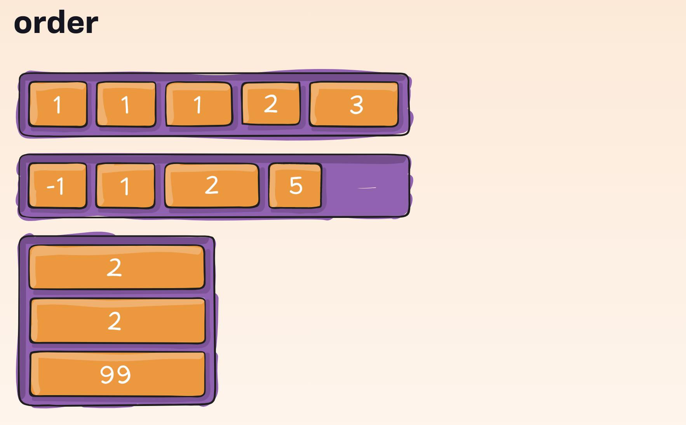

De forma predeterminada, los elementos flexibles se presentan en el orden de origen en el HTML. Sin embargo, la propiedad de orden controla el orden en el que aparecen en el contenedor de flex.

Se trata de una propiedad numérica:

```css
.item {
    order: 3; /* por defecto es 0 */
}
```

`flex-grow`

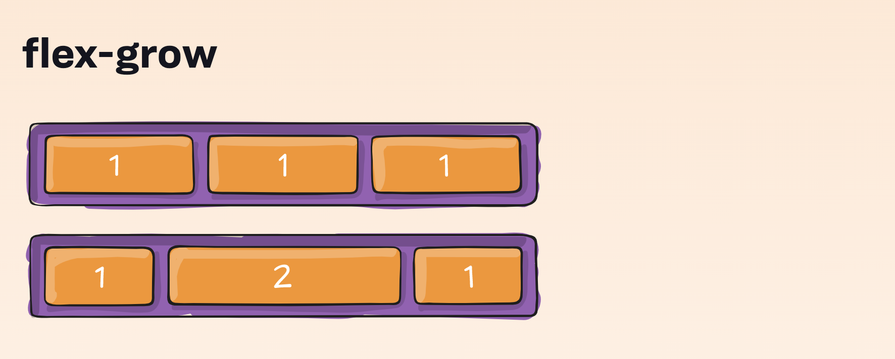

Esto define la capacidad para que un hijo crezca si es necesario. Acepta un valor sin unidades que sirve como proporción. Indica cuánto espacio disponible dentro del contenedor flexible debe ocupar el artículo.

Si todos los artículos tienen un conjunto de cultivo flexible en 1, el espacio restante en el contenedor se distribuirá por igual a todos los hijos. Si uno de los hijos tiene un valor de 2, el espacio restante ocuparía el doble de espacio que los otros (o lo intentará, al menos).

Se trata de una propiedad numérica:

```css
.item {
    flex-grow: 1; /* por defecto es 0 */
}
```

`flex-shrink`

Esto define la capacidad de un elemento flexible para reducirse si es necesario.

También acepta propiedades numéricas:

```css
.item {
    flex-shrink: 3; /* por defecto es 1 */
}
```

`flex-basis`

Define el tamaño predeterminado de un elemento antes de distribuir el espacio restante. Puede ser una longitud (20%, 10px...) o auto.

Si se establece en 0, el espacio adicional alrededor del contenido no se tiene en cuenta. Si se configura en auto, el espacio adicional se distribuye según su valor de flex-grow.

Acepta unidades de tamaños, por ejemplo:

```css
.item {
    flex-basis: 0 | auto | 200px | 10%; /* por defecto es auto */
}
```

`flex`

Esta es la abreviatura de flex-grow, flex-shrink y flex-bases combinadas. El segundo y tercer parámetro (flex-shrink y flex-basis) son opcionales. El valor predeterminado es 0 1 auto.

```css
.item {
    flex: 1 0 auto;
}

/* es lo mismo que... */
.item {
    flex-grow: 1;
    flex-shrink: 0;
    flex-basis: auto;
}
```

`align-self`

Esto permite que la alineación predeterminada (o la especificada por align-items) se anule para los elementos flex individuales.

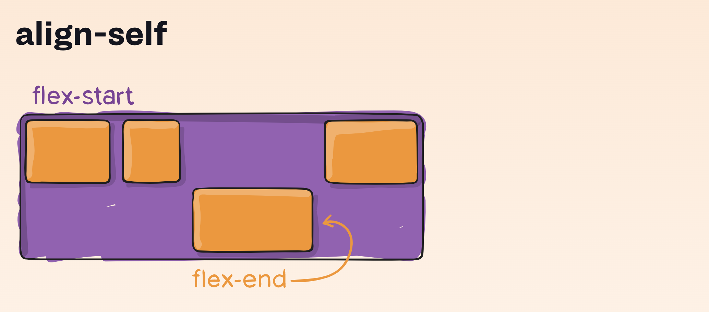

Acepta las siguientes propiedades:

```css
.item {
    align-self: auto | flex-start | flex-end | center | baseline | stretch;
}
```

Con todas estas propiedades estás listo para empezar a maquetar con flex, al principio te costará entenderlo ya que como has visto hay muchas propiedades disponibles, pero poco a poco te sentirás más cómodo usándolas.

### Calc

La función CSS calc () le permite realizar cálculos al especificar valores de propiedades CSS, esto te será muy útil en ciertos casos en los que quieras por ejemplo que un contenedor ocupe todo el ancho del contenedor menos ciertos pixeles de margen:

```css
.mi-elemento {
    /* propiedad: calc(expression) */
    width: calc(100% - 80px);
}
```

La función calc () toma una única expresión como parámetro y utiliza el resultado como valor.

`calc()` acepta los siguientes operadores:

- suma (+)
- resta (-)
- multiplicación (*) cuidado, al menos uno de los argumentos debe ser un número
- división (/) cuidado, el lado derecho debe ser un número

### SVG


SVG es un formato de imagen para gráficos vectorizados. Literalmente significa Scalable Vector Graphics. Realmente aportan muchas ventajas respecto a usar imágenes en JPEG/PNG... etc:

- Pesan poco
- Escalan a cualquier tamaño
- Se ven genial en pantallas retina
- Se pueden modificar con CSS

Si abrimos un svg observaremos que es un documento, muy parecido a HTML:

```html
<?xml version="1.0" encoding="UTF-8"?>
<svg width="305px" height="498px" viewBox="0 0 305 498" version="1.1" xmlns="http://www.w3.org/2000/svg" xmlns:xlink="http://www.w3.org/1999/xlink">
   <title>Minion</title>
   <desc>Created with Sketch.</desc>
   <g id="Page-1" stroke="none" stroke-width="1" fill="none" fill-rule="evenodd">
       <g id="minion" fill="#F5E050" fill-rule="nonzero">
           <circle id="Oval" cx="152.644" cy="134.616" r="21.333"></circle>
           <path d="M152.644,49.283 C105.583,49.283 67.311,87.555 67.311,134.616 C67.311,181,198.616 Z" id="Shape"></path>
           <path d="M284.378,8,135.277 Z" id="Path"></path>
           <path d="M77.9788,123.971 Z" id="Path"></path>
           <path d="M214.298,245.272 C210.629,240.707 203.93,239.939 199.301,8,245.272 Z" id="Path"></path>
           <path d="M288..3586,308.397 Z" id="Path"></path>
           <path d="M280.644,4,433.283 Z" id="Path"></path>
       </g>
   </g>
</svg>
```

### Cómo usar un SVG

Veamos distintas formas de usar SVGS en nuestras páginas:

En HTML como img:

```html

```

En CSS:

```css
.logo {
    display: block;
    background-image: url(./images/kiwi.svg);
}
```

O directamente en el HTML (está considerada una etiqueta HTML5):

```html
<body>
    <p>Hola este es mi svg:</p>
    <svg ...>
        <ellipse class="ground" ... />
        <path class="kiwi" ... />
    </svg>
```

### SVG: estilos CSS

Como hemos comentado, se tratan de elementos HTML, así que podremos dar estilos al svg desde nuestro CSS.

Por ejemplo, podemos cambiar el color de los svgs haciendo uso de lo siguiente:

```css
svg.kiwi {
    fill: #94d31b;
}
```

E incluso podemos cambiar elementos concretos dentro del SVG haciendo uso de clases o IDS

```css
svg.kiwi .pepita {
    fill: #333333;
}
```

NOTA: Ten en cuenta que aunque algunas propiedades CSS están soportadas, no admite todas.

### SVG: formas básicas

Veamos algunas de las formas más comunes en lo SVGS

Rectángulos:

```html
<rect x="10" y="10" width="30" height="30"/>
```

Círculos:

```html
<circle cx="25" cy="75" r="20"/>
```

Elipses:

```html
<ellipse cx="75" cy="75" rx="20" ry="5"/>
```

Poli-líneas:

```html
<polyline points="60 110, 65 120, 70 115"/>
```

Polígonos:

```html
<polygon points="50 160, 55 180, 70 180"/>
```

Líneas:

```html
<line x1="10" x2="50" y1="110" y2="150"/>
```

Los reyes de los SVG, los paths:

```html
<path d="M20,230 Q40,205 50,230 T90,230" fill="none" stroke="blue" stroke-width="5"/>
```

### SVGs Animados


Al ser elementos HTML5 y soportar CSS, pueden llegar incluso a animarse.

Eso sí: ten cuidado con el peso, porque las animaciones pueden llegar a hacer que los ficheros pesen mucho.

Recurso adicional: [https://css-tricks.com/guide-svg-animations-smil/](https://css-tricks.com/guide-svg-animations-smil/)