# CSS: Iconos, Animaciones y Transiciones, Bootstrap, BEM

En la sesión de hoy vamos a aprender a trabajar con iconos (ahora que ya conocemos los SVG's), y nos adentraremos en customización avanzada, analizando las animaciones y las transiciones de los elementos HTML.

Luego hablaremos de Bootstrap como principal librería de maquetación, y aprenderemos los que es BEM y la importancia de aplicarlo

¡A por ello!

### Fuentes Iconográficas

Dentro de una web es muy común encontrar iconos por todos lados. Como desarrollador Front-End es importante que trabajemos con ellos de una forma eficiente y escalable.

Una mala práctica es incluir cada icono como una imagen. Esto forzará a que el navegador se descargue las imágenes perdiendo mucho tiempo de carga. Además, las imágenes (salvo que estén en svg) no escalan bien.

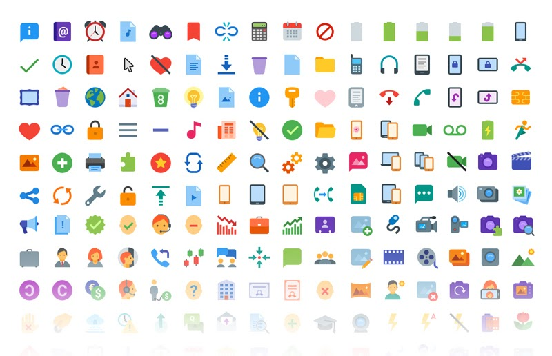

Posiblemente la manera más eficiente de incluir iconos en una web sea hacer uso de fuentes iconográficas.

Una fuente no dejan de ser una serie de dibujos que representan caracteres. Si lo llevamos al extremo esos dibujos podrían ser cualquier cosa. En los ejemplo más básicos, caracteres de texto.

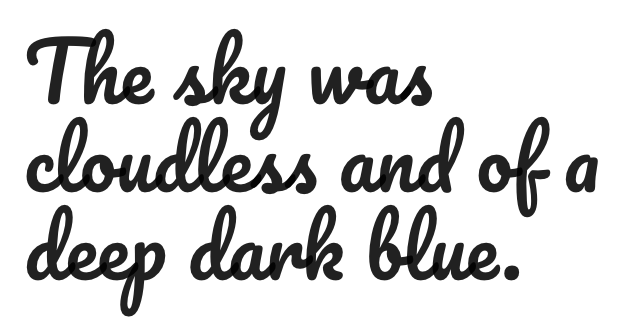

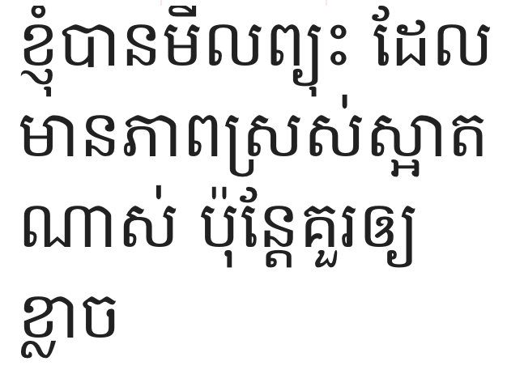

O en nuestro caso, iconos:

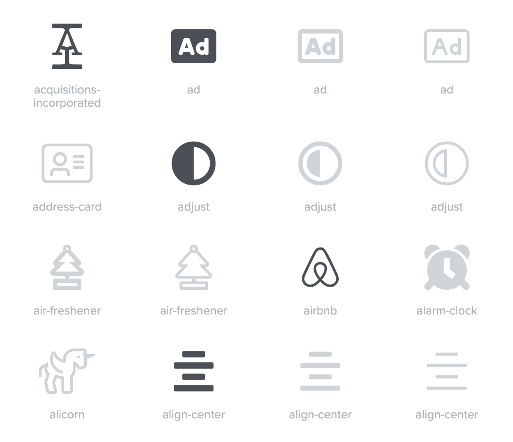

Por suerte existen multitud de fuentes iconográficas gratis. Veamos cómo funciona por ejemplo FontAwesome.

En primer lugar, debemos cargar el fichero CSS asociado:

```html
<link rel="stylesheet" href="[https://use.fontawesome.com/releases/v5.8.2/css/all.css](https://use.fontawesome.com/releases/v5.8.2/css/all.css)">
```

Esto cargará el font-face y las clases necesarias para nuestros iconos:

```css
@font-face {
   font-family: "Font Awesome 5 Free";
   src: url(../webfonts/fa-solid-900.eot);
}
.fa {
   font-family: "Font Awesome 5 Free"
}
.fa-hospital:before {
   content: "\f0f8"
}
.fa-hotel:before {
   content: "\f594"
}
```

A la hora de usarlo bastará con usar las clases que nos indica FontAwesome:

```html
<!-- Lo más correcto sería usar un span -->
<span class="fas fa-camera"></span>
<!-- Aunque mucha gente usa <i> -->
<i class="fas fa-camera"></i>
```

Semánticamente, lo más correcto sería usar un span, pero mucha gente acostumbra a usar la etiqueta <i> por ser una etiqueta pequeña. No, i no viene de icono :P

Link: [https://fontawesome.com/](https://fontawesome.com/)

## Fuentes Iconográficas Custom

Si en algún momento por necesidades de diseño necesitamos de un icono que no está disponible en ninguna fuente iconográfica, podemos crear nuestra propia fuente con herramientas como [Icomoon](https://icomoon.io/app).

En icomoon podemos cargar nuestros iconos en formato SVG y generar nuestra propia fuente:

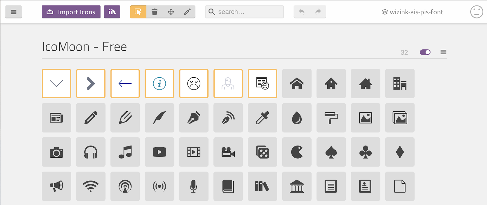

### Transiciones vs Animaciones

**Transiciones:** Una transición ocurre cuando un elemento cambia de un estado hacia otro. En el momento que hay un cambio de estado, el navegador genera una secuencia de estados y los coloca justo en medio del estado inicial y el final. Una transición, tiene un estado inicial y un estado final.

Normalmente, vemos transiciones utilizadas al momento de hover, o cuando cierto contenido es agregado o eliminado de una página. El estado hover puede ser un cambio sutil del color de fuente o el contenido de una página puede cambiar de invisible a visible.

Ya que las transiciones están limitadas a estos dos estados, pueden carecer de cierta flexibilidad, pero al mismo tiempo son más fáciles de utilizar.

[https://www.w3schools.com/css/css3_transitions.asp](https://www.w3schools.com/css/css3_transitions.asp)

**Animaciones:** Animaciones CSS son una alternativa más poderosa que las transiciones. En vez de confiar en el secuencia de un estado inicial a un estado final, las animaciones pueden tener cuantos estados se necesiten en medio del estado inicial y el estado final, ofreciendo un mayor control de cómo los estados son animados.

Mientras una transición se mueve de un estado A a un estado B, una animación puede moverse de A, B, C a D. O puede tener la cantidad de estados que necesite.

Las animaciones pueden lograr este comportamiento utilizando una colección de keyframes.

[https://www.w3schools.com/css/css3_animations.asp](https://www.w3schools.com/css/css3_animations.asp)

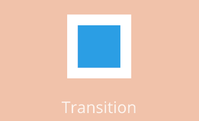

### **Propiedades de las Transiciones**

- transition: es la abreviatura de todas la siguientes
- transition-delay: retardo para que se inicie la animación
- transition-duration: duración de la animación
- transition-property: propiedad que queremos animar
- transition-timing-function: curva de movimiento (suave, brusco...)

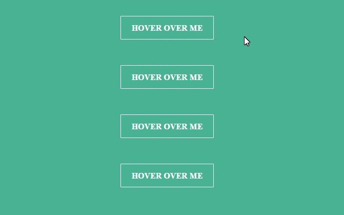

### **Propiedades de las Animaciones**

- animation: es la abreviatura de todas las siguientes
- animation-name: indica el nombre de la animación a usar
- animation-duration: indica la duración de la animación
- animation-timing-function: indica la curva de velocidad de la animación
- animation-delay: permite indicar un retardo a la animación
- animation-iteration-count: indica el número de veces que se repetirá
- animation-direction: indica si la animación será inicio-fin o viceversa
- animation-fill-mode: indica si la animación terminará con los valores iniciales o los finales
- animation-play-state: permite pausar o reanudar la animación


Definiendo una animación:

```css
@keyframes animacion-molona {
  0% { top: 0; left: 0; }
  30% { top: 50px; }
  68%, 72% { left: 50px; }
  100% { top: 100px; left: 100%; }
}
```

Cualquier propiedad que no se especifican en cualquier keyframes son interpoladas (con la excepción de aquellas que no pueden ser interpoladas, las que son eliminadas de la animación completamente).

### Librerías de animaciones

Es recomendable reducir el número de librerías que usamos, generalmente añaden peso y hacen el código más complejo de entender, ya que requiere conocer las librerías también

**Animate.css:**

Librería CSS bastante limpia:**[https://daneden.github.io/animate.css/](https://daneden.github.io/animate.css/)**

**Velocity.js:**

Librería JS apoyada en JQuery (también hay versión sin él), dicen que mayor velocidad (¿Será cierto?), tiene callbacks, más personalización:

**[http://velocityjs.org/](http://velocityjs.org/)**

### Transform

Transform permite modificar el aspecto visual de un elemento agrandandolo, rotándolo, trasladándose…

Un punto muy importante de transform es que modifica el tamaño o la posición del elemento en el DOM. Con lo cual no afecta al resto de elementos.

```css
.element {
  width: 20px;
  height: 20px;
  transform: scale(20);
}
```

Propiedades aceptadas:scale, rotate, skewX, skewY y perspective

Ejemplo: [https://codepen.io/vineethtr/pen/XKKEgM](https://codepen.io/vineethtr/pen/XKKEgM)

### Bootstrap Styles

Bootstrap es una librería Open Source para desarrollo de aplicaciones HTML, CSS y JS.

Te permite desarrollar más rápido ya que incluye elementos ya desarrollados como son:

- Estilos base
- Grid para tu layout
- Clases auxiliares (imgs. responsive, márgenes… etc)
- Componentes:
    - Sliders
    - Tablas
    - Modales
    - Paginadores
    - …

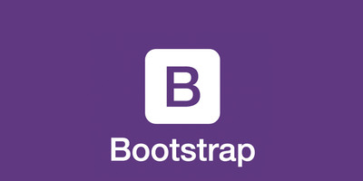

Bootstrap Website: [https://getbootstrap.com/](https://getbootstrap.com/)

Para poder utilizar Bootstrap en nuestra web necesitaremos incorporar sus estilos.

Por ahora (hasta que conozcamos gestores de dependencias) lo haremos de la manera clásica:

```html
<!-- Estilos -->
<link rel="stylesheet" href="https://stackpath.bootstrapcdn.com/bootstrap/4.3.1/css/bootstrap.min.css">
<!-- Lógica -->
<script src="https://code.jquery.com/jquery-3.3.1.slim.min.js"></script>
<script src="https://cdnjs.cloudflare.com/ajax/libs/popper.js/1.14.7/umd/popper.min.js"></script>
<script src="https://stackpath.bootstrapcdn.com/bootstrap/4.3.1/js/bootstrap.min.js"></script>
```

En caso de que vayamos a hacer uso de algún componente que requiera JavaScript (modal, carruseles… etc) necesitaremos también incorporar su librería JS y sus dependendencias (jQuery y Popper).

**¡¡OJO CUIDAO!!**

Boostrap setea por defecto todos elementos como border-box, recordad que esto cambia la manera en la que se crecen los elementos cuando tienen paddings y bordes.

```css
*, ::after, ::before {
   box-sizing: border-box;
}
```

Es importante que cuando desarrollemos sepamos qué modo estamos usando. Recurso sobre el box-sizing en [https://developer.mozilla.org/es/docs/Web/CSS/box-sizing](https://developer.mozilla.org/es/docs/Web/CSS/box-sizing).

## Bootstrap Styles: Layout

El elemento principal del layout de Bootstrap son los containers. Los containers tendrán dentro el resto de elementos, filas, columnas… etc. Hay dos tipos, los “normales” y los fluidos. Los fluidos como ya vimos anteriormente no tienen su ancho limitado.

```html
<div class="container">
  <!-- Aquí el contenido -->
</div>

<div class="container-fluid">
  <!-- Aquí el contenido -->
</div>
```

Dentro de nuestro container / container-fluid debemos comenzar a colocar nuestras filas. Las filas además de actuar como tal, harán que los márgenes laterales se comporten correctamente.

```html
<div class="container">
   <div class="row">
     <!-- Aquí el contenido -->
   </div>
</div>
```

Dentro de nuestras filas podremos colocar cada una de nuestras columnas.

```html
<div class="container">
   <div class="row">
       <div class="col-2">
           One of three columns
       </div>
       <div class="col-8">
           One of three columns
       </div>
       <div class="col-2">
           One of three columns
       </div>
   </div>
</div>
```

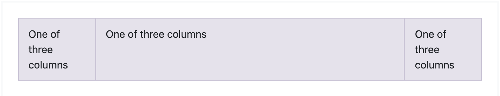

Bootstrap se basa en un layout de 12 columnas, muy común en el mundo web:

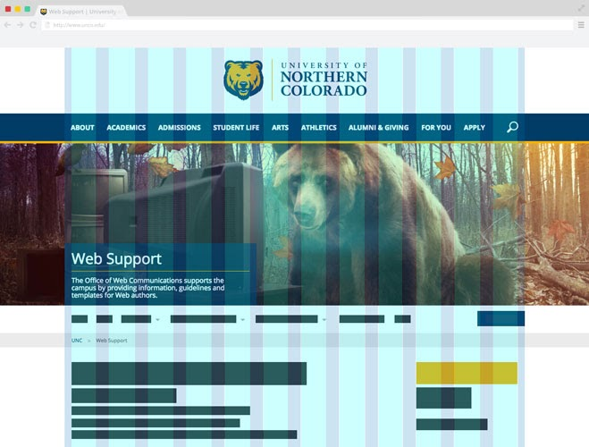

Otro ejemplo de distribución por columnas:

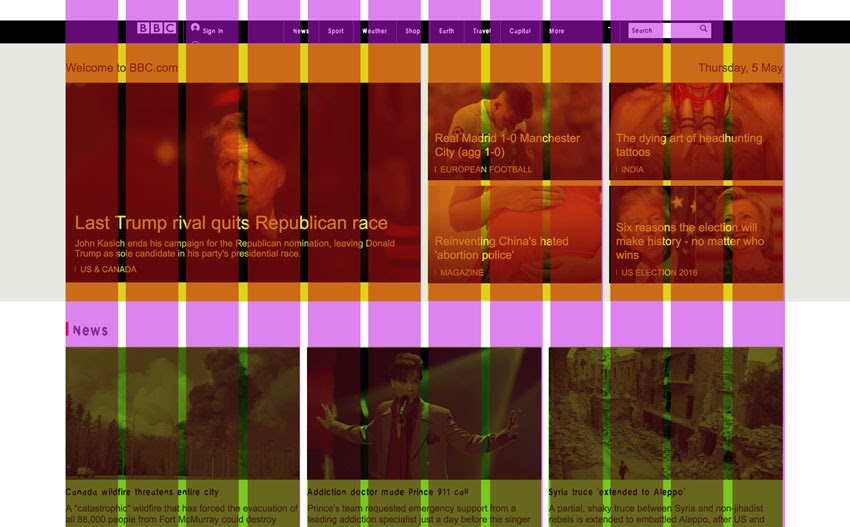

12 es un número que permite muchas combinaciones:

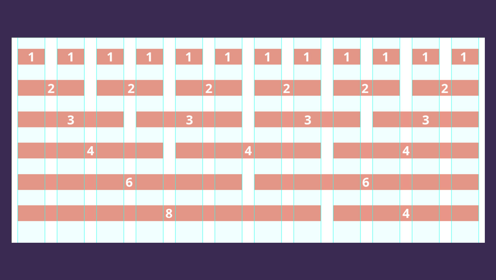

3 + 3 + 3 + 3 = 12

4 + 4 + 4 = 12

4 + 8 = 12

12 = 12

Para generar las columnas Bootstrap nos provee de las siguientes clases:

```html
<div class="container">
  <div class="row">
     <div class="col-2"></div>
     <div class="col-8"></div>
     <div class="col-2"></div>
  </div>
</div>
```

Lógicamente disponemos de todas desde col-1 hasta col-12

Por suerte la gente de Bootstrap ha pensado en el responsive y nos han hecho clases también para los distintos tamaños de pantalla:

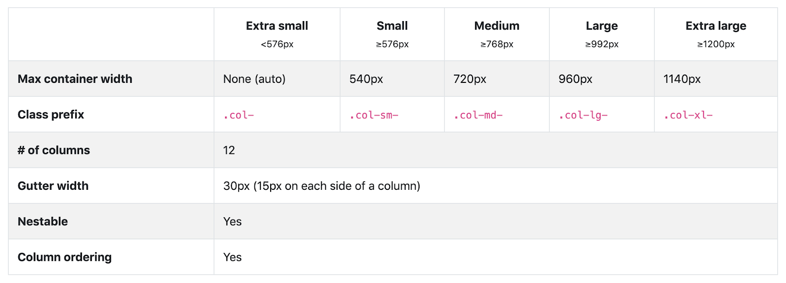

Veamos un ejemplo:

```html
<div class="container">
  <div class="row">
     <div class="col-12 col-md-8">.col-12 .col-md-8</div>
     <div class="col-6 col-md-4">.col-6 .col-md-4</div>
  </div>

  <div class="row">
     <div class="col-6 col-md-4">.col-6 .col-md-4</div>
     <div class="col-6 col-md-4">.col-6 .col-md-4</div>
     <div class="col-6 col-md-4">.col-6 .col-md-4</div>
  </div>

  <div class="row">
     <div class="col-6">.col-6</div>
     <div class="col-6">.col-6</div>
  </div>
</div>
```

Mobile:

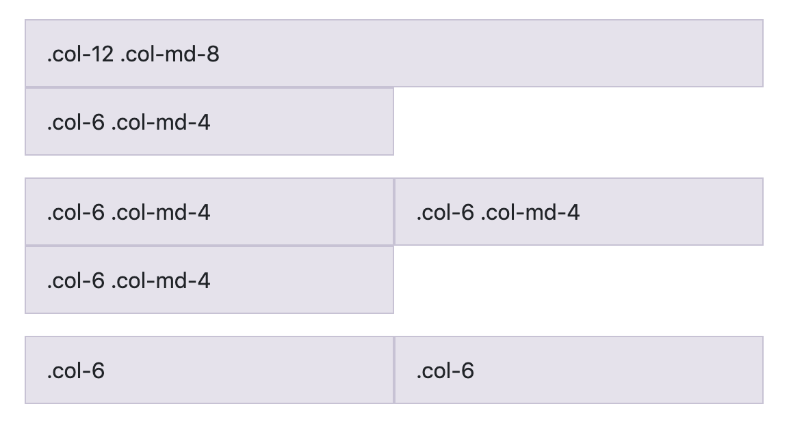

Desktop:

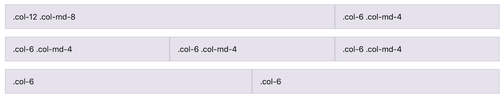

### Metodologías de nombrado: BEM

BEM (Block, Element, Modifier) es un enfoque de desarrollo web basado en componentes. La idea detrás de esto es dividir la interfaz de usuario en bloques independientes. Esto hace que el desarrollo de la interfaz sea fácil y rápido, incluso con una UI compleja, y permite la reutilización del código existente sin copiar y pegar.

Referencia: [https://en.bem.info/methodology/](https://en.bem.info/methodology/)

Referencia: [http://getbem.com/](http://getbem.com/)

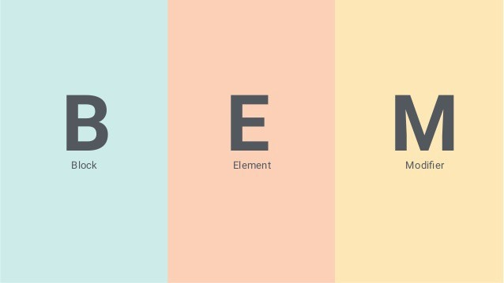

### BEM: bloques

Un BLOQUE se trata de un elemento funcionalmente independiente que puede ser reutilizado. Representamos los bloques con un nombre de clase.

El nombre del bloque (clase) debe describir su propósito (Qué es: menú / botón) y nunca su estado.

```html
<!-- Correcto. El bloque "error-message" es semánticamente tiene valor -->
<div class="error-message"></div>
    
<!-- Incorrecto. Describe la apariencia -->
<div class = "red-text"> </div>
```

NOTAS:

No debemos usar IDs para el CSS cuando usamos BEM

Un bloque no debería alterar su entorno, por eso no debería tener márgenes o posicionamientos.

Los bloques pueden anidarse sin problema y sin límite de profundidad:

```html
<!-- `header` block -->
<header class="header">
  <!-- Nested `logo` block -->
  <div class="logo"></div>

  <!-- Nested `search-form` block -->
  <form class="search-form"></form>
</header>
```

### BEM: elementos

Un ELEMENTO es una parte de un bloque que no se puede usar por separado.

El nombre del elemento debe describe su propósito (Qué es: Elemento, texto, etc.), no su estado o apariencia (igual que en los bloques)

El nombre de un elemento es debe ser block-name__element-name. El nombre del elemento se separa del nombre del bloque con un subrayado doble (__).

```html
<!-- `search-form` block -->
<form class="search-form">
  <!-- `input` element in the `search-form` block -->
  <input class="search-form__input">

  <!-- `button` element in the `search-form` block -->
  <button class="search-form__button">Search</button>
</form>
```

Los elementos se pueden anidar dentro de elementos, sin límite de profundidad.

PEEEERO: Cualquier elemento dentro de un elemento, realmente forma parte del bloque, por eso se nombrará también como block-name__element2-name

```html
<!-- Correcto-->
<form class="search-form">
  <div class="search-form__content">
     <input class="search-form__input">
     <button class="search-form__button">Search</button>
  </div>
</form>
<!-- Incorrecto -->
<form class="search-form">
  <div class="search-form__content">
     <input class="search-form__content__input">
     <button class="search-form__content__button">Search</button>
  </div>
</form>
```

Por eso si hubiera varios elementos anidados debería escribirse así:

```html
<div class="block">
  <div class="block__elem1">
     <div class="block__elem2">
        <div class="block__elem3"></div>
     </div>
  </div>
</div>
```

Y su css:

```css
.block {}
.block__elem1 {}
.block__elem2 {}
.block__elem3 {}
```

### BEM: modificadores

Un modificador es una entidad que define un estado, apariencia o comportamiento de un bloque o elemento.

Por tanto un modificador describe su apariencia (tamaño, color...), estado (habilitado, enfocado...) y su comportamiento (clicable, desplegable...)

El nombre de un modificador oficialmente se indica con un guión bajo (_) pero por claridad es más extendido el uso de dos guiones (--)

```html
<form class="search-form search-form--focused">
  <input class="search-form__input">

  <button class="search-form__button search-form__button--disabled">Search</button>
</form>
```

Como queremos aplicar los estilos de bloque o de elemento, debemos indicar ambas clases.

Ejemplo:

```html
<!-- Uso correcto -->
<button class="button-primary"></button>
<button class="button-primary button-primary--disabled"></button>
<button class="button-primary button-primary--big"></button>

<!-- Errores comunes -->
<button class="button-primary"></button>
<!-- No cogen los estilos del botón... -->
<button class="button-primary--disabled"></button> 
<button class="button-primary--big"></button>
```

### BEM: Ejemplo de aplicación


Enlaces de interés:

- Metodologías CSS: [https://www.espai.es/blog/2016/07/metodologias-css-oocss-bem-smacss/](https://www.espai.es/blog/2016/07/metodologias-css-oocss-bem-smacss/)