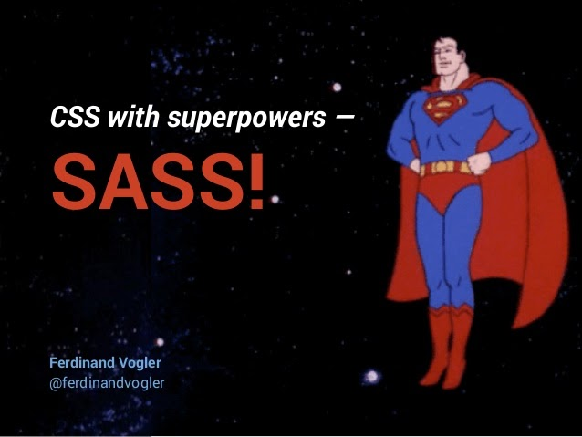
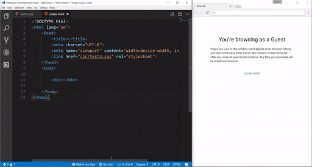

# CSS: Preprocesadores (SCSS)

En esta sesión vamos a darle una última vuelta a la creación de estilos y CSS. Vamos a aprender lo que son los preprocesadores de CSS y conocer las bondades que nos aportan. En concreto nos centraremos en SASS, pero no os asustéis, que nos vale todo lo aprendido en CSS.

### Preprocesadores CSS

Un preprocesador CSS es un programa que te permite generar CSS a partir de la syntax del preprocesador. Existen varios preprocesadores CSS entre los que escoger.

La mayoría de preprocesadores CSS añaden algunas características que no existen en CSS puro, como variables, mixins, selectores anidados... entre otros.

Estas características hacen la estructura de CSS más legible y fácil de mantener.

Los preprocesadores más conocidos son:

- [SASS / SCSS](https://sass-lang.com/)
- [LESS](http://lesscss.org/)



Lamentablemente, los navegadores no entienden nada más que `HTML`, `CSS` y `JS`. Por eso necesitamos pasar nuestro `SASS` / `SCSS` / `LESS` por un compilador que lo convierta a `CSS`.

Por ahora lo más cómodo será usar un plugin en el IDE de Visual Studio Code: 

[Live Sass Compiler - Visual Studio Marketplace](https://marketplace.visualstudio.com/items?itemName=ritwickdey.live-sass)



En un proyecto real se usan herramientas de construcción (*webpack*/*browserify*) o gestores de tareas (*grunt*/*gulp*) para realizar esta compilación. Por ejemplo, cuando veamos **Angular**, por defecto tendremos la opción de trabajar con `SCSS` o `SASS`, delegando en Angular la compilación de los estilos.

### SCSS vs SASS

SASS y SCSS son muy parecidos, pero no son lo mismo. Una de las principales diferencias es el uso de llaves `{ }` en SCSS, ausente en SASS. También se omite el uso de `;` al terminar una sentencia.

```scss
// SCSS
@mixin cover {
  $color: red;

  @for $i from 1 through 5 {
    &.bg-cover#{$i} {
      background-color: red;
    }
  }
}
.wrapper {
  @include cover;
}
```

```sass
// SASS
=cover
  $color: red

  @for $i from 1 through 5
    &.bg-cover#{$i}
      background-color: red

.wrapper
   +cover
```

### SCSS

Nosotros nos vamos a centrar en SCSS, ya que su uso [está más extendido](https://trends.google.es/trends/explore?date=today%205-y&geo=ES&q=%2Fm%2F054k6n_,%2Fm%2F0gjd0jv). Una de las mejores cosas, es que todo lo que hemos aprendido en CSS, nos sigue valiendo, ya que es totalmente compatible con las mismas reglas de CSS que hemos estado usando hasta ahora.


### SCSS: variables

Las variables son una forma de almacenar información que deseamos reutilizar en las hojas de estilo.

Puedes almacenar colores, fuentes o cualquier valor de CSS que creas que vas a reutilizar. SCSS usa el símbolo `$` para hacer variables.

```scss
// SCSS
$font-stack: Helvetica, sans-serif;
$primary-color: #333;

body {
   font: 100% $font-stack;
   color: $primary-color;
}
```

```css
/* CSS */
body {
  font: 100% Helvetica, sans-serif;
  color: #333;
}
```

Cuando se procesa el Sass, coger las variables que definimos `$font-stack` y `$primary-color` y genera el CSS normal con nuestros valores variables colocados en el CSS. Esto es muy útil para por ejemplo tener una imagen de marca y usarla por toda la app.

### SCSS: nesting / indentado

Cuando escribimos HTML todo es muy visual y jerárquico, sin embargo CSS no lo es tanto. Por suerte SCSS te permite indentar tu CSS, lo cual hará que generes código más legible y mantenible.

```scss
// SCSS
nav {
  ul {
    margin: 0;
    padding: 0;
    list-style: none;
  }
  
  li {
    display: inline-block;
  }
  
  a {
    display: block;
    padding: 6px 12px;
    text-decoration: none;
  }
}
```

```css
/* CSS */
nav ul {
 margin: 0;
 padding: 0;
 list-style: none;
}
nav li {
 display: inline-block;
}
nav a {
 display: block;
 padding: 6px 12px;
 text-decoration: none;
}
```

### SCSS: imports

Puedes crear pequeños trozos parciales, que contengan partes de SCSS para incluir en otros ficheros. 

Es una manera estupenda de modularizar tus estilos y hacerlos más mantenibles. Nombramos los parciales con un guión bajo por delante _ y se importan con la directiva `@import`.

```scss
// fichero _reset.scss
html,
body,
ul,
ol {
   margin:  0;
   padding: 0;
}
```

```scss
// fichero styles.scss
@import 'reset';

body {
   font: 100% Helvetica, sans-serif;
   background-color: #efefef;
}
```

```css
/* CSS */
html,
body,
ul,
ol {
   margin:  0;
   padding: 0;
}
body {
   font: 100% Helvetica, sans-serif;
    background-color: #efefef;
}
```

### SCSS: mixins

Los mixins te permiten hacer “*funciones*” que nos hagan cierto trabajo, puedes incluso pasarle variables para hacer los mixins más flexibles. Por ejemplo para añadir los [prefijos](https://developer.mozilla.org/es/docs/Glossary/Vendor_Prefix) de cada navegador para controlar el cross-browsing.

```scss
// SCSS
@mixin transform($property) {
  -webkit-transform: $property;
  -ms-transform: $property;
  transform: $property;
}
.box {
  @include transform(rotate(30deg));
}
```

```css
/* CSS */
.box {
   -webkit-transform: rotate(30deg);
   -ms-transform: rotate(30deg);
   transform: rotate(30deg);
}
```

> Cross Browsing: Se refiere al desarrollo de páginas web que se ven exactamente igual en cualquier navegador.
> 


### SCSS: herencia

Otra de las ventajas de SCSS es la posibilidad de reutilizar elementos haciendo uso de herencia o extensión.

```scss
// SCSS
%message-shared {
   border: 1px solid #ccc;
   padding: 10px;
   color: #333;
}

.message {
   @extend %message-shared;
} 

.success {
   @extend %message-shared;
   border-color: green;
}
```

```css
/* CSS */
.message, .success {
   border: 1px solid #ccc;
   padding: 10px;
   color: #333;
}

.success {
   border-color: green;
}
```

### SCSS: cálculos

También podemos hacer cálculos mediante los típicos operadores de multiplicación/división...

```scss
// SCSS
.container {
   width: 100%;
}

article {
   float: left;
   width: 600px / 960px * 100%;
}

aside {
   float: right;
   width: 300px / 960px * 100%;
}
```

```css
/* CSS */
.container {
   width: 100%;
}

article {
   float: left;
   width: 62.5%;
}

aside {
   float: right;
   width: 31.25%;
}
```

### SCSS: ampersand / concatenado

El símbolo `&` nos permite concatenar en SCSS. Esto combina muy bien con BEM 😉

```scss
// SCSS
a {
  &:hover {
    color: red;
  }
}

.block {
  margin: 10px;

  &__element {
    color: red;
  }
}
```

```css
/* CSS */
a:hover {
  color: red;
}

.block {
  margin: 10px;
}

.block__element {
  color: red;
}
```

### SCSS: directivas de control

En SASS / SCSS podemos incluso usar directivas que nos permitan poner condiciones o bucles 🤯

```scss
// FOR
@for $i from 1 through 8 {
  $width: percentage(1 / $i);

  .col-#{$i} {
     width: $width;
  }
}

// WHILE
$num: 4;
@while $num>0 {
  .module-#{$num} {
     content: "#{$num}";
  }
  $num: $num - 1;
}

// IF
$var: true !default;
@if $var==true {
  p {
    color: red;
  }
}
```

### SCSS: namespaces

También podemos generar varias reglas, agrupándolas por nombre.

```scss
// SCSS
.font-arial-24-bold {
  font: {
    family: Arial;
    size: 24px;
    weight: bold;
  }
}
```

```css
/* CSS */
.font-arial-24-bold {
  font-family: Arial;
  font-size: 24px;
  font-weight: bold;
}
```

### SCSS: utilidades

Como en la mayoría de lenguajes, se aprovecha para definir ciertas funcionalidades comunes de tratamiento de números o colores.

```scss
// SCSS
.class {
  background-color: rgb(255, 255, 255);
  color: rgb(max(0.7, 0.9), min(0.7, 0.9), random(255));
}

.class2 {
  width: percentage(0.7);
}

.mix {
  background-color: mix(blue, yellow, 30%);
}
```

```css
/* CSS */
.class {
  background-color: white;
  color: #0101e1;
}

.class2 {
  width: 70%;
}

.mix {
  background-color: #b3b34d;
}
```

### SCSS: content

Podemos pasar contenido dinámico mediante la directiva `@content`, lo cual nos puede ser super útil para declarar los estilos **responsive** (combinándolo con los `@mixin` ya vistos antes).

```scss
// SCSS Variables
$layout_bp_mobile: 360px;
$layout_bp_tablet: 800px;
$layout_bp_desktop: 1280px;

// SCSS Mixins
@mixin tablet {
  @media only screen and (min-width: #{$layout_bp_tablet}) {
    @content;
  }
}

@mixin desktop {
  @media only screen and (min-width: #{$layout_bp_desktop}) {
    @content;
  }
}

// SCSS Styles
.class {
  background-color: blue;

  @include tablet {
    background-color: red;
  }

  @include desktop {
    background-color: green;
  }
}
```

```css
/* CSS */
.class {
  background-color: blue;
}

@media only screen and (min-width: 800px) {
  .class {
    background-color: red;
  }
}

@media only screen and (min-width: 1280px) {
  .class {
    background-color: green;
  }
}
```

Esto ha sido solo una parte de todo lo que nos ofrece SCSS, para todo aquel que quiera profundizar más, os dejamos el [link](https://sass-lang.com/documentation/syntax) de la documentación.

Con todo lo visto, tenemos ya todos los conocimientos para poder trabajar con CSS de una forma más escalable, modular y mantenible. Gracias a SCSS podremos anidar nuestras clases, hacer uso de mixins para las funcionalidades más repetidas, o declarar variables para colores o tamaños.