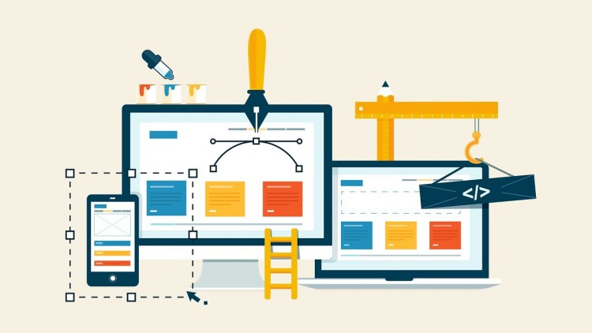
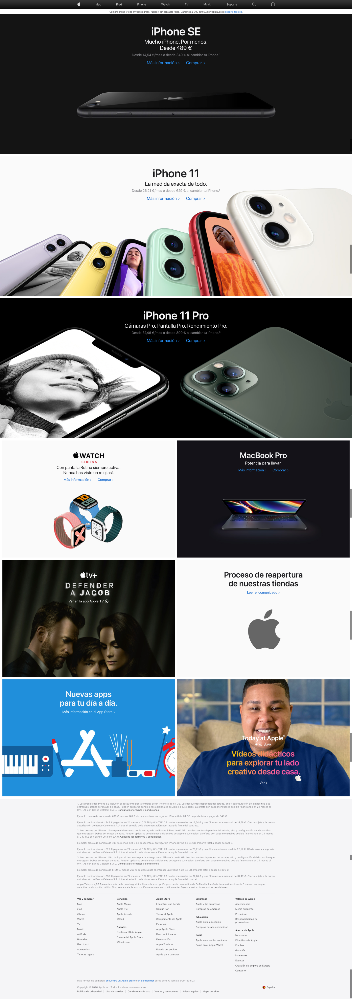

# Práctica: Webpage: BEM + SCSS + Flexbox

Hemos llegado a la última sesión de HTML/CSS y ya hemos visto toda la teoría necesaria para comenzar a maquetar `HTML` de manera semánticamente correcta y siguiendo las buenas prácticas.

Luego hemos ido exprimiendo el `CSS` pasando por las reglas más básicas y aprendiendo los tipos de selectores.

Más tarde descubrimos lo que era la **especificidad** y asentamos nuestros conocimientos de **Flexbox**. Descubrimos el **responsive** y como trabajar con el enfoque **mobile-first**.

Por último, hemos empezado a trabajar con **Bootstrap** y a aplicar la metodología **BEM** en nuestras clases para construir unos estilos más modulares y escalables.

La guinda han sido los preprocesadores y **SASS/SCSS**, con lo que ahora podremos estilar nuestras aplicaciones de manera más sencilla y rápida.

Esta última sesión será puramente práctica y los protagonistas seremos todos. Podemos resolver dudas y problemas de ejercicios anteriores o podemos lanzarnos a un último ejercicio práctico.

### Práctica: Feel Free!

En nuestra práctica vamos a poner en marcha todo lo que hemos aprendido hasta ahora, debéis elegir una temática y hacer una landing haciendo uso de todo lo aprendido. La temática es libre por lo tanto podéis elegir desde deportes, videojuegos, blog personal, Cv... lo que se os ocurra. Pero tendréis unos mínimos que garanticen que habéis adquirido todos los conocimientos.

**Mínimos**:

- Mobile First
- Responsive
- Uso de Scss o Sass
- Metodología BEM
- Buena arquitectura de HTML
- Uso de Svgs
- Flexbox como vuestro dogma xD

**Máximos**:

- Fuente iconográfica.
- Animaciones y transiciones.
- No usar Bootstrap.

En caso de no tener una temática os dejamos la web de Apple como referencia y así os sirve de inspiración. Maquetar las versiones mobile, tablet y desktop de la home de Apple. Podemos usar Bootstrap (Mejor no) y SASS o SCSS, y debemos aplicar BEM en las nuevas clases que generemos.

**Versión mobile:**

**Versión tablet:**

Versión desktop:

¡Ha sido un placer chicos! Os esperamos con muchas ganas en el siguiente bloque de conocimiento 💪🏼