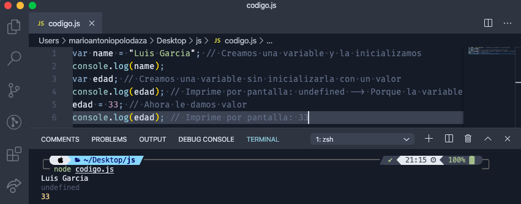

# Js: Intro

### ¿Cómo añadir javascript a una página HTML?

La manera de **incluir** y ejecutar **JavaScript** en nuestra página es mediante la etiqueta `<script>`. Podemos incluir estas etiquetas en cualquier lugar de nuestra página y el navegador ejecutará las sentencias JavaScript dentro de ellas, en cuanto las lea.

```html
<!DOCTYPE html>
  <head>
    <meta charset="utf-8">
    <title>Es es mi blog</title>
    <link rel="stylesheet" type="text/css" href="fichero.css">
    <!-- En la proxima línea vamos a ejecutar código javascript en nuestro HTML -->
    <script type="text/javascript">console.log("Hola clase!");</script>
  </head>
  <body>
     <p class="estilo1">Hola soy un párrafo con estilo1</p>
  </body>
</html>
```

Mediante la **etiqueta** `<script>` que acabamos de ver, podremos escribir lenguaje JavaScript directamente, aunque lo mejor es **cargar un fichero externo con el código JavaScript**. Esto nos permite tener nuestro código más organizado.

```html
<!DOCTYPE html>
  <head>
    <meta charset="utf-8">
    <title>Es es mi blog</title>
    <link rel="stylesheet" type="text/css" href="fichero.css">
    <!-- En la proxima línea vamos a cargar un fichero con código -->
    <script type="text/javascript" src="codigo.js"></script>
  </head>
  <body>
     <p class="estilo1">Hola soy un párrafo con estilo 1</p>
  </body>
</html>
```

Dentro de **codigo.js** podemos incluir código JavaScript, por ejemplo:

```jsx
var mensaje = "Hola, esto es un mensaje para imprimir en log";
console.log(mensaje);
// Todo lo que vaya precedido por '//' serán comentarios.
```

### Trabajando con la consola de Chrome

Para entender cómo se ejecuta este código Javascript en el navegador **Chrome**, lo mejor es abrir la propia consola que incorpora, para poder "jugar" ahí dentro.

Debemos hacer "click" en la parte superior derecha sobre los tres puntos consecutivos en vertical: ⠇→ Más herramientas → Herramientas para desarrolladores.

### Node y cómo ejecutar Javascript

Para esta sección, **crearemos** un fichero `ejemplo.js` en nuestro escritorio, lo abriremos con nuestro editor de código ([Visual Studio Code](https://www.notion.so/8f9299ad513d4d19a3662a9b0c11c7ff) si hemos seguido la guía de instalación de entorno) y **escribiremos** nuestra primera función:

```jsx
console.log('mi primera ejecución con Node');
// Todo lo que vaya precedido por '//' serán comentarios, que no se ejecutan en JavaScript
```

Guardamos el fichero y **abrimos un terminal**, nos posicionamos en el escritorio y ejecutamos `node ejemplo.js` y ¡magía! 🧙🏼‍♂️

### Declarando una variable en Javascript

Veamos un ejemplo en el que creamos variables y las imprimimos por pantalla, que podremos copiar a un `fichero.js`, para probarlo en nuestro ordenador:

```jsx
var name = "Peter Parker"; // Creamos una variable y la inicializamos
console.log(name);
var edad; // Creamos una variable sin inicializarla con un valor
console.log(edad); // Imprime por pantalla: undefined --> Porque la variable existe, pero no tiene valor dentro
edad = 16; // Ahora le damos valor
console.log(edad); // Imprime por pantalla: 16
```

Que no nos asuste la palabra `undefined`, simplemente es lo que nos muestra JavaScript cuando una variable todavía no tiene valor dentro, no está definido.



### Asignación `=`

Cada vez que creamos una variable, debemos darle un valor. Veamos un bloque de código con diferentes ejemplos (probar a copiarlo y ejecutarlo en vuestro `fichero.js`):

```jsx
var num1 = 5;
var num2 = 10;

// asignación
num1 = num2; 
console.log(num1); // num1 pasa a valer 10

// asignación y suma (num1 ya no vale el 5 inicial, recordar que ahora vale 10)
num1 += num2;
console.log(num1); // num1 pasa a ser 20 

// asignación y resta
num1 -= num2;
console.log(num1); // num1 pasa a ser 10

// asignación y multiplicación
num1 *= num2;
console.log(num1); // num1 pasa a ser 100

// asignación y división
num1 /= num2;
console.log(num1); // num1 pasa a ser 10
```

### Tipos de datos

Aunque JavaScript **no** es un **lenguaje fuertemente tipado**, esto no quiere decir que no existan tipos de datos. Vamos a ver los **tipos primitivos** que existen en JavaScript:

- **String**: Nos permite almacenar cadenas de texto
- **Number**: Nos permite almacenar valores numéricos (tanto enteros como con decimales).
- **Boolean**: Representa un valor lógico: verdadero o falso (true ó false).
- **Null**: Es un tipo especial. Su contenido es “null”.
- **Undefined**: Es una variable cuyo valor aún no se ha definido.
- **Object**: Contiene una referencia a un espacio en la memoria en el que encontramos una colección de propiedades. Lo veremos en detalle más adelante.

JavaScript es un lenguaje dinámico o de tipado débil, ya que no es obligatorio indicar el tipo de una variable al definirlo. De hecho, una misma variable puede cambiar de tipo sin problema alguno durante el proceso de ejecución de nuestro código. Podemos realizar pruebas haciendo uso de la función `typeof`, la cual nos indicará el tipo de una variable en cada momento.

```jsx
var txt = typeof "texto"; // string
var num = typeof 10;      // number
var bool = typeof true;   // boolean
```

### Datos dinámicos

JavaScript tiene tipos de datos dinámicos, lo que significa que **la comprobación de tipo se realiza en tiempo de ejecución en lugar de tiempo de compilación**. Con los lenguajes de tipo dinámico, se puede utilizar una variable del mismo nombre para contener diferentes tipos de datos.

Por ejemplo, la variable `t` , definida como una variable por la palabra clave `var` , se puede asignar para contener diferentes tipos de datos o puede inicializarse pero no se define:

```jsx
// t is a string 
var t = "cadena";   
// t is a number 
var t = 6;       
// t is a Boolean 
var t = true;              
// t is undefined 
var t;
```

Cada una de las variables `t` anteriores puede establecerse en cualquier tipo de datos disponible en JavaScript; No es necesario que se declaren explícitamente con un tipo de datos antes de que se utilicen.

### String

Uno de los tipos que más vamos a utilizar, serán las cadenas de texto o `string`. Sencillamente son un grupo de caracteres o palabras, entre comillas (dobles o simples).

```jsx
var texto = "Hola equipo";
var str = 'otro ejemplo';
```

### Number

Otro tipo bastante intuitivo serán los números:

```jsx
var numeroPi = 3.14;
var edad = 17;
```

### Mezclando tipos de datos

Aunque cada aplicación que creemos contendrá varios tipos de datos, es importante tener en cuenta que generalmente realizará operaciones dentro del mismo tipo de datos. Es decir,  estaremos realizando matemáticas en números, o rebelando cadenas.

Por ejemplo, al usar el operador `+` con números y cadenas juntas, los números se tratarán como una cadena (por lo tanto se concatenarán), pero el orden de los tipos de datos influirá en la concatenación.

Por lo tanto, si creamos una variable que realiza la siguiente concatenación, JavaScript interpretará cada elemento a continuación como una cadena:

```jsx
var concatena = "Minsaitder" + 5 + 5;

//Minsaitder55
```

Sin embargo, si entramos con números, los dos números se agregarán antes de que se interpreten como una cadena cuando el tiempo de ejecución del programa llegue a `"upgrade"` , por lo que el valor devuelto será la suma de los dos números concatenados con la cadena:

```jsx
var sumaConcatena = 5 + 3 + "Minsaitder";

//8Minsaitder
```

Debido a estos resultados inesperados, es probable que realice operaciones y métodos dentro de un tipo de datos en lugar de a través de ellos. **JavaScript, no devuelve errores al mezclar tipos de datos, como hacen algunos otros lenguajes de programación**.

### Operadores aritméticos (para trabajar con numbers)

Como en otras ocasiones vamos a comprobar en nuestro `fichero.js` el resultado de operar con ellos. Añadimos dos variables, asignamos un valor y realizamos tantas operaciones como queramos. Siempre dentro del `console.log` que nos imprimirá en pantalla la respuesta.

```jsx
var numa = 5;
var numb = 2
console.log(numa + numb); // Imprime 7
console.log(numa - numb); // Imprime 3
console.log(numa * numb); // Imprime 10
console.log(numa / numb); // Imprime 2.5

var num1 = numa++; // 4
var num2 = numb--; // 1
```

### Boolean

En programación, existe un tipo de dato que identifica los valores binarios 0 y 1. Una forma más intuitiva de trabajar con ello, es mediante booleanos. Un valor booleano, solo puede tomar verdadero o falso.

```jsx
var isActive = true;
var isDisabled = false;
```

### Operador lógico OR `||`

El operador **or**, representado por `||`, devuelve verdadero si uno de los valores combinados es verdadero. 

```jsx
var tengoEfectivo = true;
var tengoTarjeta = false;
var puedoPagar =  tengoEfectivo || tengoTarjeta;
console.log(puedoPagar); // Devuelve true, porque tengo efectivo
```


### Operador lógico AND `&&`

El operador **and**, representado por `&&`, devuelve verdadero solo si todos los valores combinados son verdaderos.

```jsx
var tengoCoche = false;
var tengoCarnetDeConducir = true;
var puedoConducir = tengoCoche && tengoCarnetDeConducir;
console.log(puedoConducir); // Devuelve false, porque no tengo coche
```


### Operador lógico NOT `!`

Por último, pero no menos importante, tenemos el operador **not** de negación `!`. Se usa para negar el valor de una expresión (darle el valor opuesto).

```jsx
!true     // => false
!false     // => true
```

### Ejercicio con operadores lógicos

Ahora que ya hemos visto todos los operadores, vamos a realizar algunas comprobaciones, para ello debemos copiar este código en nuestro fichero de **codigo.js** y probar a cambiar los valores de las variables, para ver las posibles combinaciones.

```jsx
var tengoDinero = true;
var meDaMiedoVolar = true;

// Puedo ir a Mexico si tengo dinero y NO me da miedo volar
var puedoIrAMexico = tengoDinero && !meDaMiedoVolar;
console.log(puedoIrAMexico);

var meTomoUnTranquilizante = true;
// Puedo ir a Mexico si tengo dinero y NO me da miedo volar o me tomo un tranquilizante
var puedoIrAMexico = tengoDinero && (!meDaMiedoVolar || meTomoUnTranquilizante);
console.log(puedoIrAMexico);
```

### Objetos `{ }`

A la hora de guardar información más variopinta sobre un elemento, debemos utilizar objetos.

Los **objetos** se construyen entre llaves `{ }` y se definen por duplas (**clave** y **valor**). De esta manera, el nombre de la persona puede ser almacenado en **persona.nombre** y los apellidos en **persona.apellidos** ¿Fácil verdad? Vamos a ponerlo en práctica.

```jsx
// Definimos un objeto con los datos de una persona
var persona = {
  nombre: "Peter",
  apellidos: "Parker",
  edad: 17,
  esSuperHeroe: true
}
// Accedemos a sus propiedades
console.log("La persona se llama " + persona.nombre); 
console.log("Y tiene " + persona.edad + " años");
```

Cabe destacar la manera en la definimos un objeto. A diferencia de los arrays, debemos
colocar sus elementos entre llaves `{ }` en vez de corchetes `[ ]` . Los elementos deben tener un nombre o índice que colocamos delante de cada valor y separado de este con dos puntos.

> En el ejemplo anterior hemos accedido a las propiedades mediante la sintaxis ***object.nombrePropiedad***, pero cabe destacar que también podríamos haber usado esta otra sintaxis: ***object[“nombrePropiedad”]***.
> 

Aplicado al ejemplo anterior quedaría de la siguiente manera:

```jsx
// Definimos un objeto con los datos de una persona
var persona = {
  nombre: "Peter",
  apellidos: "Parker",
  edad: 17,
  esSuperHeroe: true
}
// Accedemos a sus propiedades
console.log("La persona se llama " + persona["nombre"]); 
console.log("Y tiene " + persona["edad"] + " años");
```

### Arrays `[ ]`

La manera de representar un **listado** de elementos en programación, se denomina Array. Un array está compuesto por varios ítems, entre corchetes `[ ]`.

```jsx
var list = [1976, 1985, 1991, 1994, 1997, 2001, 2006];
var otherList = ["Jose", "Alicia", "Laura"];
var listOfObjs = [
  { id: 1, name: 'Tim' },
  { id: 4, name: 'Bob' },
];
```

### Declarar y a**cceder a los elementos de un Array**

Pensemos en el array como una lista de elementos, cada uno con su posición (**empezando por la 0**). Para acceder a la primera posición del array, basta con poner entre corchetes el número 0.

```jsx
var avengers = ["Hulk", "SpiderMan", "AntMan"];

var avenger = avengers[0]; // Probad a cambiar este numero ;)
console.log(avenger) // Devuelve "Hulk"
```

### Algunas funciones y utilidades **de los Arrays**

Los array tienen distintas funciones de utilidad, que nos van a facilitar trabajar con ellos, algunos de ellos los detallaremos, aunque otros los iremos descubriendo a lo largo del bootcamp.

**Propiedad length:**

Si queremos conocer el número de elementos del array `avengers` se puede consultar mediante la propiedad `length`. Os dejamos un ejemplo:

```jsx
avengers.length; // Devuelve 3
```

**Manipular el array:**

Al final el array actua **como una pila**, que te permite añadir datos o sacarlos. Al ser una pila de elementos, siempre se añaden o eliminan por el final:

```jsx
var avengers = ["Hulk", "Thor", "Iron-Man"];

// Iron-Man   <-- Posicion: 2 (Elemento más alto de la pila)
// Thor       <-- Posicion: 1
// Hulk       <-- Posicion: 0 (Elemento más bajo de la pila)
```

La inserción de datos se puede hacer mediante el método **push** y la extracción mediante el método **pop**.

**Método Push en Array:**

Para añadir elementos en un array, usamos el método `push`, que inserta un nuevo elemento:

```jsx
var avengers = ["Hulk", "Thor", "Iron-Man"];
avengers.push("SpiderMan", "AntMan");
console.log(avengers);
// Imprime ["Hulk", "Thor", "Iron-Man", "SpiderMan", "AntMan"]
```


**Método Pop en Array:**

Para eliminar elementos de un array, usamos el método `pop`, que elimina el último elemento:

```jsx
var avengers = ["Hulk", "Thor", "Iron-Man", "SpiderMan", "AntMan"];
avengers.pop();
console.log(avengers);
// Imprime ["Hulk", "Thor", "Iron-Man", "SpiderMan"]
```


**Método Sort:**

Este método se utiliza para **ordenar** un array. En caso de que tengamos un array con elementos string, pues estos serán ordenados **alfabéticamente**:

```jsx
var avengers = ["Hulk", "Thor", "Iron-Man", "SpiderMan", "AntMan"];
avengers.sort();
console.log(avengers);
// Imprime ['AntMan', 'Hulk', 'Iron-Man', 'SpiderMan', 'Thor']
```


En caso de ser números, lo ordenará de menor a mayor:


Os hemos dejado una recopilación de estas utilidades en el siguiente apartado:

[Javascript | Métodos del array](./01-js-intro-ampliacion-metodos-array.md)

### 

### Comparación entre booleanos

Ahora que ya sabemos combinar valores booleanos mediante operadores lógicos, vamos a ver como compararlos entre sí. Podemos comprobar si dos valores booleanos son:

- `==` iguales
- `!=` desiguales
- `===` iguales estrictamente
- `!==` desiguales estrictamente

```jsx
// Analizad cual sería el resultado de las siguientes comparaciones
var result1 = true == 1;
var result2 = false == 0;
var result3 = "1" == 1;
var result4 = undefined == null;

var result5 = true === 1;
var result6 = false === 0;
var result7 = "1" === 1;
var result8 = undefined === null;

var wtf = result6 === result7 || result8; // 🤯
```

Para finalizar el tema de comparaciones, también podremos comparar números:

- `<` menor que ...
- `>` mayor que ...
- `<=` menor o igual que ...
- `>=` mayor o igual que ...

```jsx
var edad = 15;

var soyMenor = edad < 18; // true

var mePuedoJubilar = edad >= 65; // false
```

### Condicionales ⇒ if - if..else

Nos va a permitir comparar **si** se cumple una condición, para tomar un camino, y **sino** tomar otro. Tan simple como eso, gracias a esta sentencia podemos dividir nuestro código en dos caminos, uno para el supuesto verdadero y otro para el falso:

```jsx
// Edad que tenemos
var age = 15;
// Si soy mayor de edad, entonces puedo ser un Vengador
if (age < 18) {
  // Si mi edad es menor de 18
  console.log ("Vaya tendrás que ir con Spidy a jugar al parque");
} else {
  // Si mi edad es mayor de 18
  console.log ("Bienvenido Vengador)");
}
```

### Bucles ⇒ while

El bucle `while` es bastante simple, y necesita tener un control interno para asegurar la parada del bucle. Es raramente usado en el día a día de la programación.

```jsx
var i = 0;

// Mientras la variable "i" sea menor o igual que 100
while (i <= 100) {
  console.log (i);
  i = i + 1;  // Suma 1 a la variable i
}
```

El bucle sigue las siguientes reglas:

- Comprueba si el valor de `i` es menor o igual que 100.
- Imprime en la consola el valor de `i`.
- Incrementa el valor de la `i` en 1.

### Bucles ⇒ for

En caso de necesitar un bucle algo más robusto y sofisticado, usaremos la instrucción `for`. Con ella crearemos un bucle con tres valores diferentes separados por punto y coma: **inicialización**, **condición** y **expresión de incremento**. Es un poco complicado al principio pero a través de un ejemplo sencillo lo verás mejor.

Vamos a hacer el mismo ejercicio que antes, esta vez usando una declaración **for**. Imprimamos en la consola los números del 0 al 100. El código es:

```jsx
// Inicializacion: var i = 0
// Condición: si i es menor o igual que 100
// Incremento: por cada iteración, sumale 1 al valor de 'i'
// Pista extra: i++ es lo mismo que: i = i + 1
for (var i = 0; i <= 100; i++) {
  console.log(i);
}
```

### Resumen: Trabajando con arrays, bucles y condicionales

Hemos visto cómo manipular un array, pero siempre desde el último elementos. Pero ¿y si queremos manipular otro dato que no sea el último?

Pues para eso os vamos a enseñar a recorrer un Array, haciendo uso de los bucles aprendidos anteriormente, en concreto un bucle **for**:

```jsx
var avengers = ["Thor", "Spiderman", "Iron-Man", "Hulk"];

for (var i = 0; i <= avengers.length; i++) {
  console.log(avengers[i]); // Imprime los nombres de nuestros vengadores según la posivión de i
}
```

Ahora introduzcamos un condicional (también aprendido en la sección anterior). Recorramos el array y imprimamos un mensaje, pero solo para **Hulk**:

```jsx
var avengers = ["Thor", "Spiderman", "Iron-Man", "Hulk"];

for (var i = 0; i <= avengers.length; i++) {
  if(avengers[i] == 'Hulk') {
    console.log('Este vengador se llama' + avengers[i] + ' y es el más fuerte');
  };
}
```

Y finalmente, vamos a sustituir a **Spiderman** por otro vengador:

```jsx
var avengers = ["Thor", "Spiderman", "Iron-man", "Hulk"];

for (var i = 0; i <= avengers.length; i++) {
  if(avengers[i] == 'Spiderman') {
    avengers[i] = 'AntMan';
  };
}

console.log(avengers);
```


No está mal para ser el primer día, ¿verdad? 😵.