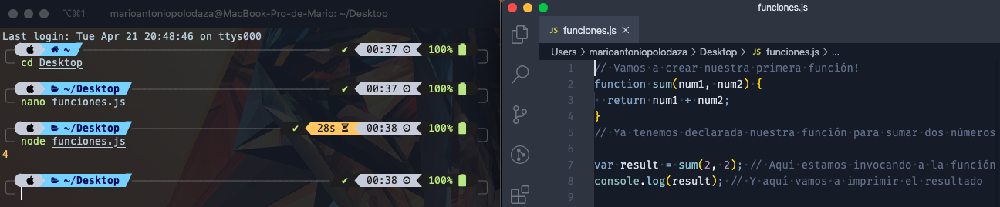

# Js: Mid

### Después de esta lección podrás:

1. Entender qué es una función
2. Trabajar con condicionales avanzados.
3. Usar condiciones ternarias dejando un código más limpio.
4. Trabajar con bucles avanzados.
5. Aprender a utilizar de un bucle u otro en función de la necesidad.

### Qué es una función?

Una función se define para a resolver una **tarea concreta.** Digamos que es un fragmento de código, que declaramos para poder usarlo en otros puntos (para reutilizar código). Por defecto en Javascript existen unas cuantas funciones ya declaradas, para que las usemos a nuestro gusto.

Una que hemos estado usando estos días es la función `log()` de la consola de javascript:

```jsx
console.log('mi primera funcion');
```

En el ejemplo anterior, vemos una función para **imprimir** un mensaje. Sencillo, ¿no? 🤯

Pensad cuando tratamos de resolver un ejercicio de programación, escribiendo código en varias líneas... ¿y si existiera alguna manera de **dividir** en "trocitos" todo ese código? (para que no esté todo en un bloque inmenso). Pues en esta sección aprenderemos a **separar** nuestro código por funcionalidades.

Volviendo al ejemplo inicial, tenemos la función `log()` para imprimir por pantalla, y la podemos usar todas las veces que queramos. Imaginad que ahora quisiéramos una función para sumar dos números, tal que `sum(2, 2)`:

```jsx
// Vamos a declarar (crear) nuestra primera función!
function sum(num1, num2) {
  return num1 + num2;
}
// Ya tenemos declarada nuestra función para sumar dos números

var result = sum(2, 2); // Aqui estamos invocando a la función (ejecutándola)
console.log(result); // Y aquí vamos a imprimir el resultado
```

Analicemos este código:

- `function` es la palabra mágica (sentencia reservada) para crear **funciones**
- `sum` es el **nombre** que le doy a la función (hay que procurar darle un nombre descriptivo)
- `(num1, num2)` a esto se le llama **parámetros**, y es lo que **entra** en nuestra función
- `return` es la palabra mágica (reservada) para **devolver** el resultado, la **salida** de la función
- `{ }`  entre los corchetes irá el cuerpo de la función, donde operamos

Tras la declaración de la función, vemos la línea en la que hacemos uso de ella `sum(2, 2)`, es fácil, basta con escribir su **nombre** y ponerle los **paréntesis** con los parámetros de **entrada**.

> Importante:

NO es lo mismo "declarar" (crear) una función...
...que "ejecutar" (invocar) una función ya creada
> 

Ahora copia y pega el bloque de código en tu fichero `funciones.js` y ejecútalo con **Node**. El resultado es 4 (hemos conseguido sumar 2 + 2 🤪).



### Asignación de funciones

También podemos crear y nombrar funciones, **asignando** funciones a **variables**. Aquí tenemos un ejemplo:

```jsx
var sayHello = function() {
  return "Hello!";
};

sayHello(); // Devuelve "Hello!"
```

### Funciones definidas en Javascript

En anteriores secciones ya hemos usado algunas funciones, lo que pasaba es que NO éramos conscientes de ello, pero ¿cómo es esto posible, si yo no recuerdo haber creado ninguna? 😱

Es fácil, existe un conjunto de funciones que ya vienen definidas en Javascript, existen en el estándar. Al principio de esta sección usábamos la función `console.log()`, y si nos paramos a pensar, es la función con nombre **log** creada dentro de la consola de Javascript, que sirve para imprimir por pantalla.

Os invitamos a repasar anteriores bloques, en búsqueda de funciones que hemos ido usando, aunque para hacéroslo más fácil, os dejamos aquí descritas algunas de las usadas:

```jsx
var test = "Test";
console.log(test); // Imprime por pantalla "Test"
var res = test.indexOf("T"); // Devuelve la posición de la letra "T" en el string "Test" -> 0
console.log(res);
var res2 = test.includes("st"); // Indica si existe la cadena "st" en el string "Test" -> true
console.log(res2);
```


### Los Condicionales

Los condicionales son estructuras de control de JavaScript que sirven para ejecutar un código u otro (o ninguno) en función de si se cumple o no una condición.

En ellos se establece una **condición** y el código en caso de que se cumpla o no, si esa condición se cumple se ejecuta un código y sino otro o ninguno. ***Si esta condición es verdadera, haz esto y sino esto otro***. La condición que escribamos siempre se va a convertir en `true` o `false`.

**If**: Podemos pensar en ellos como un *"Si...haz..."*.

```jsx
var age = 35;
if (age > 30) {
  console.log('Tienes más de 30 años'); 
  //Esta línea se ejecuta solo si se cumple la condición
}

```

Existe otra estructura para el condicional cuando queremos que ejecutar un código diferente cuando no se cumpla la condición. Partiendo de la estructura simple, añadimos:

**Else**: Podemos pensar en ello como un *"Si...haz...sino haz..."*.

```jsx
var age = 35;
if (age < 30) {
  console.log('Tienes más de 30 años'); 
  // Esta línea se ejecuta solo si se cumple la condición
} else {
  console.log('Como mucho tienes 30 años'); 
  // Esta línea se ejecuta solo si NO se cumple la condición
}
```

Si necesitamos una estructura más complicada, siempre podemos poner un `else` al final para ejecutar código cuando no se ha cumplido ninguna de las condiciones. Además, podemos incluir todas las condiciones que queramos con `else if`.

Podemos pensar en ello como un *"Si...haz...sino si...haz..."*.

```jsx
var mutant = 'Beast';

if (mutant === 'Ciclops') {
  console.log('Who are you?'); 
  // Esta línea se ejecuta solo si se cumple la condición
} else if (mutant === 'Beast') {
  console.log('Beast? Hank?'); 
  // Esta línea se ejecuta solo si se NO cumple la primera condición 
  // y SÍ se cumple la segunda
}

```

### S**witch**

Podemos pensar en ello como un *"Si...coincide haz ...sino coincide nunca default ..."*.

Lo usaremos cuando tengamos una situación similar a la del if...else pero en este caso en función del valor que entra dentro del **switch** ejecutará un case u otro. El break nos permite que cuando encuentre su caso no siga ejecutando el **switch**:

```jsx
var name  = prompt("Favorite Marvel main character:");
var team = "";

switch (name) {
  case "Daredevil":
    team = "The Defenders";
    break;
 case "Spiderman":
    team = "Avengers";
    break;
 case "Black bolt":
    team = "Inhumans";
    break;
 case "Beast":
    team = "X-Men";
    break;
 default:
    team = "Team Marvel"
    break;
}

console.log("Your favorite character is from the team " + team);
```

### Ternario `condition ? true : false`

**El operador ternario** es una forma abreviada de la sentencia ***if else*** para tomar una decisión, usarla nos ayuda a crear código más limpio y fácil de entender y además nos ayuda a escribir código más rápido por que hay menos caracteres que escribir.

Se llama ternario porque consta de 3 partes, la primera es la condición, la segunda el valor que retorna si la condición es verdadera y el tercero es el valor que devuelve si la condición es false.

Ambos valores para falso y verdadero se separan entre ellos con un signo `:` mientras en el signo `?` se usa para separar la condición de los posibles valores `falso` y `verdadero`. Muy sencillo.

Para entenderlo veamos primero la versión larga con un ejemplo en el que vamos a mostrar un mensaje en pantalla diciendo si alguien aprueba o falla un examen basándonos en una puntuación:

```jsx
var score = 5;

if(score >= 6) {
    console.log('aprobado');
} else {
    console.log('suspenso')
}
```

Ahora veamos la versión con ternario:

```jsx
var score = 5;

console.log(score >= 6 ? 'aprobado' : 'suspenso');
```

Se ve mucho mejor ¿cierto?, pero ahora voy a explicarte todo esto de forma muy sencilla, el operador ternario trabaja de esta forma:

```jsx
score >= 6 //condición 
? // si 
'aprobado' // verdadero
: // or
'suspenso' // falso
```

Por último añadir que también es posible validaciones ternarias múltiples. Aunque si se encadenan más de dos queda más limpio y entendible un if...else tradicional.

```jsx
// no recomendamos juntar varios 'ternarios', ya que hace más ilegible el código
var firstCheck = false,
    secondCheck = false,
    access = firstCheck ? "Acceso Denegado" : secondCheck ? "Acceso Denegado" : "Acceso Permitido";
  
console.log( access ); // muestra "Acceso Permitido"
```

### Bucles

Los bucles nos van a permitir iterar por listas, para recorrerlas y realizar operativa sobre cada uno de sus items.

**For:**

Es el bucle más básico y funcional, lo vimos en la sesión anterior. Recordad que entre paréntesis lleva la inicialización, la condición de ruptura y el incremento (separados por `;`):

```jsx
for (var index = 0; index < array.length; index++) {
  var element = array[index];
}
```

**Foreach:**

Podemos construir un bucle for, pero con una estructura más **funcional** gracias al `foreach`. En ocasiones puede sernos muy útil generar una función para ejecutarla por cada vuelta de bucle:

```jsx
var myArray = ['Alberto', 'Mario', 'Jose', 'Juan'];

myArray.forEach(
  function (element) {
    console.log(element);
  }
);
```

```jsx
/* Otro ejemplo */

var myArray = ['Alberto', 'Mario', 'Jose', 'Juan'];

var imprime = function(element) {
  console.log(element);
}

myArray.forEach(imprime);
```

**For-of:**

El bucle **for-of** es un bucle que automáticamente nos devuelve los **`valores`**. Este bucle lo que nos permite es iterar a través de los **elementos de objetos iterables** como, por ejemplo, **String, Array, Set, Map,** etc.

```jsx
for (value of iterable_obj) { ... }
```

Vamos a ver unos ejemplos con algunos de los tipos de objetos que hemos comentado antes que permite iterar:

```jsx
// Iteración sobre Array

var justiceLeague = ['Batman', 'Aquaman', 'Superman'];
for (var justice of justiceLeague) {
  console.log(justice);
}

// Iteración sobre String

var clark = 'Superman';
for (var who of clark) {
  console.log(who);
}

// Iteración sobre Arguments (los argumentos/parámetros de una función) 🤯

function crazyContainer() {
  for (var value of arguments) {
    console.log(value);
  }
}
crazyContainer(justiceLeague, 8, clark);
```

**For-in:** 

Para poder recorrer las **`claves`** de un objeto JavaScript nos ofrece la función **for in**: Mediante la cual recorremos todos los índices del objeto, de manera que podemos ir accediendo a cada una de sus propiedades.

```jsx
// Definimos un objeto con los datos de una spiederman
var spiderman = {
    nombre: "Peter",
    apellidos: "Parker", 
    pais: "USA",
    profesion: "Student"
}
    
for (var key in spiderman) {
    console.log("Spiderman tiene " + key + " con valor: " + spiderman[key]);
}
```

**For-of vs. For-in:**

Una de las diferencias es que **for-of** solamente puede iterar en objetos iterables, en cambio, **for-in** puede iterar en cualquier tipo de objeto. Otra diferencia, **es que for-in devuelve las claves y for-of los valores.**

Vamos a hacer una prueba del uso de **for-of** y de **for-in** seguro que os sorprende los resultados:

```jsx
var dieHardArray = [1, 2,'Simon', 'John McClane', 'Zeus Carver'];

var dieHardObj = {
  name: 'John',
  surname: 'McClane',
  age: 37
};
 
// Iterar un Array
for (value of dieHardArray) {
  console.log(value);  
}

for (key in dieHardArray) {
  console.log(key);  
}

 
// Iterar un Objeto

for (key in dieHardObj) {
  console.log(key);  
}
 
for (value of dieHardObj) {
  console.log(value);  
}
```

**For-of vs. forEach:**

La principal diferencia es que **for-of** puede iterar en cualquier tipo de objeto iterable, en cambio, **.forEach** solamente puede en arrays.

Lo vemos con un ejemplo:

```jsx
var backToTheFutureArray = [21, 10, 2015, 'Delorean'];
var backToTheFutureString = 'Dr.Emmett Brown';
 
// Iterar un Array
for (value of backToTheFutureArray) {
  console.log(value);  
}
 
backToTheFutureArray.forEach(function(value, index) {
  // podemos acceder al índice
  console.log(value, index);
});
 
 
// Iterar un String
for (value of backToTheFutureString) {
  console.log(value);  
}
 
backToTheFutureString.forEach(function(value, index) {
  console.log(value, index);
});
```