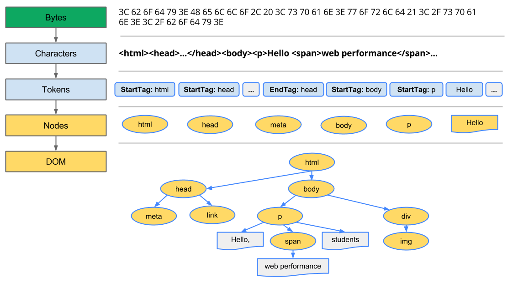

# Js: Events-DOM

Antes de lanzarnos al concepto del **DOM**, nos vendrá bien conocer un poco lo que son los timeouts e intervalos ya que en el desarrollo actual se ven ligados a la manipulación del DOM (aunque el el día a día, NO vamos a trabajar con estas funciones).

Lo primero generamos un documento **index.html**:

```html
<!DOCTYPE html>
  <head>
    <meta charset="utf-8">
    <title>index.html</title>
    <!-- En la proxima línea vamos a cargar un fichero con estilos -->  
    <link rel="stylesheet" type="text/css" href="styles.css">
    <!-- En la proxima línea vamos a cargar un fichero con código -->
    <script type="text/javascript" src="app.js"></script>
  </head>
  <body>
     <p class="estilo">Bienvenidos a la Sesión 3 de JS</p>
  </body>
</html>
```

### Timeouts

El método ***setTimeout()*** establece un **temporizador** que ejecuta una función o una porción de código después de que transcurra el tiempo indicado en **milisegundos**.

El valor **devuelto** por la función ***setTimeout()*** es **númerico** e identifica el temporizador creado con la llamada a ***setTimeout()***. Este valor puede pasarse a la función ***clearTimeout()*** para cancelar el temporizador. Veamos un ejemplo con código:

```jsx
// Variable que almacena el ID del timeout
var timeoutID;

// Función que crea el timeout
function mostrarSaludoDentroDeDosSegundos() {
  timeoutID = setTimeout(slowAlert, 2000); 
}
// Función que muestra un alert
function slowAlert() {
   alert("Hola !!");
}
// Llamamos a la función que crea el timeout
mostrarSaludoDentroDeDosSegundos();
```

Si lo ejecutamos en la consola de nuestro navegador podemos observar como **el alert se genera pasados 2000 milisegundos (2 segundos)**. Si quisiéramos crear una función que **cancelase** el **timeout** antes de que se ejecutase lo haríamos de la siguiente manera:

```jsx
// Función que cancela el timeout
function clearAlert() { 
  window.clearTimeout(timeoutID);
}
```

### Intervalos

Función muy parecida a la anterior salvo que su **comportamiento** se repite en forma de **bucle**: ***setInterval()*** ejecuta una función o un fragmento de código que recibe por parámetro de forma repetitiva cada vez que termina el periodo de tiempo determinado (también en milisegundos). 

El valor **devuelto** por la función ***setInterval()*** es **númerico** e identifica el temporizador creado con la llamada a ***setInterval()***. Este valor puede pasarse a la función ***clearInterval()*** para **cancelar** el **temporizador**. Veamos un ejemplo con código:

```jsx
// Variables que almacenan el ID del timeout y el tiempo que ha transcurrido
var intervalID; 
var segundos = 0;

// Función que crea el timeout
function crearIntervaloDeUnSegundo() {
  intervalID = setInterval(imprimirAumentarTiempo, 1000); 
}

// Función que muestra un alert
function imprimirAumentarTiempo() {
  segundos++;
  console.log("Tiempo: " + segundos + " s."); 
}

// Llamamos a la función que crea el timeout
crearIntervaloDeUnSegundo();
```

Si ejecutamos el código en un navegador podemos observar que hemos creado un contador de segundos. Para **parar el intervalo** debemos ejecutar la siguiente función:

```jsx
// Paramos el intervalo
clearInterval(intervalID);
```

### DOM

Las siglas DOM vienen de **Document Object Model**. La definición formal nos indica que es esencialmente una interfaz de plataforma que proporciona un conjunto estándar de objetos para representar documentos HTML.

Para nosotros, lo entenderemos como que es la manera en la que el navegador interpreta el HTML en conjunto con el CSS y el JS. Construyendo la sección **Elements** de las herramientas de desarrollo del navegador.

Empezaremos a comprender que los elementos HTML se renderizan como Nodos dentro del árbol web, ya que el navegador va construyendo en profundidad, a medida que analiza nuestros ficheros estáticos.



### Eventos en el DOM

Hasta ahora todo el **código** JavaScript que hemos generado se **ejecutaba** “directamente” al **cargar** la **página**, pero con esto **no** conseguimos **ofrecer al usuario** demasiada **interacción**.

Para cubrir nuestras necesidades de interacción podemos hacer uso de **eventos**, que una vez detectados **lancen las funciones** que les indiquemos. Algunos ejemplos de eventos:

Eventos de **ratón**

- `click`: botón izquierdo del ratón
- `mouseover`: pasar el ratón sobre un elemento
- `mouseout`: sacar el ratón de un elemento

Eventos de **teclado**

- `keypress`: pulsar una tecla

Sobre **elementos**

- `focus`: poner el foco (seleccionar) sobre un elemento, por ejemplo un input
- `blur`: quitar el foco de un elemento
- `change`: al cambiar el contenido de un input (hay que quitar el foco para que se considere un cambio) o de un select

**Formularios**

- `submit`: pulsar el botón submit del formulario
- `reset`: pulsar el botón reset del formulario

De la **ventana**

- `resize`: se ha cambiado el tamaño de la ventana
- `scroll`: se ha hecho scroll en la ventana o un elemento

### Ejemplo de uso onclick

Este **evento** se ejecuta cuando el usuario hace **click** en un **elemento del HTML**. No tiene por qué ser un botón, puede ser **cualquier elemento**. La manera más rápida de hacer **uso** de este evento es **indicándolo** sobre el propio **elemento** mediante el atributo **onclick**. Veamos su sintaxis con un pequeño ejemplo:

```html
<body>
  <p>Justo debajo encontramos un botón. Prueba a pulsarlo.</p>
  <button onclick="funcionalidadDeMiBoton(event)">Púlsame</button>
</body>
```

No debemos olvidarnos de definir nuestra función en nuestro fichero JS:

```jsx
function funcionalidadDeMiBoton(event){
  alert("Acabas de hacer click en el botón.");
  console.log(event);
}
```

Dedica especial atención a la información pasada mediante el parámetro `event`. Podremos averiguar **quién**, **cómo** y **dónde** se hizo click gracias a la info de este evento.

### Escuchadores de eventos

Otra manera de tratar los eventos, sería vinculando un `eventListener` (escuchador de eventos). De esta manera preparamos la programática necesaria para que cuando se dispare un evento concreto, se gestione en la función que nosotros hemos preparado para ello.

```html
<body>
  <p>Justo debajo encontramos un botón. Prueba a pulsarlo.</p>
  <button id="btn">Púlsame</button>
</body>
```

```jsx
var handleClick = function(event) {
   console.log(event);
}
document.getElementById("btn").addEventListener("click", handleClick);
```

Siguiendo las buenas prácticas, más adelante veremos cómo gestionar estos `eventListeners` y procuraremos NO utilizar `onclicks` en el HTML (para desacoplar la vista de la capa lógica).

### DOM desde Js

El **DOM** es un conjunto de utilidades específicamente diseñadas para **manipular documentos** XML, y por tanto documentos **HTML**. El DOM **transforma** el archivo **HTML** en un **árbol de nodos jerárquico**, fácilmente manipulable. Los nodos más importantes son:

- **Document**: Representa el **nodo raíz**. Todo el documento HTML.
- **Element**: Representa el **contenido** definido por un par de **etiquetas** de apertura y cierre, lo que se conoce como un tag HTML. **Puede tener como hijos más nodos de tipo Element y también atributos**.
- **Attr**: Representa el **atributo** de un elemento.
- **Text**: Almacena el **contenido del texto** que se encuentra **entre** una **etiqueta** HTML de **apertura** y **cierre**.


### Buscando en el DOM

Para poder **recorrer** el **DOM**, lo podemos hacer a través de un API JavaScript con métodos para acceder y manipular los nodos. Algunas de estas funciones son:

- `getElementById(id)`**:** Devuelve el **elemento** con un **id** especifico.
- **getElementsByName(name)**: Devuelve los **elementos** que un **name** específico.
- **getElementsByTagName(tagname)**: Devuelve los **elementos** con un nombre de **tag** específico.
- **getElementsByClassName(classname)**: Devuelve los **elementos** con un nombre de **clase** específico.
- **getAttribute(attributeName)**: Devuelve el valor del **atributo** con nombre **attributeName**
- `querySelector(selector)`**:** Devuelve un único **elemento** que corresponda con el **selector** , ya sea por **tag, id, o clase**.
- **querySelectorAll(selector):** Devuelve un **array** con los **elementos** que correspondan con la query **introducida en selector**.

```jsx
document.querySelector('.sidebar');
```

### Manipulando el DOM

De igual manera podemos **manipular** el **DOM** con las siguientes funciones:

- `createElement(name)`**:** Crea un **elemento** HTML con el **nombre** que le pasemos en el **parámetro** name.
- **createTextNode(text)**: Crea un **nodo** de **texto** que puede ser **añadido** a un **elemento HTML**.
- **createTextAttribute(attribute)**: Crea un **atributo** que puede ser **añadido posteriormente** a un **elemento** HTML.
- `appendChild(node)`**:** Nos permite **hacer hijo un elemento a otro**.
- **insertBefore(new, target)**: Permite **insertar** un **elemento** o nodo new **antes del indicado en target .**
- **removeAttribute(attribute)**: **Elimina** el **atributo** de nombre attribute del nodo desde el que se le llama.
- **removeChild(child): Elimina** el **nodo** **hijo** que se indica con child
- **replaceChild(new, old)**: **Reemplaza** el nodo old por el que se indica en el parámetro new.

### Manejando el DOM: Ejemplo

```html
<div id="div1">El texto superior se ha creado dinámicamente.</div>
```

```jsx
window.onload = function() {
  addContent();
}

function addContent () {
  // crea un nuevo div y añade contenido
  var newDiv = document.createElement("div");
  var newContent = document.createTextNode("Hola! ¿Qué tal?");
  // añade texto al div creado.
  newDiv.appendChild(newContent);
  // añade el elemento creado y su contenido al DOM
  var currentDiv = document.getElementById("div1");
  document.body.insertBefore(newDiv, currentDiv);
}
```

### Propiedades de los nodos

Todos los nodos tienen algunas propiedades que pueden ser muy útiles para las necesidades de nuestros desarrollos:

- **attributes**: Nos **devuelve** un **objeto** con todos los **atributos** que posee un nodo.
- **className**: Permite **setear o devolver** el nombre de la **clase** (para CSS) que tenga el nodo si la tiene.
- **classList**: Listado de clases del nodo.
- **id**: Igual que className pero para el atributo id.
- **innerHTML**: Devuelve o **permite insertar código HTML** (incluyendo tags y texto) dentro de un nodo.
- **nodeName**: **Devuelve** o nombre del **nodo**, si es un <div> devolverá DIV .
- **nodeValue**: Devuelve el **valor** del **nodo**. Si es de tipo element devolverá null . Pero por ejemplo **si es un nodo de tipo texto, devolverá ese valor**.
- **style**: Permite **insertar** código **CSS** para editar el estilo.
- **tagName**: Devuelve el nombre de la etiqueta HTML correspondiente al nodo. Similar a nodeName, pero solo en nodos de tipo tag HTML.
- **title**: Devuelve o permite **modificar** el valor del **atributo title** de un nodo.
- **childNodes** : Devuelve un array con los nodos hijos del nodo desde el que se llama.
- **firstChild** : Devuelve el **primer hijo**.
- **lastChild** : Devuelve el **último hijo**.
- **previousSibling** : Devuelve el anterior "hermano" o nodo al mismo nivel.
- **nextSibling** : Devuelve el siguiente "hermano" o nodo al mismo nivel.
- **ownerDocument** : Devuelve el nodo raíz donde se encuentra el nodo desde el que se llama.
- **parentNode** : Devuelve el nodo padre del nodo que se llama.

### Manejando el DOM: Ejemplo

```jsx
function sayHello() {
  console.log('Hello!');
}

function addListeners() {
  document.getElementById("btn").addEventListener("click", sayHello);
}

window.onload = function() {
  // init listeners
  addListeners();

  // init content
  addElement();
}

function addElement() {
  var newElem = document.createElement('div');
  newElem.id = 'nuevoElemento';
  newElem.className = 'bloque';
  newElem.style = 'background:red; width:200px; height:200px'; 
  var body = document.querySelector('body'); 
  body.appendChild(newElem);
}
```

Veamos el resultado sobre nuestro HTML:

```jsx
<body>
   <button id="btn">Say hello!</button>
   <div id="nuevoElemento" class="bloque" style="background: red; width: 200px; height: 200px;"></div> </body>
</body>
```

Lo que hemos hecho es **crear** un **elemento** div con un id de nombre **nuevoElemento**, una **clase** bloque y un estilo **CSS** que define un color de fondo red (rojo) y un ancho y alto de 200px. 

Todo el API del DOM nos permite cualquier modificación y edición de elementos HTML, de forma que dinámicamente, por ejemplo por medio de eventos, podemos modificar el aspecto y funcionalidad del documento HTML que estamos visualizando.


El DOM es un elemento "vivo" que nos va a permitir interactuar con el navegador (después de que este último haya interpretado nuestros estáticos de HTML/CSS).