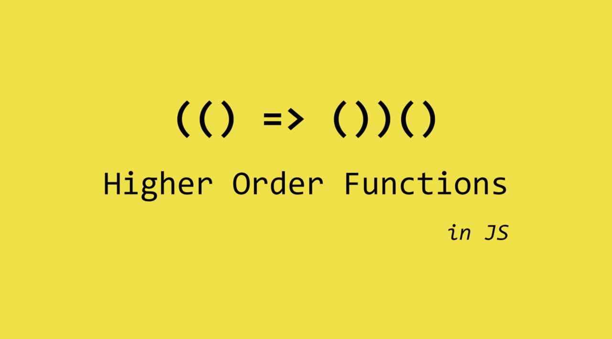

# Advance concepts

### Qué es el Scope?

El scope es el **alcance** de una **variable**, puede ser de dos tipos, **global y local**. Una variable cuyo scope es global se puede acceder desde cualquier parte del código, una local solo desde la función que la contiene. Ejemplo:

```jsx
// Declaramos variable
var avenger = 'Wolverine';
// Función
function global() {
// Accedemos a la variable  
 console.log('in function ' + avenger);
}
// Ejecutamos función
global();
// Imprimimos valor de variable
console.log('out function ' + avenger);
```

En ese caso a es una **variable global** ya que podemos **acceder** tanto **fuera** como **dentro** de una **función** debido a haberla definido fuera de cualquier función.

En el siguiente caso, la variable será local ya que la definiremos dentro de la función **local()**, esto quiere decir que solo podemos acceder a ella dentro dicha función, cuando ejecutamos **local()** te muestra correctamente '***Wolverine***', mientras que si haces **console.log(avenger)** te va a dar error porque a no esta definida, para el scope global esa variable no existe.

```jsx
// Declaramos una función
function local() {
 // Declarmaos variable
 var avenger = 'Wolverine';
 // Imprimimos por consola
 console.log(avenger);
}
// Ejecutamos función -> wolverine
local();
// Ahhhg! Error
console.log(avenger);
```

### Qué es el contexto - this?

El contexto determina cómo se invoca una función. Cuando una función es invocada en un objeto, el `this` será este objeto. Vamos a nuestra consola de chrome y ejecutemos:

```jsx
console.log(this);

// this apunta al objeto ventana por defecto
> Window { postmensage:f, blur:f, focus:f, close:f, window,... }
```

Nos devuelve el objeto window porque en este caso el contexto de ejecución es Global, lo que significa que no está bloqueado por ninguna ámbito de objeto. Pero y si por ejemplo ejecutamos:

```jsx
var avengers = {
   value: 'this se encuentra dentro de avengers',
   avengerFunction: function() {
       // this en el scope de un objeto
       console.log(this);
   }
}
avengers.avengerFunction(); 

// Console
> { value: "this se encuentra dentro de avengers", avengerFunction: ƒ }
  avengerFunction: ƒ ()
  value: "this se encuentra dentro de avengers"
  __proto__: Object
```

El valor de `this` apunta a ***avengers***. Esto se debe a que el valor de `this` depende de los objetosdesde los que se invoca.

### Trabajando con el contexto

Imaginemos el siguiente ejemplo:

```jsx
var fantasticFour = {
  nombre: "Reed Richards",
  miName: function() { 
    console.log(this.nombre);
  }
};
var reference = fantasticFour.miName;
reference();
// Devuelve - undefined
```

Si llamamos a ***miName*** directamente lo estaríamos llamando **sin contexto** por lo que la variable `this` tendría el **objeto global** dentro de **fantasticFour**, ¿como podemos hacer que ejecute ***miFantastic*** pero pasándole ***fantasticFour*** como `this`?  Para ésto tenemos las funciones **.call() y .apply()**, empecemos por la función .**call()**.

### Trabajando con el contexto → call()

La función .***call()*** recibe los mismos argumentos que la función más uno, el valor que tendrá `this` que se pasa antes que los demás argumentos. Es decir, nuestra función ***miFantastic*** no recibe ningún argumento así que si llamamos a su método .***call()*** y le pasamos lo que queremos que sea `this` es decir:  ***fantasticFour***, así conseguiremos que el método funcione igual que si lo hubiésemos llamado con ***fantasticFour.miName***

```jsx
reference.call(fantasticFour); 
// Devuelve - Reed Richards
```

Vamos a probar lo mismo con una función que reciba argumentos:

```jsx
var fantasticFour = {
  nombre: "Reed Richards",
  saludar: function (amigo1, amigo2) {
    console.log("Hola " + amigo1 + " y " + amigo2 + ", yo soy " + this.nombre);
  }
};

var miFantastic = fantasticFour.saludar; 

miFantastic.call(fantasticFour, "Sue Storm", "Johnny Storm"); 
// Devuelve - Hola Sue Storm y Jhonny Storm, yo soy Reed Richards
```

### Trabajando con el contexto → apply()

El método .***apply()*** actúa de forma bastante **similar** a .***call()***, pero con una variación, **solo recibe dos argumentos**, el **primero** es el **contexto** de la función, el valor de `this` y el **segundo** será **un array** que contendrá los argumentos que se le pasarán a la función, veamos su uso en el ejemplo anterior:

```jsx
miFantastic.apply(fantasticFour, [ "Ben Grimm", "Sue Storm" ]);
```

### Trabajando con el contexto → bind()

**Recibimos** un argumento, el **contexto** que se le podrá a la función sobre la que se aplica el .***bind()*** y devolverá una función que cuando sea llamada ejecutará la función original con el contexto que se le pasó a .**bind()**. Lo veremos mejor con un ejemplo:

```jsx
var xMen = {
  nombre: "Jubilee"
};

function myXmen() {
  console.log(this.nombre);
}
myXmen(); // TypeError

var myXmenBind = myXmen.bind(xMen);

myXmenBind();
// Jubilee
```

Ves la diferencia, bien, pero entonces ¿en que casos puedo utilizar esto? Cuando queremos **compartir la función** de un **objeto** para que **otro la utilice pero con sus propios argumentos**, veamos el ejemplo.

```jsx
var dragonBall = {
  name: 'Son',
  lastname: 'Goku',
  fullname: function() {
    return this.name + ' ' + this.lastname;
  }
};

var mySon = {
  name: 'Son',
  lastname: 'Gohan'
};

var myDragonBall = dragonBall.fullname.apply(mySon);

console.log(myDragonBall); 
// Devolvemos Son Gohan
```

Llegado a este punto, tendremos la cabeza que nos explota... 💥

### **High Order Functions**

Las funciones de orden superior son funciones que cumplen al menos una de las siguientes condiciones:

- Tomar una o más funciones como entrada
- Devolver una función como salida



### Combinando clousure y contexto

Una `clausura` permite acceder al ámbito de una función exterior desde una función interior.

Vamos a ver el funcionamiento de `this` con los `clousures` con un ejemplo:

```jsx
function outer() {
  var nombre = "Nombre oculto en contexto local";
  function inner() {
    console.log('Accediendo al contexto local y recuperando el nombre oculto: ' + nombre);
  }
  return inner;
}

var miFunc = outer();
miFunc(); // No sabe nada del nombre interno del clousure
```

En este caso ***miFunc()*** se convirtió en un closure que incorpora la función ***inner()*** y permite ver el valor `nombre` almacenado en la cuando la función cuando fue creada.

Veamos otro ejemplo, relacionando las funciones `inner` y `outer` con flechas, para ver cómo se construye el clousure:


Un poco lío verdad? pero y si os añadimos un ejemplo más práctico para que veáis la utilidad? Vamos a ello:

```jsx
function changePokemon(pokemon) {
  return function() {
    console.log('Mi pokemon preferido es: ' + pokemon)
  }
}
var pokemonAgua = changePokemon('Blastoise');
var pokemonPlanta = changePokemon('Bulbasur');
var pokemonElectrico = changePokemon('Pikachu');

// Comprobación del clousure
pokemonElectrico();
pokemonPlanta();
pokemonAgua();
```

Esta tres funciones ***pokemonAgua***, ***pokemonPlanta*** y ***pokemonElectrico*** permiten cambiar el nombre del pokemon en el  momento que se ha creado el `closure`.

### Qué es el **Hoisting?**

Una de las particularidades de JavaScript es lo que se conoce comúnmente como `hoisting`. Dicha característica consiste en que con independencia de donde esté la declaración de una variable, ésta es **movida al inicio del ámbito al que pertenece**. Es decir, aunque nuestro código sea como el siguiente:

```jsx
function foo() {
  console.log(x); // undefined
  var x = 10;
}
```

Realmente se tratará a todos los efectos como si hubiésemos escrito:

```jsx
function foo() {
  var x;
  console.log(x); // undefined
  x = 10;
}
```

 

El `hoisting` muchas veces pasa inadvertido, pero debemos tener cuidado con él. Por ejemplo, supongamos el siguiente código:

```jsx
var x = 'global value';
function foo() {
  console.log(x); 
  // undefined 
  var x = 'local value';
  console.log(x); 
  // local value
} 
foo();
```

Uno podría esperar que se imprimiese primero `"global value"` y luego `"local value"`, ya que parece que cuando se ejecuta el primer `console.log(x)` la variable `x` local todavía no existe, por lo que se imprimiría el valor de la variable `x` global. Pero no ocurre esto, en su lugar dicho **código muestra** `"undefined"` **y luego** `"local value"`**.**

Es importante además recalcar que, a diferencia de otros lenguajes, el **código dentro** de las llaves de un **`if`** o de un **`for`** **no** abre un **ámbito nuevo** (al menos no cuando usamos var).