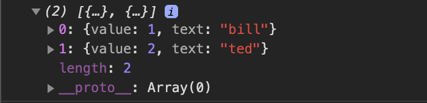

# ES6

### ECMAScript 6 - ES6 (ES2015)

Llegó la hora de entender qué es esto que tanto repetimos, ¿qué es ES6?

En resumidas cuentas, a partir del año 2015, con este nuevo estándar, Javascript evoluciona a un lenguaje de programación moderno, con numerosas estructuras y funcionalidades nuevas. Todo ello vino para enriquecer el lenguaje, aunque lo malo fue que todavía existen navegadores que NO son capaces de entender estas nuevas `features` (por ello existen Babel o Webpack).

A continuación detallaremos algunas de estas nuevas implementaciones, no obstante, ya sabéis que existe multitud de [documentación](https://www.w3schools.com/js/js_es6.asp) complementaria para investigar sobre el tema.

### ES6: let

Con la aparición de `let` (ES6) podemos definir las variables dentro de un ámbito más restrictivo.

Veíamos que `var` restringe su ámbito a la función en la que se encuentra. Si no tiene función será global. Sin embargo `let` restringe su ámbito a las llaves en las que está definido. Ya sea un `if`, un `for`, un `while`, una `función`...

Se puede decir que `let` es más **restrictivo**, más seguro y al liberar su memoria antes, también es más eficiente.

```jsx
var variableVar = "Soy un VAR";
let variableLet = "Soy un LET";
if(true) {
   var variableVar = "Nuevo valor de VAR";
   let variableLet = "Nuevo valor de LET";
}
console.log(variableVar); 
// Nuevo valor de VAR 
console.log(variableLet); 
// Soy un LET
```

### ES6: const

El `const` es muy parecido al `let`, con una diferencia fundamental: no puedes **re-asignar** su valor.

```jsx
function explainConst(){
  const x = 10;
  console.log(x); // output 10
}
```

¿Qué pasa si tratamos de re asignar la variable `const`?

```jsx
function explainConst(){
  const x = 10;
  console.log(x); // output 10
  x = 20; //throws type error
  console.log(x);
}
```

La consola mostrara un error cuando tratemos de **re-asignar** el valor de una variable `const`*.*

### ES6: String Literals (o Template Literals)

Las plantillas literales se delimitan con el carácter de comillas o tildes invertidas (```), en lugar de las comillas sencillas o dobles. Permiten combinar variables de Javascript dentro de cadenas de texto.

```jsx
const edad = 33;
const str = `Hola, tengo ${edad} años`;

// También me permite meter 'saltos de linea' en un bloque de texto
const divNodeText = `
  <div>
    <p>Hola chicos</p>
  </div>
`;
```

### ES6: Arrow functions

Después de esto toca explicar la nueva manera de declarar funciones, las **arrow functions** (funciones flecha); es una manera de clarar **funciones** más **compacta** y además nos ayudará a **ententer** mejor los problemas del `scope`. 

Al ver la sintaxis, ya no hace falta escribir la palabra `function`, lo sustituimos por la fecha `=>`:

```jsx
const getName = () => {
  console.log('Delviendo nombre');
  return 'Carlos';
};
const name = getName();
console.log(name);

// Ejemplo inline (omitiendo el return)
const getSurname = () => 'Martín';
const surname = getSurname();
console.log(surname);
```

En el siguiente ejemplo, la función nos devuelve un mensaje 'hola mundo' sin la necesidad de tener un return.

```jsx
const helloWorld = () => 'hola mundo';
const hello = helloWorld();

console.log(hello); 
```

 

En caso de querer o tener que usar un return:

```jsx
const helloWorld = () => {
  const messageToWorld = 'hello world';
  return messageToWorld;
}
```

> Nota: En el caso de querer devolver un `object` inline, la sintaxis deberá ser la siguiente:
> 

```jsx
const myObjt = () => ({ atribute: 'atribute', atribute: 'atribute' });
```

### **Argumentos en las arrow functions**

Como ya sabéis en las funciones pueden entrar parámetros que indiquen los valores con los que vamos a trabajar en el caso de las arrow functions:

```jsx
const multiTwo = x => x * 2;

const result = multiTwo(3); 
```

En el **resto** de **casos** sí que necesitaremos especificar los **paréntesis**:

```jsx
const multi = (a, b) => a * b;

const multiplication = multi(2, 2); 
```

Existe la opción de tener valores por defecto:

```jsx
// b siempre será 3

const multiDefault = (a, b = 3) => a * b;

const operation = multiDefault(2); 
```

### Arrow function as High Order function

Las ***arrow functions*** también nos permiten simplificar la forma en que trabajamos con *high order functions*. Podemos simplificar mucho el hecho de trabajar con funciones que devuelven funciones, gracias a las arrows. Por ejemplo:

```jsx
const generateAMultiplier = function(a) {
  return function(b) {
    return b * a;
  }
};

const multiplier = generateAMultiplier(5);

const foo = multiplier(10); 

// Devuelve - 50
```

Este tipo de declaraciones que empleando la sintaxis “antigua” quedan muy largas, con las arrow functions se simplifican enormemente:

```jsx
const generateAMultiplier = a => b => a * b;

const multiplier = generateAMultiplier(5);

const foo = multiplier(10);

// Devuelve - 50
```

### **Limitaciones de las arrow functions**

Sin embargo, las *arrow functions* tienen algunas limitaciones.

- **No podemos emplearlas para construir objetos.** Por tanto, si intentamos algo de este estilo:

```jsx
const MyClass = () => {};
const object = new MyClass();
```

Obtendremos un precioso `TypeError` .

- **No pueden ser usadas como funciones generadoras.** Las ***arrow functions*** no admiten la palabra `yield` dentro de su cuerpo, por lo que si queremos crear una función generadora deberemos seguir recurriendo a la forma habitual: `function` ****.

- **El método call y apply es ignorado.** Los métodos `call` o `apply` nos permiten modificar el valor de `this` dentro de una función.

> En general, el valor de **`this`** está determinado por cómo se invoca a la función. No puede ser establecido mediante una asignación en tiempo de ejecución, y puede ser diferente cada vez que la función es invocada. Las arrow functions no proporcionan su propio "binding" de **`this`** (se mantiene el valor de `this` del contexto léxico que envuelve a la función).
> 

### ES6: Object Destructuring

El destructuring me permite extraer de manera rápida ciertos valores de un objeto. Veamoslo en un ejemplo.

```jsx
let marvelCharacter = {
  name: {
    heroName: 'Doctor Strange',
    humanName: 'Stephen Vincent Strange'
  },
  team: ['Avengers', 'Iluminati']
}

// Destructuring - Ex1
let { name, team } = marvelCharacter;

// Podemos acceder a las propiedades sin el marvelCharacter -> ya asignado.
console.log(name.heroName, name.humanName);
console.log(team[0], team[1]);

// Destructuring - Ex2
let { heroName, humanName } = marvelCharacter.name;

console.log(heroName);
console.log(humanName);
```

### ES6: Spread Operator

El operador de propagación spread operator permite que una expresión **sea expandida** en situaciones donde se esperan múltiples argumentos (llamadas a funciones) o múltiples elementos (arrays literales).

```jsx
let xmen = ['Ciclops', 'Beast', 'Angel', 'Marvel-girl'];
let newXmen = ['Wolverine', 'NightCrawler', 'Storm'];

// Antes se usaba el concat y ahora ...
let myMutants = [...xmen, ...newXmen];

// Se puede usar también para copiar un array
let xmenCopy = [...xmen];

// se usa para jugar con tu array sin modificarlo
let [lastMutant] = [...xmen].reverse();

// No se ha modificado
console.log(xmen);
console.log(lastMutant)
```

```jsx
// Spreed Operator in Parameters
function suma(a, b, c) {
  return a + b + c;
}

const numbers = [1, 2, 3];

suma(...numbers);
// Spreed Operator in Parameters

// Spreed Operator in Strings
const myTeam = 'RAYO';
const characters = [ ...myTeam ];
// [ 'R', 'A', 'Y', 'O']
// Spreed Operator in Strings

// Spreed Operator in Object
const obj1 = { firstName: 'Foo', age: 22 };
const obj2 = { lastName: 'Bar', gender: 'M' };

const newObj = { ...obj1, ...obj2, planet: 'Earth' };

console.log(newObj);
// Spreed Operator in Object
```

```jsx
// Destructuring with spreed operator
const details = {
    firstName: 'Code',
    lastName: 'Burst',
    age: 22
};
// Saca el valor 22 y deja el resto de atributos
const { age, ...restOfTheDetails } = details;
console.log(age, restOfTheDetails);
// 22 { firstName: 'Code', lastName: 'Burst' }
```

### ES6: Import / Export

La declaración export se utiliza al crear módulos de JavaScript para exportar funciones, objetos o tipos de dato primitivos del módulo para que puedan ser utilizados por otros programas con la sentencia import.

```jsx
export { name1, name2, …, nameN };
export { variable1 as name1, variable2 as name2, …, nameN };
export let name1, name2, …, nameN; // también var
export let name1 = …, name2 = …, …, nameN; // también var, const
export function FunctionName() {...}

import * from …;
import { name1, name2, …, nameN } from …;
import { import1 as name1, import2 as name2, …, nameN } from …;
import { default } from …;
```

### Métodos de Array

Un **array** es un tipo de **variable** que nos permite **agrupar** un conjunto de **variables**. Los arrays se definen indicando el conjunto de variables que queremos almacenar entre corchetes. Por ejemplo, vamos a definir un array con un cartel de festival:

```jsx
let bbkLive = [ "Belako", "Vetusta", "Pulp", "Greta Van Fleet" ];
```

Para **acceder** a un **elemento concreto del array** se puede hacer mediante el índice de la posición que ocupa indicado entre corchetes ***nombreDelArray[posición]***, empezando a contar por el 0.

```jsx
let bbkLive = [ "Belako", "Vetusta", "Pulp", "Greta Van Fleet" ]; 
console.log("El primer grupo es: " + bbkLive[0]); 
console.log("El tercer grupo es: " + bbkLive[2]);
```

### Arrays: recorrido con for

Una **propiedad** muy útil de los **arrays** es “***length***”. Mediante length podemos **conocer la longitud** del array, lo cual combinado con un bucle “for” nos permite recorrer todas sus posiciones:

```jsx
let bbkLive = [ "Belako", "Vetusta", "Pulp", "Greta Van Fleet" ]; 

for(var indice = 0; indice < bbkLive.length; indice++) {
  console.log("El grupo número " + indice + " es " + bbkLive[indice]); 
}
```

Esto nos imprimirá cada uno de los elementos del array.

### Arrays: añadiendo elementos

En el ejemplo anterior hemos definido directamente el array con todo su contenido, pero en muchas ocasiones esto no se adaptará a nuestras necesidades. Son muchos los casos en los que debemos **añadir elementos a los arrays de forma dinámica**.

Para ello disponemos de la función “***push***” y la función “***unshift***”. Vamos a ver cómo crear un array vacío y posteriormente añadirle valores. **Push lo añade al final, unshift al principio**.

```jsx
var bbkLive = []; 

bbkLive.push("León Benavente"); 
bbkLive.push("Rusowsky");

console.log(bbkLive);

bbkLive.unshift("Rusowsky");

console.log(bbkLive);
```

### Arrays: eliminando elementos

En caso de que necesitemos **eliminar** un **elemento de un array**, disponemos de las funciones contrarias:

```jsx
var fib = ["Franz Ferdinand", "Artic Monkeys", "Love of lesbian"]; 
var ultimo = fib.pop();
var primero = fib.shift();
console.log(fib);
```

Con la llegada de ES6 no estamos ligados al uso de los bucles for, sino que tenemos alternativas muy interesantes que al menos debemos conocer.

### Programación Funcional → array.map()

Os explicaremos cómo funciona con un ejemplo simple. Supongamos que ha recibido un ***array*** que **contiene varios objetos**, cada uno de los cuales representa a una persona. 

```jsx
// Lo que tenemos 

var officers = [  
  { id: 20, name: 'Captain Piett' },  
  { id: 24, name: 'General Veers' },  
  { id: 56, name: 'Admiral Ozzel' },  
  { id: 88, name: 'Commander Jerjerrod' }
];

// Lo que necesitamos [20, 24, 56, 88]
```

> Hay múltiples formas de lograr esto. Es posible hacerlo creando un array vacío y luego usando .forEach(), .for(... of) o un simple .for() para cumplir su objetivo.
> 

Usando ***.forEach()***:

```jsx
var officersIds = [];

officers.forEach((officer) => {  
  officersIds.push(officer.id);
});
```

Usando ***.map()***:

```jsx
const officersIds = officers.map(officer => [officer.id](http://officer.id/));
```

Entonces, ¿cómo funciona .***map()***? Básicamente  **recibe dos argumentos**, una devolución de llamada y un contexto opcional (se considerará así en la devolución de llamada) que no utilicé en el ejemplo anterior. La devolución de llamada se ejecuta para cada valor en el ***array*** y devuelve cada nuevo valor en el ***array*** resultante.

```jsx
var arr = [{
  id: 1,
  name: 'bill'
}, {
  id: 2,
  name: 'ted'
}]

var result = arr.map(person => ({ value: person.id, text: person.name }));

console.log(result)
```



Tenemos que tener en cuenta que el ***array*** que nos devuelve siempre tendrá la misma longitud que el original. Pero es un ***array*** nuevo, el original no se ha modificado.

### Programación Funcional → array.filter()

¿Qué sucede si tiene una matriz, pero solo quiere algunos de sus elementos? ¡Ahí es donde entra en juego .filter()!

Aquí están nuestros datos:

```jsx
var pilots = [ 
{ id: 2, name: "Wedge Antilles", faction: "Rebels", }, 
{ id: 8, name: "Ciena Ree", faction: "Empire", }, 
{ id: 40, name: "Iden Versio", faction: "Empire", }, 
{ id: 66, name: "Thane Kyrell", faction: "Rebels", }];
```

Digamos que queremos dos conjuntos ahora: uno para los pilotos rebeldes, el otro para los imperiales. ¡Con .filter() no podría ser más fácil!

```jsx
var rebels = pilots.filter(function (pilot) {  
return pilot.faction === "Rebels";});

var empire = pilots.filter(function (pilot) {  
return pilot.faction === "Empire";});
```

¡Eso es! Y es aún más corto con las arrow functions:

```jsx
const rebels = pilots.filter(pilot => pilot.faction === "Rebels");

const empire = pilots.filter(pilot => pilot.faction === "Empire");
```

### Programación Funcional → array.find()

El método find() devuelve el valor del primer elemento del array que cumple la función de prueba proporcionada.

```jsx
const array1 = [5, 12, 8, 130, 44];

const found = array1.find(element => element > 10);

console.log(found);
// expected output: 12
```

### Programación Funcional → array.reduce()

Al igual que ***.map()***, ***.reduce()*** también ejecuta una devolución de llamada para cada elemento de un ***array***. Lo diferente aquí es que **reduce el resultado** de esta devolución de llamada (el acumulador) de un elemento del ***array*** a otro.

> El acumulador puede ser prácticamente cualquier cosa (entero, cadena, objeto, etc.) y debe instanciarse o pasarse al llamar a .reduce().
> 

¡Hora de un ejemplo! Digamos que tienes una ***Array*** con estos pilotos y sus respectivos años de experiencia:

```jsx
var pilots = [ 
  { id: 10, name: "Poe Dameron", years: 14, }, 
  { id: 2, name: "Temmin 'Snap' Wexley", years: 30, }, 
  { id: 41, name: "Tallissan Lintra", years: 16, }, 
  { id: 99, name: "Ello Asty", years: 22, }
];
```

Necesitamos conocer el **total de años de experiencia** de todos ellos. Con **.reduce()**, es bastante sencillo:

```jsx
var totalYears = pilots.reduce(function (accumulator, pilot) { 
return accumulator + pilot.years;}, 0);
```

Tenemos en cuenta que hemos establecido el **valor inicial en 0**. También podría haber usado una variable existente si fuera necesario. Después de ejecutar la devolución de llamada para cada elemento del array, reduce devolverá el valor final de nuestro acumulador (en nuestro caso: 82).

Veamos cómo se puede acortar esto con las funciones de flecha de ES6:

```jsx
const totalYears = pilots.reduce((acc, pilot) => acc + pilot.years, 0);
```

Ahora digamos que quiero encontrar qué piloto es el más experimentado. Para eso, puedo usar .reduce() también:

```jsx
var mostExpPilot = pilots.reduce(function (oldest, pilot) { 
return (oldest.years || 0) > pilot.years ? oldest : pilot;}, {});
```

Llamé a mi acumulador más antiguo. Mi callback de llamada compara el acumulador con cada piloto. Si un piloto tiene más años de experiencia que el más antiguo, entonces ese piloto se convierte en el nuevo más viejo, así que ese es el que esta dentro del return.

Como puedes ver, usar .reduce() es una manera fácil de generar un único valor u objeto a partir de una matriz. 

### Ejemplo final: Combinando .map(), .reduce(), and .filter()

```jsx
var personnel = [ 
  { id: 5, name: "Luke Skywalker", pilotingScore: 98, shootingScore: 56, isForceUser: true, }, 
  { id: 82, name: "Sabine Wren", pilotingScore: 73, shootingScore: 99, isForceUser: false, }, 
  { id: 22, name: "Zeb Orellios", pilotingScore: 20, shootingScore: 59, isForceUser: false, }, 
  { id: 15, name: "Ezra Bridger", pilotingScore: 43, shootingScore: 67, 
  isForceUser: true, }, 
  { id: 11, name: "Caleb Dume", pilotingScore: 71, shootingScore: 85, 
  isForceUser: true, }
];
```

Nuestro objetivo: obtener la puntuación total de los usuarios de la fuerza solamente. ¡Hagámoslo paso a paso!

Primero, necesitamos filtrar al personal que no puede usar la fuerza:

```jsx
var jediPersonnel = personnel.filter(
  function (person) {  
    return person.isForceUser;
  }
);

// Result: [{...}, {...}, {...}] (Luke, Ezra and Caleb)
```

Con eso nos quedan 3 elementos en nuestra matriz resultante. Ahora necesitamos crear una matriz que contenga la puntuación total de cada Jedi.

```jsx
var jediScores = jediPersonnel.map(
  function (jedi) {  
    return jedi.pilotingScore + jedi.shootingScore;
  }
);// Result: [154, 110, 156]
```

Y usemos .reduce() para obtener el total:

```jsx
var totalJediScore = jediScores.reduce(
  function (acc, score) {  
    return acc + score;
  }, 0
); // Result: 420
```

Y ahora esta es la parte divertida ... podemos encadenar todo esto para obtener lo que queremos en una sola línea:

```jsx
var totalJediScore = personnel .filter(function (person) { 
return person.isForceUser; }) .map(function (jedi) { 
return jedi.pilotingScore + jedi.shootingScore; }) .reduce(function (acc, score) { 
return acc + score; }, 0);
```

Y ahora haciendo uso de las arrow functions:

```jsx
const totalJediScore = personnel.filter(person => person.isForceUser)
  .map(jedi => jedi.pilotingScore + jedi.shootingScore)
  .reduce((acc, score) => acc + score, 0);
```

Boom! 💥