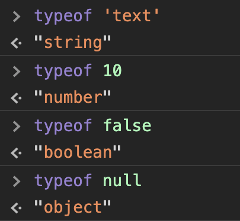
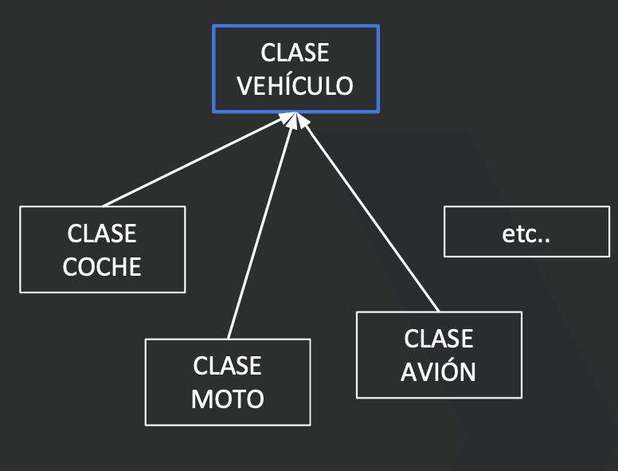

# Js: POO

### Tipos de datos

Aunque JavaScript **no** es un **lenguaje fuertemente tipado**, esto no quiere decir que no existan tipos de datos. Vamos a ver los **tipos primitivos** que existen en JavaScript:

- **String**: Nos permite almacenar cadenas de texto
- **Number**: Nos permite almacenar valores numéricos (tanto enteros como con decimales).
- **Boolean**: Representa un valor lógico: verdadero o falso (true ó false).
- **Null**: Es un tipo especial. Su contenido es “null”.
- **Undefined**: Es una variable cuyo valor aún no se ha definido.
- **Object**: Contiene una referencia a un espacio en la memoria en el que encontramos una colección de propiedades. Lo veremos en detalle más adelante.

JavaScript es un lenguaje dinámico o de tipado débil, ya que no es obligatorio indicar el tipo de una variable al definirlo. De hecho, una misma variable puede cambiar de tipo sin problema alguno durante el proceso de ejecución de nuestro código.

Podemos realizar pruebas haciendo uso de la función `typeof`, la cual nos indicará el tipo de una variable en cada momento.




### Datos dinámicos

JavaScript tiene tipos de datos dinámicos, lo que significa que **la comprobación de tipo se realiza en tiempo de ejecución en lugar de tiempo de compilación**. Con los lenguajes de tipo dinámico, se puede utilizar una variable del mismo nombre para contener diferentes tipos de datos.

Por ejemplo, la variable `t` , definida como una variable por la palabra clave `var` , se puede asignar para contener diferentes tipos de datos o puede inicializarse pero no se define:

```jsx
// t is a string 
var t = "cadena";   
// t is a number 
var t = 6;       
// t is a Boolean 
var t = true;              
// t is undefined 
var t;
```

Cada una de las variables `t` anteriores puede establecerse en cualquier tipo de datos disponible en JavaScript; No es necesario que se declaren explícitamente con un tipo de datos antes de que se utilicen.

### Mezclando tipos de datos

Aunque cada aplicación que creemos contendrá varios tipos de datos, es importante tener en cuenta que generalmente realizará operaciones dentro del mismo tipo de datos. Es decir,  estaremos realizando matemáticas en números, o rebelando cadenas.

Por ejemplo, al usar el operador `+` con números y cadenas juntas, los números se tratarán como una cadena (por lo tanto se concatenarán), pero el orden de los tipos de datos influirá en la concatenación.

Por lo tanto, si creamos una variable que realiza la siguiente concatenación, JavaScript interpretará cada elemento a continuación como una cadena:

```jsx
var o = "Ocean" + 5 + 3;
//Ocean53
```

Sin embargo, si entramos con números, los dos números se agregarán antes de que se interpreten como una cadena cuando el tiempo de ejecución del programa llegue a `"Ocean"` , por lo que el valor devuelto será la suma de los dos números concatenados con la cadena:

```jsx
var p = 5 + 3 + "Ocean";
//8Ocean
```

Debido a estos resultados inesperados, es probable que realice operaciones y métodos dentro de un tipo de datos en lugar de a través de ellos. **JavaScript, no devuelve errores al mezclar tipos de datos, como hacen algunos otros lenguajes de programación**.

### Objetos (mejor que arrays)

Los `arrays` son excelentes para guardar un conjunto de datos del mismo tipo, cuyo índice no tiene relevancia alguna. Sin embargo, si tuviéramos que guardar la información de una persona en un array, probablemente fuera un desastre.

¿Dónde almacenaríamos cada propiedad? ¿Pondríamos el nombre en la posición cero y los apellidos en la 1? ¿Tendríamos que acordarnos de en qué posición está cada propiedad?

Los **`objetos`** nos solventan esta problemática, ya que **cada una de las posiciones o índices, tienen un nombre**. De manera que el nombre de la persona puede ser almacenado en **persona.nombre** y los apellidos en **persona.apellidos** ¿Fácil verdad? Vamos a ponerlo en práctica.

```jsx
// Definimos un objeto con los datos de una persona
var persona = {
  nombre: "Peter",
  apellidos: "Parker",
  pais: "USA",
  profesion: "Student"
};
// Accedemos a sus propiedades
console.log("La persona se llama " + persona.nombre); 
console.log("Y es " + persona.profesion);
```

Cabe destacar la manera en la definimos un objeto. A diferencia de los arrays, debemos
colocar sus elementos entre llaves { } en vez de corchetes [ ] . Los elementos deben tener un nombre o índice que colocamos delante de cada valor y separado de este con dos puntos.

> En el ejemplo anterior hemos accedido a las propiedades mediante la sintaxis ***object.nombrePropiedad***, pero cabe destacar que también podríamos haber usado esta otra sintaxis: ***object[“nombrePropiedad”]***.
> 

Aplicado al ejemplo anterior quedaría de la siguiente manera:

```jsx
// Definimos un objeto con los datos de una persona
var persona = {
  nombre: "Peter",
  apellidos: "Parker",
  pais: "USA",
  profesion: "Student"
}
// Accedemos a sus propiedades
console.log("La persona se llama " + persona['nombre']); 
console.log("Y es " + persona['profesion']);
```

### Arrays de objetos

En caso de que los datos que necesitamos tratar sean un listado, siempre es mejor tratar un array de objetos para almacenarlo. Así tenemos toda la potencia de los arrays para manejar el listado, y la potencia de los objetos que acabamos de definir.

```jsx
var personList = [
  {
    name: 'Mario',
    edad: 30
  },
  {
    name: 'Jose',
    edad: 41
  },
  {
    name: 'Alberto',
    edad: 25
  },
];
```

### POO en Javascript

La programación Orientada a Objetos (POO) es una **forma diferente de programar**, más cercana a como **expresaríamos las cosas en la vida real** y no en modo máquina/ordenador.

Hasta ahora hemos hablado de **declarar** (crear) funciones , para luego **ejecutarlas** (usarlas) más tarde. Con la POO vamos a `declarar` (definir) **clases**, para luego `instanciar` (crear) **objetos** más complejos y sofisticados que los objetos que hemos venido utilizando.


Con la POO tenemos que aprender a pensar las cosas de una manera distinta, para escribir nuestros programas en términos de objetos, propiedades, métodos y más cosas que veremos más adelante.

### POO Intro

Pensar en términos de `objetos` es muy parecido a cómo lo haríamos en la vida real. Por ejemplo vamos a pensar en un **coche** para tratar de modelizarlo en un esquema de POO.

Diríamos que el `Coche` **es el elemento principal** que tiene una serie de **características**, como podrían ser el **color, el modelo o la marca**. Además tiene una serie de **funcionalidades** asociadas, como pueden ser **ponerse en marcha, parar o aparcar**.

Pues en un esquema POO el **coche** sería el **objeto**, las **propiedades/atributos** serían las características como el **color o el modelo** y los **métodos/funciones** serían las **funcionalidades asociadas** como ponerse en marcha o parar.

En este bloque detallaremos los primeros conceptos en un sistema orientado a POO, como son objetos, clases y herencia:


Recursos adicionales: 

[Introducción a JavaScript orientado a objetos](https://developer.mozilla.org/es/docs/Web/JavaScript/Introducci%C3%B3n_a_JavaScript_orientado_a_objetos)

### POO - ¿Qué son las Clases?

**Las clases son `instanciaciones de objetos`**, también se podrían definir como abstracciones de objetos. Esto quiere decir que la definición de un objeto es la clase. **Cuando programamos un objeto y definimos sus características y funcionalidades en realidad lo que estamos haciendo es programar una clase**.

**Propiedades en clases**

Las `propiedades o atributos` son las características de los objetos. Cuando definimos **una propiedad normalmente especificamos su nombre y su tipo**. Nos podemos hacer a la idea de que las propiedades son algo así como variables donde almacenamos datos relacionados con los objetos.

**Métodos en las clases**

**Son las `funcionalidades` asociadas a los objetos**. Cuando estamos programando las clases, las denominaremos `métodos`. Los métodos son funciones que están asociadas a un objeto.


### POO - ¿Qué son los Objetos?

Los **objetos** son ejemplares o **`instancias` de una clase cualquiera**. Cuando creamos una instancia
tenemos que especificar la clase a partir de la cual se creará. Esta acción de **crear un objeto a partir
de una clase se llama `instanciar`** (viene de una mala traducción de la palabra `instace` que en
inglés significa **ejemplar**).

> Por ejemplo, **un objeto de la clase coche es** por ejemplo un **Peugeot**. El concepto o definición del coche sería la clase, pero cuando ya estamos hablando de un coche en concreto, le llamamos objeto o instancia.
> 

```jsx
Coche -> Clase
   Características: Marca, Color, Tipo, Precio, Puertas.
   Acciones: Acelerar, Frenar, Encender, Apagar.

Animal -> Clase
   Características: Nombre, Especie, Color, Edad.
   Acciones: Comer, Dormir, Correr.

Audi -> Instancia(Coche)
Gato -> Instancia(Animal)
```


> Con la llegada de la nueva versión del estándar de JavaScript (ECMAScript 6 o ECMAScript 2015) la definición de una función como clase ha cambiado. Antes existían los **`prototypes`** pero ya han caído en desuso.
> 

**ES6** aporta lo que es conocido como azúcar sintáctico, para **declarar una clase** como en la mayoría de los lenguajes de programación orientados a objetos.

```jsx
class Animal {
  constructor(nombre, sonido) {
    this.nombre = nombre;
    this.sonido = sonido;
  }

  emitirSonido() {
    console.log(`El ${this.nombre} hace ${this.sonido}`);
  }
}

var miPerro = new Animal('Perro', 'Guau!');
var miGato = new Animal('Gato', 'Miau!');
miPerro.emitirSonido(); // El Perro hace Guau!
miGato.emitirSonido(); // El Gato hace Miau!
```

Gracias a la palabra reservada `new`, podremos crear nuevas instancias de las clases. El método que se invoca es el `constructor`, encargado de enlazar los atributos de la clase.

### POO herencia

La herencia es específica de la programación orientada a objetos, donde **una clase nueva se crea a partir de una clase existente**.

La `herencia` (a la que habitualmente se denomina subclase) proviene del hecho de que la subclase (la nueva clase creada) contiene las atributos y métodos de la clase primaria. La principal ventaja de la herencia es la capacidad para definir atributos y métodos nuevos para la subclase, que luego se aplican a los atributos y métodos heredados.



Gracias a esta nueva sintaxis podemos realizar herencia de una manera más sencilla, ya que **disponemos de `extends` para indicar que una clase hereda de otra**. También podemos hacer uso de super para llamar al constructor de la clase heredada.

Veamos un ejemplo con vehículos. Empezamos definiendo la **clase padre**:

```jsx
class Vehiculo {
  constructor(tipo, nombre, ruedas) {
    this.tipo = tipo;
    this.nombre = nombre;
    this.ruedas = ruedas;
  }

  getRuedas() {
    return this.ruedas;
  }

  arrancar() {
    console.log(`Arrancando el ${this.nombre}`);
  }

  aparcar() {
    console.log(`Aparcando el ${this.nombre}`);
  }
}
```

Si quisiéramos heredar de la clase Vehículo para hacer uso de sus métodos deberemos usar **`extends`** para heredarla y **`super` para invocar a su constructor**.

```jsx
class Coche extends Vehiculo { // extiende de Vehiculo
   constructor(nombre, color) {
     super('coche', nombre, 4); // ejecuta el constructor del padre
     this.color = color;
   }
}
```

De esta manera podremos **hacer uso de los métodos del padre**:

```jsx
var beetle = new Coche('Volkswagen Beetle', 'Rojo'); 
var numRuedas = beetle.getRuedas() // 4
var color = beetle.color;
beetle.arrancar() // Arrancando el beetle
```

Igualmente podemos declarar motos:

```jsx
class Moto extends Vehiculo { // extiende de Vehiculo
   constructor(nombre, isSidecar = false) {
     super('moto', nombre, 2); // ejecuta el constructor del padre
     this.isSidecar = isSidecar;
   }

   tieneSidecar() {
     return this.isSidecar;
   }
}
```

E instanciarlas:

```jsx
var vespa = new Moto('Vespa');
console.log(vespa.tieneSidecar());
```

### POO métodos estáticos

**La palabra `static`** sirve para definir métodos “estáticos” de una clase. Los métodos estáticos tienen una importante peculiaridad:

> Pueden ser llamados sin necesidad de crear una instancia de esa clase
> 

Generalmente creamos métodos estáticos para hacer `utilidades` de nuestra aplicación. Por ejemplo calcularEdad:

```jsx
class Utilidades {
  constructor() { }

  static calcularEdad(fechaNacimiento) {
    const hoy = new Date();
    let edad = hoy.getFullYear() - fechaNacimiento.getFullYear();

    if (hoy.getMonth() < fechaNacimiento.getMonth()) {
      edad--;
    }

    if ((fechaNacimiento.getMonth() === hoy.getMonth()) &&
      (hoy.getDate() < fechaNacimiento.getDate())) {
      edad--;
    }

    return edad;
  }

}
let fechaNacimiento = new Date(1991, 5, 8);
let edad = Utilidades.calcularEdad(fechaNacimiento);
console.log(edad); // 28
```

### POO getters y setters

Una manera de **proteger el acceso a ciertas variables** es haciendo uso de **`getters` y `setters`**. Esto nos permitirá controlar qué valores devolvemos o qué valores guardamos:

```jsx
class Coche {
  constructor(marca, potencia) {
    this._marca = marca;
    this._potencia = potencia;
  }

  get marca() {
    return `marca: ${this._marca}`;
  }

  set potencia(value) {
    if (typeof value === 'number') {
      this._potencia = value;
    } else {
      console.error('la potencia debe ser numérica');
    }
  }
}

var ibiza = new Coche('seat', 105);
ibiza.potencia = 'Mucha'; // ERROR: la potencia debe ser numérica
```

### Resumen: POO

 Finalmente vamos a repasar cuales son los principales beneficios de la POO.

Pongamos el caso que tenemos que trabajar con Personas en nuestra lógica de negocio, sin la POO utilizaríamos un código similar a este:

```jsx
function createNewPerson(name) {
  var obj = {};
  obj.name = name;
  obj.greeting = function() {
    alert('Hi! I\'m ' + this.name + '.');
  };
  return obj;
}

var salva = createNewPerson('Salva');
salva.name;
salva.greeting();
```

Pero gracias a POO y a ES6, podemos simplificarlo:

```jsx
class Person {
  constructor(name) {
    this.name = name;
  }
  greeting() {
    alert(`Hi! I\'m ${this.name}.`);
  }
}

var salva = new Person('Salva');
salva.greeting();
```

Y ahora podemos seguir extendiendo la lógica, suponiendo que tenemos que declarar Alumnos:

```jsx
class Alumno extends Person {
  constructor(name, email, bootcamp) {
    super(name);
    this.email = email;
    this.bootcamp = bootcamp;
    this.modoEstudioOn = false;
    this.modoEstudioId = null;
  }

  aprender() {
    this.modoEstudioId = setInterval(() => console.log('estudiar y practicar mucho'), 1000);
  }

  dormir() {
    console.log('A dormir!');
    window.clearInterval(this.modoEstudioId);
  }
}
```

```jsx
const pepe = new Alumno('Pepe', 'pepe@bootcamp.com', 'FRONTEND MAY 2020');

pepe.aprender();

setTimeout(() => pepe.dormir(), 8000);
```

En definitiva, la POO nos va a permitir abstraer mejor la lógica de nuestras aplicaciones web, ya que la programación es la misma que conocíamos hasta ahora, pero podemos acercarnos a entidades más fieles al modelo de negocio que queramos programar.