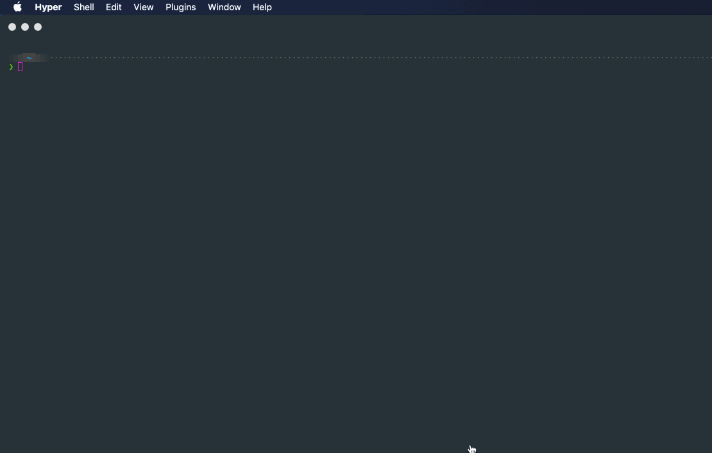
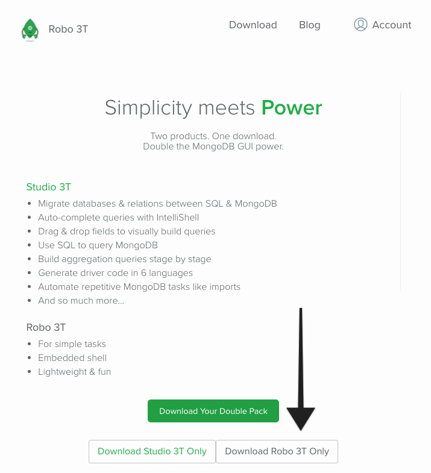
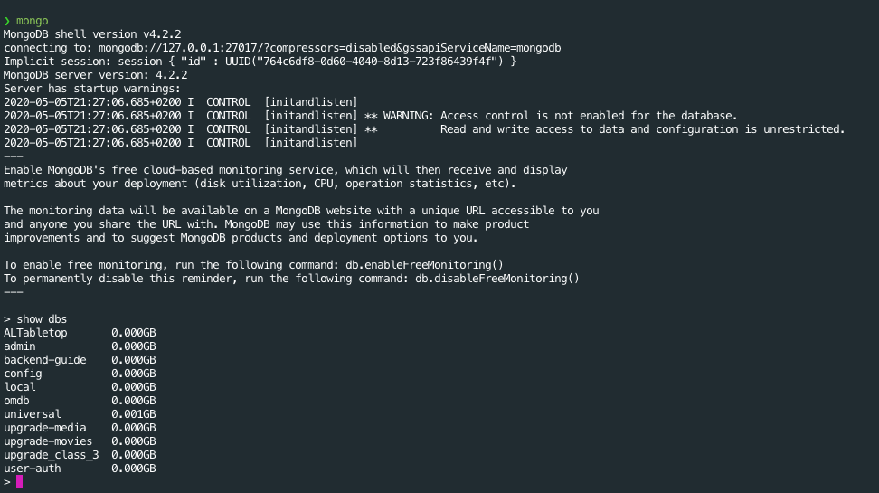
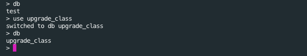

# MongoDB | Parte I

## Después de esta sesión podrás:

1. Conocer y explicar en qué consiste una base de datos no relacional.
2. Crear colecciones y documentos en MongoDB.
3. Insertar y buscar documentos en MongoDB.

## ¿Qué es MongoDB?

**MongoDB es una base de datos no relacional basada en documentos y colecciones de documentos.** Vamos a explicarlo:

Una base de datos **no relacional** o **NoSQL** es aquella que utiliza una gran variedad de modelos a lo largo de todas sus entradas de datos, de forma que no sigue un esquema preestablecido como si hacemos con las bases de datos relacionales.

Esto nos permite ser muy flexibles con la información que almacenamos y por lo tanto, llevar a la realidad la idea de poder almacenar grandes volúmenes de información en una sola entrada de nuestra base de datos, pudiendo leerla con muy baja latencia en comparación a las metodologías tradicionales.

**¿Qué ventajas ofrece utilizar una base de datos NoSQL?**

Este tipo de bases de datos nos permiten lanzarnos a desarrollar de una forma mucho más rápida con respecto a lo que estamos acostumbrados debido a que podemos ir haciendo evolucionar la información almacenada de forma progresiva.

**Destacamos los siguientes puntos favor de este tipo de base de datos:**

- Son muy **FLEXIBLES** gracias a que ofrecen esquemas progresivos con los que podemos iterar sobre la información almacenada hasta que alcancemos el modelado que mejor se adapta a nuestra aplicación.

- Son muy **ESCALABLES** ya que debido a su diseño en clústeres y su capacidad de replicación, podemos replicar varias veces nuestros sistemas para abarcar cargas de información muy elevadas, haciendo que tardemos más en contratar servicios más potentes y caros.

- Tienen un **ALTO RENDIMIENTO** debido a que los patrones de acceso utilizados junto con los modelos de datos generalmente creados.

- Son **MUY FUNCIONALES**  debido a que los modelos utilizados suelen coincidir con el formato de datos utilizados en cada caso.

**¿Qué tipo de base de datos NoSQL usaremos?**

Hay varios tipos de bases de datos NoSQL, pero entre ellas destaca el tipo de base de datos que funciona mediante la creación de **DOCUMENTOS,** como hacemos con MongoDB. ****

Esto conlleva que los datos almacenados en nuestra DB se representen por medio de un objeto {...} o documento de tipo JSON tal y como usamos en nuestro código con JavaScript (y otras tecnologías), de forma que trabajar con estos se convierte en una tarea muy eficiente.

Obtenemos la flexibilidad ofrecida por los objetos de nuestro lenguaje y la capacidad de jerarquizar contenido a través de sus claves, evolucionando según sea necesario.

**Aquí la web oficial de MongoDB: [https://www.mongodb.com/es](https://www.mongodb.com/es)**

## MongoDB soporta ACID  y multiples referencias

Un motivo de crítica muy utilizado en contra de MongoDB en sus inicios era que no cumplía realmente el principio de las transacciones **ACID**, pero hoy en día es agua pasada y las soporta por completo. Vamos a ver que es **ACID**:

- **Atomicity** → La atomicidad conlleva que una transacción dentro de la base de datos, como sacar dinero de una cuenta e insertarlo en otra, se produzca de forma completa sin posibilidad de quedarse a medio camino entre un punto y otro, como por ejemplo un error en el sistema que prevenga que el dinero acabe en la segunda cuenta pero si saliese de la primera. Por tanto, una transacción puede comenzar, estar en proceso y completarse, ya sea satisfactoriamente o con error, pero nunca terminar sin haber cumplido toda la transacción completa.

- **Consistency →** La consistencia conlleva que cada transacción que ocurre en la base de datos debe pasar la información de un estado válido a otro, respetando las normas y las combinaciones establecidas.

- **Isolation →** Las transacciones deben ser completamente independientes unas de otras, y la no consecución de una transacción occurrida al mismo tiempo que otra que sí se ha completado no debe afectar al estado válido de nuestra base de datos.

- **Durability →** La durabilidad en una base de datos implica que una vez una transacción se ha visto completada, el sistema debe mantener esos cambios producidos de forma constante aunque se apague o reinicie la base de datos.

Con respecto al tipo de referencias posibles soportadas por MongoDB, **tenemos relaciones de documentos por incrustación o por referencias.**

- Los documentos relacionados por medio de la incrustación conlleva almacenar su contenido dentro de otro documento, tal y como haríamos con dos objetivos contenidos en JavaScript.
    
    
    ```json
    {
      "_id": "5cf0029caff5056591b0ce7d",
      "firstname": "Juan",
      "lastname": "Pérez",
      "studies": [
        { "title": "Grado en Psicología", "lugar": "Universidad de Burgos" },
        { "title": "Master en Educación", "lugar": "Universidad de Alicante" },
        { "title": "Curso de Terapia Infantil", "lugar": "Universidad de Cádiz" },
      ]
    }
    ```
    

- Los documentos relacionados por medio de referencias conllevan una relación inversa con respecto a la anterior, teniendo en este caso una colección de estudios que contendrán la id de quién los ha completado. Este tipo de relaciones de documentos se emplea en colecciones muy grandes debido a la limitación de espacio en memoria de la tipología anterior.

## Modelado y guardado de datos en MongoDB

La información en MongoDB será almacenada por medio de colecciones y documentos.

Una colección se corresponderá con un conjunto de documentos que siguen un patrón común en la información que almcenan. Por ejemplo, si fuésemos a almacenar todos los estudiantes de Minsait en una colección la llamaríamos `**students`,** siempre en plural y minúsculas. 

Un documento es la forma en que guardamos la información en MongoDB, como por ejemplo, cada estudiante de Minsait sería un documento de la colección **`students`**, teniendo un formato similar como:

```json
{
  "name": "Julia",
  "surname": "García"
} 
```

Pero por la flexibilidad que ofrece MongoDB permite guardar documentos con distinto formato en la colección, como este caso:

```json
{
  "name": "Pedro",
  "surname": "Molina",
  "age": 34
} 
```

Ambos documentos pueden vivir dentro de la misma colección, por lo que podemos iterar de forma constante a lo largo de toda la evolución de nuestro proyecto. No es recomendado mantener un guardado de datos desestructurado de cara al producto final que llevemos a producción, pero esto demuestra la gran velocidad que podemos alcanzar usando MongoDB.

## Ejercicio téorico-práctico en conjunto 🚀

Vamos a separar la clase en tres grupos, teniendo cada grupo asignada la siguiente compañía:

- Grupo 1 → Instagram
- Grupo 2 → Twitter
- Grupo 3 → Youtube

Cada grupo va a crear un esquema completo con la relación entre los distintos modelos de las colecciones de la bases de datos de cada empresa, ya sea de tipo `**1 → n`** o  `**n → 1**`  y va a explicar, por medio de una persona que haga de portavoz, la razón de sus decisiones de modelado.

## Instalando MongoDB en nuestro equipo

Instalaremos la **`Community Edition`** de MongoDB, gratuita y mantenida por la comunidad seguidora de esta base de datos. Como este proceso es distinto para cada sistema operativo, os dejamos aquí los links a los pasos a seguir para cada caso. 

**Para Windows:

[https://docs.mongodb.com/manual/tutorial/install-mongodb-on-windows/](https://docs.mongodb.com/manual/tutorial/install-mongodb-on-windows/)**

**Para macOs:**

[**https://docs.mongodb.com/manual/tutorial/install-mongodb-on-os-x/**](https://docs.mongodb.com/manual/tutorial/install-mongodb-on-os-x/)

**Para Ubuntu/Linux:

[https://docs.mongodb.com/manual/tutorial/install-mongodb-on-ubuntu/](https://docs.mongodb.com/manual/tutorial/install-mongodb-on-ubuntu/)**

Una vez instalado, buscaremos como correr MongoDB como un servicio al final de los pasos de la documentación, y si hemos hecho todo correctamente, lanzaremos el siguiente comando en una terminal:

```bash
mongo
```

Si aparece una interfaz de texto diferente ¡hemos instalado con éxito! Para salir de ella, escribiremos **`exit`** y pulsaremos **`Enter`.**

**GIF entrando al servicio de Mongo para comprobar que está bien instalado:**



## Instalando robomongo Robo 3T

Para poder gestionar correctamente las colecciones y documentos de nuestras bases de datos cuando estemos en un proyecto a mayor escala, vamos a instalar una interfaz visual que usaremos para validar que todo está funcionando correctamente.

Vamos a la web [`**https://robomongo.org/`](https://robomongo.org/)** y descargaremos `**Robo 3T`:**



## Creando nuestra primera colección y documentos

Vamos a comenzar conectándono con nuestra terminal al servicio de Mongo usando:

```bash
mongo
```

Para comprobar las bases de datos que existen en nuestro sistema usaremos el comando:

```bash
show dbs
```

**Aquí un ejemplo de un equipo con un listado de varias bases de datos:**



xSi queremos crear nuestra propia base de datos, como por ejemplo una llamada `**upgrade_class**`, utilizaremos el siguiente comando:

```bash
use upgrade_class
```

Para comprobar qué base de datos estamos usando, lanzaremos el comando:

```bash
db
```

Un ejemplo en el que teníamos activa la base de datos `**test**` y ahora pasamos a `**upgrade_class`:**



Ahora que tenemos una base de datos creada vamos a ver si tiene colecciones almacenadas:

```bash
show collections
```

Ahora mismo no obtendremos un output en consola debido a que no hay colecciones en nuestra base de datos, ¡vamos a crearlas!

Para crear una colección, tenemos que insertar datos en dicha colección aunque no exista previamente. Vamos a crear la colección `**students**` en la que vamos a introducir un documento:

```bash
db.students.insert({
  firstName: "Gustavo",
  lastName: "Aznar",
  age: 24
})
```

La consola nos mostrará lo siguiente si se han creado la colección y el documento correctamente:

```bash
WriteResult({ "nInserted" : 1 })
```

Y si ahora mostramos las colección existentes, aparecerá lo siguiente:

```bash
> db
upgrade_class
> show collections
> db.students.insert({
... firstName: "Gustavo",
... lastName: "Aznar",
... age: 24
... })
WriteResult({ "nInserted" : 1 })
> show collections
students
>
```

**¡Ya tenemos lista nuestra primera coleccción! 🎉**

### Definiendo las necesidades de nuestra base de datos

Como vamos a guardar documentos que representen a nuestros estudiantes de Minsait, definiremos un modelo acorde antes de trabajar. Esto se debe a que a pesar de la flexibilidad ofrecida por MongoDB, siempre debemos seguir un esquema o modelo base para no acabar con una cantidad de datos desestructurados en el largo plazo:

```json
{
  "firstName": String,
  "lastName": String,
  "age": Number,
  "bootcamp": String,
}
```

Vamos a crear una nueva base de datos que haremos evolucionar en los siguientes ejercicios a la que llamaremos `**upgrade_hub`.** Para ello simplemente lanzaremos el comando **`use upgrade_hub`** y podremos proceder a insertar el primer estudiante que cumple con el modelo que hemos establecido:

```bash
db.students.insert({
  firstName: "María",
  lastName: "Fernández",
  age: 30,
  bootcamp: "Full Stack Web Development"
})
```

Ahora que hemos insertado nuestra primera alumna en la colección, vamos a ver si se ha creado la colección con el comando:

```bash
show collections
```

Aparecerá `**students**` como output, por lo que hemos conseguido creado nuestra colección 👏

Pero hasta el momento, hemos introducido documentos a mano directamente en nuestras queries a la DB, ¿sabías que podemos deinir variables en la terminal y utilizarlas?

```bash
student1 = {
  firstName: "Jose",
  lastName: "López",
  age: 32,
  bootcamp: "Frontend Development"
}
```

Y ahora podemos introducirlo en nuestra base de datos usando el siguiente comando:

```bash
db.students.insert(student1)
```

¡Con esto hemos introducido un alumno en la colección por medio de una variable! Se abre un mundo de posibilidades, ya que ahora podemos definir cada estudiante en una nueva variable y utilizarlas.

```bash
student1 = {
  firstName: "Felipe",
  lastName: "García",
  age: 22,
  bootcamp: "Frontend Development"
}

student2 = {
  firstName: "Luisa",
  lastName: "Molina",
  age: 28,
  bootcamp: "Full Stack Web Development"
}

student3 = {
  firstName: "Juanjo",
  lastName: "Gómez",
  age: 34,
  bootcamp: "UX Design"
}
```

Ahora podemos insertar todos juntos utilizando la misma función que utilizamos previamente:

```bash
db.students.insert([student1, student2, student3])
```

**¡Con esto hemos añadido tres estudiantes al mismo tiempo en nuestra base de datos! 🎉**

## Insertando documentos desde archivos

En vez de crear los elementos a mano en nuestra terminal deberíamos encontrar una forma más práctica de insertarlos, esto lo conseguiremos a través de archivos JSON.

Vamos a comenzar creando un archivo `**students.json**` en nuestro equipo, e introduciremos el siguiente contenido:

```json
[
  {
    "firstName": "Frodo",
    "lastName": "Bolsón",
    "age": 24,
    "bootcamp": "UX Design"
  },
  {
    "firstName": "Gandalf",
    "lastName": "el Blanco",
    "age": 52,
    "bootcamp": "Full Stack Web Development"
  },
  {
    "firstName": "Legolas",
    "lastName": "Hojaverde",
    "age": 32,
    "bootcamp": "Full Stack Web Development"
  },
  {
    "firstName": "Arwen",
    "lastName": "Undómiel",
    "age": 46,
    "bootcamp": "Frontend Development"
  }
]
```

Ahora tan solo tenemos que abrir una nueva ventana de terminal, sin abrir MongoDB, y lanzar el comando:

```bash
mongoimport --db upgrade_hub --collection students --file PATH --jsonArray                                         ─╯
```

Si lanzamos este comando nos encontraremos el siguiente output:


¡Con esto habremos importado un archivo JSON correctamente! ☘️ Aunque ahora deberíamos de aprender a leer archivos de nuestra base de datos, ¡vamos con ello!

## Leyendo y buscando documentos en nuestra DB

Para buscar un elemento en la base de datos, abriremos nuestra Mongo Shell con el comando `**mongo**` y utilizaremos la base de datos que estamos empleando en este ejercicio, `**upgrade_hub`.**

Ahora lanzaremos el siguiente comando:

```bash
db.students.find()
```

Y veremos un output en nuestra terminal como este:

```bash
> db.students.find()
{ "_id" : ObjectId("5eb47d852e5187b94eb5fe2c"), "firstName" : "María", "lastName" : "Fernández", "age" : 30, "bootcamp" : "Full Stack Web Development" }
{ "_id" : ObjectId("5eb47f232e5187b94eb5fe2d"), "firstName" : "Jose", "lastName" : "López", "age" : 32, "bootcamp" : "Frontend Development" }
{ "_id" : ObjectId("5eb489f72e5187b94eb5fe2e"), "firstName" : "Felipe", "lastName" : "García", "age" : 22, "bootcamp" : "Frontend Development" }
{ "_id" : ObjectId("5eb489f72e5187b94eb5fe2f"), "firstName" : "Luisa", "lastName" : "Molina", "age" : 28, "bootcamp" : "Full Stack Web Development" }
{ "_id" : ObjectId("5eb489f72e5187b94eb5fe30"), "firstName" : "Juanjo", "lastName" : "Gómez", "age" : 34, "bootcamp" : "UX Design" }
{ "_id" : ObjectId("5eb48d6d6b30476d4817fb1b"), "firstName" : "Gandalf", "lastName" : "el Blanco", "age" : 52, "bootcamp" : "Full Stack Web Development" }
{ "_id" : ObjectId("5eb48d6d6b30476d4817fb1c"), "firstName" : "Arwen", "lastName" : "Undómiel", "age" : 46, "bootcamp" : "Frontend Development" }
{ "_id" : ObjectId("5eb48d6d6b30476d4817fb1d"), "firstName" : "Legolas", "lastName" : "Hojaverde", "age" : 32, "bootcamp" : "Full Stack Web Development" }
{ "_id" : ObjectId("5eb48d6d6b30476d4817fb1e"), "firstName" : "Frodo", "lastName" : "Bolsón", "age" : 24, "bootcamp" : "UX Design" }
```

Con este comando podremos buscar todos los elementos que existen en una colección de la DB, aunque no están formateados, usaremos el comando de esta forma para solucionarlo:

```bash
db.students.find().pretty()
```

¡Y ahora podremos ver el contenido de forma adecuada!

```bash
> db.students.find().pretty()
{
        "_id" : ObjectId("5eb47d852e5187b94eb5fe2c"),
        "firstName" : "María",
        "lastName" : "Fernández",
        "age" : 30,
        "bootcamp" : "Full Stack Web Development"
}
{
        "_id" : ObjectId("5eb47f232e5187b94eb5fe2d"),
        "firstName" : "Jose",
        "lastName" : "López",
        "age" : 32,
        "bootcamp" : "Frontend Development"
}
...
```

Ahora vamos a intentar recuperar un elemento por un campo en especial, vamos a copiar la `**_id**` de uno de los documentos de la colección y lanzaremos el comando:

```bash
db.students.find({ _id: ObjectId("5eb47d852e5187b94eb5fe2c") }).pretty()
```

Y obtenedremos en consola el resultado correspondiente al alumno con dicha `**_id`:**

```bash
{
  "_id" : ObjectId("5eb47d852e5187b94eb5fe2c"),
  "firstName" : "María",
  "lastName" : "Fernández",
  "age" : 30,
  "bootcamp" : "Full Stack Web Development"
}
```

También podemos filtrar los campos que queremos obtener utilizando un segundo parámetro en la búsqueda, como haremos en el siguiente comando:

```bash
db.students.find(
  { _id: ObjectId("5eb47d852e5187b94eb5fe2c") },
  { firstName: 1, bootcamp: 1 }
).pretty()
```

Y obtendremos entonces el siguiente output, que no presenta el resto de campos que no tienen el valor `**1**` asignado:

```bash
{
  "_id" : ObjectId("5eb47d852e5187b94eb5fe2c"),
  "firstName" : "María",
  "bootcamp" : "Full Stack Web Development"
}
```

- **¡Nota! Podemos añadir el resultado de un `find` a una variable dentro de la shell de mongo.**

## Buscando elementos y estableciendo condiciones

Si después de aprender a buscar elementos queremos filtrarlos de alguna forma, necesitaremos aplicar nuevas funciones de MongoDB que no conocíamos, ¡vamos a aprenderlas! 💪

Vamos a empezar con un caso práctico muy común como por ejemplo, buscar documentos dado el nombre de nuestros estudiantes. 

Vamos a buscar todos los estudiantes cuyo nombre empiece por `**J` o `j`**:

```bash
db.students.find(
  { firstName: { $regex: "^j", $options: "i" } },
  { firstName: 1, bootcamp: 1 }
).pretty()
```

Y veremos que tenemos un resultado que corresponde a este caso:

```bash
{
        "_id" : ObjectId("5eb47f232e5187b94eb5fe2d"),
        "firstName" : "Jose",
        "bootcamp" : "Frontend Development"
}
{
        "_id" : ObjectId("5eb489f72e5187b94eb5fe30"),
        "firstName" : "Juanjo",
        "bootcamp" : "UX Design"
}
```

**¡Vamos a probar con distintas expresiones regulares en clase para encontrar documentos!**

También podemos buscar por comparación numérica utilizando las opciones `**$gt**` y `**$lt`,** vamos a practicar con varios casos:

- Buscaremos todos los estudiantes mayores de 30 años:

```bash
db.students.find(
  { age: { $gt: 30 } },
  { firstName: 1, age: 1, bootcamp: 1 }
).pretty()
```

- Buscaremos todos los estudiantes menores de 30 años:

```bash
db.students.find(
  { age: { $lt: 30 } },
  { firstName: 1, age: 1, bootcamp: 1 }
).pretty()
```

### Combinando distintas condiciones

En JavaScript utilizamos siempre condiciones mediante `**AND**` o `**OR**` por lo que debería funcionar también en MongoDB, ¡vamos a utilizarlos!

Vamos a buscar en la base de datos todos los alumnos que estudien el bootcamp `**Full Stack Web Development**` y **(AND)** tengan más de 30 años:

```bash
db.students.find(
  {
    $and: [
      { bootcamp: "Full Stack Web Development" }, 
      { age: { $gt: 30 } },
    ]
  },
  { firstName: 1, age: 1, bootcamp: 1 }
).pretty()
```

Tendremos entonces este resultado en nuestra terminal, cumpliendo las condiciones dadas:

```bash
{
  "_id" : ObjectId("5eb48d6d6b30476d4817fb1b"),
  "firstName" : "Gandalf",
  "age" : 52,
  "bootcamp" : "Full Stack Web Development"
}
{
  "_id" : ObjectId("5eb48d6d6b30476d4817fb1d"),
  "firstName" : "Legolas",
  "age" : 32,
  "bootcamp" : "Full Stack Web Development"
}
```

Podemos observar que en el array `**$and**` hemos colocado cada condición por separado dado lo que estábamos buscando.

Ahora vamos a cambiar el criterio de búsqueda, buscando entonces todos los estudiantes que estudien en `**Frontend Development**` o **(OR)** tengan menos de 25 años:

```bash
db.students.find(
  {
    $or: [
      { bootcamp: "Frontend Development" }, 
      { age: { $lt: 25 } },
    ]
  },
  { firstName: 1, age: 1, bootcamp: 1 }
).pretty()
```

Obtendremos un resultado que cumple la condición que hemos dado:

```bash
{
        "_id" : ObjectId("5eb47f232e5187b94eb5fe2d"),
        "firstName" : "Jose",
        "age" : 32,
        "bootcamp" : "Frontend Development"
}
{
        "_id" : ObjectId("5eb489f72e5187b94eb5fe2e"),
        "firstName" : "Felipe",
        "age" : 22,
        "bootcamp" : "Frontend Development"
}
{
        "_id" : ObjectId("5eb48d6d6b30476d4817fb1c"),
        "firstName" : "Arwen",
        "age" : 46,
        "bootcamp" : "Frontend Development"
}
{
        "_id" : ObjectId("5eb48d6d6b30476d4817fb1e"),
        "firstName" : "Frodo",
        "age" : 24,
        "bootcamp" : "UX Design"
}
```

¡Lo tenemos! Podemos buscar conjuntos de elementos con una serie de condiciones dadas y filtarlos según lo necesitemos 🚀

## Añadiendo opciones a nuestra búsqueda

Si quisiésemos ordenar los elementos de nuestra última búsqueda por su edad de forma descendente podemos añadir una opción a nuestra query con:

```bash
.sort({ age: -1 })
```

Por lo que nuestra query querdaría de la siguiente forma:

```bash
db.students.find(
  {
    $or: [
      { bootcamp: "Frontend Development" }, 
      { age: { $lt: 25 } },
    ]
  },
  { age: 1, bootcamp: 1 }
).sort({ age: -1 }).pretty()
```

En cambio, si quisiésemos ordenarlos de forma ascendente solamente tendríamos que utilizar el valor `**1**` en vez del valor `**-1**` para nuestro `**sort**`.

```bash
db.students.find(
  {
    $or: [
      { bootcamp: "Frontend Development" }, 
      { age: { $lt: 25 } },
    ]
  },
  { age: 1, bootcamp: 1 }
).sort({ age: 1 }).pretty()
```

Ahora que sabemos ordenar los datos, podemos limitar también la búsqueda a tantos elementos como queramos, en nuestro caso vamos a reducirla a **dos** **documentos** utilizando el comando `**.limit()**`:

```bash
db.students.find(
  {
    $or: [
      { bootcamp: "Frontend Development" }, 
      { age: { $lt: 25 } },
    ]
  },
  { age: 1, bootcamp: 1 }
).sort({ age: 1 })**.limit(2)**.pretty()
```

¡Tenemos los resultados limitados tal y como indicamos!

```bash
{
  "_id" : ObjectId("5eb489f72e5187b94eb5fe2e"),
  "age" : 22,
  "bootcamp" : "Frontend Development"
}
{
  "_id" : ObjectId("5eb48d6d6b30476d4817fb1e"),
  "age" : 24,
  "bootcamp" : "UX Design"
}
```

Por último, vamos a conseguir que nuestra información se muestre en forma de Array, porque hasta el momento tan solo hemos mostrado los documentos como objetos independientes. Esto lo conseguiremos con el comando `**.toArray()**`:

```bash
db.students.find(
  {
    $or: [
      { bootcamp: "Frontend Development" }, 
      { age: { $lt: 25 } },
    ]
  },
  { age: 1, bootcamp: 1 }
).sort({ age: 1 }).limit(2)**.toArray()**
```

Como puedes observar, hemos eliminado el comando `**.pretty()**` de nuestra query debido a que el array ya muestra correctamente la información directamente:

```bash
[
  {
          "_id" : ObjectId("5eb489f72e5187b94eb5fe2e"),
          "age" : 22,
          "bootcamp" : "Frontend Development"
  },
  {
          "_id" : ObjectId("5eb48d6d6b30476d4817fb1e"),
          "age" : 24,
          "bootcamp" : "UX Design"
  }
]
```

**Con esto acabaremos la primera sesión de MongoDB. 🎉 Hemos aprendido:**

- Qué es MongoDB y cómo funciona.
- Modelado de colecciones y relaciones en MongoDB.
- Insertar documentos en una colección y base de datos.
- Insertar documentos desde un archivo JSON.
- Buscar documentos en nuestra base datos.
- Buscar documentos en la DB dado el valor de sus campos.
- Configurar la búsqueda de documentos que realicemos con condiciones especiales.