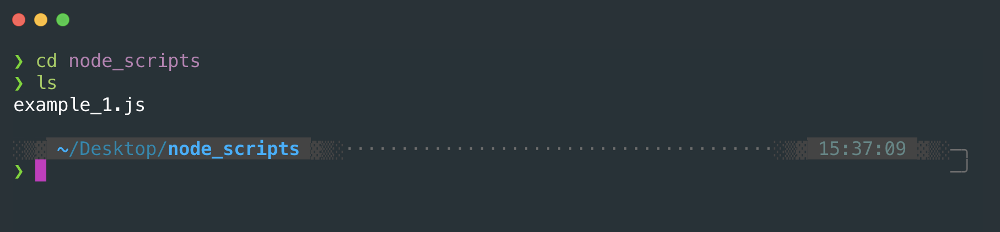
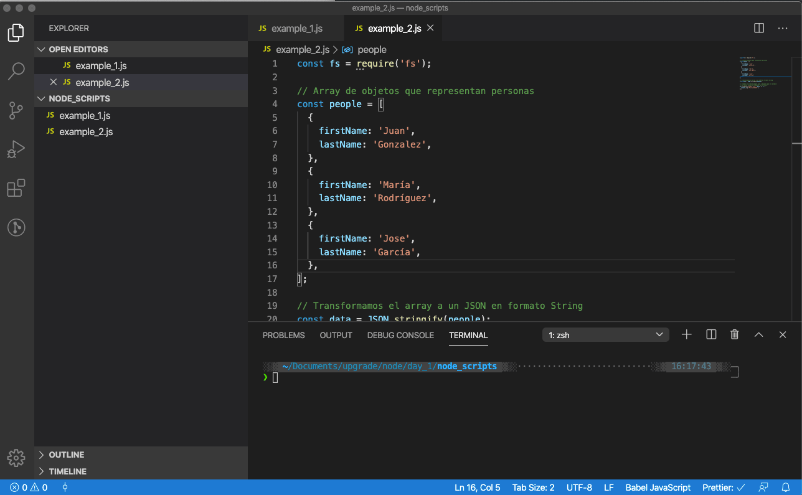

# Node S1 | Filesystem & routing

## Después de esta lección podrás:

1. Entender para qué sirve Node y que es un servidor.
2. Lanzar tus propios scripts locales en tu equipo para procesar datos.
3. Preparar tu entorno para crear tu propio servidor en Node.js.

## ¿Qué es Node.js? JavaScript en el servidor

¿Recuerdas que instalamos Node.js cuando estábamos realizando el Prework? Estábamos preparando tu equipo para este momento ⏰

Describimos Node.js como un **entorno de ejecución para JavaScript construido con el motor JavaScript v8 de Chrome.**

¿Qué significa esto? Esta definición quiere decir que, al igual que Chrome es capaz de hacer funcionar el código JavaScript que importamos en nuestros archivos HTML a través de su motor de JavaScript (conocido como v8), el equipo a cargo de Node.js ha conseguido hacer que nuestro sistema operativo pueda hacer funcionar JavaScript de la misma manera directamente sin usar un navegador aplicando este mismo motor.

**¡Vamos a probar con un script!** 

Para la clase de hoy, crearemos una carpeta en la que iremos añadiendo archivos **.js** para ir probando distintas funcionalidades, la llamaremos **node_scripts**, y dentro de esta carpeta crearemos un nuevo archivo **example_1.js**



Dentro del archivo **example_1.js** vamos a escribir el siguiente código:

```jsx
console.log('Hello Minsait!');
```

Si ahora desde la terminal vamos a la carpeta **node_scripts** que contiene nuestro archivo **example_1.js** y escribimos el comando:

```bash
node example_1.js
```

Veremos el siguiente output en consola:


¡Exactamente como lo haría el navegador! La parte buena es que como ahora estamos lanzando estos scripts directamente en nuestro sistema operativo, podemos utilizar funciones especiales para escribir archivos y abrir servidores.

## Creando nuestro primer script para escribir archivos

Hasta ahora hemos usado JavaScript para crear funciones, hacer cálculos y peticiones a distintas APIs, pero ya que ahora estamos lanzándolo en nuestro sistema local, podemos hacer cosas que no habíamos visto antes. ¡Vamos a aprender como crear archivos!

Para comenzar, vamos a crear un archivo que llamaremos **example_2.js** en el que crearemos una función que, dado un array de objetos, los escriba en un archivo **.json**.

Para ello utilizaremos la función **fs.writeFile** que pertence al paquete de herramientas propio de Node.js, en nuestro archivo comenzaremos requiriendo el paquete **'fs'** y escribiendo la función **writeFile.** Aquí tienes más información sobre este paqueteune

[https://nodejs.org/api/fs.html#fs_fs_writefile_file_data_options_callback](https://nodejs.org/api/fs.html#fs_fs_writefile_file_data_options_callback)

```jsx
  const fs = require('fs');
  
  fs.writeFile(file, data[, options], callback)
```

Vamos paso por paso con cada argumento de la función:

- **file →** Esto será un string que representará el nombre del archivo.
- **data →** La información en formato string que enviaremos al archivo.
- **callback →**  Función que será invocada cuando termine de escribirse el archivo.

Como dijimos que íbamos a escribir un nuevo archivo dado un array de objetos, vamos a cambiar el código:

```jsx
const fs = require('fs');

// Array de objetos que representan personas
const people = [
  {
    firstName: 'Juan',
    lastName: 'Gonzalez'
  },
  {
    firstName: 'María',
    lastName: 'Rodríguez'
  },
  {
    firstName: 'Jose',
    lastName: 'García'
  }
];

// Transformamos el array a un JSON en formato String
const data = JSON.stringify(people);

// Creamos el archivo people.json y dejamos que el callback
// nos avise cuando se complete la escritura.
fs.writeFile('people.json', data, () => {
  console.log('File created!');
})

```

¡Veamos el script en acción! Lo utilizaremos con el comando **node example_2.js** en la terminal:



¡Increible! Estamos creando archivos de forma automática con datos introducidos a mano, imagina las posibilidades que tenemos si utilizamos APIs externas 🔥

Más adelante, combinaremos esto con un servidor abierto para escribir datos cuando queramos en nuestro sistema local.

## Creando nuestro primer servidor HTTP

Al igual que Node.js contiene el paquete **fs** en sus herramientas por defecto, existen otros paquetes preparados para abrir servidores, llamados **http** y **https.**

En nuestro caso, usaremos el paquete **http,** ya que el paquete **https** necesita usar certificados y firmas seguros para funcionar y no será necesario que los usemos durante el curso.

Cuando abramos un servidor, esté se mantendrá abierto hasta que decidamos cerrarlo manualmente o sufra un error inesperado. ¡Vamos a probar con un nuevo servidor hecho por nosotros!

Crea un archivo **example_3.js** y añade el siguiente código en su interior:

```jsx
const http = require('http');

const PORT = 3000;
const server = http.createServer();

// El servidor necesita dos argumentos, el puerto y un callback 
// para cuando empiece a funcionar cuando usemos node.
server.listen(PORT, () => {
  console.log(`Server started in http://localhost:${PORT}`);
});
```

Si ahora utilizamos el comando `node example_3.js` veremos como nuestra consola se queda "suspendida" después de mostrar el mensaje en consola que hemos escrito en el callback de la función **server.listen.**

Si desde el navegador acedemos a **[http://localhost:3000](http://localhost:3000)** podremos ver como se queda cargando pero no obtenemos respuesta alguna. ¡Vamos a configurarlo!

Si añadimos una función que llamaremos **requestHandler** y la usamos como argumento en **createServer** podremos acceder a la información que el navegador manda al servidor:

```jsx
const http = require('http');

// Se encarga de escuchar las peticiones que lleguen al servidor.
const requestHandler = (req, res) => {
  console.log(req);
  console.log(res);
};

const PORT = 3000;
const server = http.createServer(requestHandler);

server.listen(PORT, () => {
  console.log(`Server started in http://localhost:${PORT}`);
});
```

Si ahora abres de nuevo el servidor y lanzas una petición desde tu navegador, verás que en la consola aparece un output muy largo para **req** y otro para **res.**

- **req →** El argumento req se refiere a **request**, es decir, el contenido que llega desde el navegador al servidor. Contendrá información sobre las Cookies, la sesión, la url, y todos los headers que identifican una petición HTTP.
- **res →** El argument res se refiere a **response** y es capaz de indicar a nuestro servidor la forma en la que queremos envíar la información de vuelta al navegador.

Por ejemplo, si una persona hace una petición a nuestro servidor, la información de éste llegará en la Request que identificaremos como **req**, y usando esos datos podemos obtener si un usuario accede desde una sesión tras registrarse o no tiene sesión, para luego enviarle la información que creamos necesaria utilizando el argumento Response que identificaremos como **res** y es capaz de utilizar funciones para enviar respuestas al usuario.

¡**Vamos a enviar un mensaje a nuestros usuarios cuando accedan al servidor!**

Modificaremos nuestro **requestHandler** con el siguiente código:

```jsx
const requestHandler = (req, res) => {
  // Indicamos que vamos a responder con un contenido de tipo json
  res.setHeader("Content-Type", "text/plain");
  // Indicamos que la respuesta será el status 200 (éxito)
  res.writeHead(200);
  // Enviamos la respuesta a nuestros usuarios
  res.end('¡El servidor está funcionando!')
};
```