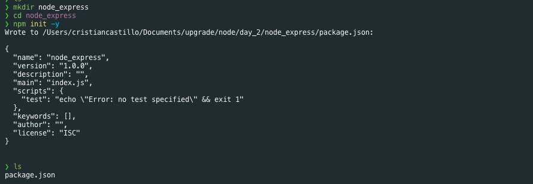
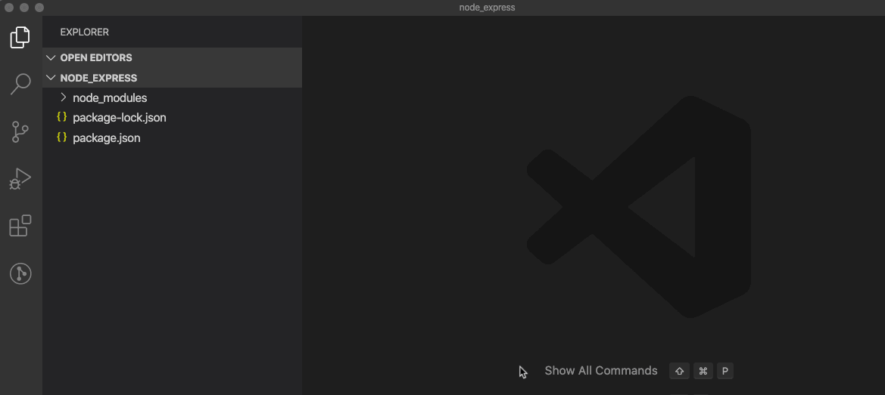
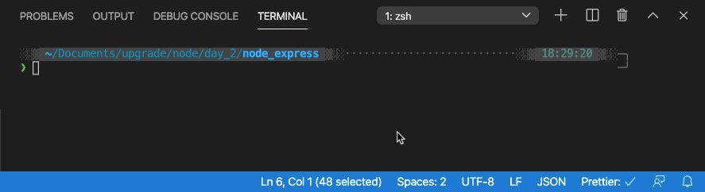
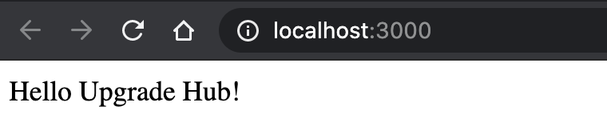
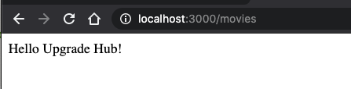
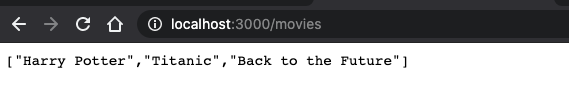

# Node S2 | Express & nodemon

## Después de esta lección podrás:

1. Crear un servidor "mejorado" utilizando Express sobre Node.js
2. Facilitar el uso de rutas y adecuar las respuesta de tu servidor a cada caso.

## ¿Qué es Express.js?

Hasta el momento hemos iniciado nuestros servidores utilizando el paquete **http** de Node.js, y creado una función **requestHandler** que recibirá los datos del navegador de nuestros usuarios cuando hagan una petición al servidor, y responderá usando el elemento **Response(res)** de Node.js.

Ahora, imagina que ocurriría con nuestro proyecto si nuestro servidor empezase a crecer y a tener muchos **endpoints** diferentes, o si quisiésemos añadir autenticación y librerías externas... La función **requestHandler** se haría enorme y desorganizada.

Este problema lo solucionaremos utilizando un framework de desarrollo Backend para Node.js llamado **Express.js.**

- **Link a la web oficial del framework: [https://expressjs.com](https://expressjs.com/es/)**

**¿Cómo añadimos Express.js a nuestro servidor?**

Si entramos en la web oficial, veremos que podemos instalarlo con el comando:

```bash
npm install express --save
```

Pero, hasta el momento no hemos usado **npm** en nuestro servidor, ¿qué hacemos?

Crearemos una nueva carpeta de proyecto para este ejercicio a la que llamaremos **node_express,** y entraremos en esta carpeta con la terminal.

Una vez dentro, lanzaremos el comando `npm init -y` que creará un archivo `package.json` en nuestra carpeta y soportará el uso del gestor de paquetes **npm** desde ahora.



 

Ahora podemos instalar express.js en nuestro proyecto lanzando el comando en al carpeta del proyecto:

```bash
npm install express --save
```

Si abrimos nuestro proyecto en VSCode podremos comenzar a trabajar con Node.js y Express.js.

Comenzaremos creando un nuevo archivo **.gitignore** y añadiendo la siguiente línea dentro:

```bash
/node_modules
```



Ahora crearemos un archivo **index.js** que será el punto de entrada de nuestro servidor, y tal y como hicimos con Node.js, añadiremos el siguiente código:

```jsx
const express = require('express');

const PORT = 3000;
const server = express();

server.listen(PORT, () => {
  console.log(`Server running in http://localhost:${PORT}`);
});
```

¡Vaya! ¿Te has fijado en que es muy parecido al servidor que creamos con Node.js pero usa Express.js en todos los casos?

Antes de utilizar node directamente para abrir el servidor, modificamos el archivo **package.json** para que los scripts contengan lo siguiente:

```json
"scripts": {
    "start": "node index.js"
},
```

Y ya que tenemos todo listo, lancemos en la terminal el siguiente comando:

```bash
npm run start
```

Y habremos abierto el servidor en http://localhost:3000:



## Creando rutas en nuestro servidor

Con Node.js teníamos que usar **req.url** para todas las peticiones, pero con Express.js podemos utilizar el sistema de callbacks y middlewares propios del framework.

Añadiremos la siguiente llamada a la función app.use:

```jsx
const express = require('express');

const PORT = 3000;
const server = express();

server.use('/', (req, res) => {
  res.send('Hello Minsait!');
});

server.listen(PORT, () => {
  console.log(`Server running in http://localhost:${PORT}`);
});
```

Si ahora reiniciamos el servidor y accedemos a [http://localhost:3000](http://localhost:3000/) aparecerá el mensaje en pantalla.



¡Express.js gestionará el enturado directamente por nosotros! Vamos a crear una nueva ruta:

```jsx
server.use('/movies', (req, res) => {
  const movies = ['Harry Potter', 'Titanic', 'Back to the Future'];
  res.send(movies);
});
```

Y si reiniciamos el servidor y accedemos a [http://localhost:3000/movies](http://localhost:3000/movies) veremos lo siguiente:



Pero, ¿y las películas? 😨

Esto se debe a que Node.js ejecuta su código de arriba a abajo, y cuando encuentra el callback para **`app.use('/', () ⇒ {})`**  no estamos indicando de ninguna manera que debe cambiar a otra ruta.

Esto lo conseguiremos con el **Router de Express.js.** 

Existen distintos métodos de comunicación HTTP:

- GET → Recopila datos del servidor y los devuelve a los usuarios.
- POST → Envía información al servidor y crea nuevos elementos en la base de datos.
- PUT → Envía información al servidor y edita un elemento de la base de datos.
- DELETE → Elimina un elemento de la base de datos.

Al conjunto de estos métodos lo llamamos **CRUD (Create, Read, Update and Delete).**

Por ahora trabajaremos con endpoints de tipo GET para recoger información de nuestro servidor. Por lo tanto, utilizaremos el Router de Express.js en el siguiente ejemplo:

```jsx
const express = require('express');

const PORT = 3000;
const server = express();

const router = express.Router();

router.get('/', (req, res) => {
  res.send('Hello Minsait!');
});

router.get('/movies', (req, res) => {
  const movies = ['Harry Potter', 'Titanic', 'Back to the Future'];
  res.send(movies);
});

server.use('/', router);

server.listen(PORT, () => {
  console.log(`Server running in http://localhost:${PORT}`);
});
```

Si ahora reiniciamos el servidor y recargamos la petición desde el navegador, veremos lo siguiente:



¡Lo hemos conseguido, ya podemos crear rutas en nuestro servidor!  🎉

## Parámetros y queries en rutas

Nuestras rutas han sido sencillas hasta el momento, pero es hora de añadir una mejora al sistema de comunicación que hemos creado con el servidor.

Vamos a realizar una petición a [http://localhost:3000/movies/titanic](http://localhost:3000/movies/titanic) en nuestro navegador.

```bash
Cannot GET /movies/titanic
```

Esta ruta no funcionará porque no la hemos creado previamente, pero ¿y si queremos una ruta que nos responda si una película existe o no dado su nombre? Tendríamos que crear un endpoint para cada película que tenemos en el servidor y sería algo infinito.

Para solucionar esto, tenemos los parámetros de ruta, o **route params,** que obtendremos de la **Request (req)** que llega a nuestros endpoints mediante `**req.params**`.

Para crear el parámetro de ruta que buscamos, hay que añadir `/:nombre_del_param` en la ruta de la url, como hacemos a continuación:

```jsx
router.get('/movies/:name', (req, res) => {});
```

Con esta ruta, hemos creado un parámetro que esperamos en la ruta llamado **name** que obtendremos de **[req.params.name](http://req.params.name).** Y será la cadena de texto que ocupe ese lugar en la url, por lo tanto:

```jsx
 [http://localhost:3000/movies/titanic](http://localhost:3000/movies/titanic) 

router.get('/movies/:name', (req, res) => {
  const name = req.params.name;
  console.log(name);
});
```

El nombre que aparecerá en el log en la terminal, será **'titanic'.**