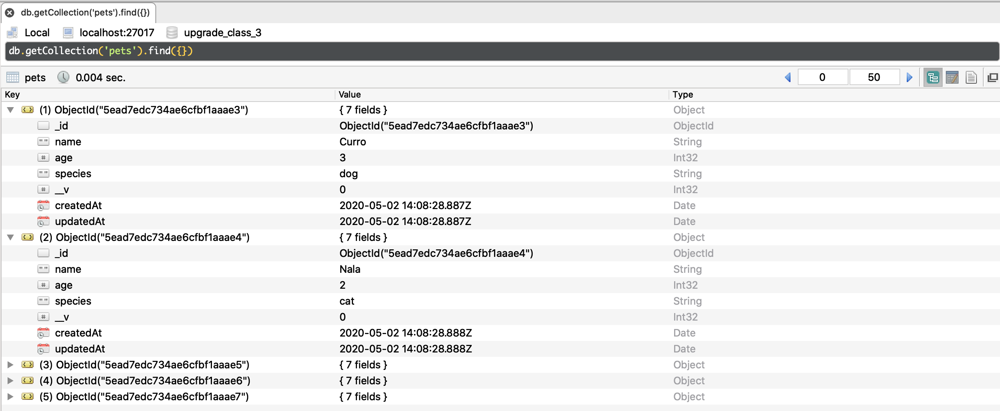

# Node S3 | Mongoose

## Después de esta lección podrás:

1. Crear tu propia base de datos noSQL.
2. Modificar la información de tu base de datos y guardar tu información.

## ¿Para qué usaremos una base de datos?

Hasta el momento hemos utilizado datos guardados en archivos o en variables dentro de nuestro servidor, pero te habrás dado cuenta de que estos datos no son estables y podemos tener problemas si reiniciamos nuestro servidor.

Para conseguir consistencia en la información que tengamos en nuestro servidor, utilizaremos una **base de datos.**

### MongoDB

La base de datos que usaremos en este módulo será **MongoDB** debido a que utilizarla desde Node.js y el entorno JavaScript se convierte en una tarea muy sencilla debido al sistema de guardado de documentos. Como ya sabes, MongoDB es una base de datos **no relacional,** por lo que no es necesario definir tablas de datos ni guardaremos la información en forma de columnas y filas, sino en forma de documentos.

 

**¿Cómo utilizaremos MongoDB desde Node.js?**

Si instalamos el driver de MongoDB en nuestro proyecto de Node.js podemos conectarnos con la base de datos directamente utilizando las funciones que aprendimos en el módulo de MongoDB. Aunque esta pueda parecer una buena solución, utilizaremos una alternativa muy parecida al sistema original en forma de **librería npm** llamada **Mongoose**. 

- Aquí la web de Mongoose: [https://mongoosejs.com/](https://mongoosejs.com/)

**¿Qué ventajas dará Mongoose?**

Como ya sabemos, MongoDB permite crear colecciones y documentos sin problema alguno, cambiando el formato de la información cuando queramos. Esto puede ser una espada de doble filo si no lo usamos correctamente, y para evitarnos problemas utilizaremos este **ODM (Object Document Mapper)** de más alto nivel.

Con Mongoose crearemos **esquemas** que definirán las **colecciones** que guardaremos en la base de datos y el f**ormato de los documentos** que podemos guardar en ésta.  Crearemos un proyecto inicial con Express como en las sesiones anteriores e instalaremos mongoose con el comando npm correspondiente:

```bash
npm install --save mongoose
```

Una vez instalado, creareamos un pequeño archivo **`db.js`** donde nos conectaremos a MongoDB mediante la función **connect** de mongoose:

```jsx
const mongoose = require('mongoose');

// URL local de nuestra base de datos en mongoose y su nombre upgrade_class_3
const DB_URL = 'mongodb://localhost:27017/upgrade_class_3';

// Función que conecta nuestro servidor a la base de datos de MongoDB mediante mongoose
mongoose.connect(DB_URL, {
  useNewUrlParser: true,
  useUnifiedTopology: true,
});
```

Si ahora requerimos este archivo en nuestro `**index.js`** de esta forma:

```jsx
const express = require('express');

// Requerimos el archivo de configuración de nuestra DB
require('./db.js');

const PORT = 3000;
const server = express();

server.listen(PORT, () => {
  console.log(`Server running in http://localhost:${PORT}`);
});
```

Al lanzar nuestro servidor, **nos conectaremos a la base de datos** si hemos instalado y abierto el servicio de MongoDB previamente en nuestro sistema.

Ahora que tenemos el servicio conectado, vamos a crear un esquema y a empezar a llenar nuestras colecciones.

### Creando nuestro primer esquema

Comenzaremos creando una carpeta **`models`** en nuestro proyecto en la que a partir de ahora crearemos un archivo por esquema. Por ejemplo, si queremos crear un esquema de mascotas, crearemos un archivo `**Pet.js**` en nuestra carpeta models.

- ¡Recuerda! Al modelo nos referiremos siempre con mayúsculas y en singular, es decir, si tenemos un modelo de vehículos, el archivo se llamará **`Vehicle.js` .**

Vamos a crear un modelo para mascotas en las que nuestros documentos tendrán nombre, escpecie y edad:

```jsx
// Archivo Pet.js dentro de la carpeta models
const mongoose = require('mongoose');

const Schema = mongoose.Schema;

// Creamos el esquema de mascotas
const petSchema = new Schema(
  {
    name: { type: String, required: true },
    age: { type: Number },
    species: { type: String, required: true },
  },
  {
    // Esta propiedad servirá para guardar las fechas de creación y actualización de los documentos
    timestamps: true,
  }
);

// Creamos y exportamos el modelo Pet
const Pet = mongoose.model('Pet', petSchema);
module.exports = Pet;
```

Como puedes ver, la clase **`Schema`** de mongoose acepta 2 argumentos cuando se instancia, el primero es el formato del documento que guardamos en la base de datos, y el segundo las opciones, que serán **timestamps: true** en nuestro caso.

### Usando nuestro primer esquema ✍️

Como ya tenemos un esquema creado, podemos empezar a usarlo para recuperar o crear documentos en nuestra base de datos. 

Debido a que aún no hemos visto los métodos POST, PUT y DELETE en Express, y que no tenemos datos en nuestra base de datos, vamos a crear un archivo llamado **`seed.js`** en el que crearemos un script para llenar nuestra base de datos de información.

- Por tanto, en la sesión de hoy veremos como crear y recuperar los datos de nuestra base de datos, y en la próxima clase aprenderemos a modificarlos 🚀

Abriremos el archivo `**seed.js`** y crearemos una serie de objetos que representen nuestras mascotas, con el mismo formato que nuestro esquema **Pet.js**:

```jsx
// Archivo seed.js
const mongoose = require('mongoose');

// Imporatmos el modelo Pet en este nuevo archivo.
const Pet = require('./models/Pet');

const pets = [
  {
    name: 'Curro',
    age: 3,
    species: 'dog',
  },
  {
    name: 'Nala',
    age: 2,
    species: 'cat',
  },
  {
    name: 'Margarita',
    age: 6,
    species: 'dog',
  },
  {
    name: 'Simón',
    age: 8,
    species: 'turtle',
  },
  {
    name: 'Max',
    age: 5,
    species: 'dog',
  },
];
```

¡Hasta ahora todo como esperábamos! El siguiente paso será conectarnos a nuestra base de datos local e insertar cada documento.

Pero antes, para insertar un documento en nuestra base de datos, debes saber que tenemos que instanciar la clase del modelo, es decir, para cada objeto mascota dentro de nuestro array tenemos que hacer **new Pet()** de forma que se convierta en una instancia del modelo. Vamos a utilizar un map para ello a continuación:

```jsx
const petDocuments = pets.map(pet => new Pet(pet));
```

Por último, nos conectaremos utilizando mongoose a nuestra base de datos local completando los siguientes pasos:

- Buscaremos las mascotas de nuestra base de datos y las eliminaremos si existen.
- Insertaremos las nuevas mascotas en la base de datos.
- Controlaremos los errores que puedan producirse y los enseñaremos en la terminal.
- Nos desconectaremos de la base de datos en cuanto introduzcamos los elementos que queremos.

```jsx
// En este caso, nos conectaremos de nuevo a nuestra base de datos
// pero nos desconectaremos tras insertar los documentos
mongoose
  .connect('mongodb://localhost:27017/upgrade_class_3', {
    useNewUrlParser: true,
    useUnifiedTopology: true,
  })
  .then(async () => {
    // Utilizando Pet.find() obtendremos un array con todos los pets de la db
    const allPets = await Pet.find();
    
    // Si existen pets previamente, dropearemos la colección
    if (allPets.length) {
      await Pet.collection.drop();
    }
  })
  .catch((err) => console.log(`Error deleting data: ${err}`))
  .then(async () => {
    // Una vez vaciada la db de las mascotas, usaremos el array petDocuments
    // para llenar nuestra base de datos con todas las mascotas.
    await Pet.insertMany(petDocuments);
  })
  .catch((err) => console.log(`Error creating data: ${err}`))
  // Por último nos desconectaremos de la DB.
  .finally(() => mongoose.disconnect());
```

Con este archivo, hemos aprendido a encontrar todos los elementos de un mismo tipo en la base de datos, introducir elementos en bulk y a hacer un drop de la colección directamente. En las siguientes lecciones aprenderemos a hacer esto con elementos individuales.

Ahora utilizaremos el comando `**node seed.js`** y veremos como aparecen todos los elementos nuestra base de datos en local:



¡Ya tenemos todos los elementos añadidos!

### Creando endpoints para recuperar información de nuestra base de datos

Si volvemos a lo que estábamos haciendo en la clase anterior, recordarás que aprendimos a crear endpoints GET con los que recoger información del servidor. Vamos a aprender a usar mongoose para encontrar información de los siguientes modos:

- Todos lo elementos de una colección.
- Un elemento dada su id.
- Uno o más elementos dado el valor de algún campo.

Crearemos un endpoint `**/pets`** en nuestro **`index.js`:**

```jsx
const Pet = require('./models/Pet');

const router = express.Router();

router.get('/pets', (req, res) => {
  return Pet.find()
    .then(pets => {
      // Si encontramos las mascotas, las devolveremos al usuario
      return res.status(200).json(pets);
    })
    .catch(err => {
      // Si hay un error, enviaremos por ahora una respuesta de error.
      return res.status(500).json(err);
    });
});

server.use('/', router);
```

Si hacemos una petición al servidor en el endpoint `**/pets**` recuperaremos un array con todas las mascotas que hemos guardado en la base de datos.

**→ El endpoint podemos resolverlo también usando async/await como veremos ahora:**

```jsx
 router.get('/pets', async (req, res) => {
  try {
    const pets = await Pet.find();
    return res.status(200).json(pets)
  } catch (err) {
    return res.status(500).json(err);
  }
});
```

Una vez tenemos el primer endpoint, hagamos uno para encontrar mascotas por su id, que llamaremos **/pets/:id** y recibirá la información del parámetro **id** por medio de **req.params:**

```jsx
 router.get('/pets/:id', async (req, res) => {
  const id = req.params.id;

  try {
    const pet = await Pet.findById(id);

    if (pet) {
      return res.status(200).json(pet);
    } else {
      return res.status(404).json('No pet found by this id');
    }
  } catch (err) {
    return res.status(500).json(err);
  }
});
```

Si sacamos la id de alguna de las mascotas **(el campo _id)** y hacemos una petición a [**http://localhost:3000/pets/5ead7edc734ae6cfbf1aaae3](http://localhost:3000/pets/5ead7edc734ae6cfbf1aaae3)** (en el ejemplo anterior la id era esta cadena para el primer elemento), veremos como obtenemos la información de esta mascota solamente.

¿Y si ahora queremos obtener una mascota dada su especie? ¡Vamos a buscar las mascotas que sean tengan **dog** como especie 🐶: 

```jsx
 router.get('/pet/species/:species', async (req, res) => {
  const species = req.params.species;

  try {
    const petsBySpecies = await Pet.find({ species: species });
    return res.status(200).json(petsBySpecies);
  } catch (err) {
    return res.status(500).json(err);
  }
});
```

Si hacemos una petición a [**http://localhost:3000/pets/](http://localhost:3000/pets/5ead7edc734ae6cfbf1aaae3)species/dog** obtendremos todos los animales que sean de la especie perro 👏

Vamos a buscar ahora las mascotas por su edad, por ejemplo, las menos de 5 años:

```jsx
 router.get('/pet/age/:age', async (req, res) => {
  const age = req.params.age;

  try {
    const petsByAge = await Pet.find({ age: { $lt: age } });
    return res.status(200).json(petsByAge);
  } catch (err) {
    return res.status(500).json(err);
  }
});
```

Si hacemos una request GET a [**http://localhost:3000/pets/](http://localhost:3000/pets/5ead7edc734ae6cfbf1aaae3)age/5** encontraremos las mascotas con menos de 5 años debido a la utilidad que acabamos de aprender.

- Si usamos **$lt (less than)** encontraremos valores menores al que usemos.
- Si usamos **$lte (less than equal)** encontraremos valores menores o igual al usado.
- Si usamos **$gt (greater than)** encontraremos los valores mayores al usado.
- Si usamos **$gte (greater than equal)** encontraremos los valores mayores e iguales al usado.