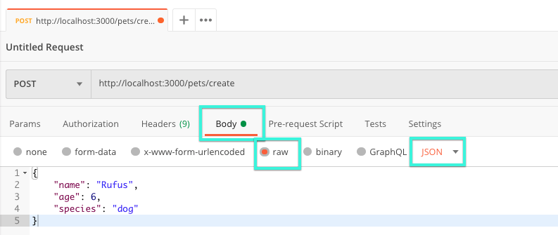
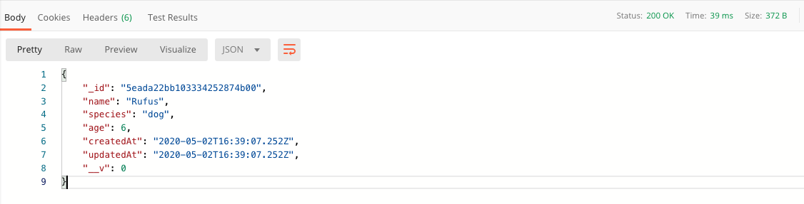
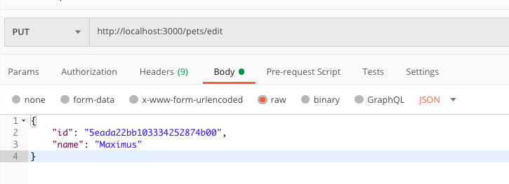
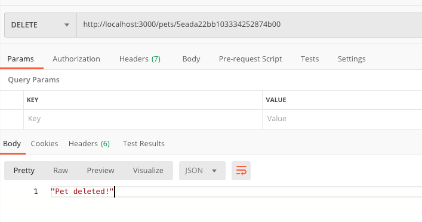
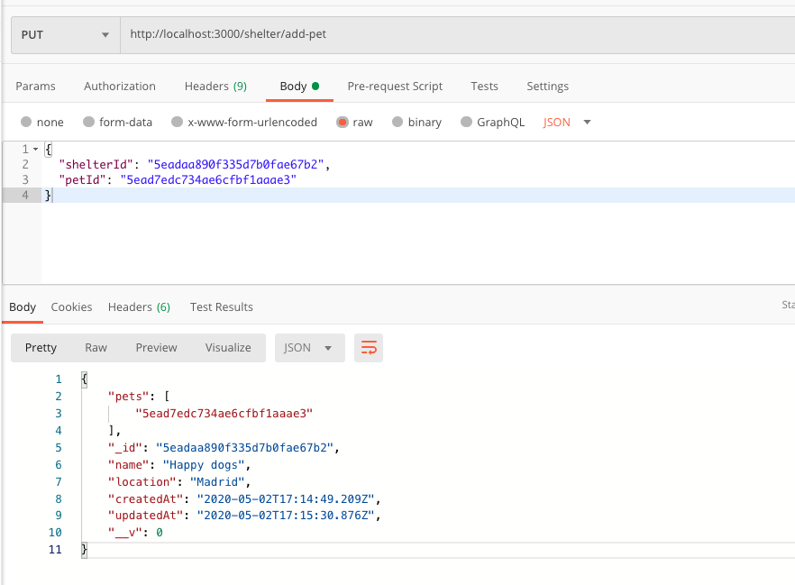

# Node S4 | Endpoints & Errores

## Después de esta lección podrás:

1. Facilitar el uso de rutas y adecuar las respuesta de tu servidor a cada caso.
2. Terminar de aprender POST, PUT y DELETE.
3. Emplear mongoose para terminar de usar CRUD en nuestra base de datos.

## Manejando errores con Express

Te habrás dado cuenta de que en Express, todos los callbacks para las funciones de rutas reciben dos parámetros, **Request y Response** o **(req, res) ⇒ {},** pero hay uno más que no hemos visto hasta ahora, y es **Next (next),** este último argumento irá siempre en tercera posición dentro los callbacks de express, aquí un ejemplo:

```jsx
(req, res, next) => {}
```

Si repasamos lo visto hasta el momento, si usamos estos parámetros podemos hacer lo siguiente:

- **req →** Nos permite acceder a la información que el cliente envía al servidor, como las cookies, los query o los request params.
- **res →** Nos permite modificar las respuestas y enviar datos al cliente tras completar un proceso a través del status o las funciones send o json.
- **next →** Si llamamos a esta función sin envíar nada como argumento, Express avanzará hasta el siguiente punto de control de la aplicación (middleware), y si enviamos un argumento de tipo error, se lanzará el controlador de errores de Express.

### Controlador de errores de Express

Para crear el controlador de errores de Express, tendremos que añadir un cuarto parámetro al callback de Express, que corresponderá con el Error (err) e irá en primer lugar:

```jsx
server.use((err, req, res, next) => {
  return res.status(err.status || 500).json(err.message || 'Unexpected error');
});
```

Como dijimos, nuestro código se lanzará de arriba hacia abajo cuando nuestro servidor analice una request, por lo que este middleware se añadirá al final de todo nuestro código en `**index.js` .**

De esta forma, todo el nuevo código que añadamos a nuestro servidor funcionará hasta llegar al controlador de errores si no se ha resuelto previamente, ya sea por el uso de next() enviando un error debido a nuestro código, o porque no encuentra la ruta adecuada:

```jsx
const express = require('express');

const PORT = 3000;
const server = express();

// Aquí añadiremos el nuevo código, dejando el controlador de errores en último lugar

// Crearemos un middleware para cuando no encontremos la ruta que busquemos
server.use('*', (req, res, next) => {
  const error = new Error('Route not found'); 
  error.status = 404;
  next(error); // Lanzamos la función next() con un error
});

// Si se lanza la función
server.use((err, req, res, next) => {
  return res.status(err.status || 500).json(err.message || 'Unexpected error');
});

server.listen(PORT, () => {
  console.log(`Server running in http://localhost:${PORT}`);
});
```

Con esto, tenemos creado nuestro control de errores completo para express. A partir de ahora podremos crear un nuevo error y enviarlo al controlador mediante la funcion **next. 🚀**

→ **¡Recuerda! No debes crear otra función en tu código que tenga cuatro argumentos como el controlador de errores, ya que si lo haces se pisarán entre ellos y tendrás side effects inesperados.**

## Creando nuevos endpoints POST, PUT y DELETE

Ahora que tenemos controlados los errores, sabemos crear nuevos endpoints en Express y tenemos control sobre nuestra base de datos, vamos a continuar aprendiendo el proceso CRUD visto hasta ahora con los endpoints restantes, para terminar nuestra primera API funcional en esta sesión.

### Utilizando POST para añadir nuevos documentos a nuestra DB

Al igual que los enpoints pueden tener **query y route params,** los endpoints de tipo **POST y PUT** pueden tener una propiedad llamada **body** que utilizaremos para enviar datos a estos endpoints.

Vamos a aprovechar el último proyecto sobre mascotas y a crear un enpoint para añadir nuevas mascotas.

Hasta ahora hemos utilizado las rutas directamente en el `**index.js**` de nuestro servidor, pero de este momento en adelante vamos a crear una carpeta llamada **`routes`** en la que exportaremos cada tipo de ruta en un archivo distinto, en nuestro caso, crearemos el archivo **`pet.routes.js`** en el que añadiremos todas las rutas relacionadas con mascotas.

```jsx
// Archivo pet.routes.js dentro de la carpeta routes
const express = require('express');

const Pet = require('../models/Pet');

const router = express.Router();

router.get('/', async (req, res) => {
  try {
    const pets = await Pet.find();
    return res.status(200).json(pets)
  } catch (err) {
    return res.status(500).json(err);
  }
});

module.exports = router;
```

Y ahora, ¿por qué el endpoint utiliza **'/'** en vez **'/pets'** como antes? Vamos a ver el motivo y razonar su solución.

Añadiremos en el archivo `**index.js`** un nuevo middleware de rutas para el enpoint **'/pets':**

```jsx
const express = require('express');

// Importaremos las rutas de mascotas aquí
const petRoutes = require('./routes/pet.routes');

const PORT = 3000;
const server = express();

// Aquí tendremos los endpoints y rutas de las mascotas
server.use('/pets', petRoutes);

server.use('*', (req, res, next) => {
  const error = new Error('Route not found'); 
  error.status = 404;
  next(error); // Lanzamos la función next() con un error
});

server.use((err, req, res, next) => {
  return res.status(err.status || 500).json(err.message || 'Unexpected error');
});

server.listen(PORT, () => {
  console.log(`Server running in http://localhost:${PORT}`);
});
```

**Por tanto, nuestro código se comporta de la siguiente forma:**

- El cliente hace una request a **`http://localhost:3000/pets`**
- El código de index.js llega al punto **`app.use('/pets', petRoutes)`** ya que las rutas coinciden.
- Al entrar en `**pet.routes.js`** ya se ha considerado la parte **`/pets`** de la ruta, por lo que el archivo empieza  en su nueva base `**/`.**
- Se busca el enpoint GET, POST, PUT o DELETE que coincida con la nueva base de ruta y se lanza la función Response o Next para continuar o terminar el proceso en ese controlador.

Ahora que sabemos como funciona la división de rutas por archivos, vamos a crear nuestro endpoint POST para crear mascotas:

```jsx
router.post('/create', async (req, res, next) => {
  try {
    // Crearemos una instancia de mascota con los datos enviados
    const newPet = new Pet({
      name: req.body.name,
      species: req.body.species,
      age: req.body.age,
    });

    // Guardamos la mascota en la DB
    const createdPet = await newPet.save();
    return res.status(200).json(createdPet);
  } catch (err) {
    // Lanzamos la función next con el error para que gestione todo Express
    next(err);
  }
});
```

**¿Cómo accedemos a este endpoint?** **¿Cómo enviamos información a req.body?**

Al endpoint se accederá a través de **[http://localhost:3000/pets/create](http://localhost:3000/pets/create)** pero, no podremos hacerlo a través del navegador todavía, ya que necesitaríamos un formulario o una función **fetch** que envíe datos en formato **JSON**, así que vamos a utilizar **Postman** para simular peticiones.

Vamos a añadir una nueva request POST, con el endpoint que acabamos de crear, y enviaremos los datos en formato `**raw**` y `**JSON`** de la siguiente manera:



Si tenemos todo configurado correctamente, podremos enviar la petición a través de Postman y deberíamos poder crear la nueva mascota en la base de datos, pero **¡tendremos un error!**

Esto se debe a que **req.body** no contendrá los datos que hemos enviado al servidor porque no estamos utilizando ningún middleware para "parsear" la información. Para ello, añadiremos estas líneas en el archivo `**index.js`** antes de añadir las rutas. 

Estas son funciones propias de express que transforman la información enviada como JSON al servidor de forma que podremos obtenerla en **req.body.**

```jsx
server.use(express.json());
server.use(express.urlencoded({ extended: false }));
```

Repetiremos el proceso para confirmar que ahora podemos crear nuevas mascotas:



### Utilizando PUT para editar un documento de nuestra DB

Como ya sabemos crear enpoints de tipo POST en nuestro servidor, vamos a editar una mascota dada su **id** utilizando los métodos PUT.

Para ello, crearemos un nuevo enpoint **`/pets/edit`** en que enviaremos la id nueva y los campos que queremos modificar en el documento de la colección Pet.

```jsx
router.put('/edit', async (req, res, next) => {
  try {
    const id = req.body.id;

    const updatedPet = await Pet.findByIdAndUpdate(
      id, // La id para encontrar el documento a actualizar
      { name: req.body.name }, // Campos que actualizaremos
      { new: true } // Usando esta opción, conseguiremos el documento actualizado cuando se complete el update
    );

    return res.status(200).json(updatedPet);
  } catch (err) {
    next(err);
  }
});
```

Cambiaremos el nombre del perro que acabamos de crear de Rufus a Maximus:



Si enviamos la request de tipo PUT y hemos añadido todo correctamente a nuestro servidor, nuestro perro habrá cambiado de nombre 🐶

### Utilizando DELETE para eliminar un documento de la DB

Aunque podamos encontrarlo en algún proyecto, no es correcto enviar body a nuestro endpoit de tipo DELETE, por lo tanto utilizaremos un parámetro de ruta **/:id** para identificar el elemento que queremos eliminar de nuestra DB.

```jsx
router.delete('/:id', async (req, res, next) => {
  try {
    const id = req.params.id;
    
    // No será necesaria asignar el resultado a una variable ya que vamos a eliminarlo
    await Pet.findByIdAndDelete(id);
    return res.status(200).json('Pet deleted!');
  } catch (err) {
    next(err);
  }
});
```

Con esto, podremos lanzar la petición al endpoint usando el método DELETE y podremos ver como hemos eliminado el elemento de nuestra base de datos.



### ¡Hemos aprendido a crear una API CRUD completa! 🎉

## Aprendiendo a relacionar modelos entre si ⛓

Como último paso en la clase de hoy, relacionaremos varios modelos entre si utilizando un nuevo tipo de variable de mongoose, ya que hasta este momento hemos visto como crear campos de tipo String y Number.

Vamos a suponer que tenemos casas de acogida y las mascotas, en este caso tendremos dos modelos, Shelter y Pet. La relación de estos modelos será tal que una casa de acogida tenga un array de ids representando a cada animal que se encuentra en ella. Veamos el nuevo modelo **`Shelter.js` :**

```jsx
const mongoose = require('mongoose');

const Schema = mongoose.Schema;

const shelterSchema = new Schema(
  {
    name: { type: String, required: true },
    location: { type: String, required: true },
    // Tipo mongoose Id y referencia al modelo Pet
    pets: [{ type: mongoose.Types.ObjectId, ref: 'Pet' }],
  },
  {
    timestamps: true,
  }
);

const Shelter = mongoose.model('Shelter', shelterSchema);
module.exports = Shelter;
```

¡Ya tenemos el modelo Shelter para la casa de acogida! 🏡

Vamos a crear un endpoint POST para las casas de acogida en el que crearemos una nueva casa, donde crearemos una nueva casa con estos datos:

```jsx
{
  name: "Happy dogs",
  location: "Madrid",
  pets: [],
}
```

**¿Cómo añadimos una nueva mascota?** 

Crearemos un endpoint PUT que reciba la id del Shelter y la id de la mascota que queramos añadir, de la siguiente forma:

```jsx
const express = require('express');

const Shelter = require('../models/Shelter');

const router = express.Router();

router.post('/create', async (req, res, next) => {
  try {
    const newshelter = new Shelter({
      name: req.body.name,
      location: req.body.location,
    });

    const createdShelter = await newshelter.save();
    return res.status(200).json(createdShelter);
  } catch (err) {
    next(err);
  }
});

router.put('/add-pet', async (req, res, next) => {
  try {
    const shelterId = req.body.shelterId;
    const petId = req.body.petId;

    const updatedShelter = await Shelter.findByIdAndUpdate(
      shelterId,
      { $push: { pets: petId } },
      { new: true }
    );

    return res.status(200).json(updatedShelter);
  } catch (err) {
    next(err);
  }
});

module.exports = router;
```

Como puedes ver, si tomamos el atributo **$push** como referencia, podemos añadir el nombre del campo al que hacer push dentro de un array de valores. En este caso, **petId** será añadido a **pets**.



Ahora, si creamos un endpoint GET para el Shelter, obtendremos todos los documentos de la colección, y estos tendrán un array de mascotas con ids. Podemos llenar el array con las mascotas correspondientes utilizando la función populate:

```jsx
router.get('/', async (req, res, next) => {
  try {
    const shelters = await Shelter.find().populate('pets');

    return res.status(200).json(shelters);
  } catch (err) {
    next(err);
  }
});
```

Ahora, cada vez que recuperemos los Shelters del servidor, estarán los datos de las mascotas en este array:

```json
[
    {
        "pets": [
            {
                "_id": "5ead7edc734ae6cfbf1aaae3",
                "name": "Curro",
                "age": 3,
                "species": "dog",
                "__v": 0,
                "createdAt": "2020-05-02T14:08:28.887Z",
                "updatedAt": "2020-05-02T14:08:28.887Z"
            }
        ],
        "_id": "5eadaa890f335d7b0fae67b2",
        "name": "Happy dogs",
        "location": "Madrid",
        "createdAt": "2020-05-02T17:14:49.209Z",
        "updatedAt": "2020-05-02T17:15:30.876Z",
        "__v": 0
    }
]
```

## Con esto habremos terminado todo lo relacionado con las operaciones CRUD de nuestra API y con los modelos de Mongoose y MongoDB 🚀