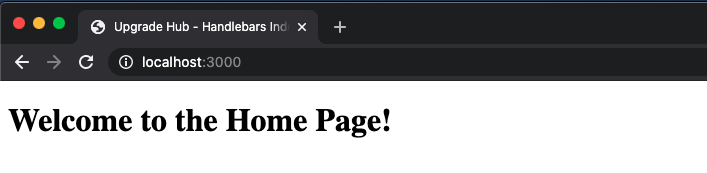
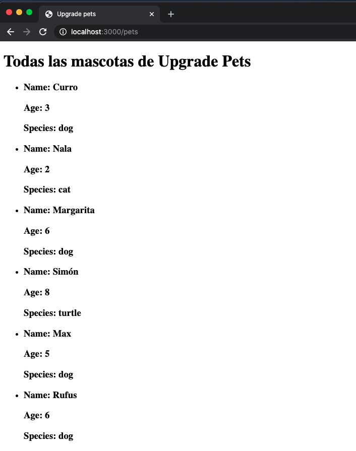
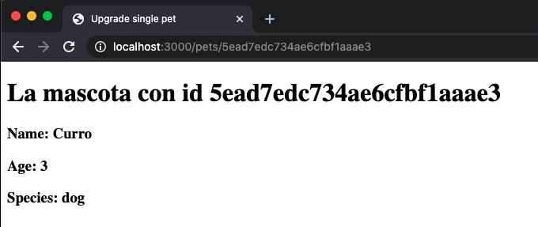
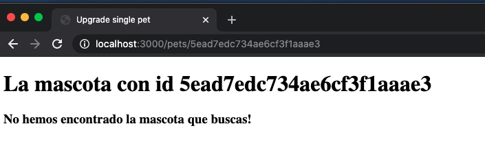
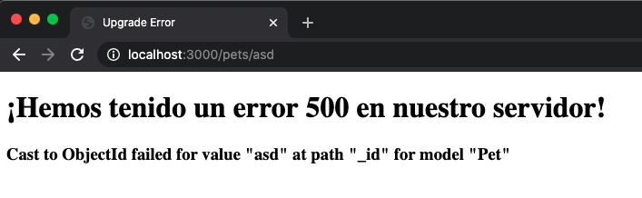
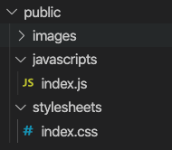

# Node S5 | Handlebars

## Después de esta lección podrás:

1. Mostrar la información de nuestro servidor en el frontend con templates.
2. Interactuar desde el cliente con nuestro servidor mediante JS.

## ¿Qué es handlebars?

Handlebars es un motor de plantillas o templates para presentar información en el cliente, como HTML, pero capaz de recoger información directamente del servidor e inyectarla de forma dinámica en la web.

Esto se llama **Server Side Rendering**, el proceso por el cual el servidor envía información a una vista generada dentro de éste, y el cliente recibe el HTML ya con la información inyectada la primera vez que pinta nuestra web.

Los archivos handlebars serán identificados por medio de la extensión **.hbs** y los colocaremos dentro de la carpeta **views** de nuestro servidor.

Vamos a recuperar el proyecto sobre mascotas que hicimos en la última clase e instalaremos la librería:

```bash
npm install --save hbs
```

Una vez instalada la librería de vistas **handlebars (hbs)**, vamos a añadir estas líneas a Express en el archivo **`index.js`** de nuestro servidor:

```jsx
const path = require('path');

server.set('views', path.join(__dirname, 'views'));
server.set('view engine', 'hbs');
```

**¿Qué hemos conseguido con estas líneas? 🔮**

En la primera línea, habremos hecho que nuestro servidor tome como referencia para las vistas **'views'**  la carpeta **`/views`** que se encuentra en este directorio. Para evitar posibles errores según el lugar donde lancemos nuestro servidor, utilizaremos la librería **`path`** propia de node.js

En la siguiente línea, estamos indicando que utilizaremos el paquete `**hbs**` que acabamos de instalar como el motor de vistas.

### Creando una vista en handlebars

Antes de poder unir nuestro primer layout con los datos de nuestro servidor, crearemos un archivo **`index.hbs`** en nuestra carpeta **`views` :**

```html
<!DOCTYPE html>
<html>

<head>
  <title>{{title}}</title>
</head>

<body>
  <h1>Welcome to the Home Page!</h1>
</body>

</html>
```

Como puedes ver, este archivo es la base sobre la que pintaremos nuestra ruta **[http://localhost:3000](http://localhost:3000)** o Home como se suele identificar en todos los sitios web.

Vamos a crear un archivo **`index.routes.js`** en la carpeta **`routes`** y añadiremos el siguiente método GET:

```jsx
const express = require('express');

const router = express.Router();

router.get('/', (req, res, next) => {
  res.status(200).render('index', { title: 'Minsait - Handlebars Index' });
});

module.exports = router;
```

Como puedes observar, ahora responderemos a las requests utilizando la función **`render`** que recibirá **dos argumentos**, el primero es el **nombre del archivo de la carpeta views** que queremos utilizar, y el segundo argumento serán los parámetros que enviaremos, en este caso la variable **title.**



¿Te has fijado en que el título de nuestra web es justo lo que hemos enviado en la variable title? Así es como funciona Handlebars 🎉

## Mostrando una lista en Handlebars

Hasta el momento, ¿cómo hemos hecho para mostrar muchos elementos en HTML? Hemos escrito cada elemento a mano, por ejemplo, para las mascotas que teníamos en nuestra base de datos, crearíamos un elemento <ul> con varios <li> dentro y los datos de cada mascota.

Imagina ahora que el número de mascotas pudiese cambiar con el tiempo, o que fuese muy extenso y tuviésemos que escribirlos todos. La cantidad de trabajo sería infinita...

Para solucionar este problema, podemos utilizar handlebars y envíar la lista como una variable que entonces recorreremos como un bucle utilizando la función **#each.**

Vamos a cambiar el endpoint que recogía todas las mascotas para que utilice una vista que crearemos con el archivo `**pets.hbs` :**

```jsx
router.get('/', async (req, res) => {
  try {
    const pets = await Pet.find();
    return res.status(200).render('pets', { title: 'Minsait pets', pets });  
  } catch (err) {
    next(err);
  }
});
```

Y ahora el archivo `**pets.hbs` :**

```html
<!DOCTYPE html>
<html>

<head>
  <title>{{title}}</title>
</head>

<body>
  <h1>Todas las mascotas de Minsait Pets</h1>
  <ul>
    {{#each pets}}
      <li>
        <h3>Name: {{ this.name }}</h3>
        <h3>Age: {{ this.age }}</h3>
        <h3>Species: {{ this.species }}</h3>
      </li>
    {{/each}}
  </ul>
</body>

</html>
```

¡Wow! Acabamos de aprender una nueva función de handlebars, utilizando **`#each`** podremos  recorrer un array de elementos, en este caso **`pets`** será el array que tendrá objetos en su interior.

Cada objeto se identifica por la variable **`this`** en cada uno de los bucles, por lo que si fuese un string estaríamos utilizando `**{{this}}**` para pintar dicho string en nuestro template. Como en este caso tenemos un objeto, podremos acceder a los atributos de dicho objeto tal y como hecho en el ejemplo para cada mascota con **`{{this.name}}`** y **`{{this.age}}`.**



## ¿Cómo usamos condicionales con Handlebars?

En Handlebars, hay condicionales por defecto que emplearemos mediante **`{{#if}}{{/if}}`** pero serán capaces de comprar unicamente si el elemento es **truthy**, es decir, no es validado como **false** en JavaScript. 

Hagamos un ejemplo con una mascota. Crearemos un endpoint **`/pet/:id`** que recogerá una mascota de nuestra base de datos dada su id y la representará en una vista:

```jsx
 router.get('/:id', async (req, res) => {
  try {
    const id = req.params.id;
    const pet = await Pet.findById(id);
    
    return res
      .status(200)
      .render('pet', { title: 'Minsait single pet', pet: pet, id: id });  
  } catch (err) {
     next(err);
  }
});
```

Ahora debemos de tener una vista acorde al render que acabamos de realizar, que será **`pet.hbs`:**

```html
<!DOCTYPE html>
<html>

<head>
  <title>{{title}}</title>
</head>

<body>
  <h1>La mascota con id {{this.id}}</h1>
  {{#if this.pet}}
    <h3>Name: {{ this.pet.name }}</h3>
    <h3>Age: {{ this.pet.age }}</h3>
    <h3>Species: {{ this.pet.species }}</h3>
  {{else}}
    <h3>No hemos encontrado la mascota que buscas!</h3>
  {{/if}}
</body>

</html>
```

Ahora podremos ir a la vista de alguna mascota dada su id, ¡vamos al perfil de una de nuestras mascotas!



En caso de introducir una id que no exista en nuestro servidor, veremos lo siguiente:



### Y si introducimos una id no válida en MongoDB, ¿como vemos el error?

Para poder proceder correctamente al control de errores con nuestras vistas, crearemos un archivo `**error.hbs`** donde pintaremos lo que muestre nuestro error handler de Express.

```html
<!DOCTYPE html>
<html>

<head>
  <title>Minsait Error</title>
</head>

<body>
  <h1>¡Hemos tenido un error {{ status }} en nuestro servidor!</h1>
  <h3>{{message}}</h3>
</body>

</html>
```

Y cambiaremos el error handler de forma que podamos hacer render de  **`error.hbs`**:

```jsx
server.use((err, req, res, next) => {
  return res.status(err.status || 500).render('error', {
    message: err.message || 'Unexpected error',
    status: err.status || 500,
  });
});
```

Este será nuestro resultado:



## ¿Cómo mejorar los condicionales en Handlebars?

Si queremos usar condiciones más específicas, como por ejemplo comparar si la edad de nuestra mascota es superior a cinco años, tendremos que crear un helper custom. Lo haremos de la siguiente manera:

```jsx
const hbs = require('hbs');

server.set('views', path.join(__dirname, 'views'));
server.set('view engine', 'hbs');

// Registramos el helper justo después de hacer .set
hbs.registerHelper('gte', (a, b, opts) => {
  if (a >= b) {
    return opts.fn(this)
  } else {
      return opts.inverse(this)
  }
});
```

Como queremos emplear nuestro "helper" como si fuese una condición, recibirá siempre como último argumento uno denominado **`options`** al que llamaremos **`opts`** y tendrá dos funciones:

- **opts.fn(this) →**  Con esto, pintaremos en pantalla el contenido como si fuese la parte **válida** de un condicional if.
- **opts.inverse(this) →**  Esta llamada sería como utilizar la parte **else** de un condicional

Vamos a verlo en acción:

```html
<body>
  <h1>La mascota con id {{this.id}}</h1>
  {{#if this.pet}}
      <h3>Name: {{ this.pet.name }}</h3>
      <h3>Age: {{ this.pet.age }}</h3>
      <h3>Species: {{ this.pet.species }}</h3>
    {{#gte this.pet.age 5}}
      <h3>¡Este perro tiene más de cinco años!</h3>
    {{/gte}}
  {{else}}
    <h3>No hemos encontrado la mascota que buscas!</h3>
  {{/if}}
</body>
```

Como puedes ver, lo estamos utilizando como un condicional `**{{#if}}{{/if}}`** de forma que pintará su contenido si la edad es mayor o igual a cinco. Si quisiésemos añadir un else, es tan fácil como emplear **{{else}}** al igual que en la otra condición.

¡Recuerda! Si queremos registrar helpers de varios tipos, podemos buscar alguna librería, pero recomendamos crear los justos y necesarios para nuestro proyecto, teniendo todos en su propio archivo **`helpers-hbs.js`** e importándolos en `**index.js`.**

### ¿Y si queremos registrar una función?

Imagina que queremos hacer una función que transforme todo el contenido de un string a mayúsculas. Podemos registrar un nuevo helper que sea una función normal en este caso y no use options:

```jsx
hbs.registerHelper('uppercase', (str) => {
  return str.toUpperCase();
});
```

Y ahora, podremos hacer que el nombre de nuestra mascota esté en mayúsculas usando la función:

```html
<h3>Name: {{ uppercase this.pet.name }}</h3>
```

## Importando archivos JavaScript y CSS en nuestros views

Para conseguir este último requisito y tener una web plenamente funcional, crearemos una carpeta llamada `**public`** en la que tendremos una carpeta para **`css`,  `js`** e **`images`.**

Vamos a crear un archivo **`index.css`** y un archivo **`index.js`** para nuestra vista **`index.hbs`** 



Y ahora solo queda añadir a nuestro servidor que utilice esta carpeta para todos los elementos públicos usando esta línea de código con un nuevo middleware en `**index.js` :**

```jsx
app.use(express.static(path.join(__dirname, 'public')));
```

Con esto habremos conseguido que nuestras vistas hbs puedan utilizar los elementos **<link>** y **<script>** para utilizar los que tengamos en la carpeta public. Ahora puedes importar en tu **index.hbs** el archivo **index.css** o **index.js** y dar funcionalidad a toda tu web! 🚀