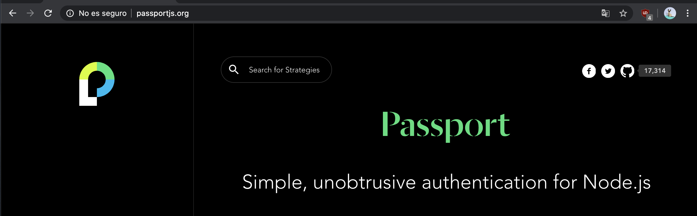
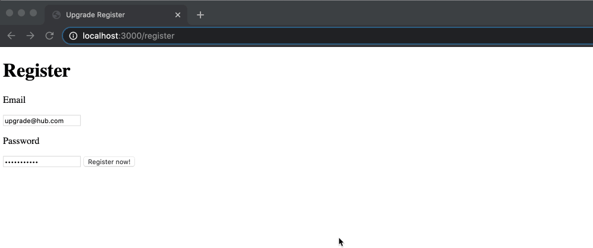
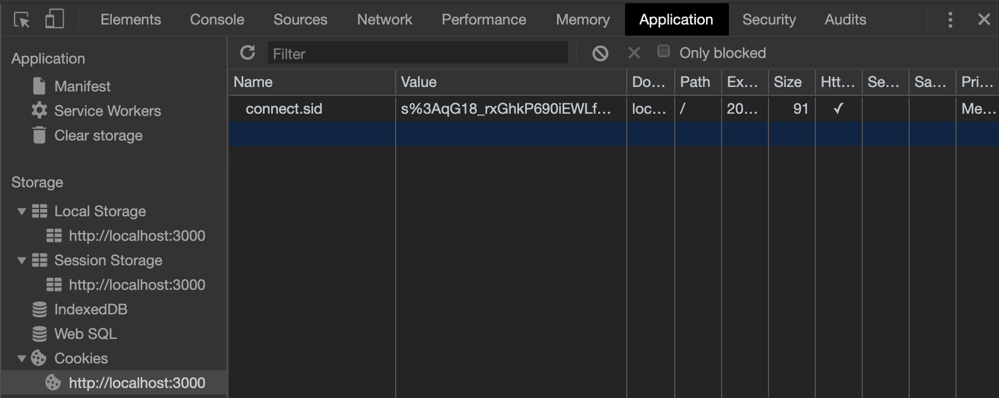

# Node S6 | Autenticación

## Después de esta lección podrás:

1. Crear un control de autenticación en tu aplicación.
2. Crear flows distintos para tus usuarios según su rol.

## ¿Para qué usaremos la autenticación?

Como en la gran mayoría de sitios webs complejos que puedes visitar, llegará el momento en que necesitemos crear un proceso de autenticación para nuestros usuarios.

Este proceso será muy útil para decidir a qué partes de nuestra aplicación puede acceder cada persona que utilice nuestro servicio, así como que capacidad de interacción tendrá cada una de ellas.

Hay muchísimas formas de crear un proceso de autenticación en una aplicación web:

- Sesiones que guardaremos de forma activa en nuestro servidor.
- JSON Web Tokens (JWT) que servirán como identificador.
- Autenticación por medio de plataformas sociales como Google, Facebook, GitHub...

En nuestro caso, veremos principalmente la autenticación por medio de sesiones de usuario, debido a que es el método más usado tradicionalmente y que nos permitirá entender correctamente todos los procesos que ocurren en nuestro servidor.

## Express y Passport.js como librería de autenticación

Para trabajar correctamente con Express y un sistema de autenticación, vamos a hacer uso de una librería muy conocida en el mundo del desarrollo en Node.js para gestionar este proceso, **Passport.js**.

**Web URL: [http://www.passportjs.org/](http://www.passportjs.org/)**



Como hemos comentado previamente, vamos a utilizar un sistema de autenticación por medio de sesiones, y esté lo gestionaremos a través de la **autenticación local con usuario y contraseña.**

**Las librerías que necesitaremos para esta lección serán:**

- **mongoose →** Como hasta ahora, la usaremos para guardar nuestros usuarios en la base de datos.
- **express-session →** Gestionará las sesiones de nuestros usuarios usando cookies
- **connect-mongo →** Se encargará de guardas las sesiones en nuestra base de datos y actualizarlas.
- **passport →** Middleware que se encargará de gestionar los procesos de autenticación.
- **passport-local →** Estrategia de autenticación con passport por medio de email y contraseña.
- **bcrypt →** Librería para hacer un hash de nuestro password antes de guardarlo en la DB.

## ¡Empezamos! 🚔

Para esta nueva funcionalidad, vamos a seguir trabajando en el proyecto sobre mascotas al que hemos estado añadiendo nuevas tecnologías estas últimas clases.

Para comenzar, vamos a instalar las librerías de passport para crear un flow para los usuarios:

```bash
npm install --save passport passport-local
```

Antes de empezar, crearemos el modelo **`User`** para poder gestionar los usuarios de nuestra aplicación. Crearemos un archivo `**User.js**` en la carpeta `**models`** con el siguiente código:

```jsx
const mongoose = require('mongoose');

const Schema = mongoose.Schema;

const userSchema = new Schema(
  {
    email: { type: String, required: true },
    password: { type: String, required: true },
  },
  {
    timestamps: true,
  }
);

const User = mongoose.model('User', userSchema);
module.exports = User;
```

Ahora, crearemos un archivo `**passport.js**` en la raíz de nuestro proyecto. Este archivo contendrá todo el sistema de estrategías de autenticación que implementaremos en passport. 

La ventaja que ofrece trabajar de esta forma es que podemos añadir nuevas estrategias en cualquier momento de forma isolada.

```jsx
const passport = require('passport');
const LocalStrategy = require('passport-local').Strategy;

passport.use(
  'register', // Nombre de la estrategia, en este caso será register
  new LocalStrategy(
    {
      usernameField: 'email', // Elegimos el campo email del req.body
      passwordField: 'password', // Elegimos el campo password del req.body
      passReqToCallback: true, // Hace que el callback reciba la Request (req)
    },
    (req, email, password, done) => {
      // Aquí pondremos la lógica de registro
    }
  )
);
```

🔝 Este código será la base para autenticar nuestros usuarios por medio de un registro tradicional. La instancia de LocalStrategy recibe dos argumentos, siendo el primero una serie de **opciones para configurar cómo se recibirá la información el el callback**. Y el segundo será el callback de passport que recibirá, dadas las opciones que hemos configurado, **la request, el email, el password y una función done que resolverá la llamada a este middleware**.

Ahora que tenemos todo preparado para crear nuestro registro, vamos a instalar `**bcrypt**` :

```bash
npm install --save bcrypt
```

Y vamos a crear la lógica para que dada una petición con un email y una contraseña en el body, se registre un usario en la base de datos. Suponemos el siguiente body en formato JSON:

```json
{
  "email": "upgrade@hub.com",
  "password": "upgrade1234"
}
```

Este sería el código final para registrar usuarios:

```jsx
const passport = require('passport');
const LocalStrategy = require('passport-local').Strategy;
const bcrypt = require('bcrypt');

const User = require('./models/User');

// Creamos los salts de bcrypt
const saltRounds = 10;

passport.use(
  'register',
  new LocalStrategy(
    {
      usernameField: 'email',
      passwordField: 'password',
      passReqToCallback: true,
    },
    async (req, email, password, done) => {
      try {
        // Primero buscamos si el usuario existe en nuestra DB
        const previousUser = await User.findOne({ email: email });

        // Si hay usuario previamente, lanzamos un error
        if (previousUser) {
          const error = new Error('The user is already registered!');
          return done(error);
        }

        // Si no existe el usuario, vamos a "hashear" el password antes de registrarlo
        const hash = await bcrypt.hash(password, saltRounds);

        // Creamos el nuevo user y lo guardamos en la DB
        const newUser = new User({
          email: email,
          password: hash,
        });

        const savedUser = await newUser.save();
        
        // Invocamos el callback con null donde iría el error y el usuario creado
        done(null, savedUser);
      } catch (err) {
        // Si hay un error, resolvemos el callback con el error
        return done(err);
      }
    }
  )
);
```

- **¡Nota! La función callback llamada `done` es propia de passport, como primer argumento puede recibir un error, y como segundo argumento el usuario que se ha creado o autenticado.**

Ahora que tenemos nuestro nuevo usuario guardado en la base de datos, vamos a inicializar passport en nuestro `**index.js`:**

```jsx
const passport = require('passport');
require('./passport'); // Requerimos nuestro archivo de configuración

// Añadimos el nuevo middleware al servidor
server.use(passport.initialize())
```

Y ahora que tenemos el middleware de passport añadido y la configuración inicializada, solo tenemos que crear un endpoint POST para registrar usuarios. Crearemos el archivo `**user.routes.js`** tal y como hemos hecho en las ultimas sesiones bajo la ruta `**/users`:** 

```jsx
// En nuestro archivo index.js
const userRouter = require('./routes/user.routes');

server.use('/users', userRouter);
```

En nuestra ruta, invocaremos a la función authenticate de passport para registros que hemos creado con `**passport.authenticate('register', (err, user) => {})`.**

Si te fijas bien, verás que el **callback de esta función** **recibe dos parámetros, un posible error y un usuario, ¡menuda coincidencia!** Estamos resolviendo nuestra función original de passport mediante la llamada a la función **done(),** y esa función recibía bien un error o un usuario según la situación. ¿Ves ahora como se conectan las dos partes de nuestra autenticación? 🎉

```jsx
const express = require('express');
const passport = require('passport');

const router = express.Router();

router.post('/register', (req, res, next) => {
  // Invocamos a la autenticación de Passport
  passport.authenticate('register', (error, user) => {
    // Si hay un error, renderizamos de nuevo el formulario con un error
    if (error) {
      return res.render('register', { error: error.message });    
    }

    // Si no hay error, redijimos a los usuarios a la ruta que queramos
    return res.redirect('/pets');
  })(req); // ¡No te olvides de invocarlo aquí!
});

module.exports = router;
```

Ahora crearemos una vista `**register.hbs`** donde nuestros usuarios podrán acceder a un formulario de registro, este endpoint podemos añadirlo como una ruta independiente en `**index.routes.js`:**

```jsx
// En index.routes.js 
router.get('/register', (req, res, next) => {
  res.render('register');
});
```

Y el archivo `**register.hbs**` de nuestra carpeta `**views`** será el siguiente:

 

```html
<!DOCTYPE html>
<html>

<head>
  <title>Minsait Register</title>
</head>

<body>
  <h1>Register</h1>

  <form action="/users/register" method="POST">
    <label for="email">
      <p>Email</p>
      <input type="text" name="email">
    </label>

    <label for="password">
      <p>Password</p>
      <input type="password" name="password">
    </label>

    <input type="submit" value="Register now!">

    {{#if error}}
      <p style="color: red;">{{error}}</p>
    {{/if}}
  </form>
</body>

</html>
```

- **¡Nota! Puedes observar que el formulario toma como método POST y como acción está utilizando la URL que hemos creado para el registro de usuarios con `Passport` en la nueva ruta para users →  `/users/register`**
- ¡**Otra nota! Mira como hemos utilizado la función #if de handlebars para comprobar si recibimos un error del servidor y mostrarlo en pantalla.**

Si realizamos ahora el proceso de registro desde nuestro archivo hbs veremos dos situaciones:

- Si nos registramos con un nuevo email, se nos redirijirá a la ruta /pets y tendremos un nuevo usuario en nuestra base de datos.
- Si utilizamos un mail que ya existe previamente, la página se recargará y no habremos registrado a ningún nuevo usuario.

### ¿Y como veremos esto en nuestra pantalla?



## Ahora que tenemos registro, tocan login y sesiones 🚀

Hasta el momento estamos registrando usuarios nuevos y validando que no se repitan pero, ¿y si queremos iniciar sesión con estos?

Vamos a crear una nueva función de passport, en este caso será `**'login'`** y comprobará si el usuario existe para después validar su contraseña y responder con un error (en caso de que NO haya usuario o la contraseña sea incorrecta) o el usuario si todos los datos son correctos.

```jsx
passport.use(
  'login',
  new LocalStrategy(
    {
      usernameField: 'email',
      passwordField: 'password',
      passReqToCallback: true,
    },
    async (req, email, password, done) => {
      try {
        // Primero buscamos si el usuario existe en nuestra DB
        const currentUser = await User.findOne({ email: email });

        // Si NO existe el usuario, tendremos un error...
        if (!currentUser) {
          const error = new Error('The user does not exist!');
          return done(error);
        }

        // // Si existe el usuario, vamos a comprobar si su password enviado coincide con el registrado
        const isValidPassword = await bcrypt.compare(
          password,
          currentUser.password
        );

        // Si el password no es correcto, enviamos un error a nuestro usuario
        if (!isValidPassword) {
          const error = new Error(
            'The email & password combination is incorrect!'
          );
          return done(error);
        }

        // Si todo se valida correctamente, completamos el callback con el usuario
        done(null, currentUser);
      } catch (err) {
        // Si hay un error, resolvemos el callback con el error
        return done(err);
      }
    }
  )
);
```

Como hicimos antes, crearemos la ruta para renderizar el login:

```jsx
// En index.routes.js
router.get('/login', (req, res, next) => {
  res.render('login');
});
```

Y una vista en hbs llamada **`login.hbs`** donde tendremos el formulario de login:

```html
<!DOCTYPE html>
<html>

<head>
  <title>Minsait Login</title>
</head>

<body>
  <h1>Login</h1>

  <form action="/users/login" method="POST">
    <label for="email">
      <p>Email</p>
      <input type="text" name="email">
    </label>

    <label for="password">
      <p>Password</p>
      <input type="password" name="password">
    </label>

    <input type="submit" value="Login now!">

    {{#if error}}
      <p style="color: red;">{{error}}</p>
    {{/if}}
  </form>
</body>

</html>
```

**¡Con esto tendremos sistema de autenticación sin registro! 👏**

Tan solo nos queda crear sesiones cuando el usuario valide su información, de forma que todo queda registrado en una cookie y podamos comunicar entre cliente y servidor que nuestros usuarios están correctamente autenticados.

En el archivo `**index.js**` de nuestro servidor, añadiremos una nueva línea de configuración de Passport:

```jsx
server.use(passport.initialize());
server.use(passport.session()); // Este middlware añadirá sesiones a nuestros usuarios
```

Una vez tenemos el middleware de sesiones de passport preparado, tenemos que añadir dos nuevas funciones a nuestro archivo de configuración de passport llamado `**passport.js**`.

Estas funciones consistirán en una **serialización y deserialización** de nuestros usuarios, añadiendo sus datos a una nueva propiedad de la Request llamada **`req.user`.**

```jsx
// Esta función usará el usuario de req.LogIn para registrar su id en la cookie de sesión
passport.serializeUser((user, done) => {
  return done(null, user._id);
});

// Esta función buscará un usuario dada su _id en la DB y populará req.user si existe
passport.deserializeUser(async (userId, done) => {
  try {
    const existingUser = User.findById(userId);
    return done(null, existingUser);
  } catch (err) {
    return done(err);
  }
});
```

Tan solo nos queda añadir el paquete `**express-session`** , que será el encargado de registrar la cookie de sesión de la que hablábamos antes:

```bash
npm install --save express-session
```

Y lo configuraremos en nuestro archivo principal `**index.js**` de entrada al servidor de esta forma:

```jsx
app.use(
  session({
    secret: 'upgradehub_node', // ¡Este secreto tendremos que cambiarlo en producción!
    resave: false, // Solo guardará la sesión si hay cambios en ella.
    saveUninitialized: false, // Lo usaremos como false debido a que gestionamos nuestra sesión con Passport
    cookie: {
      maxAge: 3600000 // Milisegundos de duración de nuestra cookie, en este caso será una hora.
    },
  })
);
app.use(passport.initialize());
app.use(passport.session());
```

- **¡Nota! ¡El orden de los middlewares es MUY importante, no lo cambies nunca!**

Como puedes observar, estamos creando una cookie con express utilizando un secreto propio de nuestro servidor (siempre debe ser algo muy difícil de obtener), y le estamos dando una edad máxima de 1 hora para prevernir que las sesiones estén abiertas siempre una vez el usuario se logea.

Ahora solamente nos queda cambiar como resolvemos las funciones de passport en nuestras rutas de usuarios para poder hacer el login de forma correcta:

```jsx
// En el archivo user.routes.js
const express = require('express');
const passport = require('passport');

const router = express.Router();

router.post('/register', (req, res, next) => {
  passport.authenticate('register', (error, user) => {
    if (error) {
      return res.render('register', { error: error.message });
    }

    req.logIn(user, (err) => {
      // Si hay un error logeando al usuario, resolvemos el controlador
      if (err) {
        return res.render('register', { error: error.message });
      }

      // Si no hay error, redijimos a los usuarios a la ruta que queramos
      return res.redirect('/pets');
    });
  })(req, res, next);
});

router.post('/login', (req, res, next) => {
  passport.authenticate('login', (error, user) => {
    if (error) {
      return res.render('login', { error: error.message });
    }

    req.logIn(user, (err) => {
      // Si hay un error logeando al usuario, resolvemos el controlador
      if (err) {
        return res.render('login', { error: error.message });
      }

      // Si no hay error, redijimos a los usuarios a la ruta que queramos
      return res.redirect('/pets');
    });
  })(req, res, next);
});

module.exports = router;
```

- **¡Nota! Como puedes ver ahora, estamos logeando a nuestros usuarios con `req.logIn` enviando el objeto usuario que recogemos de la base de datos en la función de passport. Esto hará que pasen por serializeUser y nos permitan crear la cookie de sesión que aparecerá ahora en nuestro navegador como `connect.sid`.**



Si nos fijamos bien, ahora cuando completemos el registro o el login de usuarios desde las vistas, podremos ver aparecer esta cookie de sesión en nuestro navegador. Si desde cualquier endpoint accedemos a `**req.user`, ¡**tendremos siempre el objeto de usuario si estamos logeados! 👏

## Mantener la sesión iniciada y cerrar sesión

Puede que no lo hayamos visto aún, pero cualquier cambio que hagamos en el servidor borrará la sesión de la memoria de Express y, por lo tanto, eliminará el objeto **`req.user`.**

Esto se debe a que no estamos guardando la sesión en la base de datos en ningún momento. Para solucionar este pequeño problema, usaremos la librería `**connect-mongo`:**

```bash
npm install --save connect-mongo
```

Tan solo tenemos que añadir estas nuevas líneas de configuración en nuestro `**index.js`:**

```jsx
const mongoose = require('mongoose');
const session = require('express-session');
const MongoStore = require('connect-mongo')(session);

app.use(
  session({
    secret: 'upgradehub_node', // ¡Este secreto tendremos que cambiarlo en producción!
    resave: false, // Solo guardará la sesión si hay cambios en ella.
    saveUninitialized: false, // Lo usaremos como false debido a que gestionamos nuestra sesión con Passport
    cookie: {
      maxAge: 3600000, // Milisegundos de duración de nuestra cookie, en este caso será una hora.
    },
    store: new MongoStore({ mongooseConnection: mongoose.connection }),
  })
);
app.use(passport.initialize());
app.use(passport.session());
```

Y con esto podremos ver que, aunque reiniciemos el servidor, seguimos manteniendo a nuestro usuario en la Request a través de `**req.user`** y en la base de datos se ha creado una nueva colección llamada `**sessions`.**

Por último, solo tenemos que destruir la sesión del usuario. Para ello crearemos un nuevo endpoint llamado `**/logout**` dentro de nuestro archivo `**user.routes.js**` que gestionará esto:

```jsx
router.post('/logout', (req, res, next) => {
  if (req.user) {
    // Destruimos el objeto req.user para este usuario
    req.logout();

    req.session.destroy(() => {
      // Eliminamos la cookie de sesión al cancelar la sesión
      res.clearCookie('connect.sid');
      // Redirijimos el usuario a la home
      res.redirect('/');
    });
  } else {
    return res.sendStatus(304); // Si no hay usuario, no habremos cambiado nada
  }
});
```

Y con esto, añadiremos un botón que haga logout en una barra de navegación de nuestras vistas para llamar a este endpoint, en nuestro caso será en la vista `**pets.hbs`:**

```html
<nav>
  <form action="/users/logout" method="POST">
    <input type="submit" value="Logout"></input>
  </form>
</nav>
```

### ¡Con esto, tendremos un sistema de sesiones y autenticación completamente funcional! 🚀