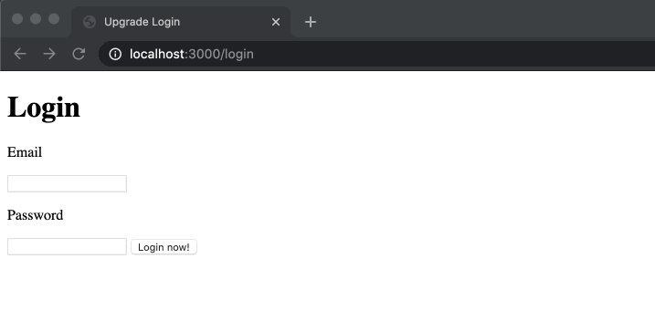

# Node S7: Middlewares & Multer

## Después de esta lección podrás:

1. Crear tus propios middlewares y utilizarlos en las rutas.
2. Subir archivos a tu base de datos y usarlos en tus vistas.

## ¿Qué son los middlewares?

Has ahora hemos estado viendo esta palabra aparecer muchas veces en todo el entorno relacionado con Node y Express pero, ¿sabemos realmente que son los middlewares?

Cuando utilizamos alguna nueva función en Express, ya sea una ruta o el mismo Passport que vimos en la última lección, aplicamos una funcionalidad a cada paso que damos en nuestro servidor:

```jsx
server.use(passport.initialize());
server.use(passport.session()); 

server.use(express.static(path.join(__dirname, 'public')));

server.use('/', indexRouter);
server.use('/pets', petRouter);
```

¿Podrías explicar lo que ocurre aquí arriba? Veamos paso a paso que está haciendo nuestro código.

Cada vez que llamamos a la función **`server.use()`** estamos diciéndole a nuestro servidor que siempre que recorra ese punto del código de nuestro servidor, aplique la función o las opciones que mandemos como argumento.

En este caso, `**passport.initialize()**` hará que Express aplique las opciones que se generen al llamar la función a la cadena de pasos que hay que dar en nuestro servidor. Y cuando utilizamos `**server.use('RUTA', ROUTER)`** lo que está ocurriendo es que Express relaciona dicha ruta con la serie de funciones GET, POST, PUT o DELETE que asignemos a dicho router.

### Creando nuestro primer middleware

En la última sesión vimos como se genera un sistema de autenticación con Express utilizando Passport, y para ello utilizamos middlewares que gestionan el sistema de cookies de sesión por nosotros como `**passport**`, `**express-session`** o **`connect-mongo`.** 

Como sabemos, passport añadía a nuestras Requests la propiedad `**req.user`** que contenía los datos de nuestro usuario debido al deserializado de nuestro usuario:

```jsx
passport.deserializeUser(async (user, done) => {
  try {
    const existingUser = User.findById(user._id);
    return done(null, existingUser);
  } catch (err) {
    return done(err);
  }
});
```

Bien, pues esto es exactamente un middleware, por lo que vamos a crear nuestro propio middleware para saber si un usuario está autenticado o no y así redireccionar su navegación creado **rutas protegidas.**

Crearemos una carpeta a la que llamaremos `**middlewares`** donde vivirán los archivos que contendrán nuestros middlwares. Dentro de esta carpeta vamos a crear un archivo llamado **`auth.middleware.js`** en el que crearemos los middlewares propios de autenticación que queramos.

En este archivo, aprovecharemos una propiedad que Passport añade a nuestra Request que se conocemos como **`req.isAuthenticated`** que consiste en una función que devolverá un Boolean para indicar si estamos o no logeados. ¡Vamos a crear el middlware!

```jsx
function isAuthenticated(req, res, next) {
  // Si el Boolean de autenticación devuelve true, avanzamos al siguiente punto
  if (req.isAuthenticated()) {
    return next();
  } else {
    // En caso de no hacer usuarios logeados, redireccionamos a login
    return res.redirect('/login');
  }
}

module.exports = {
  isAuthenticated,
}; 
```

**¿Cómo usaremos este middleware?**

Al igual que en Express podemos usar middlewares globales, que son exactamente los que hemos visto hasta ahora, podemos usarlos de forma local para algunas rutas.

Vamos a proteger las rutas de mascotas dentro de `**/pets**` para que únicamente sean accesibles a los usuarios que estén autenticados.

```jsx
const authMiddleware = require('./middlewares/auth.middleware');

server.use('/pets', [authMiddleware.isAuthenticated], petRouter);
```

Antes de utilizar el objeto que queramos aplicar para solventar la ruta (en nuestro caso petRouter) podemos añadir un array de middlewares como segundo argumento, lo que hará que el código pase por ese punto cada vez que acceda a dicha ruta. ¡Pongámoslo en acción!



¡Podemos ver que redirecciona al usuario de vuelta a login! 👏

## Usando un middleware para subir archivos

Hemos llegado al punto en el que nuestro servidor está casi plenamente funcional y solo faltan unos pequeños retoques antes de salir a producción 🔥 

Uno de esos pasos será subir archivos de forma manual a nuestro servidor y guardarlos en la carpeta `**public**` que preparamos para acceder a archivos públicos.

Como primer paso vamos a instalar la librería multer en nuestro servidor:

```bash
npm install --save multer
```

Crearemos entonces un archivo al que llamaremos `**file.middleware.js`** en nuestra carpeta de middlewares. Introduciremos lo siguiente en el archivo:

```jsx
const multer = require('multer');
const path = require('path');

const upload = multer({
  storage,
  fileFilter,
});

module.exports = { upload };
```

Hemos creado una constante upload que es el resultado de invocar la función `**multer()`** con dos opciones, pero no estamos enviando nada como opción por ahora. Vamos paso a paso.

**Creando un storage**

Para crear un objeto de tipo storage de Multer tenemos que invocar a la función **`multer.diskStorage`** que recibirá dos opciones, `**filename**` y **`destination`.**

```jsx
const storage = multer.diskStorage({
  filename: (req, file, cb) => {
    cb(null, Date.now() + file.originalname);
  },
  destination: (req, file, cb) => {
    cb(null, path.join(__dirname, '../public/uploads'));
  }
});
```

- Con la opción `**filename`** estamos invocando a una función que recibirá como parámetros la Request, el archivo que estamos subiendo y un callback. **El callback podrá invocarse con dos argumentos, un error y el nombre del archivo que queremos guardar.**

En nuestro caso, usaremos como nombre la fecha actual más el nombre original del archivo, creando así un nombre único y no replicable, de forma que no pise a los archivos previamente guardados en nuestro servidor.

- Con la opción `**destination`** crearemos un proceso parecido al anterior, pero en este caso enviaremos como segundo argumento del callback un string que corresponda con la dirección en disco de la carpeta donde guardaremos los archivos. En este caso, será **`/public/uploads`.**

**Creando un fileFilter**

Usaremos un filtro de archivos en nuestro caso porque únicamente queremos permitir a los usuarios la subida de imágenes al servidor y no de archivos de texto o canciones.

Crearemos por tanto una lista de archivos permitidos e invocaremos al callback con un error si la extensión del archivo subido no está admitida en el servidor. En caso contrario simplemento invocaremos el callback sin error y con un Boolean que sea true.

```jsx
const VALID_FILE_TYPES = ['image/png', 'image/jpg'];

const fileFilter = (req, file, cb) => {
  if (!VALID_FILE_TYPES.includes(file.mimetype)) {
    cb(new Error('Invalid file type'));
  } else {
    cb(null, true);
  }
}
```

Una vez configurado todo correctamente, el archivo tendrá el siguiente contenido:

```jsx
const path = require('path');
const multer = require('multer');

const VALID_FILE_TYPES = ['image/png', 'image/jpg'];

const upload = multer({
  storage: multer.diskStorage({
    filename: (req, file, cb) => {
      cb(null, Date.now() + file.originalname);
    },
    destination: (req, file, cb) => {
      cb(null, path.join(__dirname, '../public/uploads'));
    },
  }),
  fileFilter: (req, file, cb) => {
    if (!VALID_FILE_TYPES.includes(file.mimetype)) {
      cb(new Error('Invalid file type'));
    } else {
      cb(null, true);
    }
  },
});

module.exports = { upload: upload };
```

Ahora que tenemos listo nuestro middleware, solo tenemos que aplicarlo a una ruta. ¿Recuerdas que creamos un endpoint para crear nuevas mascotas en nuestra base de datos? Vamos a añadirle el middleware:

```jsx
const fileMiddlewares = require('../middlewares/file.middleware');

router.post(
  '/create',
  [fileMiddlewares.upload.single('picture')],
  async (req, res, next) => {}
);
```

Antes de ver el contenido del callback de la ruta (o controlador) vamos a explicar que ocurre cuando aplicamos el middleware.

Nuestro middleware es `**fileMiddlewares.upload`** pero a través de multer se ha añadido la funcion `**.single()`** que nos permite indicar que únicamente vamos a subir un archivo. El argumento que enviamos será `**'picture'`** ya que es el nombre del campo del body que llega a nuestro servidor. Si estuviésemos creando un usuario con avatar, podríamos llamar a este campo `**'avatar'`.**

Cada vez que multer consiga subir un archivo con éxito (si este existe), ocurrirá una proceso muy parecido al que aplica Passport cuando crea `**req.user**`, y adjunta en su lugar **`req.file`,** siendo este un objeto que representa nuestra imagen.

El campo `**req.file**` contendrá los siguientes campos:

```jsx
{
  fieldname: 'picture',
  originalname: 'image.png',
  encoding: '7bit',
  mimetype: 'image/png',
  destination: '',
  filename: '1588546283237.png',
  path: '',
  size: 460982
}
```

Para guardar la información dentro de nuestros modelos, usaremos el campo `**filename`** ya que conocemos que las imágenes están en nuestro servidor dentro de la carpeta `**public/uploads`** y por tanto podremos utilizarlas con la url `**http://localhost:3000/uploads/<FILENAME>`.**

**Subiendo una imagen a través de Postman**

Modificaremos el endpoint para que haga uso de la propiedad `**filename**` de nuestro archivo en caso de haberlo subido:

```jsx
router.post(
  '/create',
  [fileMiddlewares.upload.single('picture')],
  async (req, res, next) => {
    // Obtenemos el nombre de la imagen
    const dogPicture = req.file ? req.file.filename : null;
  
    try {
      // Crearemos una instancia de mascota con los datos enviados
      const newPet = new Pet({
        name: req.body.name,
        species: req.body.species,
        age: req.body.age,
        picture: dogPicture // Lo utilizamos en el modelo
      });

      // Guardamos la mascota en la DB
      const createdPet = await newPet.save();
      return res.status(200).json(createdPet);
    } catch (err) {
      next(err);
    }
  }
);
```

- **¡Nota! Recuerda añadir el campo picture a nuestro modelo Pet  `picture: { type: String }`, si no lo haces nunca se guardará la imagen en la base de datos ☠️**

Si completamos Postman de la siguiente manera, podremos crear un req.body a través de datos de tipo `**form-data`** y se podrá enviar una imagen en la petición.


Si ahora cambiamos nuestro archivo `**pets.hbs**` para que pueda renderizar la imagen de nuestras mascotas en caso de que existan utilizando el siguiente código:

```html
<body>
  <nav>
    <form action="/users/logout" method="POST"><input type="submit" value="Logout"></input></form>
  </nav>
  <h1>Todas las mascotas de Minsait Pets</h1>
  <ul>
    {{#each pets}}
    <li>
      <h3>Name: {{ this.name }}</h3>
      <h3>Age: {{ this.age }}</h3>
      <h3>Species: {{ this.species }}</h3>

      {{#if this.picture}}
        
      {{/if}}
    </li>
    {{/each}}
  </ul>
</body>
```

Veremos el resultado en nuestro navegador:


**¡Ya tenemos nuestro Doge con su imagen guardada en el servidor! 🐶🚀**

## Subiendo una imagen desde el navegador

Este paso necesita que hagamos una nueva ruta a la que llamaremos `**/pets/new`** en la que renderizaremos una vista del archivo `**new-pet.hbs`.**

Esta será nuestra nueva ruta:

```jsx
router.get('/new', (req, res) => {
  return res.status(200).render('new-pet');
});
```

Y este el archivo de vista `**new-pet.hbs**`:

```jsx
<!DOCTYPE html>
<html>

<head>
  <title>Minsait Pets - New!</title>
  <link rel="stylesheet" href="/stylesheets/new-pet.css">
</head>

<body>
  <h1>Crea tu nueva mascota!</h1>

  <form action="/pets/create" method="POST" enctype="multipart/form-data">
    <label for="name">
      <p>Name</p>
      <input type="text" name="name">
    </label>
    <label for="species">
      <p>Species</p>
      <input type="text" name="species">
    </label>
    <label for="age">
      <p>Age</p>
      <input type="number" name="age">
    </label>

    <label for="picture">
      <p>Picture</p>
      <input type="file" name="picture" accept="image/png, image/jpeg">
    </label>

    <input type="submit" value="Crear mascota">
  </form>
</body>

</html>
```

- **¡Nota! Observa el atributo de formulario `enctype="multipart/form-data"`. Este nos permitirá subir imágenes a nuestro servidor.**

Vamos a sustituir por último en nuestro enpoint `/pets/create` el tipo de respuesta para que en vez de devolver un JSON se encargue de renderizar la lista de mascotas para así poderlas ver cada vez que creemos una nueva usando el formulario:

```jsx
// Cambiaremos esto:
  const createdPet = await newPet.save();
  return res.status(200).json(createdPet);

// Por esto:
  await newPet.save();
  return res.redirect('/pets');

```

**¡Veamos el resultado en acción! 🔥**


### ¡Ya sabemos subir imágenes a nuestro servidor! 🎉