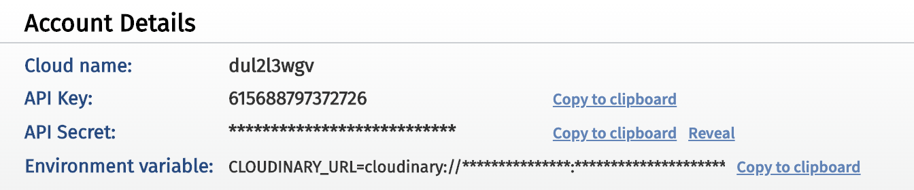
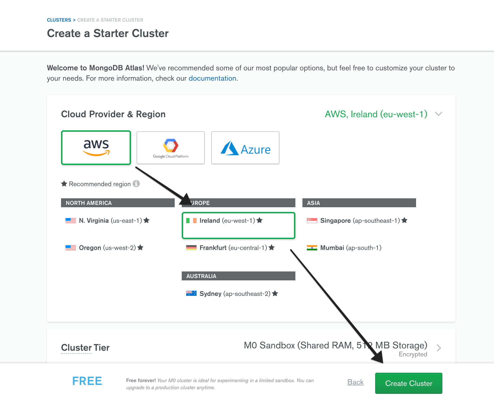
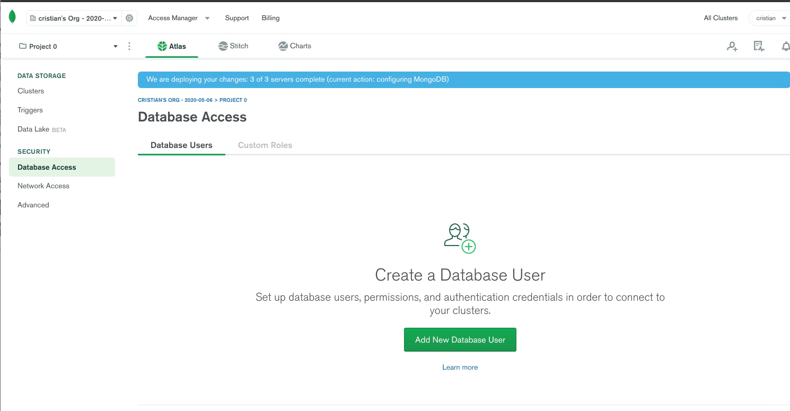
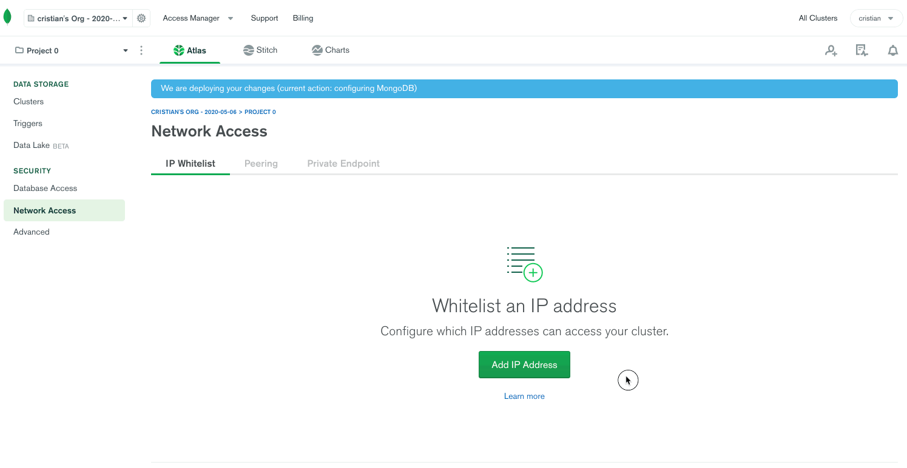
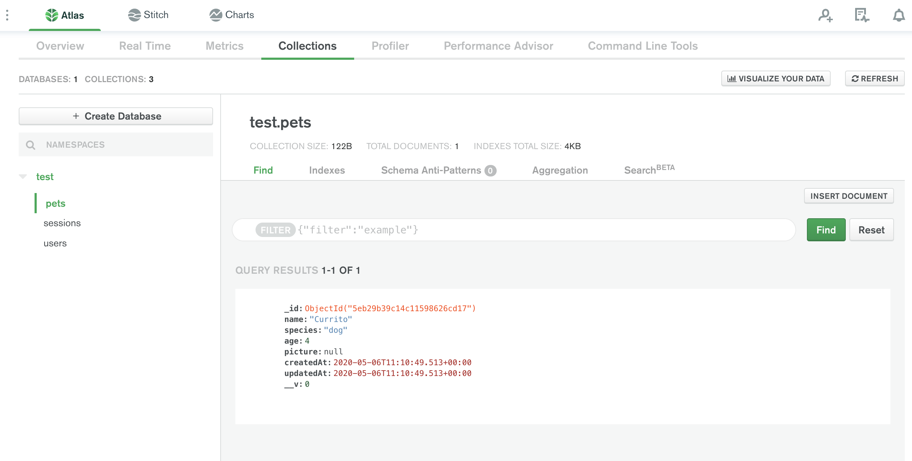
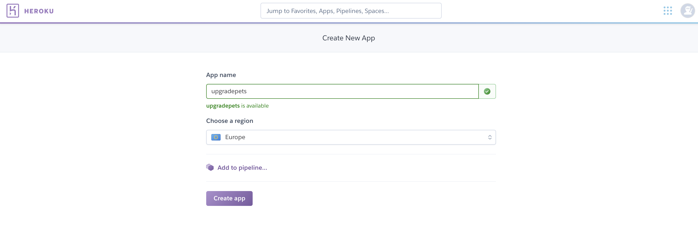
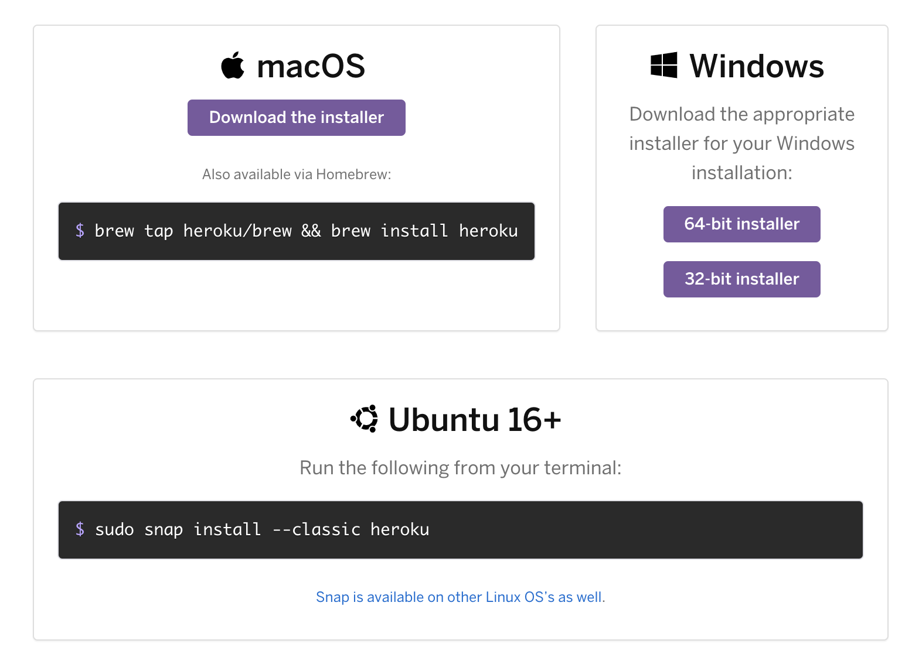
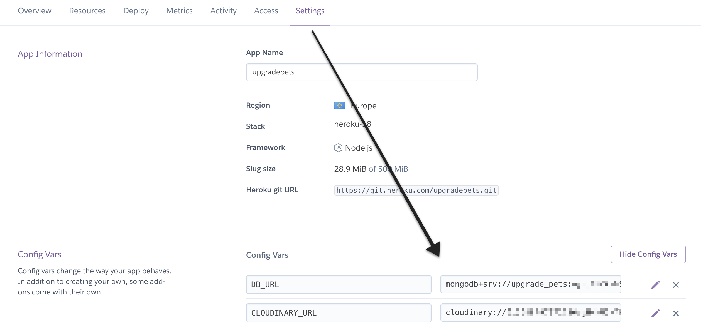
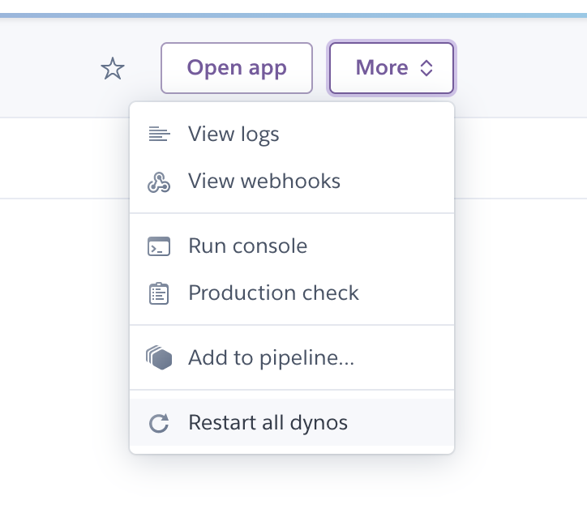

# Producción

## Después de esta lección podrás:

1. Usar servicio Cloud para almacenar tu servidor y archivos.
2. Tener tu proyecto listo para salir a producción.

## Configurando las variables de entorno

¡Ha llegado el momento de salir a producción y llevar a cabo nuestro primer despliegue! Pero antes tenemos que configurar una serie de cosas importantes.

Una de estas cosas se corresponde con las **Variables de Entorno**, es decir, variables muy importantes para nuestra aplicación, que usaremos de forma global en todo el proyecto y cuyo valor dependerá del entorno en el que arranquemos nuestro proyecto. 

Veamos esto más en profundidad con la configuración inicial de los puertos. En el proyecto sobre mascotas que hemos estado trabajando estas sesiones, configuramos un puerto inicial de la siguiente forma:

```jsx
const PORT = 3000;

server.listen(PORT, () => {});
```

Esta configuración hará que nuestro servidor siempre se inicialice en el puerto 3000 de nuestro localhost. Pero cuando estemos en producción el puerto será algo más complicado de configurar debido a que, dependiendo del proveedor de servicios que utilicemos, se deben usar puertos diferentes al 3000.

**¿Cómo solucionamos este problema y flexibilizamos la aplicación?**

Vamos a instalar una librería npm que se encargará de gestionar las variables de entorno por nosotros:

```bash
npm install --save dotenv
```

Una vez instalado `**dotenv**` solamente tenemos que requerirlo antes que cualquier otra librería en nuestro archivo principal `**index.js`** de la siguiente forma:

```jsx
require('dotenv').config();
// Resto del archivo de inicialización del servidor...
```

Como siguiente paso tenemos que crear un archivo en la raíz de la carpeta de nuestro servidor, a la altura de `**index.js**` al que llamaremos `**.env`** en el que vamos a introducir la siguiente variable:

```bash
PORT=4000
```

 

Ahora solo tenemos que cambiar nuestra variable de puerto por:

```jsx
const PORT = process.env.PORT || 3000;
```

Si iniciamos nuestro servidor con todo correctamente configurado veremos que el nuevo puerto en el que está escuchando en nuestro [`**localhost**`](http://localhost) es el `**4000**`, y si por alguna razón no tenemos el archivo `**.env**` usaremos el puerto `**3000**`. 

**Aplicando la configuración a más partes de nuestro proyecto**

Ahora que tenemos las variables de entorno a pleno funcionamiento vamos a configurar más elementos del servidor. La base de datos que estamos utilizando tiene el siguiente nombre:

```jsx
// URL local de nuestra base de datos en mongoose y su nombre upgrade_class_3
const DB_URL = 'mongodb://localhost:27017/upgrade_class_3';
```

- El nombre se debe a que comenzamos con el proyecto en la clase 3 de Node y hemos seguido utilizando este proyecto a lo largo del módulo.

Cuando estemos en producción tendremos una base de datos en Cloud, por lo que no usaremos la local, vamos a cambiar la línea anterior:

```jsx
const DB_URL = process.env.DB_URL || 'mongodb://localhost:27017/upgrade_class_3';
```

Con esta nueva variable utilizaremos la variable de entorno `**DB_URL**` si existe y en caso de no existir usaremos nuestro mongodb local.

**¿Recuerdas la configuración de `express-session`?** 

```jsx
app.use(
  session({
    secret: 'upgradehub_node', // ¡Este secreto tendremos que cambiarlo en producción!
    resave: false, // Solo guardará la sesión si hay cambios en ella.
    saveUninitialized: false, // Lo usaremos como false debido a que gestionamos nuestra sesión con Passport
    cookie: {
      maxAge: 3600000, // Milisegundos de duración de nuestra cookie, en este caso será una hora.
    },
    store: new MongoStore({ mongooseConnection: mongoose.connection }),
  })
);
```

El atributo `**secret**` es algo privado de nuestra aplicación, vamos a usar variable de entorno para este:

```jsx
secret: process.env.SESSION_SECRET || 'upgradehub_node',
```

Ahora solo tenemos que añadir la nueva variable de entorno en `**.env`** y tendremos todo configurado:

```bash
PORT=4000
DB_URL=
SESSION_SECRET=@123_asd*456?
```

Nuestro secreto será `**@123_asd*456?**` cuando reiniciemos el servidor, por lo que ya nadie podrá conocerlo aun accediendo al código si lo tenemos configurado en nuestro `**.env`.**

## Subiendo archivos a la nube con Cloudinary

La subida de archivos con `**multer**` ha sido gestionada de forma que hemos estado almacenando los archivos en la carpeta `**public**` de nuestro servidor. Esto tiene una problemática a la hora de almacenar muchas imágenes debido a que podríamos sobrecargar nuestro espacio reservado en el servidor que usemos.

Solucionar esta problemática pasa por utilizar un servicio alternativo en Cloud especializado en almacenamiento de archivos, como `**Cloudinary**`.

**Web oficial: [https://cloudinary.com/](https://cloudinary.com/)**

Una vez nos registremos, podemos obtener nuestras claves en el panel de control principal:



Fíjate en **Environment variable,** nos dan por defecto una variable preparada para su uso en nuestro proyecto, vamos a copiarla clickando en `**Copy to clipboard`.**

Pegaremos esta variable de entorno en nuestro `**.env`** para que esté de forma global en nuestro proyecto.

Ahora seguiremos los pasos recomendados por Cloudinary y vamos a crear un nuevo middleware que, dado un archivo subido de forma local a nuestro servidor, lo envíe al servicio cloud `**Cloudinary**` y borre el archivo local una vez subido.

```bash
npm install --save cloudinary
```

Vamos al archivo `**file.middleware.js**` que creamos en la sesión anterior y añadimos:

```jsx
const path = require('path');
const multer = require('multer');

// Importaremos las librerías necesarias para la nueva función
const fs = require('fs');
const cloudinary = require('cloudinary').v2;

const VALID_FILE_TYPES = ['image/png', 'image/jpg'];

const upload = multer({
  storage: multer.diskStorage({
    filename: (req, file, cb) => {
      cb(null, Date.now() + path.extname(file.originalname));
    },
    destination: (req, file, cb) => {
      cb(null, path.join(__dirname, '../public/uploads'));
    },
  }),
  fileFilter: (req, file, cb) => {
    if (!VALID_FILE_TYPES.includes(file.mimetype)) {
      cb(new Error('Invalid file type'));
    } else {
      cb(null, true);
    }
  },
});

// Ahora tenemos un nuevo middleware de subida de archivos
const uploadToCloudinary = async (req, res, next) => {
  if (req.file) {
    const filePath = req.file.path;
    const image = await cloudinary.uploader.upload(filePath);

    // Borramos el archivo local
    await fs.unlinkSync(filePath);
  
    // Añadimos la propiedad file_url a nuestro Request
    req.file_url = image.secure_url;
    return next();
  } else {
    return next();
  }
};

module.exports = { upload: upload, uploadToCloudinary };
```

Ahora que tenemos nuestro middleware de subida de imágenes a Cloudinary, vamos a usarlo de nuevo en el endpoint de mascotas:

```jsx
router.post(
  '/create',
  // Ahora usamos DOS middlewares en el orden necesario
  [fileMiddlewares.upload.single('picture'), uploadToCloudinary],
  async (req, res, next) => {
    // Obtenemos el nombre de la imagen de cloudinary
    const picture = req.file_url || null;

    try {
      // Crearemos una instancia de mascota con los datos enviados
      const newPet = new Pet({
        name: req.body.name,
        species: req.body.species,
        age: req.body.age,
        picture: picture, // Lo utilizamos en el modelo
      });

      // Guardamos la mascota en la DB
      await newPet.save();
      return res.redirect('/pets');
    } catch (err) {
      next(err);
    }
  }
);
```

La URL de la imgen estará ahora en `**picture**`, por lo que a partir de ahora podremos usar desde el frontend `**pet.picture`** como source de nuestras imágenes de mascotas directamente. 🎉

**¡Pruébalo e investiga las opciones que da Cloudinary! Podemos editar imágenes en el momento de subirla y configurar muchas opciones de forma gratuita.**

## Preparando la base de datos en MongoAtlas

Nos registramos en **[https://cloud.mongodb.com/](https://cloud.mongodb.com/)** para tener una cuenta oficial que nos permita craer Clusters de base de datos para MongoDB.

Una vez tengamos la cuenta creada, vamos a crear un **Cluster de Tier Gratuito en Irlanda** (la mejor zona disponible de cara al consumo en España):



Ahora iremos a la opción `**Database Access**` de la barra de navegación izquierda y crearemos un nuevo usuario con acceso a nuestros Clusters.



- **¡Nota! Copia la contraseña que uses para el usuario creado y guárdala de forma segura.**

Ahora vamos a la opción `**Network Access**` y configurando nuestra IP de acceso a la base de datos. Esta IP será la que utilice el host de nuestro servidor, pero como estamos preparando un proyecto personal y para facilitar el desarrollo y aprendizaje, vamos a permitir acceso global.



Por último, accederemos a `**Clusters**` y conseguiremos el string de conexión para nuestra aplicación:


Ahora toca configurar nuestra variable de entorno para conectarnos a la DB cuando trabajemos en producción en nuestro `**.env`:**

```jsx
DB_URL=mongodb+srv://upgrade_pets:<password>@cluster0-mrmkf.mongodb.net/test?retryWrites=true&w=majority
```

- **¡Nota! Utiliza el password del usuario que creamos previamente para conectarte.**

Si utilizamos la variable de entorno en nuestro servidor y lo iniciamos podremos utilizar la DB de mongo, vamos a crear una nueva mascota usando las funciones de las sesiones anteriores y a ver si se ha generado en nuestro Cluster:



¡Lo tenemos! Ahora podemos cambiar el nombre de la colección modificando esta parte de nuestro string de conexión:

```bash
# Cambiaremos la parte del string: **/test**
cluster0-mrmkf.mongodb.net**/test**?retryWrites=true&w=majority

# Y usaremos el nombre de la DB que queramos crear
cluster0-mrmkf.mongodb.net**/pets**?retryWrites=true&w=majority
```

**¡Ya podemos conectarnos con una base de datos en Cloud para trabajar en producción! 🎉**

## Saliendo a producción con Heroku

Por último nos queda exponer nuestro servidor al público para el acceso global. Esto lo conseguiremos por medio de un proveedor de servicio de almacenamiento de servidores.

Entre todos lo que hay en el mercado, Heroku es una opción gratuita que permite subir nuestros proyectos muy rápidamente y gestionarlos desde un panel de control muy intuitivo.

**Crearemos nuestra cuenta en: [https://signup.heroku.com/](https://signup.heroku.com/)**

Una vez creada la cuenta, crearemos una nueva App con las siguientes opciones (usa el nombre que prefieras para tu aplicación):



Para subir nuestra aplicación tendremos que seguir los pasos necesario para instalar Heroku CLI en nuestra terminal.



Una vez tengas Heroku CLI instalado, introduce en la terminal el comando `**heroku login`** y pulsa alguna tecla para abrir una ventana del navegador que te permita logearte.

Una vez te hayas logeado con tu cuenta de heroku, vamos a hacer un commit de nuestros ultimos cambios no sin antes haber creado un archivo `.gitignore` que al menos contenga como excepción:

```bash
/node_modules
.env
```

Una vez esté todo commiteado, lanza el comando `**heroku git:remote -a HEROKU_PROJECT_NAME**`  donde usaremos el nombre de nuestro proyecto de Heroku en vez de  `**HEROKU_PROJECT_NAME**` y tras esto haz un push del proyecto con **`git push heroku master`:**

```bash
heroku git:remote -a upgradepets
git push heroku master
```

Ahora iremos a la opción `**Settings**` de la navegación de nuestro panel de Heroku y configuraremos las variables de entorno que necesitamos. En Heroku **nunca debemos utilizar una variable de entorno para el puerto**:



Una vez hecho, reiniciaremos nuestras instancias en `**More**` y `**Restart all Dynos`:**



Una vez hecho, en `**Open app**` podremos acceder a la URL donde estará desplegada nuestra aplicación 🚀

### Ejercicio del día

Hoy no haremos un ejercicio con metología Merge Request, sino que trabajaremos en nuestro primer proyecto en "producción". 

Crea un pequeño proyecto en Express, con una ruta y endpoint GET `/` que actuará como `**Home`** a través del cual renderizarás un archivo `**home.hbs**` con tu curriculum. 

Usa las herramientas aprendidas para subir imágenes con otros endpoints bajo `/api` y saca la información de las secciones de tu perfil  (experiencia laboral, tecnologías...) de una MongoDB en la que puedes crear modelos a tu gusto.

¡Sube esto a Heroku y compártelo con el resto de tus compañer@s! ¡Felicidades en tu primer proyecto en cloud de portfolio!