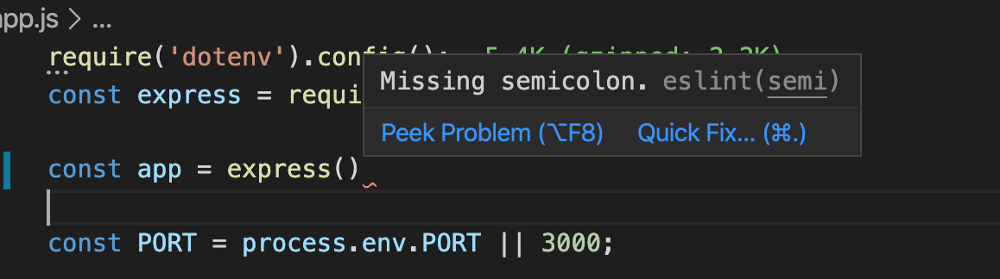
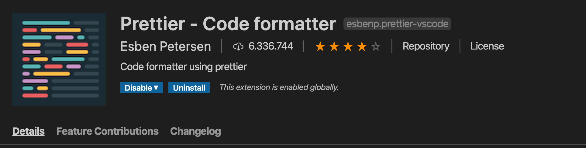

# New Project

**¡Hoy empezamos el proyecto final del módulo de Node y Express! 🎉** 

Vamos a comenzar configurando todo nuestro entorno de desarrollo para facilitar el proceso de crear código y debuggar nuestro proyecto. Esto es muy importante para el trabajo en equipo y nuestro día a día en programación.

## Iniciando nuestro proyecto

Vamos a crear una nueva carpeta con el nombre de nuestro proyecto e inicializaremos dentro de esta carpeta un `package.json`:

```bash
mkdir NOMBRE_PROYECTO
cd NOMBRE_PROYECTO
npm init -y
```

Podemos preparar los scripts iniciales con los que vamos a trabajar en Node cambiando el atributo `**"scripts"**` de `**package.json`:**

```json
"scripts": {
  "start": "node app.js",
  "dev": "nodemon app.js"
},
```

Como puedes observar, vamos a crear todo el proyecto en un archivo `**app.js**` en vez de en un archivo `**index.js`** dedido a que tiene un mayor sentido semántico llamar a nuestro archivo por lo que representa, el archivo que lanza una aplicación.

Vamos a instalar tres librerías iniciales:

```bash
npm install express dotenv

npm install --save-dev nodemon
```

**¡Ahora tenemos `nodemon` preparado para reiniciar el servidor en modo desarrollo!**

Vamos a preparar el archivo `**app.js**` con un servidor básico de Express:

```jsx
require('dotenv').config();
const express = require('express');

const app = express();

const PORT = process.env.PORT || 3000;

app.listen(PORT, () => {
  console.log(`Listening in http://localhost:${PORT}`);
});
```

Tan solo nos queda crear los archivos `**.env**` y `**.gitignore`** para configurar todo lo básico:

```bash
# Environment Variables
PORT=
DB_URL=
```

- ¡Dejaremos vacíos los campos por ahora!

```bash
# Ignore this folders when using git add
/node_modules
.env
.DS_Store
```

Por último, iniciamos nuestro repositorio de GIT con `**git init`** y añadiremos todo a nuestro primer commit:

```bash
git init
git add .
git commit -m "First commit. Create project"
```

**¡Ya está todo listo para que empecemos a trabajar! 🚀**

## Preparando ESLint con Node

Vamos a preparar reglas de lintado para que nuestro proyecto reciba correcciones automáticas cuando escribamos mal nuestro código.

Instalaremos `**eslint**` en `**devDependencies**` ya que solo será necesario en desarrollo:

```bash
npm install --save-dev eslint
```

Y ahora usaremos `**npx**` para lanzar el configurador automático de `**eslint**`:

```bash
npx eslint --init
```

Una vez aparezca la interfaz con la vamos a interactuar, vamos a elegir las siguientes opciones:

```bash
**? How would you like to use ESLint?** To check syntax, find problems, and enforce code style
**? What type of modules does your project use?** CommonJS (require/exports)
**? Which framework does your project use?** None of these
**? Does your project use TypeScript?** No
**? Where does your code run?** Browser
**? How would you like to define a style for your project?** Use a popular style guide
**? Which style guide do you want to follow?** Google: https://github.com/google/eslint-config-google
**? What format do you want your config file to be in?** JSON
```

Como último paso, instalaremos las dependencias con npm introduciendo `**Y`** cuando sea necesario:

```bash
**? Would you like to install them now with npm?** Yes
```

Cuando todo termine de configurarse, tendremos un corrector automático para que nuestro código nos avise de los errores de sintaxis, como cuando nos falten `**;**` al final de una línea:



## Preparando Prettier para Node

Este paso será muy sencillo ya que consistirá en configurar un archivo único e instalar pocas dependencias:

```bash
npm install --save-dev prettier eslint-config-prettier eslint-plugin-prettier 
```

Añadiremos lo siguiente a nuestro archivo `**.eslintrc.json`** usando el nuevo prettier instalado:

```json
...
"extends": ["prettier", "google"],
"plugins": ["prettier"],
...
```

Ahora crearemos un archivo `**.prettierrc**` en la raíz de nuestra carpeta de proyecto con el siguiente contenido:

```json
{
  "tabWidth": 2,
  "semi": true,
  "singleQuote": true,
  "trailingComma": "es5",
  "printWidth": 100
}
```

Y para terminar instalaremos la extensión **`Prettier`** en `**VSCode`:**



## Configurando hooks de Husky y Lint-staged

Para prevenir que subamos código erróneamente a nuestro repositorio vamos a instalar un par de librerías que gestionarán nuestros archivos cuando hagamos `**git commit**`  o `**git push**`.

Vamos a instalar estas dos librerías:

```bash
npm install --save-dev husky lint-staged
```

Y ahora añadiremos a nuestro archivo `**package.json**` la siguiente configuración:

```json
"husky": {
    "hooks": {
      "pre-commit": "lint-staged",
      "pre-push": "lint-staged"
    }
  },
  "lint-staged": {
    "*.js": [
      "prettier --write",
      "eslint"
    ]
  }
```