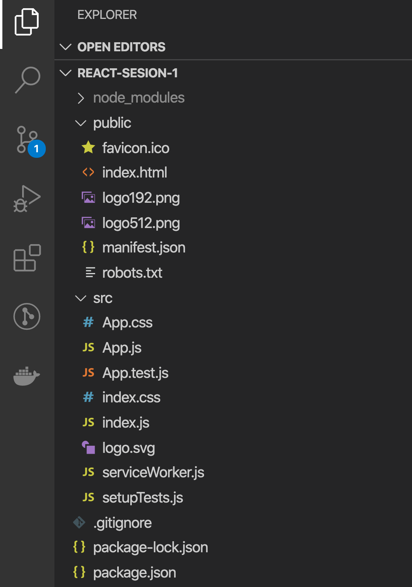
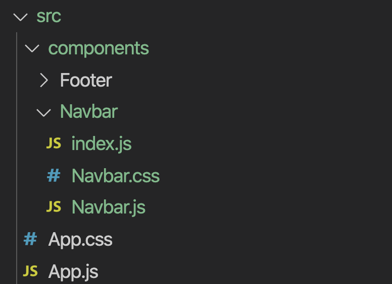
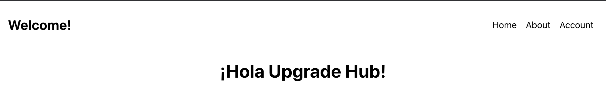

# S1 | JSX & Componentes

### Después de esta lección podrás:

1. Entender para qué sirve React y por qué es una librería.
2. Crear tus propios componentes y combinarlos.

## ¿Qué es React?

React es una librería utilizada sobre JavaScript a través de la cual podremos dividir nuestras aplicaciones en pequeñas piezas llamadas **`Componentes`** como si fueran partes de un set de Lego. Podremos reutilizarlas en cualquier punto de nuestra aplicación si son lo suficientemente versátiles o en un solo punto específico si cumplen una sola labor.

Estos componentes los escribiremos con una mezcla de lenguajes que no hemos visto hasta el momento, el **JSX.** Esto comprenderá que nuestros componentes sean archivos `.js` o `.jsx` que **combinarán código en JavaScript con XML.** Podrán incluso combinar CSS con JS en algunos casos que veremos en las próximas clases.

Así es como veremos un componente:

```jsx
import React from 'react';

export default class Example extends React.Component {
  render() {
    return (
      <div>
        <h1>Hello Minsait!</h1>
      </div>
    );
  }
}

<Example/>
```

¡Esto creará un <div> con un <h1> dentro siempre que utilicemos el componente en cualquier punto de la aplicación!

### ¿Por qué es React una librería? 📚

A diferencia de `**Angular**`, que sí consideramos un framework al necesitar un patrón de desarrollo más estandarizado y contar en conjunto con un sistema completo de rutas, tests y servicios, a `React` lo consideramos una librería a  pesar de que utilizándolo podemos hacer proyectos a gran escala.

Esto se debe a que cuando comezamos a trabajar con React, nos daremos cuenta de que realmente se comporta únicamente como una librería que, a través de una nueva metodología de trabajo, permite una generación rápida de vistas y componentes de UI.

En cambio, si necesitamos sistema de rutas para nuestro cliente, una herramienta de tests o un servicio a nivel general para nuestra aplicación, tendremos que instalar librerías adicionales que en su conjunto conformarán un framework de trabajo.

### Trabajando con React y JSX

Como hemos visto previamente,  los componentes de React se escribirán usando JSX, lo que conllevará aprender una nueva forma de trabajo.

Para poder usar JSX necesitamos crear componentes que utilicen React de forma que estos sean interpretados por el navegador, que inyectará el bundle de JavaScript procesado en un <div> sobre la web. Vamos a ver más sobre esto a continuación.

### Create React App 🔧

Desde este momento en adelante, trabajaremos utilizando una librería npm muy utilizada llamada `create-react-app` que nos permitirá crear proyectos de React con una estructura básica directamente en nuestro equipo. Veamos el comando a seguir:

```bash
npx create-react-app NOMBRE_PROYECTO
```

Si lanzamos este comando en una terminal, podremos ver como se genera un proyecto con el nombre que hayamos indicado en una nueva carpeta. Si accedemos al proyecto veremos la siguiente estructura:



**Vamos a repasar por partes todo este contenido para aprender bien de donde viene cada función de un nuevo proyecto de React.**

### Carpeta public ⛳️

Esta carpeta será donde deben vivir los archivos de entrada principales donde llegará la petición de cualquier usuario de nuestra web. 

Entre estos archivos se encuentran los assets públicos como el `**favicon`, `manifest`** y `**robots**` que ayudarán a identificar nuestra web y trabajar en nuestra web progresiva y el SEO.

El archivo de mayor importancia aquí es el `index.html`, que tendrá la siguiente estructura:

```html
<!DOCTYPE html>
<html lang="en">
  <head>
    <meta charset="utf-8" />
    <link rel="icon" href="%PUBLIC_URL%/favicon.ico" />
    <meta name="viewport" content="width=device-width, initial-scale=1" />
    <meta name="theme-color" content="#000000" />
    <meta
      name="description"
      content="Web site created using create-react-app"
    />
    <link rel="apple-touch-icon" href="%PUBLIC_URL%/logo192.png" />
    <link rel="manifest" href="%PUBLIC_URL%/manifest.json" />
    <title>React App</title>
  </head>
  <body>
    <noscript>You need to enable JavaScript to run this app.</noscript>
    **<div id="root"></div>**
  </body>
</html>
```

Presta atención a esta línea en especial **`<div id="root"></div>`.** Aquí solamente tenemos un div que tiene una `id` con nombre `root` , ¿y nuestra aplicación?

React se encargará automática de inyectar TODA nuestra aplicación en el div con id `root` que encuentre en el archivo `index.html` de la carpeta `public` ¡así que recuerda no borrarlo ni duplicarlo nunca!

### Carpeta source (src) ⭐️

¡Aquí es donde está la parte importante de nuestra aplicación! Vamos al archivo `index.js` para ver que ocurre en el entrypoint de nuestra carpeta:

```jsx
import React from 'react';
import ReactDOM from 'react-dom';
import './index.css';
import App from './App';
import * as serviceWorker from './serviceWorker';

ReactDOM.render(
  <React.StrictMode>
    <App />
  </React.StrictMode>,
  document.getElementById('root')
);

// If you want your app to work offline and load faster, you can change
// unregister() to register() below. Note this comes with some pitfalls.
// Learn more about service workers: https://bit.ly/CRA-PWA
serviceWorker.unregister();
```

Podemos observar que se están importando bastantes cosas, vamos en orden:

- Primero importamos `**React**` ya que debe estar siempre en cada archivo que utilice JSX.
- Luego tenemos `**ReactDOM**` que es la parte de react encargada de inyectar toda nuestra aplicación sobre un elemento HTML.
- Importa una hoja de estilos, ya que a partir de ahora no las importaremos en el HTML sino como si fuesen un archivo.
- Ahora importa un `**componente`** llamado **`App`** que veremos a fondo en la siguiente sección.
- Por último, un `**serviceWorker`** que servirá para trabajar con PWA y que no veremos en este módulo, por lo que podemos eliminarlo sin problemas por ahora 🔥

Y ahora, ¡a lo importante! ¿Que ocurre en esta parte del código?

```jsx
ReactDOM.render(
  <React.StrictMode>
    <App />
  </React.StrictMode>,
  document.getElementById('root')
);
```

Estamos haciendo que `**ReactDOM`** renderice, es decir, pinte nuestro componente interpretado, sobre el elemento con id `**root**` del HTML. ¡Ahora todo cuadra! 💡 

¿Ves como se está utilizando un componente? Le damos un nombre en el `**import**` y lo utilizamos como un tag HTML, luego ahondaremos más en esto.

Con respecto a la etiqueta `React.StrictMode`, es una herramienta para obligarnos a programar con React de la forma adecuada que supervisará nuestro código y nos avisará de posibles bugs que puedan surgir en futuras versiones si no hacemos caso a las indicaciones. **¡Muy útil!**

### Componente App

Para comenzar a trabajar en una aplicación de React, debemos crear un componente App que será importado en el `**index.js**` y será el punto de entrada inicial de todos nuestros componentes.

Veamos como está estructurado el componente principal de la aplicación:

```jsx
import React from 'react';
import './App.css';

function App() {
  return (
    <div className="App">
      {/* Ejemplo de comentario en JSX... */}
    </div>
  );
}

export default App;
```

Este componente importa `**React`** ya que hace uso de JSX, y luego crea una función App que exporta mediante `**export default**` (lo que significa que podemos importarla directamente mediante el comando `**import App from 'PATH'`).**

Lo que este componente devuelva en su `**return**` debe ser siempre **JSX** que represente el **HTML** que se verá en nuestra aplicación.

Si te fijas en la diferencia con el primer componente que vimos al inicial la sesión, este componente no es una clase. Vamos a ver que ocurre con ellos a continuación.

## Componentes de clase y funcionales

Como vimos al principio y como se creaban componentes en React en principio, los `**componentes eran clases**` que extendían de `React.Component` y hacían su `return` a través de la función `render` como vemos a continuación:

```jsx
import React from 'react';
import './App.css';

class App extends React.Component {
  render() {
    return (
      <div className="App">
        <h1>¡Hola Minsait!</h1>
      </div>
    );
  }
}

export default App;
```

En cambio, desde hace no mucho tiempo, se trabaja normalemente con `**componentes funcionales`** que permiten exprimir al máximo todas las funcionalidades y patrones de programación funcional que ofrece React.

```jsx
import React from 'react';
import './App.css';

function App() {
  return (
    <div className="App">
      <h1>¡Hola Minsait!</h1>
    </div>
  );
}

export default App;
```

**¡Fíjate en que la diferencia es mínima! Aunque esto será por ahora, en las próximas sesiones podrás apreciar realmente las diferencias entre ambas metodologías de desarrollo.**

Para este módulo tenemos pensado enseñarte React de la mejor manera posible, y como a día de hoy la gran mayoría de empresas siguen manteniendo parte de su código con componentes de clases, vamos a comenzar trabajando con ellos para que los entiendas perfectamente antes de pasar a componentes funcionales. 👩‍🏫

## Combinando componentes

¡Llegamos a la parte importante de React! Combinar componentes como pequeñas piezas de un puzle es la forma de desarrollar más avanzada para React, aunque ahora es donde comienzan los  quebraderos de cabeza, ¿dónde pongo mis componentes? ¿cómo los estructuro?

Después de trabajar durante un tiempo con React, hemos observado que hay una estructura de archivos que funciona muy bien y escala correctamente, aunque esto puede ser utilizado de cualquier otra manera, vamos a adentrarnos con esta estructura de componentes:

```jsx
app_folder
└── src
    └── components
        ├── componentName
        │   ├── componentName.css
        │   ├── componentName.js
        │   └── index.js
        └── index.js
```

De esta forma, si creamos un componente `Navbar` en nuestra aplicación que utiliza CSS, lo estructuraremos de la siguiente forma:



**¿Y qué contenido tendrán estos archivos? ¡Vamos a construir nuestra Navbar!**

Este será en contenido en `Navbar.js`, donde vivirá nuestro componente:

```jsx
import React from 'react';

import './Navbar.css';

class Navbar extends React.Component {
  render() {
    return (
      <nav>
        <h1>Welcome!</h1>

        <ul>
          <li>Home</li>
          <li>About</li>
          <li>Account</li>
        </ul>
      </nav>
    );
  }
}

export default Navbar;
```

En el archivo `index.js` de la carpeta tendremos lo siguiente:

```jsx
import Navbar from './Navbar';

export default Navbar;
```

**¿Por qué usamos index?** De esta forma, todo lo relacionado con nuestro componente puede vivir en la carpeta `Navbar` y para importarlo solamente tendremos que hacer:

```jsx
import Navbar from '<PATH>/components/Navbar'
```

Este import es `default`, y  no es necesario importar el archivo Navbar de dentro, sino que a través del `index.js` se exporta e importa todo el contenido de la carpeta de forma automática. 🎉 

Con respecto al CSS, pues añadiremos contenido acorde a nuestro componente:

```css
nav {
  display: flex;
  justify-content: space-between;
  align-items: center;
  padding: 0.5rem 1rem;
}

ul {
  display: flex;
  justify-content: space-between;
  align-items: center;
  list-style: none;
}

li {
  margin: 0 0.5rem;
}
```

Ahora tan solo tenemos que importar nuestro componente en `App` para utilizarlo de la siguiente forma (hemos dejado que App sea funcional porque viene por defecto cuando creamos el proyecto):

```jsx
import React from 'react';

import Navbar from './components/Navbar';

import './App.css';

function App() {
  return (
    <div className="App">
      <Navbar />
      <h1>¡Hola Minsait!</h1>
    </div>
  );
}

export default App;
```

- Fíjate  en que lo usamos como una etiqueta HTML normal. También presta atención al orden de los imports, ya que estamos dando prioridad a las librerías, luego a los archivos relativos y luego al CSS.

Esto lo veremos así en el navegador si lanzamos el comando `**npm run start**` en nuestra terminal dentro de la carpeta de proyecto:



¡Ya tenemos nuestros componentes pintándose en el DOM! Podemos comenzar a trabajar con React 👏

## Funciones de JSX

¿Pensabas que JSX era utilizado únicamente para utilizar componentes dentro de React? ¡Resulta que puedes utilizar JavaScript dentro mismo HTML si lo usas correctamente!

Vamos a introducir una variable en nuestra `**Navbar**`:

```jsx
import React from 'react';

import './Navbar.css';

// Variable que contiene el título
const TITLE = 'Welcome!';

class Navbar extends React.Component {
  render() {
    return (
      <nav>
        {/* Usando la variable... */}
        <h1>{TITLE}</h1>

        <ul>
          <li>Home</li>
          <li>About</li>
          <li>Account</li>
        </ul>
      </nav>
    );
  }
}

export default Navbar;
```

**¡Así es como podemos interpolar variables!  🎉** Aunque tenemos que tener un poco de cuidado con ello, ya que si introducimos arrays y objetos tendremos problemas renderizando en el DOM, y si añadimos una variable de valor `**null**` no pintaremos nada.

Vamos a utilizar condicionales en nuestro HTML mediante la interpolación de JSX:

```jsx
import React from 'react';

import './Navbar.css';

// Suponemos que este valor viene de una API
const language = 'es';

const spanishTitle = 'Bievenid@!';
const englishTitle = 'Welcome!';

class Navbar extends React.Component {
  render() {
    return (
      <nav>
        {/* ¡Usando la variable en un ternario para devolver otra variable! */}
        <h1>{language === 'es' ? spanishTitle : englishTitle}</h1>

        <ul>
          <li>Home</li>
          <li>About</li>
          <li>Account</li>
        </ul>
      </nav>
    );
  }
}

export default Navbar;
```

Recuerda que con JSX no podemos hacer un condicional `**if...else**` normal y que tenemos que hacerlos mediante ternarios, ¡aunque ya los dominamos perfectamente! 💪

Por último, veremos como iterar sobre un array. Vamos a hacerlo con nuestros `<li>`:

```jsx
import React from 'react';

import './Navbar.css';

// Suponemos que este valor viene de una API
const language = 'es';

const spanishTitle = 'Bievenid@!';
const englishTitle = 'Welcome!';

const navbarLinks = ['Home', 'About', 'Account'];

class Navbar extends React.Component {
  render() {
    return (
      <nav>
        <h1>{language === 'es' ? spanishTitle : englishTitle}</h1>

        <ul>
          {/* ¡Usamos map para iterar y devolver un nuevo JSX! */}
          {navbarLinks.map((linkName) => {
            return <li key={linkName}>{linkName}</li>;
          })}
        </ul>
      </nav>
    );
  }
}

export default Navbar;
```

Hemos utilizado el método `**map**` para recorrer el array y devolver un valor en forma de JSX para cada iteración (recuerda que si devolvemos `**null**` no se pintaría nada) como una etiqueta de tipo  `**<li>**`.

A cada `**return**` de la iteración le tenemos que añadir una `**key`** que sea **`ÚNICA para cada elemento`** debido a que React la utilizará como referencia para su renderizado en grupo. No utilices nunca el `**index**` que obtenemos del `**map**` como la `**key**` única, ya que esto puede cambiar si alteramos el array.

### Con lo visto hoy, hemos aprendido:

- ¿Qué es React y JSX?
- ¿Cómo funcionan los componentes y para que los utilizamos?
- Usos especiales de JS en JSX .