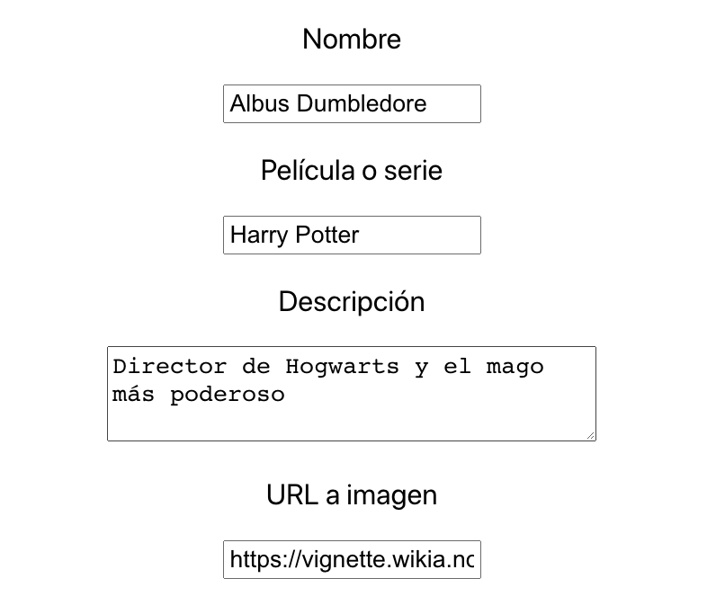
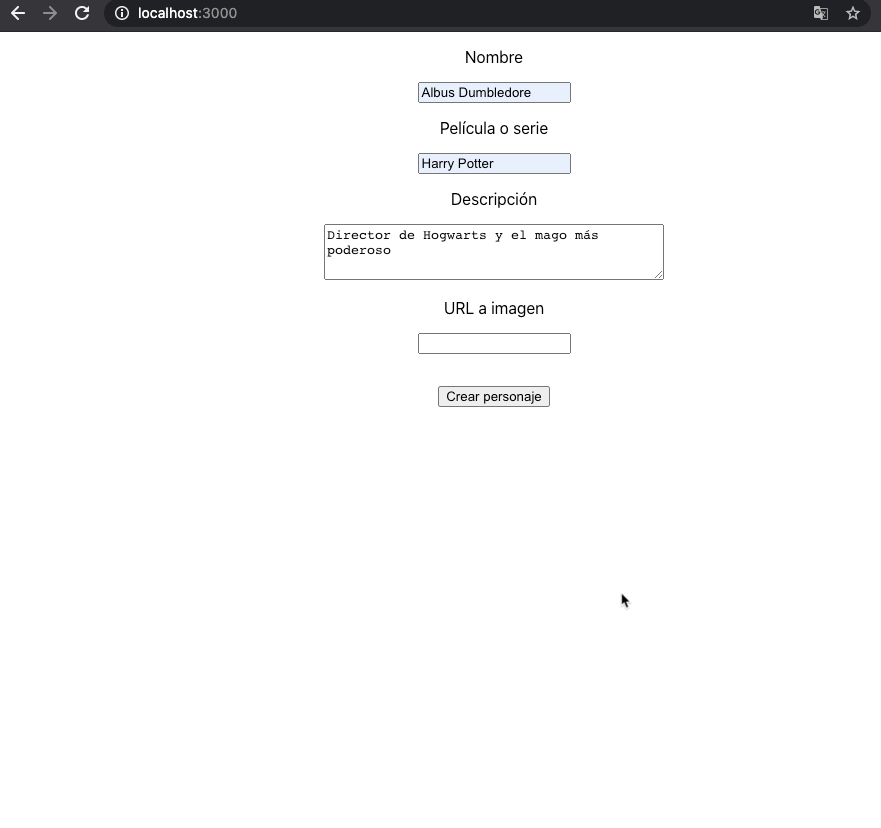

# S3 | Forms & state compartido

### Después de esta lección podrás:

1. Compartir estado y props a nivel avanzado
2. Crear formularios reactivos e interactivos
3. Usar eventos para comunicar los componentes de tu app.

### En la sesión anterior...

En la sesión anterior de este módulo aprendimos como utilizar `props` para enviar información desde un componente padre a sus componentes hijos. 

También aprendimos a crear un estado dentro de nuestros componentes para persistir información y poder cambiarla únicamente a través de `setState` de forma que estos datos sean inmutables excepto cuando lanzamos esta función, lo que provoca un nuevo render.

## Editando formularios

Uno de los elementos más extendidos y utilizados en todo internet es el formulario. Son la herramienta perfecta para recoger información de nuestros usuarios y finalmente tienen como objetivo enviar esta información a un servidor.

En React crearemos formularios reactivos, es decir, podremos escuchar cada cambio que ocurre en estos para poder lanzar `side-effects`. Esto lo conseguiremos por medio del uso extendido de eventos.

Como ejemplo, vamos a crear una pequeña web app que nos permita crear personajes y editar su información (simulando el funcionamiento de una API CRUD). ¡Vamos allá!

Comenzaremos creando un formulario mediante un componente de React al que llamaremos `Form`.

```jsx
import React from 'react';

class Form extends React.Component {
  handleFormSubmit = (e) => {
    // Tenemos que prevenir la recarga de la página
    e.preventDefault();
  };

  render() {
    return (
      <form onSubmit={this.handleFormSubmit}>
        {/* Aquí crearemos nuestros inputs y botón de submit */}
      </form>
    );
  }
}

export default Form;
```

Con este componente tenemos un `form` que llamará a la función `handleFormSubmit` cuando se pulsemos el botón de tipo `submit` que añadiremos más tarde.

Ahora vamos a crear un estado inicial para guardar los campos del formulario. Como vamos a crear una web app sobre personajes de películas supondremos los siguientes campos:

```jsx
state = {
  name: '',
  movie: '',
  description: '',
  imageUrl: '',
}
```

Y ahora podemos crear el primer `input` del formulario de la siguiente manera:

```jsx
return (
  <form onSubmit={this.handleFormSubmit}>
    <label>
      <p>Nombre</p>
      <input type="text" name="name" value={this.state.name} onChange={} />
    </label>
  </form>
);
```

Como puedes observar, ahora necesitamos una función onChange para este input, podríamos hacerla de la siguiente manera:

```jsx
handleChangeNameInput = (e) => {
  this.setState({
    name: e.target.value,
  });
};

<input
  type="text"
  name="name"
  value={this.state.name}
  onChange={this.handleChangeNameInput}
/>
```

Esta función cambiará el valor `name` de nuestro estado y lo actualizará en el input. El problema que surje mediante esta aproximación al problema es que a medida que necesitamos más campos, necesitamos nuevas funciones y por tanto acabaremos llenando el componente de handlers.

Para solucionarlo, podemos utilizar un valor del input como su atributo `name` para identificarlo corectamente:

```jsx
handleChangeInput = (e) => {
  this.setState({
    [e.target.name]: e.target.value,
  });
};
```

Y por tanto, podemos ampliar el formulario de la siguiente forma:

```jsx
import React from 'react';

class Form extends React.Component {
  state = {
    name: '',
    movie: '',
    description: '',
    imageUrl: '',
  };

  handleFormSubmit = (e) => {
    e.preventDefault();
  };

  handleChangeInput = (e) => {
    this.setState({
      [e.target.name]: e.target.value,
    });
  };

  render() {
    return (
      <form onSubmit={this.handleFormSubmit}>
        <label>
          <p>Nombre</p>
          <input
            type="text"
            name="name"
            value={this.state.name}
            onChange={this.handleChangeInput}
          />
        </label>

        <label>
          <p>Película o serie</p>
          <input
            type="text"
            name="movie"
            value={this.state.movie}
            onChange={this.handleChangeInput}
          />
        </label>

        <label>
          <p>Descripción</p>
          <textarea
            name="description"
            value={this.state.description}
            onChange={this.handleChangeInput}
          />
        </label>

        <label>
          <p>URL a imagen</p>
          <input
            type="text"
            name="imageUrl"
            value={this.state.imageUrl}
            onChange={this.handleChangeInput}
          />
        </label>
      </form>
    );
  }
}

export default Form;
```

Con esto podremos editar el formulario sin problemas y ver como se actualizan todos los campos correctamente:



**¡Bonus!** Antes de completar el formulario mediante la función `onSubmit`, vamos a hacer una preview de la imagen que utilicemos.

Añadiremos al final de los inputs un nuevo campo y el botón de submit:

```jsx
{/* Al final de todo el formulario... */}
<label>
    <p>URL a imagen</p>
    <input
      type="text"
      name="imageUrl"
      value={this.state.imageUrl}
      onChange={this.handleChangeInput}
    />
  </label>

  {/* ¡Estamos utilizando CSS en JS! */}
  <div style={{ padding: '1rem' }}>
    {this.state.imageUrl ? (
      
    ) : null}
  </div>

  <button type="submit">Crear personaje</button>
</form>
```

Y ahora veremos lo siguiente cuando rellenemos el formulario:


### Compartiendo datos entre estados

Vamos a proceder a guardar nuestros personajes en la lista de personajes de nuestra aplicación.

Para ello, necesitamos un nuevo estado un componente arriba del formulario. Vamos a crear uno en `App`:

```jsx
class App extends React.Component {
  state = {
    characterList: [],
  };

  addCharacter(character) {
    this.setState((prevState) => ({
      characterList: [...prevState.characterList, character],
    }));
  }

  render() {
    return (
      <div className="App">
        <Form />
      </div>
    );
  }
}
```

Como puedes ver, en App tenemos ahora un estado que almacenará la lista de personajes que crearemos. Además hemos añadido una función `addCharacter` que añadirá un personaje al estado cuando la invoquemos.

Vamos a crear ahora un nuevo componente que pintará una carta de personaje al que llamaremos `CharacterCard`:

```jsx
import React, { Component } from 'react';
import PropTypes from 'prop-types';

class CharacterCard extends Component {
  render() {
    const { name, imageUrl, movie, description } = this.props.character;

    return (
      <div
        style={{
          border: '1px solid grey',
          borderRadius: '0.25rem',
          padding: '0.5rem',
          maxWidth: '250px'
        }}
      >
        <h3>Name: {name}</h3>
        
        <h3>Movie: {movie}</h3>
        <h3>Description: {description}</h3>
      </div>
    );
  }
}

CharacterCard.propTypes = {
  character: PropTypes.shape({
    name: PropTypes.string,
    movie: PropTypes.string,
    description: PropTypes.string,
    imageUrl: PropTypes.string,
  }),
};

export default CharacterCard;
```

Ahora tenemos un componente preparado para utilizar un personaje de la lista dados los campos del state que habíamos creado. Vamos a actualizar nuestro formulario para utilizar la función `addCharacter` cuando hagamos submit:

```jsx
render() {
    return (
      <div className="App">
        <Form onSubmitForm={this.addCharacter} />      
      </div>
    );
  }
```

Esta será la función a la que llamaba nuestro formulario al hacer submit, pero con la llamada a su prop `onSubmitForm` actualizada:

```jsx
handleFormSubmit = (e) => {
  e.preventDefault();

  this.props.onSubmitForm(this.state);
  // Limpiamos los campos del formulario
  this.setState({
    name: '',
    movie: '',
    description: '',
    imageUrl: '',
  });
};
```

Este será el render final de nuestro componente `App`:

```jsx
render() {
  return (
    <div className="App">
      <Form onSubmitForm={this.addCharacter} />
      <div>
        {this.state.characterList.map((character) => (
          <CharacterCard
            key={`${character.name}${character.movie}`}
            character={character}
          />
        ))}
      </div>
    </div>
  );
}
```

Y el resultado final será el siguiente:



Ahora podemos crear un CRUD completo desde el frontend utilizando `React` a través del cual compartiremos información entre componentes. En este caso, tenemos la siguiente estructura:

- App envía un campo de su `state`, en este caso `characterList`, a un componente hijo. O en este caso uno de los elemento de este array.
- El estado de `App` se ve modificado por otro componente hijo, en este caso `Form`, a través de un evento `addCharacter`.
- Aparte del estado de `App` tenemos un estado propio en `Form` para gestionar el formulario de forma independiente.

Hay que tener mucho cuidado y pensar muy bien en qué lugares utilizaremos un `state` ya que, como recordarás de la sesión anterior, cualquier cambios en el `state` provoca un nuevo render de nuestros componentes y esto puede desencadenar efectos secundarios inesperados.