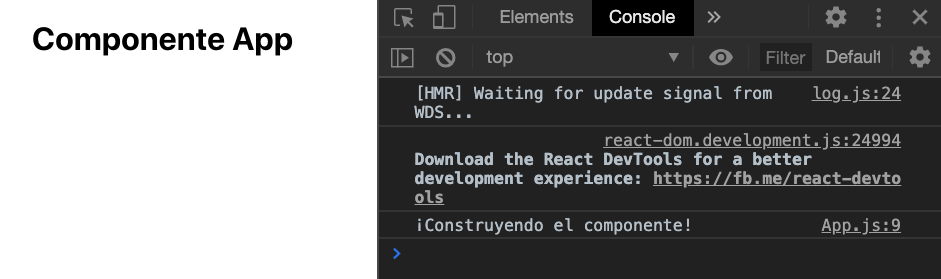
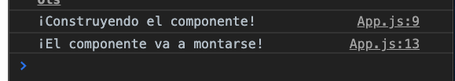
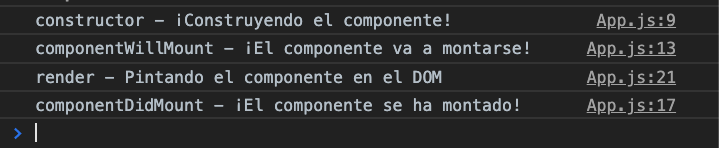
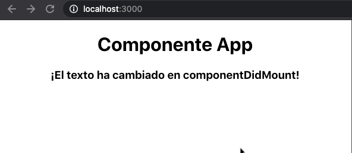
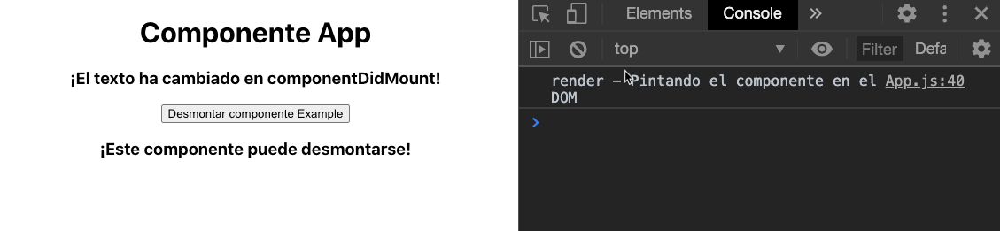

# S4 | Ciclos de vida y APIs

### Después de esta lección podrás:

1. Controlar el comportamiento de nuestros componentes
2. Consumir APIs externas para mostrar nueva información

### ¿Qué son los ciclos de vida?

En React, todos nuestros componentes de renderizan por primera vez y se actualizan cuando cambiamos sus `props` o `state`, o eso conocemos hasta ahora. Pero en esta sesión vamos a descrubrir como controlaremos estas actualizaciones y podremos controlar cuando mostrar la información que queremos.

Crearemos un componente `App` básico en el que mostraremos un log para paso del ciclo de vida de este componente:

```jsx
import React from 'react';

import './App.css';

class App extends React.Component {
  constructor(props) {
    super(props);

    console.log('¡Construyendo el componente!');
  }

  render() {
    return (
      <div className="App">
        <h1>Componente App</h1>
      </div>
    );
  }
}

export default App;
```

→ Vamos a desactivar `React.StrictMode` en este proyecto para que no nos moleste el doble render que se produce en `dev` y veamos un solo log para cada caso.

Ahora veremos un log cuando el componente se construya, previo a pintarse:



### Component Will Mount -  `ComponentWillMount`

Vale, ahora tenemos un componente que nos avisa cuando se está construyendo. Vamos a aprender el primer ciclo de vida de los componentes, `ComponentWillMount`.

Este ciclo de vida ocurrirá justo antes de que el componente vaya a "montarse" en nuestra aplicación, es decir, estará listo para renderizarse en el DOM.

```jsx
UNSAFE_componentWillMount() {
  console.log('¡El componente va a montarse!');
}
```

→ Usaremos `UNSAFE_componentWillMount` debido a que el equipo de React mantiene una preferencia por el ciclo de vida que veremos a continuación.

Y esto hará que los logs se modifiquen para mostrar lo siguiente:



¿Qué significa esto? Que nuestro componente nos permite modificar valores o realizar llamadas a funciones justo antes de aparecer en nuestro documento. Hay que tener cuidado, eso sí, con no hacer peticiones muy pesadas a una API o cálculos exhaustivos ya que hasta que esta función no termine, no se pintará nada en el DOM.

### Component Did Mount -  `ComponentDidMount`

Este ciclo de vida es el más útil para el momento en que nuestra aplicación comienza a ser usada, ya que deja lugar a un primer render del DOM y permite hacer peticiones API o cálculos al igual que `ComponentWillMount`, pero permite que los usuarios vean contenido y no tengan que esperar.

Actualizaremos el componente `App` para mostrar el momento en el que se activa este nuevo ciclo de vida:

```jsx
class App extends React.Component {
  constructor(props) {
    super(props);

    console.log('constructor - ¡Construyendo el componente!');
  }

  UNSAFE_componentWillMount() {
    console.log('componentWillMount - ¡El componente va a montarse!');
  }

  componentDidMount() {
    console.log('componentDidMount - ¡El componente se ha montado!');
  }

  render() {
    console.log('render - Pintando el componente en el DOM');

    return (
      <div className="App">
        <h1>Componente App</h1>
      </div>
    );
  }
}
```

Veremos lo siguiente en la consola del navegador:



Como puedes observar, el componente se construye, se prepara para montarse en el DOM, se renderiza, y nos avisa de que ha conseguido montarse en `componentDidMount`.

Vamos a crear un ejemplo práctico con un texto que cambia cuando pasan 2 segundos desde el primer pintado del componente. 



Lo hemos conseguido mediante la creación de un `state` que contenga el texto inicial, que cambiará a través del siguiente código:

```jsx
setTimeout(
  () =>
    this.setState({ text: '¡El texto ha cambiado en componentDidMount!' }),
  2000
);
```

### Component Will Unmount -  `componentWillUnmount`

Un componente que utiliza el ciclo de vida `componentWillUnmount` nos permitirá lanzar efectos y funciones justo antes de desaparecer del DOM. Vamos con un ejemplo práctico donde veremos como funciona realmente.

Crearemos un componente `Example` que pueda utilizar `componentWillUnmount` de la siguiente forma:

```jsx
import React, { Component } from 'react';

export default class Example extends Component {
  componentWillUnmount() {
    console.log('Example componentWillUnmount - ¡Desmontando componente!');
  }

  render() {
    return <h3>¡Este componente puede desmontarse!</h3>;
  }
}
```

Y controlaremos desde `App` si este componente se pinta o no mediante un nuevo estado:

```jsx
hideExample = () => {
    this.setState({
      showExample: false,
    });
  };

  render() {
    console.log('render - Pintando el componente en el DOM');

    return (
      <div className="App">
        <h1>Componente App</h1>
        <h3>{this.state.text}</h3>

        <button onClick={this.hideExample}>Desmontar componente Example</button>

        {this.state.showExample ? <Example /> : null}
      </div>
    );
  }
```

Si pulsamos el botón podremos desmontar el componente al hacerse `false` el atributo `showExample` del estado en `App`. Se verá lo siguiente en el DOM:



Un caso de uso sería eliminar cierta información cuando el usuario cierra un modal o cancela la edición de un formulario.

### Resto de ciclos de vida

Hay muchísimos más ciclos de vida que tenemos a nuestra disposición, pero con estos ciclos de vida tendremos suficiente para trabajar ya que próximamente avanzaremos a utilizar componentes funcionales, y estos se acercan a los ciclos de vida de una forma distinta.

### Consumiendo una API

¡Vamos a aprender como se consume una API en React! Para ello utilizaremos la API de Rick & Morty, precisamente el endpoint [`https://rickandmortyapi.com/api/character`](https://rickandmortyapi.com/api/character). Este endpoint nos devolverá un array de personajes que podremos pintar en el DOM.

De acuerdo a los ciclos de vida que hemos visto, podemos pedir esta información en el ciclo de vida `componentDidMount` donde actualizaremos el estado del componente.

Vamos a editar `App` para ello:

```jsx
class App extends React.Component {
  state = {
    characterList: [],
  };

  componentDidMount() {
    fetch('https://rickandmortyapi.com/api/character/')
      .then((res) => res.json())
      .then((response) => {
        // La petición trae los personajes en el array results...
        this.setState({
          characterList: response.results,
        });
      });
  }

  render() {
    console.log('render - Pintando el componente en el DOM');

    return (
      <div className="App">
        <h2>Listado de personajes</h2>

        <div>
          {this.state.characterList.length ? (
            this.state.characterList.map((character) => (
              <div key={JSON.stringify(character)}>
                <h4>Id: {character.id}</h4>
                <h4>Name: {character.name}</h4>

                

                <p>Status: {character.status}</p>
                <p>Species: {character.species}</p>
              </div>
            ))
          ) : (
            <h3>¡No hay personajes cargados!</h3>
          )}
        </div>
      </div>
    );
  }
}
```

Como ves en el código anterior, mostraremos un texto cuando no hay personajes cargados, y en caso de que estén ya en el estado haremos un `map` para pintar cada personaje.

La petición la haremos con `fetch` ya que es un método nativo de JS y soportado por los navegadores modernos, que cumple de sobra con nuestras necesidades HTTP actuales.

→ Añadiremos también un delay forzado en componentDidMount para poder ver que la carga muestra un texto si no hay personajes en la lista. Esto lo haremos como ejemplo, no es una buena práctica pero nos servirá para aprender lo que ocurre en nuestro componente:

```jsx

componentDidMount() {
  setTimeout(() => {
    fetch('https://rickandmortyapi.com/api/character/')
      .then((res) => res.json())
      .then((response) => {
        // La petición trae los personajes en el array results...
        this.setState({
          characterList: response.results,
        });
      });
  }, 2000);
}
```

Vamos a ver lo que hemos conseguido en la práctica:


¡Ahora tenemos una herramienta de carga de personajes usando los ciclos de vida! 🚀

### Ejercicio conjunto

Vamos a terminar la sesión poniendo en práctica lo aprendido. 💪

Dada la respuesta de la API que acabamos de utilizar, tenemos estos resultados:

```json
{
  "info": {
    "count": 591,
    "pages": 30,
    "next": "https://rickandmortyapi.com/api/character/?page=2",
    "prev": null
  },
  "results": []
}
```

Ya que tenemos un atributo `next` donde tenemos la siguiente request que podemos hacer, vamos a conseguir entre toda la clase que podamos **paginar** las peticiones para poder cargar personajes por partes.

Esto lo conseguiremos combinando una carga inicial de personajes, con un cambio de estado a través del click de un botón que permitirá hacer requests a la API y mostrar así en el DOM el `slice` del array que corresponda según la página.