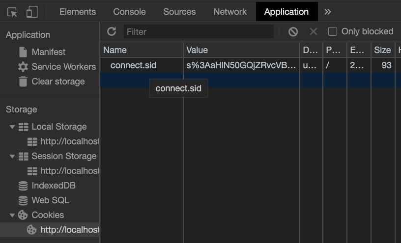
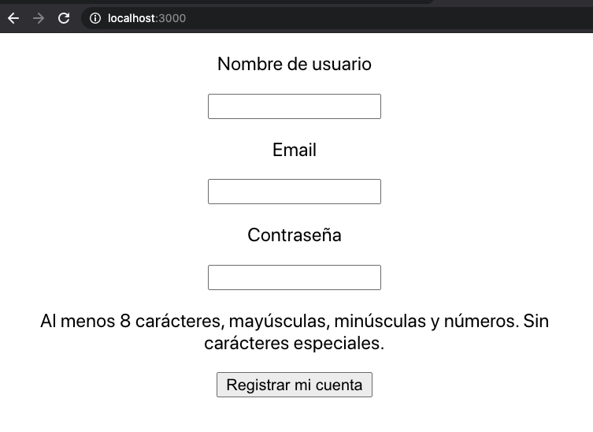

# S5 | React router & autenticación

### Después de esta lección podrás:

1. Crear sistemas de enrutado en cliente
2. Proteger rutas frente a un sistema de autenticación

En la última sesión conseguimos controlar la información que necesitamos mostrar en nuestros componentes según el ciclo de vida en que estos se encuentren.

Ahora sabemos que podemos hacer requests en `componentDidMount` para tener los datos justo cuando nuestro componente se ha montado y renderizado por primera vez, dando así contenido a los usuarios y manteniendo un tiempo de carga adecuado.

En la sesión de hoy aprovecharemos también la información aprendida en la sesión de formularios para crear formularios de autenticación y registro.

### Partiendo de una API existente

Hemos creado una API en Minsait en la que podrás registrar usuarios e iniciar sesión con ellos. También podrás obtener sus datos de sesión y proporcionaremos un endpoint protegido para que solamente puedas acceder a información si tienes una cookie de sesión en tu navegador.

Los endpoints que usaremos son:

```markdown
Registro de usuarios:
[https://upgrade-auth.herokuapp.com/api/auth/register](https://upgrade-auth.herokuapp.com/api/auth/register)

Login de usuarios:
[https://upgrade-auth.herokuapp.com/api/auth/login](https://upgrade-auth.herokuapp.com/api/auth/login)

Comprobar sesión:
[https://upgrade-auth.herokuapp.com/api/auth/check-session](https://upgrade-auth.herokuapp.com/api/auth/login)

-----------------------------------------------------------

Ruta protegida:
[https://upgrade-auth.herokuapp.com/api/secret](https://upgrade-auth.herokuapp.com/api/auth/login)
```

### Creando nuestro formulario de registro

Vamos a comenzar creando un proyecto de React con `create-react-app` como hemos hecho hasta ahora y limpiando `App.js` para comenzar a diseñar nuestra aplicación.

Ahora crearemos un componente `RegisterForm` que contenga un formulario (con su propio estado) y lo pintaremos directamente desde App. Los campos necesarios para hacer un correcto registro son:

```markdown
{
  "username": "",
  "email": "",
  "password": "", 
}

# Password tendrá 8 carácteres, mayúscula, minúscula y número.
```

Por tanto, vamos a comenzar a diseñar nuestro formulario (lo haremos juntos en clase):

```jsx
import React, { Component } from 'react';

class Form extends Component {
  state = {
    username: '',
    email: '',
    password: '',
  };

  handleChangeInput = (e) => {
    const inputName = e.target.name;
    const inputValue = e.target.value;

    this.setState({
      [inputName]: inputValue,
    });
  };

  render() {
    return (
      <form>
        <label htmlFor="username">
          <p>Nombre de usuario</p>
          <input
            type="text"
            name="username"
            value={this.state.username}
            onChange={this.handleChangeInput}
          />
        </label>

        <label htmlFor="email">
          <p>Email</p>
          <input
            type="text"
            name="email"
            value={this.state.email}
            onChange={this.handleChangeInput}
          />
        </label>

        <label htmlFor="password">
          <p>Contraseña</p>
          <input
            type="password"
            name="password"
            value={this.state.password}
            onChange={this.handleChangeInput}
          />

          <p>
            Al menos 8 carácteres, mayúsculas, minúsculas y números. Sin
            carácteres especiales.
          </p>
        </label>

        <button type="submit">Registrar mi cuenta</button>
      </form>
    );
  }
}

export default Form;
```

Como puedes observar, es un formulario igualito a lo que habíamos trabajado antes. Ahora podremos tener un `state` con la información necesaria para el registro de nuestros usuarios.

→ Podemos añadir estilos juntos en clase para que el formulario mejore visualmente.

Tan solo nos queda hacer submit, así que vamos a crear un servicio para ello. Crearemos una carpeta `api` en la que craremos un archivo `auth.js`:

```jsx
const registerUrl = 'https://upgrade-auth.herokuapp.com/api/auth/register';

export const register = async (userData) => {
  const response = await fetch(registerUrl, {
    method: 'POST',
    headers: {
      Accept: 'application/json',
      'Content-Type': 'application/json',
      'Access-Control-Allow-Origin': '*',
    },
    credentials: 'include',
    body: JSON.stringify(userData),
  });

  const jsonResponse = await response.json();

  // Si hay un error en la respuesta, devolveremos el error del servidor que tenemos en .message
  if (!response.ok) {
    throw new Error(jsonResponse.message);
  }

  // Si tenemos una respuesta adecuada, devolvemos el resultado que habrá en .data
  return jsonResponse.data;
};
```

Wow! Aquí hay mucha información que vamos a explicar:

- Necesitamos los headers para aceptar la API, debido a que está en un dominio diferente al que usaremos para trabajar.
- Sin la opción `credentials: true` no podremos recibir una cookie de sesión. Esto solamente es necesario si trabajaremos con autenticación, en caso contrario podemos quitarlo de nuestra configuración.
- Si una respuesta devuelve un error, `fetch` nos permite trabajar con el error usando la propiedad `.ok`.

Aparte, tenemos que considerar que la API con la que estamos trabajando devuelve los status 200 (éxito) en forma de un objeto `{ data: CONTENIDO }` por lo que necesitaremos la propiedad `.data` para recuperar la información. Los errores devuelven `{ message: CONTENIDO }` por lo que los obtendremos de `.message`.

Ahora que tenemos la request preparada, vamos a adaptar el componente `Form` para que tenga un nuevo estado, una función para `submit` y un control de errors simplificado:

```jsx
import React, { Component } from 'react';

import { register } from '../../api/auth';

class Form extends Component {
  state = {
    form: {
      username: '',
      email: '',
      password: '',
    },
    error: null,
  };

  handleChangeInput = (e) => {
    const inputName = e.target.name;
    const inputValue = e.target.value;

    // Necesitamos mantener la información previa en el formulario al tener una clave de profundidad.
    this.setState((prevState) => ({
      form: {
        ...prevState.form,
        [inputName]: inputValue,
      },
    }));
  };

  handleFormSubmit = async (e) => {
    e.preventDefault();

    try {
      // Envíamos como argumento el estado actual del formulario
      const data = await register(this.state.form);
      // Por ahora dejaremos un log y más tarde añadiremos más lógica
      console.log('¡Registro completado!', data);
    } catch (err) {
      this.setState({
        error: err.message,
      });
    }
  };

  render() {
    return (
      <form onSubmit={this.handleFormSubmit}>
        <label htmlFor="username">
          <p>Nombre de usuario</p>
          <input
            type="text"
            name="username"
            value={this.state.username}
            onChange={this.handleChangeInput}
          />
        </label>

        <label htmlFor="email">
          <p>Email</p>
          <input
            type="text"
            name="email"
            value={this.state.email}
            onChange={this.handleChangeInput}
          />
        </label>

        <label htmlFor="password">
          <p>Contraseña</p>
          <input
            type="password"
            name="password"
            value={this.state.password}
            onChange={this.handleChangeInput}
          />

          <p>
            Al menos 8 carácteres, mayúsculas, minúsculas y números. Sin
            carácteres especiales.
          </p>
        </label>

        {this.state.error ? (
          <p style={{ color: 'red' }}>{this.state.error}</p>
        ) : null}

        <button type="submit">Registrar mi cuenta</button>
      </form>
    );
  }
}

export default Form;
```

Vamos a analizar los cambios que hemos realizado:

- Ahroa tendremos un estado "nesteado". Es decir, tendemos un estado con objetos dentro, por lo que el `setState` necesitará copiar el contenido de estos objetos si cambiamos una propiedad.
- Tenemos un error en el estado que setearemos cuando llegue un error dentro de la API
- Dejaremos un console.log mientras tanto para ver el resultado del registro. Pero más tarde añadiremos lógica para gestionar lo que ocurre.

Si todo ha funcionado correctamente, podremos ver en la pestaña `Application` de nuestro navegador la cookie de sesión:



Esto siginifica que ahora tendremos una cookie de sesión persistente en nuestro navegador que podremos usar para autenticarnos siempre que nuestras llamadas `fetch` usen `crendentials`.

### Formulario de Login

Ahora que tenemos un formulario de registro podemos hacer facilmente uno para iniciar sesión. Crearemos el componente `LoginForm` de la siguiente forma:

```jsx
import React, { Component } from 'react';

import { login } from '../../api/auth';

class LoginForm extends Component {
  state = {
    form: {
      email: '',
      password: '',
    },
    error: null,
  };

  handleChangeInput = (e) => {
    const inputName = e.target.name;
    const inputValue = e.target.value;

    // Necesitamos mantener la información previa en el formulario al tener una clave de profundidad.
    this.setState((prevState) => ({
      form: {
        ...prevState.form,
        [inputName]: inputValue,
      },
    }));
  };

  handleFormSubmit = async (e) => {
    e.preventDefault();

    try {
      // Envíamos como argumento el estado actual del formulario
      const data = await login(this.state.form);
      console.log('Fulfilled!', data);
    } catch (err) {
      this.setState({
        error: err.message,
      });
    }
  };

  render() {
    return (
      <form onSubmit={this.handleFormSubmit}>
        <label htmlFor="email">
          <p>Email</p>
          <input
            type="text"
            name="email"
            value={this.state.email}
            onChange={this.handleChangeInput}
          />
        </label>

        <label htmlFor="password">
          <p>Contraseña</p>
          <input
            type="password"
            name="password"
            value={this.state.password}
            onChange={this.handleChangeInput}
          />

          <p>
            Al menos 8 carácteres, mayúsculas, minúsculas y números. Sin
            carácteres especiales.
          </p>
        </label>

        {this.state.error ? (
          <p style={{ color: 'red' }}>{this.state.error}</p>
        ) : null}

        <button type="submit">Registrar mi cuenta</button>
      </form>
    );
  }
}

export default LoginForm;
```

Como puedes ver, es simplemente una versión simplificada del anterior, con la diferencia principal en el endpoint consumido `login` que tenemos a continuación en el archivo `auth.js`:

```jsx
const loginUrl = 'https://upgrade-auth.herokuapp.com/api/auth/login';

export const login = async (userData) => {
  const response = await fetch(loginUrl, {
    method: 'POST',
    headers: {
      Accept: 'application/json',
      'Content-Type': 'application/json',
      'Access-Control-Allow-Origin': '*',
    },
    credentials: 'include',
    body: JSON.stringify(userData),
  });

  const jsonResponse = await response.json();

  // Si hay un error en la respuesta, devolveremos el error del servidor que tenemos en .message
  if (!response.ok) {
    throw new Error(jsonResponse.message);
  }

  // Si tenemos una respuesta adecuada, devolvemos el resultado que habrá en .data
  return jsonResponse.data;
};
```

### Comprobando la sesión

Una vez tenemos preparado el registro e inicio de sesión de los usuarios, solamente nos queda comprobar si tienen una sesión iniciada o no a través de otro endpoint. Esto nos permitirá controlar si un usuario está autenticado en nuestra web app incluso cuando se recargue la página.

```jsx
const checkSessionUrl =
  'https://upgrade-auth.herokuapp.com/api/auth/check-session';

export const checkSession = async () => {
  const response = await fetch(checkSessionUrl, {
    method: 'GET',
    headers: {
      Accept: 'application/json',
      'Content-Type': 'application/json',
      'Access-Control-Allow-Origin': '*',
    },
    credentials: 'include',
  });

  const jsonResponse = await response.json();

  // Si hay un error en la respuesta, devolveremos el error del servidor que tenemos en .message
  if (!response.ok) {
    throw new Error(jsonResponse.message);
  }

  // Si tenemos una respuesta adecuada, devolvemos el resultado que habrá en .data
  return jsonResponse.data;
};
```

Si consumimos este endpoint en algún punto de la App, podremos obtener los datos de los usuarios.

### Creado rutas: React Router

Te preguntarás el motivo detrás de todo este sistema de autenticación, y es el conseguir crear distintas rutas para distintas funcionalidades, y protegerlas adecuadamente si es necesario.

Instalaremos React Router usando npm:

```bash
npm install react-router-dom
```

Y ahora podemos ir al componente App y añadir el Router sobre el resto de nuestra aplicación:

```jsx
import React from 'react';
import { BrowserRouter as Router, Switch, Route } from 'react-router-dom';

import RegisterForm from './components/RegisterForm';

import './App.css';

function App() {
  return (
    <Router>
      <div className="App">
        <Switch>
          <Route path="/" component={RegisterForm} />
        </Switch>
      </div>
    </Router>
  );
}

export default App;
```

Aquí estamos haciendo que en la ruta `/` tengamos el formulario de Registro:



Pero podrás comprobar también que si entramos en una ruta diferente de este path seguiremos viendo el formulario de registro. Esto se debe a que hemos especificado una ruta dentro del `Switch` sin especificar que sea exacta.

Para comprobar esto en más profundidad, vamos a crear un componente `Home` que muestre un mensaje y dos links a `/register` y `/login`.

```jsx
import React, { Component } from 'react';

export default class Home extends Component {
  render() {
    return (
      <div>
        <h1>¡Bienvenid@ a nuestra webapp en React!</h1>

        <div>
          <a href="/login">Quiero iniciar sesión</a>
        </div>
        
        <div>
          <a href="/register">Quiero registrarme</a>
        </div>
      </div>
    );
  }
}
```

Ahora podemos actualizar nuestro `App` para ver lo que ocurre:

```jsx
import React from 'react';
import { BrowserRouter as Router, Switch, Route } from 'react-router-dom';

import Home from './components/Home';
import RegisterForm from './components/RegisterForm';
import LoginForm from './components/LoginForm';

import './App.css';

function App() {
  return (
    <Router>
      <div className="App">
        <Switch>
          <Route path="/register" exact component={RegisterForm} />
          <Route path="/login" exact component={LoginForm} />
          <Route path="/" component={Home} />
        </Switch>
      </div>
    </Router>
  );
}

export default App;
```

Como puedes observar, hemos hecho que las rutas `/register` y `/login` sean rutas `exact`, lo que indica esto es que si accedemos a estos endpoints podremos cargar únicamente estos componentes. En cambio, el componente `Home` será el que aparezca para cualquier ruta `NO EXACTA`. 


Como último detalle, podemos ver como el navegador se recarga siempre que cambiamos de ruta. Esto se debe a que estamos usando elementos `<a />` para cambiar de ruta. Esto podemos cambiarlo por el elemento `Link` de forma que no recargaremos el navegador y tendremos una verdadera SPA:

```jsx
import React, { Component } from 'react';
import { Link } from 'react-router-dom';

export default class Home extends Component {
  render() {
    return (
      <div>
        <h1>¡Bienvenid@ a nuestra webapp en React!</h1>

        <div>
          <Link to="/login">Quiero iniciar sesión</Link>
        </div>

        <div>
          <Link to="/register">Quiero registrarme</Link>
        </div>
      </div>
    );
  }
}
```

Ahora podremos probar de nuevo a cambiar nuestras rutas y verás como no se actualiza la página:


### Protegiendo rutas y haciendo redirecciones

Tan solo nos queda un último paso, proteger rutas y redijir al usuario hacia el punto que corresponda.

Para la redirección dentro de React Router podemos utilizar el componente `Redirect`, vamos a combinarlo todo para crear un componente `SecureRoute`:

```jsx
import React from 'react';
import { Route, Redirect } from 'react-router-dom';
import PropTypes from 'prop-types';

class SecureRoute extends React.Component {
  render() {
    const { hasUser, ...restProps } = this.props;

    return hasUser ? <Route {...restProps} /> : <Redirect to="/" />;
  }
}

SecureRoute.propTypes = {
  hasUser: PropTypes.bool.isRequired,
};

export default SecureRoute;
```

Este componente recibe un prop `hasUser` y decide entonces si devolver un `Route` o un `Redirect` acorde a las necesidades del componente.

Con el spread operator podemos obtener el resto de props y enviarlos al componente `Route` haciendo el spread `{...props}`.

Al igual que acabamos de hacer, podemos crear un componente `NoUserRoute` que compruebe que no hay usuario para entonces devolver la ruta:

```jsx
import React from 'react';
import { Route, Redirect } from 'react-router-dom';
import PropTypes from 'prop-types';

class NoUserRoute extends React.Component {
  render() {
    const { hasUser, ...restProps } = this.props;

    return !hasUser ? <Route {...restProps} /> : <Redirect to="/" />;
  }
}

NoUserRoute.propTypes = {
  hasUser: PropTypes.bool.isRequired,
};

export default NoUserRoute;
```

Ahora podemos usarlos en App para mover a los usuarios en la aplicación según queramos.

Actualizaremos el componente `Home`:

```jsx
import React, { Component } from 'react';
import { Link } from 'react-router-dom';

export default class Home extends Component {
  render() {
    return (
      <div>
        <h1>¡Bienvenid@ a nuestra webapp en React!</h1>

        <div>
          <Link to="/login">Quiero iniciar sesión</Link>
        </div>

        <div>
          <Link to="/register">Quiero registrarme</Link>
        </div>

        <div>
          <Link to="/secret">Ruta secreta</Link>
        </div>
      </div>
    );
  }
}
```

Ahora creamos un endpoint `logout` en la api the autenticación:

```jsx
const logoutUrl = 'https://upgrade-auth.herokuapp.com/api/auth/logout';

export const logout = async () => {
  const response = await fetch(logoutUrl, {
    method: 'GET',
    headers: {
      Accept: 'application/json',
      'Content-Type': 'application/json',
    },
    credentials: 'include',
  });

  const jsonResponse = await response.json();

  // Si hay un error en la respuesta, devolveremos el error del servidor que tenemos en .message
  if (!response.ok) {
    throw new Error(jsonResponse.message);
  }

  // Si tenemos una respuesta adecuada, devolvemos el resultado que habrá en .data
  return jsonResponse.data;
};
```

Creamos un componente `Secret` que utilizaremos en una ruta especial solamente usada por usuarios autenticados:

```jsx
import React, { Component } from 'react';
import PropTypes from 'prop-types';

import { logout } from '../api/auth';

export default class Secret extends Component {
  handleOnClickLogout = async () => {
    await logout();
    this.props.handleLogout();
  };

  render() {
    return (
      <div>
        <h1>Esto es una ruta secreta</h1>
        <button onClick={this.handleOnClickLogout}>Cerrar sesión</button>
      </div>
    );
  }
}

Secret.propTypes = {
  handleLogout: PropTypes.func.isRequired,
};
```

Y ahora podemos terminar de cerrar `App`:

```jsx
handleInitUser = (userData) => {
  this.setState({ user: userData });
};

...

render() {
  const hasUser = !!this.state.user;

  return (
    <Router>
      <div className="App">
        {this.state.isLoading ? (
          <h1>Loading...</h1>
        ) : (
          <Switch>
            <SecureRoute
              hasUser={hasUser}
              path="/secret"
              exact
              component={(props) => (
                <Secret {...props} handleLogout={this.handleLogout} />
              )}
            />
            <NoUserRoute
              hasUser={hasUser}
              path="/register"
              exact
              component={(props) => (
                <RegisterForm {...props} handleInitUser={this.handleInitUser} />
              )}
            />
            <NoUserRoute
              hasUser={hasUser}
              path="/login"
              exact
              component={(props) => (
                <LoginForm {...props} handleInitUser={this.handleInitUser} />
              )}
            />
            <Route path="/" component={Home} />
          </Switch>
        )}
      </div>
    </Router>
  );
}
```

Como puedes ver, ahora añadimos un nuevo props `handleInitUser` a los componentes `LoginForm` y `RegisterForm`.

Los podemos utilizar de la siguiente forma en ambos:

```jsx
handleFormSubmit = async (e) => {
    e.preventDefault();

    try {
      // Envíamos como argumento el estado actual del formulario
      const data = await login(this.state.form);
      this.props.handleInitUser(data);
    } catch (err) {
      this.setState({
        error: err.message,
      });
    }
  };
```

**¡Con esto tenemos un sistema de autenticación válido y rutas protegidas! 🚀**

