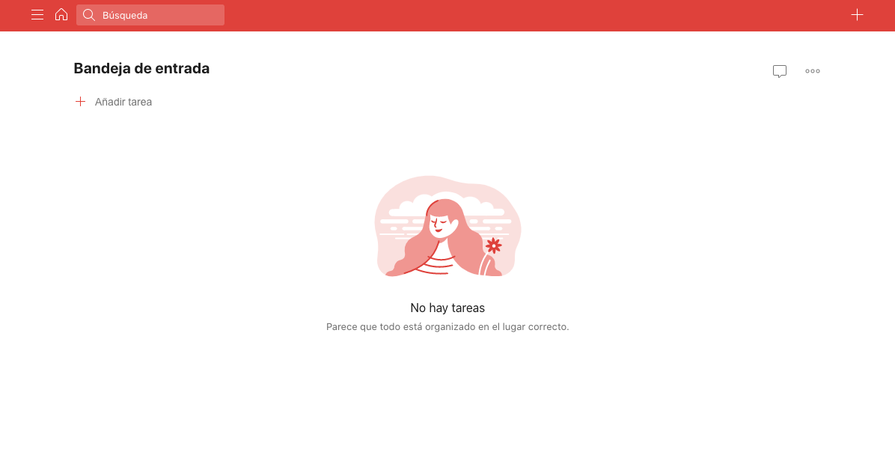
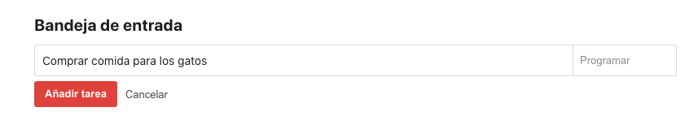
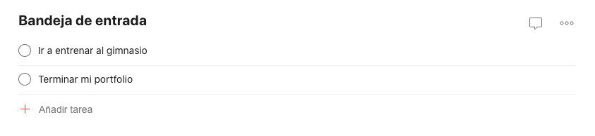
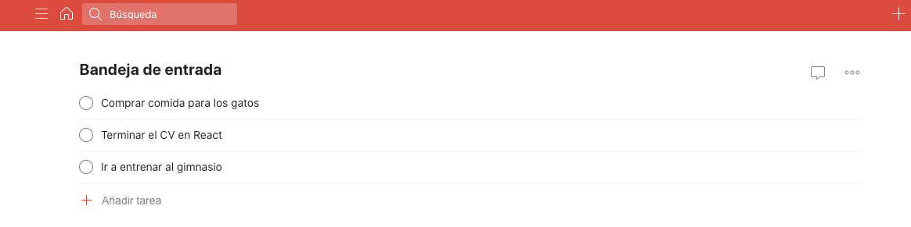
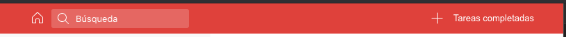

# S6 | Replicando Todoist

Después de lo que hemos visto en las últimas sesiones, nos encontramos en un punto perfecto para poner en práctica todo lo aprendido con React y crear un buen proyecto para nuestro portfolio personal 🎉

En cuanto acabemos el proyecto, habremos reafirmado nuestro conocimiento sobre todo el funcionamiento básico de React utilizando clases para ello. Tras esto, pasaremos a trabajar con componentes funcionales y aprenderemos a utilizar técnicas avanzadas para compartir estado usando Context o Redux, así que vamos a ponernos manos a la obra para practicar React como buenos Frontend developers 🚀

## Objetivo del proyecto

Trabajaremos de forma **`individual`** en este caso, ¡aunque podemos hacerlo en `**parejas**` si nos animamos!

Completar nuestro proyecto llevará DOS SESIONES de clase que seguirán la metodología Workshop. Nosotros (los mentores) haremos el proyecto por nuestro lado de forma simultánea junto a tí, de forma que podrás seguir como programamos y estaremos siempre al día con tus avances. **¡Recuerda preguntar todas las dudas que bloqueen tu avance en este proyecto!**

El principal objetivo de este proyecto es imitar, de forma simplificada primero (aunque podemos avanzar tanto como queramos 😈) la aplicación `**todoist`:**



Esta aplicación es un Todo List avanzado, donde podemos hacer un seguimiento muy intuitivo de nuestras tarjetas.

En nuestro caso, añadiremos tarjetas de forma general pulsando el botón `**Añadir tarjeta`** a través de un pequeño formulario como el siguiente:



Cuando creemos varias tareas las veremos de la siguiente forma contenidas en una lista:



Y ahora un GIF mostrando como funcionaría el completar tarea cuando pulsamos el `**Radio button`:**



### Pasos a seguir para crear el proyecto:

- Crearemos un nuevo proyecto con `create-react-app` que "limpiaremos" y prepararemos para trabajar.

```bash
npx create-react-app NOMBRE_PROYECTO
```

- Añadiremos las librerías `prop-types`, `node-sass`, `react-router-dom` que vamos a utilizar en el proyecto.

```bash
npm i prop-types node-sass react-router-dom
```

- Para los iconos podemos utilizar la librería `**FontAwesome**` instalando los siguientes paquetes npm:

```bash
npm i --save @fortawesome/fontawesome-svg-core @fortawesome/free-solid-svg-icons @fortawesome/free-regular-svg-icons @fortawesome/react-fontawesome
```

Y ahora podemos usar los iconos como componentes de React de la siguiente forma:

```jsx
import { FontAwesomeIcon } from '@fortawesome/react-fontawesome'
import { faHome } from '@fortawesome/free-solid-svg-icons'

<FontAwesomeIcon icon={faHome} />
```

**→ Aquí tienes la lista de iconos disponibles:**

[`**https://fontawesome.com/icons?d=gallery&m=free**`](https://fontawesome.com/icons?d=gallery&m=free)

- Crearemos un `state` inicial en App donde seguiremos una estructura parecida a la siguiente:

```jsx
state = {
  todos: [],
  completed: [],
}
```

- Instalar la librería uuidv4 para crear ids aleatorias cada vez que añadamos una nueva carta:

```bash
npm i uuidv4
```

La usaremos de la siguiente forma:

```jsx
const { uuid } = require('uuidv4');

uuid() // Genera un nuevo id aleatorio
```

- ¡Ahora toca crear componentes! Vamos a montar un componente **`Navbar`** que estará en todas las rutas, un componente **`MainList`** con todas las cartas dentro, y un componente **`Card`** que tendrás el botón radio con el título.
- Desde `App` enviaremos props a la lista de todos los todos y un handler para poderlos completar. Este handler añadirá una carta a `completed`.
- Clickando el botón `+` de la Navbar o el botón `Añadir tarea` de la lista podremos abrir el formulario de nuevas cartas y añadiremos la tarea al array `cards`.
- El input de búsqueda filtrará las cartas que vemos en la pantalla de todos.
- El icono de la casa nos enviará a la lista de todos.
- Añadiremos un nuevo botón que nos permita cambiar de ruta a la lista de `tareas completadas`:

→ Crear rutas `/` y `/completed`.



- Dejamos por aquí el favicon de Todoist para que lo uséis si lo veis necesario (añadir a la carpeta public del proyecto):

[favicon.ico](./assets/06/favicon.ico)

### ¡Comenzamos! 🦄

Con las instrucciones dadas podemos empezar a desarrollar en React e intentar replicar esta versión de `**Todoist`.** 

Este proyecto es el MVP que tendremos como objetivo entre esta y la próxima clase. Si logras completar todo lo necesario daremos nuevas instrucciones y funcionalidades como bonus en la siguiente sesión.

**¡Vamos a programar!**