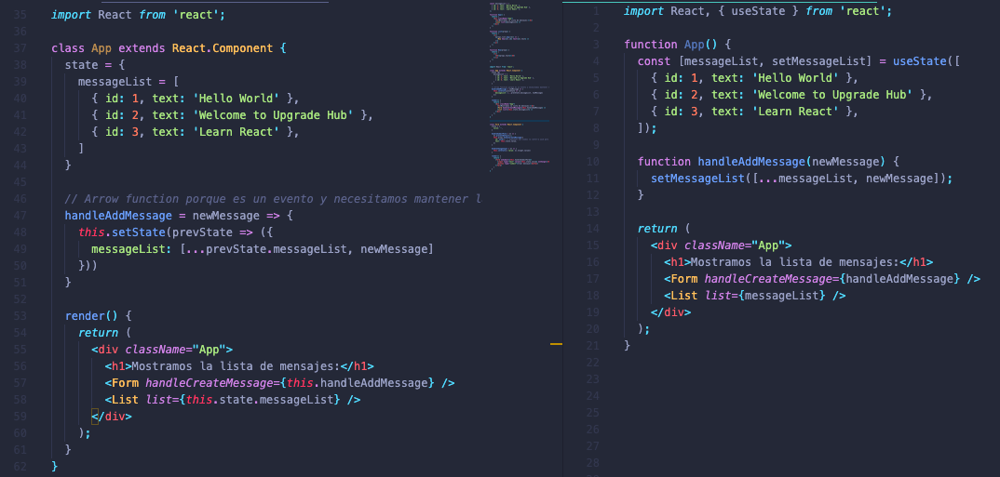
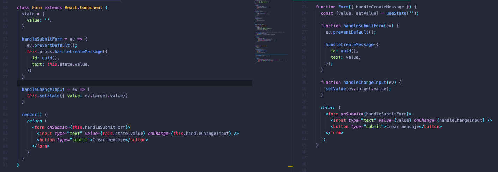

# S8 | Componentes funcionales

### Después de esta lección podrás:

1. Crear componentes funcionales y de clase.
2. Usar los hooks useState y useEffect.

## De clase a funcional

Tras la última clase hemos conseguido crear un proyecto completo con React, compartiendo `state` y `props` entre componentes, simulando una API y dando una experiencia reactiva a los usuarios de nuestra aplicación.

Todo esto lo hemos conseguido mediante componentes de clases, similares al que tenemos a continuación:

```jsx
class App extends React.Component {
  render() {
    return (
      <div className="App">
        <h1>Aprendiendo React en Minsait</h1>
      </div>
    );  
  }
}
```

Para transformarlo en un componente funcional, podemos copiar todo el contenido del `render` y convertirlo en la función que vayamos a utilizar:

```jsx
function App() {
  return (
      <div className="App">
        <h1>Aprendiendo React en Minsait</h1>
      </div>
  );
}
```

¡Que sencillo! React está convirtiendo la función por a un componente de la misma manera que hace con las clases.

**¿Qué ventajas nos ofrecen los componentes funcionales?**

Vamos a verlo con una puesta en práctica paso a paso, compararemos el uso de `props`, `state` y algunos `ciclos de vida`. De esta forma podrás observar que utilizamos componentes funcionales para acercarnos más a lo que conocemos como `Clean Code`.

### Usando props

Vamos a crear un componente `List` que dado un prop la que llamaremos `list` mapeará los valores para renderizar otro componente `Row` que mostrará un texto en pantalla:

```jsx
const messageList = [
  { id: 1, text: 'Hello World' },
  { id: 2, text: 'Welcome to Minsait' },
  { id: 3, text: 'Learn React' },
];

function App() {
  return (
    <div className="App">
      <h1>Mostramos la lista de mensajes:</h1>
      <List list={messageList} />
    </div>
  );
}
```

Ahora el componente `List`:

```jsx
function List(props) {
  return (
    <ul>
      {props.list.map((el) => (
        <Row key={el.id} text={el.text} />
      ))}
    </ul>
  );
}
```

Y el componente `Row`:

```jsx
function Row(props) {
  return (
    <li>
      <h3>{props.text}</h3>
    </li>
  );
}
```

Como puedes observar, ahora los props llegan al componente en forma de `argumento` de la función, y comprenden un objeto tal y como ocurría con las clases, aunque ahora no necesitamos usar `this` ya que no tenemos que hacer referencia al contexto de ejecución de la función.

También te habrás dado cuenta de que la constante en `App` está declarada fuera del componente y es usada en el `return`. Es totalmente normal hacer esto en componentes funcionales, ya que cuando un componente de este tipo se renderiza de nuevo, todo el contenido de la función vuelve a ejecutarse y por tanto la constante volvería a ser declarada.

### Usando state

Si has escuchado hablar de componentes funcionales previamente o has investigado por tu cuenta, habrás escuchado la palabra `hooks` repetidas veces en el proceso. En caso contrario no te preocupes, vamos a explicarlos a continuación 🚀

**Los `hooks` serán la herramienta que utilizaremos en componentes funcionales para tener acceso al `state` y los `lifecycles` o ciclos de vida del componente, así como muchas más funciones añadidas que los convierten en una potentísima herramienta para desarrollar proyectos muy completos con React.**

Para utilizar el `state` que usábamos en las clases, vamos a ver un ejemplo en el que aplicaremos el hook `useState`.

Este sería el ejemplo anterior para `App` con un componente de clase usando `state`:

```jsx
import React from 'react';

class App extends React.Component {
  state = {
    messageList = [
      { id: 1, text: 'Hello World' },
      { id: 2, text: 'Welcome to Minsait' },
      { id: 3, text: 'Learn React' },
    ]
  }

  render() {
    return (
      <div className="App">
        <h1>Mostramos la lista de mensajes:</h1>
        <List list={this.state.messageList} />
      </div>
    );
  }
}
```

 

Y ahora lo veremos convertido a un componente funcional. Para utilizar el hook `useState` tendremos este patrón como referencia:

```jsx
const [value, setValue] = useState(initialValue)
```

- `value` es el valor del estado en todo momento.
- `setValue` es una función que cambia el valor del estado cuando la invocamos.
- `initialValue` es el valor inicial que queremos darle al estado.

Como vemos en el ejemplo, estamos haciendo `destructuring` de un array, dando nombre en forma de variables a los valores `[0]` y `[1]` del array.

Vamos con el componente: 

```jsx
import React, { useState } from 'react';

function App() {
  const [messageList, setMessageList] = useState([
    { id: 1, text: 'Hello World' },
    { id: 2, text: 'Welcome to Minsait' },
    { id: 3, text: 'Learn React' },
  ]);

  return (
    <div className="App">
      <h1>Mostramos la lista de mensajes:</h1>
      <List list={messageList} />
    </div>
  );
}
```

¡Y listo 👍!  Hemos simplificado nuestro componente de clase, le hemos dado un valor inicial a la variable `messageList` al invocar `useState` y lo pasamos como `props` como una variable normal, nada de `this.state` a la vista.

Si quisiésemos añadir un elemento nuevo a la lista de nuestro componente `App`, tendremos que crear un pequeño formulario previamente al que pasaremos como `props` la función `handleCreateMessage` la cual enviando un mensaje con el formato `{ id: '', text: '' }` nos permitirá añadir un nuevo mensaje al array `messageList`.

```jsx
class Form extends React.Component {
  state = {
    value: '',
  }

  handleSubmitForm = ev => {
    ev.preventDefault();
    this.props.handleCreateMessage({
      id: uuid(), // Suponemos que usamos la librería uuid para crear una id alreatoria
      text: this.state.value,
    })
  }

  handleChangeInput = ev => {
    this.setState({ value: ev.target.value})
  }

  render() {
    return (
      <form onSubmit={this.handleSubmitForm}>
        <input type="text" value={this.state.value} onChange={this.handleChangeInput} />
        <button type="submit">Crear mensaje</button>
      </form>
    )
  }
}
```

Ahora tan solo tenemos que crear la función correspondiente en App:

```jsx
class App extends React.Component {
  state = {
    messageList = [
      { id: 1, text: 'Hello World' },
      { id: 2, text: 'Welcome to Minsait' },
      { id: 3, text: 'Learn React' },
    ]
  }
  
  // Arrow function porque es un evento y necesitamos mantener la referencia al this.
  handleAddMessage = newMessage => {
    this.setState(prevState => ({
      messageList: [...prevState.messageList, newMessage]
    }))
  }

  render() {
    return (
      <div className="App">
        <h1>Mostramos la lista de mensajes:</h1>
        <Form handleCreateMessage={this.handleAddMessage} />
        <List list={this.state.messageList} />
      </div>
    );
  }
}
```

Ya tenemos un handler en `App` y el formulario necesario para crear mensajes. Ahora vamos a transformar esto a un componente funcional para ver como limpiaremos el código en el proceso.

Vamos a adaptar `App` al nuevo formato:

```jsx
import React, { useState } from 'react';

function App() {
  const [messageList, setMessageList] = useState([
    { id: 1, text: 'Hello World' },
    { id: 2, text: 'Welcome to Minsait' },
    { id: 3, text: 'Learn React' },
  ]);

  function handleAddMessage(newMessage) {
    setMessageList([...messageList, newMessage]);
  }

  return (
    <div className="App">
      <h1>Mostramos la lista de mensajes:</h1>
      <Form handleCreateMessage={handleAddMessage} />
      <List list={messageList} />
    </div>
  );
}
```

¿Hemos simplificado bastante nuestro código verdad? Veamos una comparativa más visual:



Vamos ahora con el formulario:

```jsx
function Form({ handleCreateMessage }) {
  const [value, setValue] = useState('');

  function handleSubmitForm(ev) {
    ev.preventDefault();

    handleCreateMessage({
      id: uuid(),
      text: value,
    });
  }

  function handleChangeInput(ev) {
    setValue(ev.target.value);
  }

  return (
    <form onSubmit={handleSubmitForm}>
      <input type="text" value={value} onChange={handleChangeInput} />
      <button type="submit">Crear mensaje</button>
    </form>
  );
}
```

¡Wow! ¡Ahora es mucho más sencillo manejar formularios! 💃 Vamos a ver los dos componentes en una misma imagen para apreciar mejor su comparativa:



## Ciclos de vida

Para la sesión de hoy, vamos a ver únicamente un ciclo de vida comparado con el funcionamiento en componentes funcionales, y este será `componentDidMount`.

¿Recuerdas que usábamos `componentDidMount` para realizar peticiones a una API y cargar el state con los datos necesarios para usar nuestra App? Supongamos que cargamos los mensajes de una API:

```jsx
class App extends React.Component {
  state = {
    messageList = []
  }
  
  // Cargaremos los mensajes de la API sobre messageList
  componentDidMount() {
    fetch('URL_DE_MIS_MENSAJES')
      .then((messages) => {
        this.setState({ messageList: messages });
      })
  }

  handleAddMessage = newMessage => {
    this.setState(prevState => ({
      messageList: [...prevState.messageList, newMessage]
    }))
  }

  render() {
    return (
      <div className="App">
        <h1>Mostramos la lista de mensajes:</h1>
        <Form handleCreateMessage={this.handleAddMessage} />
        <List list={this.state.messageList} />
      </div>
    );
  }
}
```

Para el caso de los componentes funcionales, tenemos un nuevo `hook` al que se conoce como `useEffect`. Este hook nos permitirá simular todos los ciclos de vida que había en componentes de clase pero desde una única función.

¡Suena genial! Pero cuidado, al tener una función tan polivalente hay que tener en cuenta que será bastante difícil manejarla en muchos casos. ¡Un gran poder conlleva una gran responsabilidad!

En la sesión de hoy veremos únicamente esta función como un `componentDidMount`, por lo que la invocaremos así:

```jsx
useEffect(() => {
  // Aquí realizaremos las operaciones necesarias...
}, [])
```

**¿Ves el array vacío `[]` al final de la función? Será el elemento que indique que el contenido de nuestro useEffect se lance únicamente cuando el componente se haya renderizado por primera vez, ¡así que no olvides usarlo!**

Vamos a poner en práctica lo que acabamos de ver:

```jsx
function App() {
  const [messageList, setMessageList] = useState([]);

  useEffect(() => {
    fetch('URL_DE_MIS_MENSAJES').then((messages) => {
      setMessageList(messages);
    });
  }, []);

  function handleAddMessage(newMessage) {
    setMessageList([...messageList, newMessage]);
  }

  return (
    <div className="App">
      <h1>Mostramos la lista de mensajes:</h1>
      <Form handleCreateMessage={handleAddMessage} />
      <List list={messageList} />
    </div>
  );
}
```

¡Es bastante parecido a lo que teníamos! Vamos a dejarlo aquí hasta la próxima clase donde profundizaremos más en los `hooks`.

### ¿Qué hemos aprendido?

- Podemos crear componentes funcionales desde componentes de clase.
- Hemos aprendido a pasar `props` entre componentes funcionales.
- Sabemos utilizar el hook `useState` para tener acceso a los estados en React.
- Hemos simulado `componentDidMount` con el hook `useEffect`.

### Ejercicio propuesto

Vamos a trabajar juntos en clase para ir modificando poco a poco el ejercicio que acabamos de completar esta última sesión con `React`, de forma que acabemos utilizando componentes funcionales en nuestra aplicación.

Recuerda cambiar los estados por un `useState` y dividirlos en varios estados simultáneos en vez de hacerlo en un solo estado más complejo.

¡A por ello! 🔥