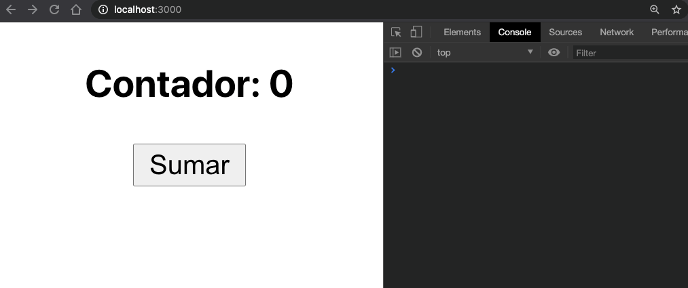

# S9 | Hooks avanzados

### Después de esta lección podrás:

1. Aplicar useEffect para controlar tu aplicación sin problemas.
2. Utilizar useReducer para controlar estados complejos.
3. Aplicar useContext para compartir estado globalmente en tu App.

## Ciclos de vida & useEffect

En los componentes de clase hemos sido capaces de controlar el comportamiento del estado y el render a través de los ciclos de vida, pero en el caso de los componentes funcionales vamos a ser capaces de controlar estos estados a través de un hook que vimos rápidamente en la sesión anterior, el hook que conocemos como `useEffect`.

Cuando jugábamos con los ciclos de vida, nos encontrábamos un gran problema, ¡y es que hay muchísimos! Recordar todos ellos, con los props que pueden o no recibir, es un detrimento hacia su uso constante.

Gracias al hook `useEffect` podemos simular todo el comportamiento de todos los ciclos de vida en una sola función, ¡aunque tenemos que tener cuidado! 🛑

### Configurando useEffect

Vamos a ver un ejemplo sencillo utilizando este hook:

```jsx
useEffect(() => {
  // Aquí lanzamos las funciones que queramos

  return () => {
    // Limpiamos listeners que hayamos configurado
  };
}, []);
```

`useEffect` recibe dos argumentos:

- Una función que será invocada cada vez que se cumpla una condición.
- Un array (en este caso vacío) que definirá a qué cambios debemos estar pendientes.

El **array** que utilizamos en useEffect determinará el momento en que será invocado. Si no utilizamos un array, ocurrirá en cada render:

```jsx
useEffect(() => {
  console.log('¡Muestro un mensaje en cada render!');
});
```

Muy pocas veces querremos utilizarlo en cada render que hagamos, así que ten mucho cuidado con olvidar el array, ya que si hacemos alguna petición a una API externa podemos desencadenar una cantidad de peticiones muy elevada ☠️

Vamos a ver ahora todos los casos que podamos usando arrays, pero vamos a empezar con un caso de uso muy interesante, el parecido a `componentDidMount`:

```jsx
useEffect(() => {
  console.log('Yo me comporto como componentDidMount!');

  // Simulamos una request a una API
  fetch(API_URL)
    .then((res) => res.json())
    .then((data) => {
      console.log(data);
    })
    .catch((err) => {
      console.log(err.message);
    });
}, []);
```

En este caso el array está vacío, por lo que nuestro `useEffect` solamente se lanzará una vez cuando el componente se renderiza por primera vez. Al igual que hacíamos con `componentDidMount` podemos hacer requests y cambiar estados sin problemas.

Vamos a ver otro ejemplo práctico, imagina que queremos crear un componente que al renderizarse  escuche el scroll que hagamos en nuestra web, pero como no queremos dejar eventos repartidos por la App cuando no hay un componente dándole uso, vamos a eliminar el evento cuando el componente se desmonta:

```jsx
useEffect(() => {
  // Creamos la función handler una vez en el useEffect
  function scrollHandler() {
    console.log('Scrolling!');
  }

  // Añadimos la función al listener
  document.addEventListener('scroll', scrollHandler);

  // Devolvemos un remove del listener cuando el componente se desmonta
  return () => {
    document.removeEventListener('scroll', scrollHandler);
  };
}, []);
```

En este `useEffect` estamos creando y quitando un eventListener, tanto al "montar" el componente como al "desmontarlo". Como puedes ver, hemos creado la función `scrollHandler` por separado para poder compartirla con el `addEventListener` y `removeEventListener` de forma que ambos hagan referencia a la misma función.

Por tanto, podemos decir que el utilizar un `return` dentro de `useEffect` es similar al ciclo de vida `componentWillUnmount`.

### ¡Vamos a darle uso al array!

El array de este hook sirve para escuchar cambios en otras propiedades del componente y reaccionar a estas. Es decir, si al array le añadimos una variable de estado que cambia, el efecto se lanzará cuando esa variable cambie. Por ello, lo denominamos como array de dependencias.

Vamos a ver un ejemplo con un contador:

```jsx
import React, { useEffect, useState } from 'react';

const Home = () => {
  const [counter, setCounter] = useState(0);

  // Cuando el contador cambia, se lanza el efecto
  useEffect(() => {
    if (counter % 2 === 0) {
      console.log('El contador es par');
    } else {
      console.log('El contador es impar');
    }
  }, [counter]);

  return (
    <div>
      <h3>Contador: {counter} </h3>
      <button onClick={() => setCounter(counter + 1)}>Sumar</button>
    </div>
  );
};

export default Home;
```

Con el código de arriba 🔝veremos el siguiente resultado en nuestro navegador:



Como `useEffect` está escuchando al `counter`, siempre que éste cambie se lanzará la función que hemos definido en `useEffect`.

Esto es potentísimo para controlar todo lo que ocurre en nuestra aplicación, pero tenemos que tener mucho cuidado con los elementos del array, debido a que envíar funciones asíncronas como dependencia, o elementos que puedan cambiar un estado de los que depende el `useEffect` puede generar renders infinitos.

### Estados complejos con useReducer

El hook useReducer es un hook de uso avanzado que nos permitirá modificar estados más complejos que lo que nos permite el uso de `useState`. 

No es recomendable crear grandes objetos en `useState` ya que podemos generar cambios inesperados en nuestro componente, porl o que siempre lo dividimos en useState más pequeños, pero imagina por un momento un estado en el que necesitamos datos de una API y controlar la carga:

```jsx
const Home = () => {
  const [user, setUser] = useState(null);
  const [isLoading, setIsLoading] = useState(false);
  const [error, setError] = useState(null);

  useEffect(() => {
    // Activamos el estado para empezar la carga
    setIsLoading(true);

    fetch(USER_API)
      .then((res) => res.json())
      .then((userData) => {
        // El ususario se setea en el estado
        setUser(userData);
      })
      .catch((err) => {
        // Si hay error, lo seteamos en el estado
        setError(err.message);
      })
      .finally(() => {
        // Desactivamos el loader
        setIsLoading(false);
      });
  }, []);

  return (
    <div>
      {isLoading ? (
        <h2>Loading data...</h2>
      ) : (
        <>
          <h2>Data loaded!</h2>
          {user ? <h3>user.name</h3> : null}
          {error ? <h3>error</h3> : null}
        </>
      )}
    </div>
  );
};
```

En este caso, ¿cuántos render provocaremos al cambiar los estados? ¡Uno  por cada `setState` que invoquemos! 😨

En el mejor de los casos, provocaremos 3 renders, además de tenemos el estado complejo de nuestro componente dividido en tres constantes distintas, por lo que podemos perder control sobre estos.

Para solucionarlo, podemos utilizar el hook `useReducer` y crear un estado complejo. Este seguirá un patrón **`muy parecido a Redux`** por lo que será interesante conocerlo en profundidad.

El hook useReducer utiliza un sistema de `reducer` junto con `initialState`. Un reducer es una función que recibe el estado interno almacenado y la `**acción`** que lanzamos desde el componente por medio de `**dispatch**`.

```jsx
import React, { useEffect, useReducer } from 'react';

const initialState = {
  user: null,
  error: null,
  isLoading: false,
};

// Creamos action types en constantes para reutilizarlos
const SET_USER = 'SET_USER';
const SET_ERROR = 'SET_ERROR';
const SET_IS_LOADING = 'SET_IS_LOADING';

// El reducer siemrpe recibe state y action
const reducer = (state, action) => {
  // La acción contendrá un type y el nuevo valor en payload
  const { type, payload } = action;
  
  // Dependiendo del action type, devolvemos un nuevo estado
  switch (type) {
    case SET_USER:
      return { ...state, user: payload, isLoading: false };
      break;
    case SET_ERROR:
      return { ...state, error: payload, isLoading: false };
      break;
    case SET_IS_LOADING:
      return { ...state, isLoading: payload };
      break;
    default:
      return state;
  }
};

const Home = () => {
  // useReducer devuelve un state y un dispatch, similar a useState
  const [state, dispatch] = useReducer(reducer, initialState);
  // El state nos permitirá destructurar los atributos que queramos
  const { user, error, isLoading } = state;

  useEffect(() => {
    // Para lanzar una acción y cambiar el estado, llamamos dispatch
    dispatch({
      type: SET_IS_LOADING,
      payload: false,
    });

    fetch(USER_API)
      .then((res) => res.json())
      .then((userData) => {
        setUser(userData);
        dispatch({
          type: SET_USER,
          payload: userData,
        });
      })
      .catch((err) => {
        dispatch({
          type: SET_ERROR,
          payload: err.message,
        });
      });
  }, []);

  return (
    <div>
      {isLoading ? (
        <h2>Loading data...</h2>
      ) : (
        <div>
          <h2>Data loaded!</h2>
          {user ? <h3>user.name</h3> : null}
          {error ? <h3>error</h3> : null}
        </div>
      )}
    </div>
  );
};

export default Home;
```

En este nuevo ejemplo podrás ver que `useReducer` aporta cierta complejidad inicial al componente, pero después permite controlar el estado perfectamente sin miedo a equivocarnos, ya que con el `reducer` configuramos como debe comportarse cada acción.

- La función `reducer` se encargará de definir el estado que devolveremos para cada acción que se invoque mediante el uso de `dispatch`.
- La función `dispatch` es el `setState` para nuestro hook `useReducer`, pero recuerda que siempre debe invocarse con `type` y `payload` para mantener una estructura común que usamos en la comunidad de React.

¿Te has fijado en que hemos ahorrado un render?  Al cambiar la propiedad `isLoading` del estado cuando seteamos el usuario o el error, no es necesario lanzar una nueva acción para cancelar la carga.

**—> Hagamos un formulario juntos en clase para ver en profundidad como afecta `useReducer` al manejo de los estados.**

### Compartiendo estados con React.Context y useContext

En React existe una función interna que nos permite configurar un estado que vamos a compartir de forma global en la aplicación, se llama `**React.Context**`.

```jsx
import React from 'react';

// Creamos un estado interno con valor inicial null
const UserContext = React.createContext(null);
```

Con lo que acabamos de hacer, hemos creado un estado global en la aplicación, pero ahora tenemos que ser capaces de acceder a éste y cambiar el valor cuando sea necesario.

Para darle un nuevo valor al estado creado en `React.Context` tenemos que utilizar un componente llamado `Context.Provider` en el cual `Context` será el nombre que hayamos dado a nuestro contexto:

```jsx
// Proporcionando un value a nuestro Provider, podremos modificar el valor del contexto
<UserContext.Provider value={{ username: 'upgradehub' }}>
  <div>
    { /* Todos los componentes podrán acceder al estado */}
  </div>
</UserContext.Provider>

```

Ahora todo nuestro contexto obtendrá el valor que hayamos configurado en `value`, por tanto, si este valor es dinámico, podremos compartir un estado dinámico de forma global y actualizarlo según sea necesario.

Para utilizar el contexto en un componente hijo del componente que aporta el valor al `Provider`, usaremos un hook que conocemos como `useContext`.

```jsx
import React, { useContext } from 'react';

// Importamos UserContext del componente que lo haya declarado
import { UserContext } from '...';

function ChildComponent() {
  // Al utilizar useContext podemos obtener el valor del contexto
  const userData = useContext(UserContext)
  const { username } = userData;

  return (
    <div>
      <h3>{username}</h3>
    </div>
  );
}
```

Y de esta forma tan sencilla podemos compartir un estado a través de `React.Context`, vamos a verlo en práctica con un contador:

- Componente Home que utiliza un Context como Provider:

```jsx
import React, { useState, useContext } from 'react';

export const CounterContext = React.createContext(0);

const Home = () => {
  const [counter, setCounter] = useState(0);

  function handleIncrement() {
    setCounter(counter + 1);
  }

  return (
    <CounterContext.Provider value={counter}>
      <CounterTitle />
      <CounterButton handleIncrement={handleIncrement} />
    </CounterContext.Provider>
  );
};

export default Home;
```

- Componente `CounterTitle` que utiliza `useContext` para acceder al estado global:

```jsx
const CounterTitle = () => {
  const counter = useContext(CounterContext);

  return <h3>El contador vale: {counter}</h3>;
};

export default CounterTitle;
```

- Componente `CounterButton` que invoca al handler que cambia el estado y actualiza el estado global a través del `Provider` de App:

```jsx
const CounterButton = ({ handleIncrement }) => (
  <button type="button" onClick={handleIncrement}>
    Sumar uno al contador
  </button>
);

export default CounterButton;
```

### ¿Qué hemos aprendido hoy?

- Ya sabemos utilizar `useEffect` en distintas ocasiones.
- Hemos aprendido a crear estados complejos con `useReducer` para no realizar render innecesarios.
- Mediante `useContext` podemos compartir estados en la aplicación.

### Ejercicio propuesto

¿Recuerdas la sesión en la que vimos React Router? Resulta que el equipo de desarrolo nos ofrece hooks para utilizar cuando veamos necesario y así no depender de los `hooks`.

Entre estos hooks, tenemos `useHistory` para acceder a los métodos de gestión de rutas, como `history.push('/profile')`, ¡lo utilizamos para las rutas protegidas!

Otro hook interesante que puede ser de utilidad es `useLocation`, que nos permite acceder a la dirección en la que nos encontramos en el navegador `location.pathname`.

Para completar el ejercicio de hoy, realizaremos los siguientes pasos:

- En el componente `App`, configura `useReducer` para crear un estado complejo que contenga `user` y `counter`. El objeto `user` contendrá tres campos: `username`, `description` y `email`.

- Crea un contexto para el usuario al que llamaremos `UserContext` y otro para el contador al que llamaremos `CounterContext`.

- Añade `React Router` y crea una ruta `/`, una ruta `/user` y una ruta `/counter`.

- En la ruta principal, renderizaremos una `Home` que muestre dos `Link` para cambiar a las otras dos rutas.

- En la ruta `/user` mostraremos los datos del usuario obtenido por medio de `Context` y crea también un pequeño formulario de edición para cambiar los datos de usuario del contexto (puedes pasar funciones `handler` como props a la ruta).

- En `/counter` mostraremos el valor del contador y podremos aumentarlo o reducirlo mediante dos botones distintos. Los handlers los pasaremos como props también.

- Ahora crea un efecto con `useEffect` que, cuando el valor de  `counter`  sea mayor que `10`, lo cambie a `0` y haga un `history.push` para llevar al usuario de vuelta a la `Home`.