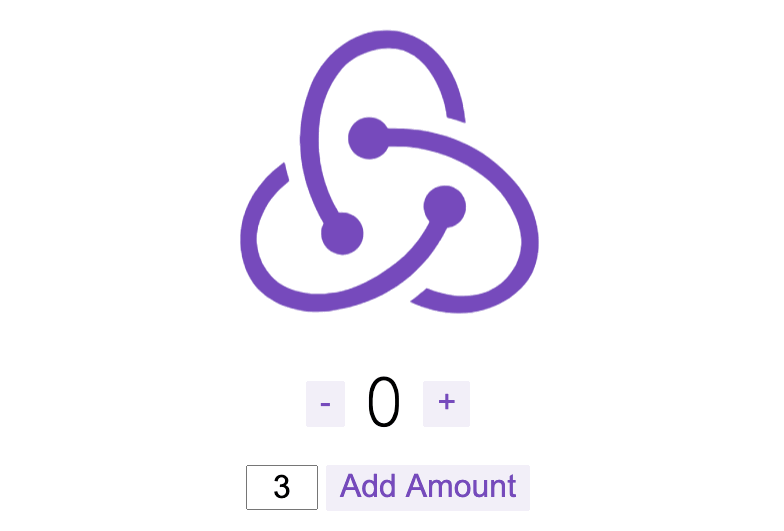
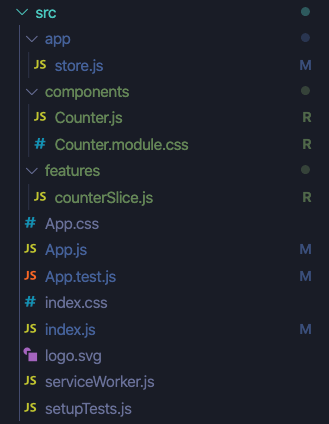
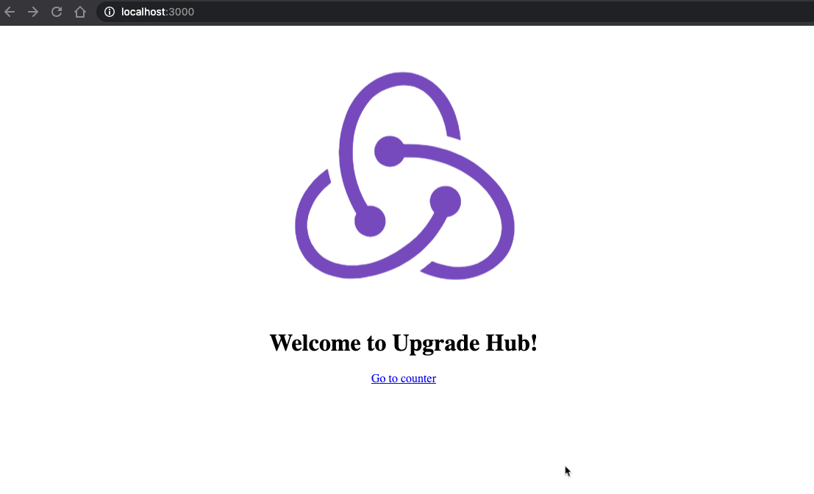
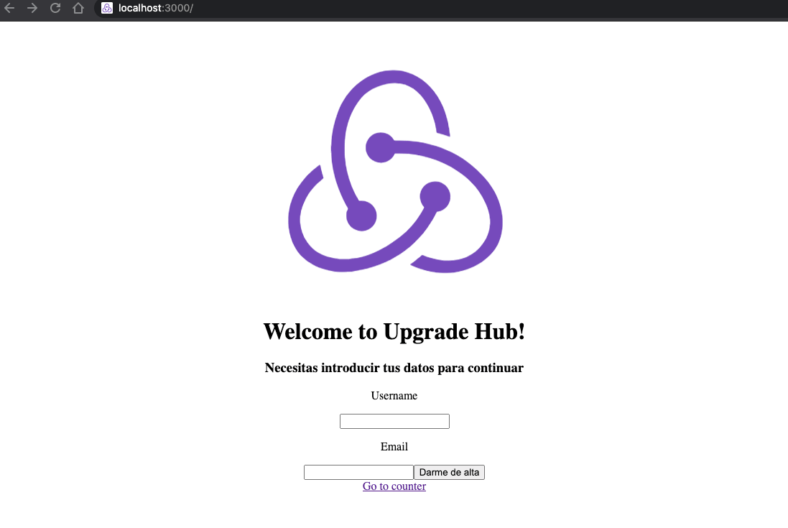
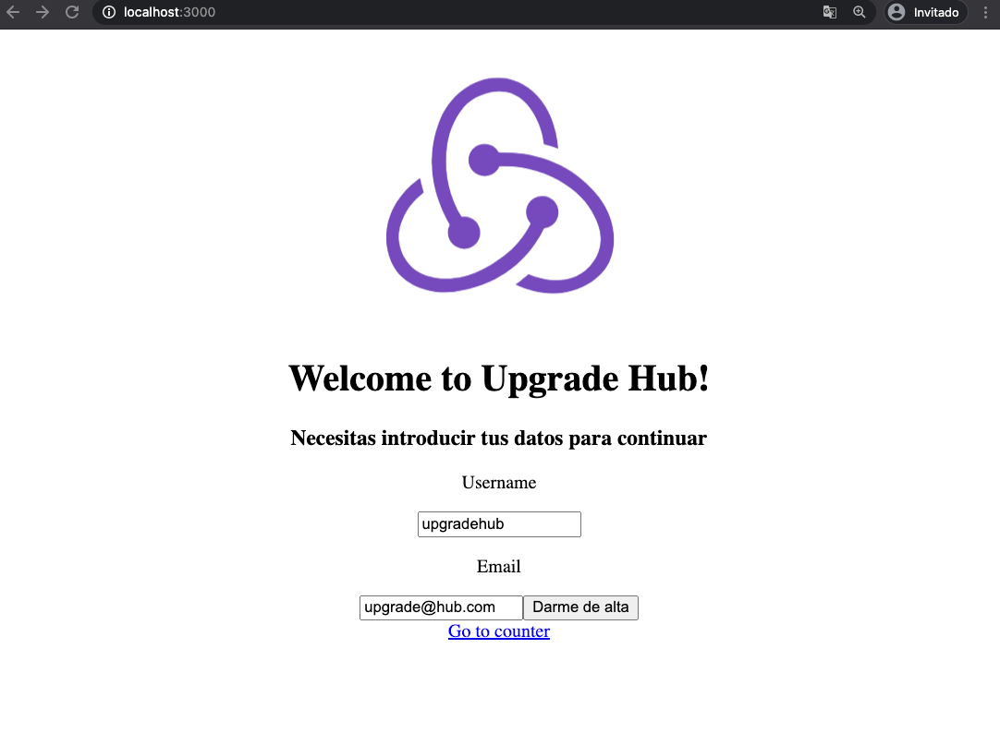

# S10 | Redux & hooks

### Después de esta lección podrás:

1. Crear tu propio sistema de estados global mediante Redux.
2. Crear arquitecturas escalables para tus proyectos de React.

## ¿Qué es Redux?

Por lo que hemos aprendido hasta este punto, React tiene varias formas de solucionar la persistencia de información mediante el uso de:

- Estado propio de cada compomente mediante `state` o `useState` según sean componentes de clase o funcionales.
- Estado compartido entre varios componentes combinando `useState` y `React.Context`.

Ahora que sabemos esto, y en la última clase vimos como se utilizaba el hook `useReducer`, podemos lanzarnos a aprender Redux.

Pero antes, vamos a definir qué es y para qué sirve `Redux`:

> Redux es un contenedor predecible del estado de aplicaciones JavaScript.

Te ayuda a escribir aplicaciones que se comportan de manera consistente, corren en distintos ambientes (cliente, servidor y nativo), y son fáciles de probar. Además de eso, provee una gran experiencia de desarrollo, gracias a edición en vivo combinado con un depurador sobre una línea de tiempo.

Puedes usar Redux combinado con React, o cual cualquier otra librería de vistas. Es muy pequeño (2kB) y no tiene dependencias.
> 

Por tanto, entendemos que podemos contener un estado complejo en nuestra aplicación y compartirlo de forma global entre todos los componentes. De esta forma, podemos estructurar nuestro código para que la aplicación se comporte de forma muy consistente y el `state` almacene la información que necesitamos.

## ¿Cuándo usar Redux?

Si has estado investigando más información acerca del entorno React antes de llegar a esta sesión, seguramente habrás leido muchos posts acerca de "como sustituir Redux", "por qué no usar Redux" o similares. 

Antes de usar `Redux` tenemos que valorar muy bien si realmente es necesario o no utilizarlo, ya que instalarlo suele conllevar la preparación de una arquitectura muy específica en el proyecto, y hay que conocer bien la herramienta antes de configurarla.

La curva de aprendizaje de `React`, como has podido comprobar, se vuelve bastante elevada a medida que añadimos nuevas funciones o patrones de desarrollo. Por ello, hay que planificar de antemano el objetivo que queremos alcanzar con nuestros proyectos.

Si tenemos que definir el momento en el que utilizar `Redux` con palabras, podríamos decir que el mejor momento es **`cuando el proyecto lo necesite`**. ¿Qué queremos decir con esto? Pues que que deberíamos empezar a trabajar siempre que podamos sin `Redux` y, cuando el proyecto se vuelva lo suficientemente complejo como para necesitar compartir un estado de forma global y tenerlo controlado en un solo punto, añadirlo.

Por ello, es recomendable empezar trabajando con una combinación de `useState + useContext` o `useReducer + useContext` para que los patrones utilizados se asemejen a lo que haremos con Redux, e introducirlo en el momento en que sea dificil controlar nuestra aplicación.

## Introducción a Redux

Una vez hemos hablado sobre el mejor momento para usar Redux,  vamos a explicar como funciona y utilizarlo en un proyecto desde cero, para demostrar que, a pesar de ser recomendable introducirlo en un proyecto cuando llegue el momento, podemos también arrancar un proyecto con Redux desde cero y no tener ningún inconveniente.

En lugar de implementar `Redux` desde cero y configurar un proyecto completo (algo que hacía de barrera de entrada en el uso de esta librería), vamos a utilizar `Redux Toolkit`. Una herramienta desarrollada por el equipo oficial de Redux para implementar todo el proceso de configuración del proyecto de forma automática y simplificada.

- **Web oficial de Redux Toolkit:** [https://redux-toolkit.js.org/](https://redux-toolkit.js.org/)

Podemos crear una aplicación desde cero como hacemos con `create-react-app` partiendo de un `template` mediante el siguiente comando:

```bash
npx create-react-app my-app --template redux
```

Vamos a investigar en profundidad que ha ocurrido en nuestro nuevo proyecto y como hacer funcionar Redux a toda potencia.

## Redux Toolkit

Vamos a recorrer el proyecto poco a poco, empecemos por el archivo `index.js` donde se crea nuestra aplicación:

- Hemos LIMPIADO y REORDENADO el archivo en el ejemplo para ver Redux con mayor facilidad, la muestra que tienes a continuación NO será exactamente igual que lo que haya creado tu proyecto, pero contendrá las mismas librerías y configuraciones.

```jsx
import React from 'react';
import ReactDOM from 'react-dom';
import { Provider } from 'react-redux';

import store from './app/store';
import App from './App';

ReactDOM.render(
  <React.StrictMode>
    <Provider store={store}>
      <App />
    </Provider>
  </React.StrictMode>,
  document.getElementById('root')
);
```

Por lo que podemos ver, hay dos factores diferenciales con respecto a lo que siempre tenemos en nuestro index, y eso es la `store` y el `Provider`. 

¿Te suena de algo el uso de un `Provider`? ¡Los vimos con `React.Context`! Eso significa que desde el punto en el que rendericemos el `Provider` hacia abajo, todos los componentes podrán acceder a nuestro estado compartido 🎉

La variable `store` es toda la configuración de `Redux` inicial y sus funciones. Cuando configuramos Redux, creamos `selectors`, `actions`, `reducers` y un `initialState`.

**Si profundizamos en el archivo `store` podremos ver la siguiente estructura:**

```jsx
import { configureStore } from '@reduxjs/toolkit';
import counterReducer from '../features/counter/counterSlice';

export default configureStore({
  reducer: {
    counter: counterReducer,
    // Añadiremos más reducers aquí
  },
});
```

Este archivo lo dejaremos tal y como está. Como puedes observar, crea y exporta la `store` que estamos utilizando en `index.js`.

El único añadido será que, cada vez que queramos separar nuestra `store` en un reducer más, tendremos que añadirlo debajo. En este caso hay un `counter`, que será un contador que veremos ahora, pero si quisiésemos añadir soporte para los datos de un usuario, podríamos añadir un nuevo `reducer`:

```jsx
reducer: {
  counter: counterReducer,
  // Añadiremos más reducers aquí
  user: userReducer,
},
```

Vamos ahora con los `reducers`, que serán lo más importante de nuestra aplicación, ya que conllevan la arquitectura de los datos que queremos usar. En Redux Toolkit, los reducers se almacenarán en un archivo al que llamaremos `slice`.

En este caso, el proyecto se ha generado con un archivo `counterSlice.js` que contiene la configuración de nuestro reducer.

### ¿Qué es un slice?

Un slice es la forma que tenemos de crear un nuevo apartado en nuestra `store` para diferenciar la lógica de una parte de nuestra aplicación.

En este caso, tenemos el reducer llamado `counter`, por lo que el `slice` se llamará `counterSlice`.

🛑 **Presta mucha atención a los comentarios que hemos añadido en este archivo para comprender la estructura del `slice` y como se divide en `selectors`, `actions` y `reducer`.**

```jsx
import { createSlice } from '@reduxjs/toolkit';

// Creamos el slice del contador:
// Le ponemos el nombre que tendrá nuestro reducer, en este caso counter.
// Definimos el estado inicial que tendrá cuando se inicie la aplicación.
// Definimos el comportamiento que tendrá cada reducer cuando ocurra y el nuevo estado que devolverán.
export const counterSlice = createSlice({
  name: 'counter',
  initialState: {
    value: 0,
  },
  reducers: {
    increment: (state) => {
      // Con Redux Toolkit podemos MUTAR el state, esto se debe a que usa por
      // debajo una librería llamada IMMER que evita que se mute el contenido
      // realmente, creando una copia por nosotros.
      state.value += 1;
    },
    decrement: (state) => {
      state.value -= 1;
    },
  },
});

// El slice genera una acción para cada función creada en el reducer.
// Estas acciones se invocarán con lo que queramos que sea el "payload".
export const { increment, decrement } = counterSlice.actions;

// Podemos crear selectores para recuperar facilmente elementos de nuestra store.
export const selectCount = (state) => state.counter.value;

// Exportamos por defecto el reducer, gracias a ello en el archivo store hacemos:
// import counterReducer from '../features/counter/counterSlice';
export default counterSlice.reducer;
```

- Hemos eliminado una acción `async` del ejemplo, la podremos ver en profundidad en clase si comprendemos correctamenete como usar `actions`.

En este caso, podremos utilizar las acciones creadas y los selectores en nuestros componentes de una forma muy sencilla, ya que `Redux Toolkit` expone unos hooks especiales para ello:

- Hemos simplificado este archivo para tener un contador con `+` y con `-` para añadir y restar, de forma que facilitaremos así la explicación sobre el uso de `dispatch`.

```jsx
import React from 'react';
import { useSelector, useDispatch } from 'react-redux';

// Importamos las acciones y selectores del slice.
import { decrement, increment, selectCount } from './counterSlice';

import styles from './Counter.module.css';

export function Counter() {
  // Con useSelector destionaremos de forma automática los selectores.
  const count = useSelector(selectCount);
  // Usaremos dispatch para lanzar acciones que activan reducers.
  const dispatch = useDispatch();

  return (
    <div>
      <div className={styles.row}>
        <button
          className={styles.button}
          aria-label="Decrement value"
          onClick={() => dispatch(decrement())}
        >
          -
        </button>

        <span className={styles.value}>{count}</span>

        <button
          className={styles.button}
          aria-label="Increment value"
          onClick={() => dispatch(increment())}
        >
          +
        </button>
      </div>
    </div>
  );
} 
```

Por lo que podemos observar en este ejemplo, primero importaremos las acciones y selectores que hemos definido en el `slice` y luego los utilizaremos de la siguiente forma:

- `useSelector` se encarga de asignar el resultado del selector directamente a una variable.
- `dispatch` invocará dentro a una `action` enviando `payload` si fuese necesario.


### Utilizando el payload

Vamos a añadir a nuestro `slice` una nueva función dentro de `reducers`:

```jsx
reducers: {
  // Resto de funciones que ya teníamos...
  incrementByAmount: (state, action) => {
    // Usamos el "payload" recibido para sumarlo al valor que había antes
    state.value += action.payload;
  },
}
```

Ahora destructuramos de nuevo las acciones:

```jsx
// Ahora estamos destructurando también "incrementByAmount"
export const { increment, decrement, incrementByAmount } = counterSlice.actions;
```

Y dentro del archivo `Counter.js` encargado de renderizar nuestro contador, vamos a añadir un `input` que dado su valor, añada la cantidad al estado:

- En el ejemplo que mostramos a continuación hemos AÑADIDO líneas a lo que teníamos previamente. Si no aparece algo que ya estaba es porque damos por hecho que se mantiene dentro del documento y todo lo escrito que difiera es contenido adicional.

```jsx
// Archivo Counter.js
import {
  decrement,
  increment,
  // Añadimos el nuevo import a las acciones de counterSlice
  incrementByAmount,
  selectCount,
} from './counterSlice';

export function Counter() {
  // Definimos un state local que inicie el incremento en el número que queramos
  const [incrementAmount, setIncrementAmount] = useState('3');

  return (
    {/* Contenido que teníamos antes... */}
    
    {/* Añadimos un div que contenga el input y el botón nuevos... */}
    <div className={styles.row}>
      <input
        className={styles.textbox}
        aria-label="Set increment amount"
        value={incrementAmount}
        onChange={(e) => setIncrementAmount(e.target.value)}
      />
      <button
        className={styles.button}
        onClick={() =>
          // Cada vez que pulsemos el botón, lanzamos el dispatch con la
          // cantidad que tenga el state local del componente
          dispatch(incrementByAmount(Number(incrementAmount) || 0))
        }
      >
        Add Amount
      </button>
    </div>
  );
}

```

- Estamos enviando como payload `Number(incrementAmount) || 0` de forma que si el usuario vacía el `input` se siga enviando al menos el número 0 para no modificar el valor y no causar problemas al sumar números y strings.

**Aquí el ejemplo con el resultado visual final**:



### ¡Ya tenemos Redux en marcha! 🚀

## Redux junto con React Router

Hagamos un ejemplo conjunto con `React Router` incluido, para demostrar la potencia que nos ofrece `Redux` en estos casos. 

Instalaremos `React Router DOM` antes de continuar: 

```bash
npm i react-router-dom
```

Vamos a ordenar un poco mejor el proyecto. Movamos `Counter.js` a la carpeta `components` junto con su `css` y actualicemos los `import`:



Ahora que hemos simplificado la estructura de carpetas, podemos trabajar más rápido y de forma más precisa  🔎

Crearemos un componente `Home` para dar la bienvenida a nuestros usuarios:

```jsx
import React from 'react';
import { Link } from 'react-router-dom';

export const Home = () => {
  return (
    <div>
      <h1>Welcome to Minsait!</h1>

      <Link to="/counter">Go to counter</Link>
    </div>
  );
};
```

Vamos a editar App para que soporte rutas y muestre los componentes adecuados:

```jsx
import React from 'react';
import { BrowserRouter as Router, Switch, Route } from 'react-router-dom';

import { Home } from './components/Home';
import { Counter } from './components/Counter';

import logo from './logo.svg';
import './App.css';

function App() {
  return (
    <Router>
      <div className="App">
        <header>
          
        </header>

        <Switch>
          <Route path="/counter" exact component={Counter} />
          <Route path="/" exact component={Home} />
        </Switch>
      </div>
    </Router>
  );
}

export default App;
```

Veamos lo que acabamos de conseguir:



 Bien, ahora que tenemos un sistema sencillo de enrutado, vamos a complicar un poco la cosa y a **`proteger nuestra ruta`** de usuarios no deseados.

Vamos a crear un nuevo `slice` para la entidad `user`:

```jsx
import { createSlice } from '@reduxjs/toolkit';

// Slice with reducers
export const userSlice = createSlice({
  name: 'user',
  initialState: {
    username: '',
    email: '',
    isAuthenticated: false,
  },
  reducers: {
    authenticateUser: (state, action) => {
      const { username, email } = action.payload;

      state.username = username;
      state.email = email;

      // Si hemos añadido username y un email, el usuario estará "autenticado"
      if (username && email) {
        state.isAuthenticated = true;
      }
    },
  },
});

// Actions
export const { authenticateUser } = userSlice.actions;

// Selectors
export const selectUsername = (state) => state.user.username;
export const selectEmail = (state) => state.user.email;
export const selectIsAuthenticated = (state) => state.user.isAuthenticated;

export default userSlice.reducer;
```

Ahora vamos a crear un pequeño formulario en `App` para simular un proceso de autenticación de nuestros usuarios y que puedan "darse de alta" en nuestra aplicación. ¿Para qué haremos esto? En breve, protegeremos la ruta `**/counter`**  y por tanto necesitaremos que nuestros usuarios estén autenticados:

```jsx
import React, { useState } from 'react';
import { Link } from 'react-router-dom';
import { useDispatch } from 'react-redux';

// Importamos la acción del nuevo "slice" que hemos creado para los usuarios
import { authenticateUser } from '../features/userSlice';

export const Home = () => {
  const dispatch = useDispatch();
  // Estado local de formulario de "autenticación"
  const [userForm, setUserForm] = useState({ email: '', value: '' });
  const { username, email } = userForm;

  // Cambiamos el estado local del formulario de Home con los datos del <form>
  function handleChangeInput(ev) {
    const { name, value } = ev.target;

    setUserForm({
      ...userForm,
      [name]: value,
    });
  }

  // Esta función hará "submit" del formulario. Enviaremos el "userForm" completo porque sigue
  // la estructura { username, email } que está esperando el reducer como "payload"
  function handleSubmit(ev) {
    ev.preventDefault()
    dispatch(authenticateUser(userForm));
  }

  return (
    <div>
      <h1>Welcome to Minsait!</h1>

      <h3>Necesitas introducir tus datos para continuar</h3>

      <form onSubmit={handleSubmit}>
        <label htmlFor="username">
          <p>Username</p>
          <input
            type="text"
            name="username"
            value={username}
            onChange={handleChangeInput}
          />
        </label>

        <label htmlFor="email">
          <p>Email</p>
          <input
            type="email"
            name="email"
            value={email}
            onChange={handleChangeInput}
          />
        </label>

        <button type="submit">Darme de alta</button>
      </form>

      <Link to="/counter">Go to counter</Link>
    </div>
  );
};
```

→ ¡Ya tenemos un formulario en App para darnos de alta! Recuerda, estamos SIMULANDO una autenticación de usuarios, esto no es válido para una autenticación normal pero sirve para demostrar el ejemplo que buscamos.

Ahora en nuestro componente `Counter` podemos añadir lo siguiente:

```jsx
import { Redirect } from 'react-router-dom';

import { selectIsAuthenticated } from '../features/userSlice';

export function Counter() {
  // Inicializamos los selectors y dispatch de counter...

  // Si el usuario no se ha autenticado, lo redijimos a la Home.
  const isAuthenticated = useSelector(selectIsAuthenticated);
  if (!isAuthenticated) {
    return <Redirect to="/" />;
  }

  return (
    // Contenido anterior del render...
  )
}
```

Con esto, hemos protegido nuestro contador para que, si no tenemos un usario autenticado no podamos entrar en la ruta:



Ahora podemos dar de alta un usuario de forma sencilla rellenando el formulario con los datos necesarios:



**🎉🎉🎉 ¡Ya lo tenemos! 🎉🎉🎉**

Como bien sabes, esto podemos mejorarlo para persistir información si recargamos, validar email/password del ususario, mostrar el formulario si están autenticados o redijir directamente con `history.push()` y más funciones.

### ¡En lo que queda de clase vamos a experimentar con nuevos slices y componentes unidos a Redux! 🚀